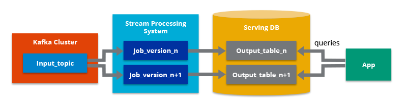

# Arquitecturas Big Data

Ya sabemos en qué consiste Big Data, y que dentro de sus 5V, dos de las más importantes son el *volumen* y la *velocidad*. Para cumplir con estas necesidades, necesitamos una infraestructura que dote a nuestras aplicaciones de toda la potencia y robustez necesarias.

## Características

* *Escalabilidad*: permite aumentar fácilmente las capacidades de procesamiento y almacenamiento de datos.
* *Tolerancia a fallos*: garantiza la disponibilidad del sistema, aunque se produzcan fallos en algunas de las máquinas.
* *Datos distribuidos*: los datos están almacenados entre diferentes máquinas evitando así el problema de almacenar grandes volúmenes de datos.
* *Procesamiento distribuido*: el tratamiento de los datos se realiza entre diferentes máquinas para mejorar los tiempos de ejecución y dotar al sistema de escalabilidad.
* *Localidad del dato*: los datos a trabajar y los procesos que los tratan deben estar cerca para evitar las transmisiones por red que añaden latencias y aumentan los tiempos de ejecución.

## Tipos de arquitecturas

<https://www.futurespace.es/como-disenar-una-arquitectura-big-data-y-no-morir-en-el-intento>

<https://blog.powerdata.es/el-valor-de-la-gestion-de-datos/los-pilares-de-la-gestion-del-big-data-y-arquitectura-big-data>

Debido a que las empresas disponen de un volumen cada vez mayor de datos y a la necesidad de analizarlos y obtener valor de ellos lo antes posible, surge la necesidad de definir nuevas arquitecturas para cubrir casos de uso distintos a los que había hasta el momento.

Las arquitecturas más comunes en estos proyectos son principalmente dos: *Lambda* y *Kappa*. La principal diferencia entre ambas son los flujos de tratamiento de datos que intervienen.

Un par de conceptos que tenemos que definir antes de ver las características de ambas, son el procesamiento batch y el procesamiento en streaming.

### Procesamiento Batch

Batch hace referencia a un proceso en el que intervienen un conjunto de datos y que tiene un inicio y un fin en el tiempo.

<https://www.franciscojavierpulido.com/2013/11/paradigmas-bigdata-el-procesamiento.html>

### Procesamiento en Streaming

Un procesamiento es de tipo streaming cuando está continuamente recibiendo y tratando nueva información según va llegando sin tener un fin en lo referente al apartado temporal.

## Arquitectura Lambda

Representada mediante la letra griega, apareció en el año 2012 y se atribuye a *Nathan Marz*. 

!!! note "Nathan Marz"
    La definió en base a su experiencia en sistemas de tratamiento de datos distribuidos durante su etapa como empleado en las empresas Backtype y Twitter, y está inspirada en su artículo *How to beat the CAP theorem*.

Su objetivo era tener un sistema robusto tolerante a fallos, tanto humanos como de hardware, que fuera linealmente escalable y que permitiese realizar escrituras y lecturas con baja latencia. Para ello, se basa en diferentes capas para el procesamiento batch y el streaming como muestra la siguiente imagen:

<https://www.paradigmadigital.com/techbiz/de-lambda-a-kappa-evolucion-de-las-arquitecturas-big-data/>

El flujo de trabajo es el siguiente:

1. La nueva información recogida por el sistema se envía tanto a la capa de batch como a la capa de streaming (denominada como Speed Layer en la imagen anterior).
2. En la capa batch (Batch Layer) se gestiona la información en crudo, es decir, sin modificar. Los datos nuevos se añaden a los ya existentes. Seguidamente se hace un tratamiento mediante un proceso batch cuyo resultado serán las denominadas Batch Views, que se usarán en la capa que sirve los datos para ofrecer la información ya transformada al exterior.
3. La capa que sirve los datos o Serving Layer, indexa las Batch Views generadas en el paso anterior de forma que puedan ser consultadas con baja latencia.
4. La capa de streaming o Speed Layer, compensa la alta latencia de las escrituras que ocurre en la serving layer y solo tiene en cuenta los datos nuevos.
5. Finalmente, la respuesta a las consultas realizadas se construye combinando los resultados de las Batch Views y de las vistas en tiempo real (Real-time Views), las cuales se han generado en el paso anterior.

## Arquitectura Kappa

<https://www.treelogic.com/es/Arquitectura_Kappa.html>

El término Arquitectura Kappa, representada por la letra , fue introducido en 2014 por Jay Kreps en su artículo Questioning the Lambda Architecture.

En él señala los posibles puntos “débiles” de la Arquitectura Lambda y cómo solucionarlos mediante una evolución. Su propuesta consiste en eliminar la capa batch dejando solamente la capa de streaming.

Esta capa, a diferencia de la de tipo batch, no tiene un comienzo ni un fin desde un punto de vista temporal y está continuamente procesando nuevos datos a medida que van llegando.

Como un proceso batch se puede entender como un stream acotado, podríamos decir que el procesamiento batch es un subconjunto del procesamiento en streaming.

Esta evolución consiste en una simplificación de la Arquitectura Lambda, en la que se elimina la capa batch y todo el procesamiento se realiza en una sola capa denominada de tiempo real o Real-time Layer, dando soporte a procesamientos tanto batch como en tiempo real.

Podemos decir que sus cuatro pilares principales son los siguientes:

Todo es un stream: las operaciones batch son un subconjunto de las operaciones de streaming, por lo que todo puede ser tratado como un stream.
Los datos de partida no se modifican: los datos son almacenados sin ser transformados y las vistas se derivan de ellos. Un estado concreto puede ser recalculado puesto que la información de origen no se modifica.
Solo existe un flujo de procesamiento: puesto que mantenemos un solo flujo, el código, el mantenimiento y la actualización del sistema se ven reducidos considerablemente.
Posibilidad de volver a lanzar un procesamiento: se puede modificar un procesamiento concreto y su configuración para variar los resultados obtenidos partiendo de los mismos datos de entrada.
Como requisito previo a cumplir, se tiene que garantizar que los eventos se leen y almacenan en el orden en el que se han generado. De esta forma, podremos variar un procesamiento concreto partiendo de una misma versión de los datos.

## Casos de uso

¿Qué arquitectura se adapta mejor a nuestro problema? ¿Cúal encaja mejor en nuestro modelo de negocio?.

Por lo general, no existe una única respuesta. La arquitectura *Lambda* es más versátil y es capaz de cubrir un mayor número de casos, muchos de ellos que requieren incluso procesamiento en tiempo real.

Una pregunta que debemos plantearnos para poder decidir es, ¿el análisis y el procesamiento que vamos a realizar en las capas batch y streaming es el mismo? En ese caso la opción más acertada sería la Arquitectura Kappa.

Como ejemplo real de esta arquitectura podríamos poner un sistema de geolocalización de usuarios por la cercanía a una antena de telefonía móvil. Cada vez que se aproximase a una antena que le diese cobertura se generaría un evento. Este evento se procesaría en la capa de streaming y serviría para pintar sobre un mapa su desplazamiento respecto a su posición anterior.

Sin embargo, en otras ocasiones necesitaremos acceder a todo el conjunto de datos sin penalizar el rendimiento por lo que la Arquitectura Lambda puede ser más apropiada e incluso más fácil de implementar.

También nos inclinaremos hacia una Arquitectura Lambda si nuestros algoritmos de batch y streaming generan resultados muy distintos, como puede suceder con operaciones de procesamiento pesado o en modelos de Machine Learning.

Un caso de uso real para una arquitectura Lambda podría ser un sistema que recomiende libros en función de los gustos de los usuarios. Por un lado, tendría una capa batch encargada de entrenar el modelo e ir mejorando las predicciones; y por otro, una capa streaming capaz de encargarse de las valoraciones en tiempo real.

Para finalizar, hay que destacar lo rápido que evolucionan los casos de uso que queremos cubrir con nuestras soluciones Big Data, y eso supone que hay que adaptarse a ellos lo antes posible.

Cada problema a resolver tiene unos condicionantes particulares y en muchos casos habrá que evolucionar la arquitectura que estábamos utilizando hasta el momento, o como se suele decir: “renovarse o morir”.

## Referencias

* [Arquitectura Big Data: ¿en qué consiste y para qué se utiliza?](https://www.unir.net/ingenieria/revista/arquitectura-big-data/)
* [What Is Lambda Architecture?](https://hazelcast.com/glossary/lambda-architecture/)

<https://medium.com/dataprophet/4-big-data-architectures-data-streaming-lambda-architecture-kappa-architecture-and-unifield-d9bcbf711eb9>