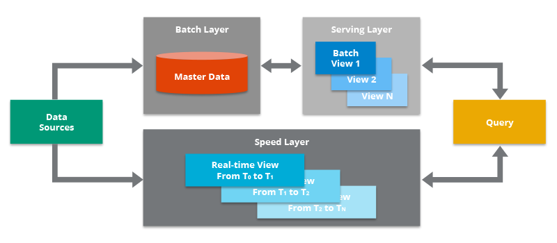

# Arquitecturas Big Data

Ya sabemos en qué consiste Big Data, y que dentro de sus 5V, dos de las más importantes son el *volumen* y la *velocidad*. Para cumplir con estas necesidades, necesitamos una infraestructura que dote a nuestras aplicaciones de toda la potencia y robustez necesarias.

Una arquitectura de big data se diseña para manejar la ingestión, el procesamiento y el análisis de los datos que son demasiado grandes o complejos para un sistema tradicional de base de datos.

En esta sesión no vamos a profundizar en ninguna tecnología concreta, ya que el stack de herramientas es muy amplio y en constante crecimiento. A lo largo del curso iremos conociendo las distintas herramientas y aprenderemos cómo y cuándo utilizarlas.

## Características

Todas las arquitecturas que diseñemos / utilicemos deben cumplir las siguientes características:

* *Escalabilidad*: permite aumentar fácilmente las capacidades de procesamiento y almacenamiento de datos.
* *Tolerancia a fallos*: garantiza la disponibilidad del sistema, aunque se produzcan fallos en algunas de las máquinas, evitando la pérdida de datos.
* *Datos distribuidos*: los datos deben estar almacenados entre diferentes máquinas evitando así el problema de almacenar grandes volúmenes de datos en un único nodo central.
* *Procesamiento distribuido*: el tratamiento de los datos se realiza entre diferentes máquinas para mejorar los tiempos de ejecución y dotar al sistema de escalabilidad.
* *Localidad del dato*: los datos a trabajar y los procesos que los tratan deben estar cerca, para evitar las transmisiones por red que añaden latencias y aumentan los tiempos de ejecución.

Antes de conocer las arquitecturas más empleados, es conveniente tener presente siempre cuál es el objetivo que debe cumplir nuestra solución. Es muy fácil caer en la sobreingeniería y montar una arquitectura con una amalgama de productos que luego son difíciles de configurar y mantener.

## Tipos de arquitecturas

Debido a que las empresas disponen de un volumen de datos cada vez mayor y la necesidad de analizarlos y obtener valor de ellos lo antes posible, surge la necesidad de definir nuevas arquitecturas para cubrir casos de uso distintos a los que había hasta el momento.

Las arquitecturas más comunes en estos proyectos son principalmente dos: *Lambda* y *Kappa*. La principal diferencia entre ambas son los flujos de tratamiento de datos que intervienen.

Un par de conceptos que tenemos que definir antes de ver las características de ambas, son el procesamiento batch y el procesamiento en streaming.

### Procesamiento Batch

*Batch* hace referencia a un proceso en el que intervienen un conjunto de datos y que tiene un inicio y un fin en el tiempo. También se le conoce como procesamiento por lotes y se ejecuta sin control directo del usuario.

Por ejemplo, si tenemos un conjunto de datos muy grande, puede llevarnos del orden de horas ejecutar las consultas que necesita el cliente, y por tanto, no se pueden ejecutar en tiempo real y necesitan de algoritmos paralelos (como por ejemplo, *Map Reduce*). En estos casos, los resultados se almacenan en un lugar diferente al de origne para posteriores consultas.

Otro ejemplo, si tenemos una aplicación que muestra el total de casos COVID que hay en cada ciudad, en vez de realizar el cálculo sobre el conjunto completo de los datos, podemos realizar una serie de operaciones que hagan esos cálculos y los almacenen en tablas temporales (por ejemplo, mediante `INSERT ... SELECT`), de manera que si queremos volver a realizar la consulta sobre todos los datos, accederíamos a los datos ya calculados de la tabla temporal. El problema es que este cálculo necesita actualizarse, por ejemplo, de manera diaria, y de ahí que haya que rehacer todas las tablas temporales.

Es el procesamiento que se ha realizado desde los inicios del trabajo con datos, tanto a nivel de bases de datos como con *Data Warehouses*.

De la mano del procesamiento *batch* se ha implantado el ecosistema Hadoop con todas las herramientas que abarcan un proceso ETL (extracción, transformación y carga de los datos). Estos conceptos los trabajaremos más adelante.

### Procesamiento en Streaming

Un procesamiento es de tipo *streaming* cuando está continuamente recibiendo y tratando nueva información según va llegando sin tener un fin en lo referente al apartado temporal.

Este procesamiento se relaciona con el análisis en tiempo real. Para ello, se utilizan diferentes sistemas basados en el uso de colas de mensajes.

!!! warning
    No confundir tiempo real con inmediatez.
    En informática, un sistema de tiempo real es aquel que responde en un periodo de tiempo finito, normalmente muy pequeño, pero no tiene por qué ser instantaneo.

## Arquitectura Lambda

Representada mediante la letra griega, apareció en el año 2012 y se atribuye a *Nathan Marz*.

!!! note "Nathan Marz"
    La definió en base a su experiencia en sistemas de tratamiento de datos distribuidos durante su etapa como empleado en las empresas *Backtype* y *Twitter*, y está inspirada en su artículo *How to beat the CAP theorem*.

Su objetivo era tener un sistema robusto y tolerante a fallos, tanto humanos como de hardware, que fuera linealmente escalable y que permitiese realizar escrituras y lecturas con baja latencia.

Todos los datos que llegan al sistema van a ir por dos caminos, uno el lento (capa *batch*) y otro el rápido (capa *streaming*), que finalmente confluyen en la capa de consultas. Así pues, se compone de tres capas:

* Capa **batch**: se encarga de gestionar los datos históricos y recalcular los resultados. De manera específica, la capa *batch* recibe todos los datos en crudo, los almacena de forma inmutable y los combina con el histórico existente (se añaden a los datos existente y los datos previos nunca se sobreescriben) y recalcula los resultados iterando sobre todo el conjunto de datos combinado. Cualquier cambio en un dato se almacena como un nuevo registro, no modifica nada, para así poder seguir el linaje de los datos.  
Así pues, este capa opera sobre el conjunto completo y permite que el sistema produzca los resultados más precisos. Sin embargo, esto conlleva un coste de alta latencia debido a los requisitos de tiempo de computación.
* Capa de **streaming** / *speed*: sirve para ofrecer resultados con muy baja latencia, cercano al tiempo real. Este capa recibe los datos y realizar modificaciones incrementales sobre los resultados de la capa *batch*. Gracias a los algoritmos incrementales implementados en esta capa, se consigue reducir el coste computacional de manera considerable, a coste de perder algo de precisión.
* Capa de **serving**: permite la consulta de los resultados enviados desde las dos capas anteriores, en base a las vistas *batch* que rellenan las capas anteriores.

Podemos ver un esquema de la arquitectura en el siguiente gráfico:

<figure style="align: center;">
    
    <figcaption>Arquitectura Lambda</figcaption>
</figure>

Los datos que fluyen por la capa de velocidad/*streaming* tienen la restricción de latencia que impone la capa para poder procesar los datos todo lo rápido que sea posible. Normalmente, este requisito choca con la precisión de los datos. Por ejemplo, en un escenario IoT donde se leen un gran número de sensores de temperatura que envían datos de telemetría, la capa de velocidad se puede utilizar para procesar una ventana temporal de los datos que entran (por ejemplo, los diez primeros segundos de cada minuto).

Los datos que fluyen por el camino lento, no están sujeto a los mismos requisitos de latencia, lo que permite una mayor precisión computacional sobre grandes conjuntos de datos, que pueden conllevar mucho tiempo de procesamiento.

Finalmente, ambos caminos,el lento y el rápido,convergen en las aplicaciones analíticas del cliente. Si el cliente necesita información constante (cercana al tiempo real) aunque menos precisa, obtendrá los datos del camino rápido. Si no, lo hará a partir de los datos de la capa *batch*.

Dicho de otro modo, el camino rápido tiene los datos de una pequeña ventana temporal, la cual se puede actualizar con datos más precisos provenientes de la capa *batch*.

### Paso a paso

<figure style="align: center;">
    
    <figcaption>Arquitectura Lambda</figcaption>
</figure>

El flujo de trabajo es el siguiente:

1. La nueva información recogida por el sistema se envía tanto a la capa *batch* como a la capa de *streaming* (*Speed Layer* en la imagen anterior).
2. En la capa *batch* (*Batch Layer*) se gestiona la información en crudo, es decir, sin modificar. Los datos nuevos se añaden a los ya existentes. Seguidamente se hace un tratamiento mediante un proceso *batch* cuyo resultado serán las *Batch Views*, que se usarán en la capa que sirve los datos para ofrecer la información ya transformada al exterior.
3. La capa que sirve los datos (*Serving Layer*) indexa las *Batch Views* generadas en el paso anterior de forma que puedan ser consultadas con tiempos de respuesta muy bajos.
4. La capa de *streaming* compensa la alta latencia de las escrituras que ocurre en la *serving layer* y solo tiene en cuenta los datos nuevos (incrementos entre los procesos batch y el momento actual).
5. Finalmente, combinando los resultados de las *Batch Views* y de las vistas en tiempo real (*Real-time Views*), se construye la respuesta a las consultas realizadas.

## Arquitectura Kappa

<https://www.ericsson.com/en/blog/2015/11/data-processing-architectures--lambda-and-kappa>

El término ^^Arquitectura Kappa^^ fue introducido en 2014 por *Jay Kreps* en su artículo [Questioning the Lambda Architecture](https://www.oreilly.com/radar/questioning-the-lambda-architecture/). En él señala los posibles puntos *débiles* de la Arquitectura Lambda y cómo solucionarlos mediante una evolución. 

Uno de los mayores inconveniente de la arquitectura Lambda es su complejidad. El procesamiento de los datos se realiza en dos camis diferenciados, lo que conlleva a duplica la lógica de computación y la gestión de la arquitectura de ambos caminos.

Lo que señala *Jay Kreps* en su propuesta es que todos los datos fluyan por un único camino, eliminando la capa batch y dejando solamente la capa de streaming. Esta capa, a diferencia de la de tipo batch, no tiene un comienzo ni un fin desde un punto de vista temporal y está continuamente procesando nuevos datos a medida que van llegando.

<figure style="align: center;">
    
    <figcaption>Arquitectura Kappa</figcaption>
</figure>

Podemos decir que sus cuatro pilares principales son los siguientes:

1. Todo es un *stream*: las operaciones *batch* son un subconjunto de las operaciones de *streaming*, por lo que todo puede ser tratado como un *stream*.
2. Los datos de partida no se modifican: los datos se almacenan sin ser transformados, por tanto son inmutables, y las vistas se derivan de ellos. Un estado concreto puede ser recalculado puesto que la información de origen no se modifica.
3. Solo existe un flujo de procesamiento: puesto que mantenemos un solo flujo, el código, el mantenimiento y la actualización del sistema se ven reducidos considerablemente.
4. Tenemos la posibilidad de volver a lanzar un procesamiento: se puede modificar un procesamiento concreto y su configuración para variar los resultados obtenidos partiendo de los mismos datos de entrada.

<figure style="align: center;">
    
    <figcaption>Arquitectura Kappa</figcaption>
</figure>

Como requisito previo a cumplir, se tiene que garantizar que los eventos se leen y almacenan en el orden en el que se han generado. De esta forma, podremos variar un procesamiento concreto partiendo de una misma versión de los datos.

## Arquitectura por capas

[La arquitectura por capas](https://docs.microsoft.com/en-us/azure/architecture/data-guide/big-data/) da soporte tanto al procesamiento *batch* como por *streaming*. La arquitectura consiste en 6 capas que aseguran un flujo seguro de los datos:

<figure style="align: center;">
    
    <figcaption>Arquitectura por capas (xenonstack.como)</figcaption>
</figure>

* Capa de ingestión: es la primera capa que recoge los datos que provienen de fuentes diversas. Los datos se categorizan y priorizan, facilitando el flujo de éstos en posteriores capas.
* Capa de colección: Centrada en el transporte de los datos desde la ingesta al resto del *pipeline* de datos. En esta capa los datos se deshacen para facilitar la analítica posterior.
* Capa de procesamiento: Esta es la capa principal. Se procesan los datos recogidos en las capas anteriores (ya sea mediante procesos *batch*, *streaming* o modelos híbridos), y se clasifican para decidir hacía qué capa se dirige.
* Capa de almacenamiento: Se centra en decidir donde almacenar de forma eficiente la enorme cantidad de datos. Normalmente en un almacen de archivos distribuido, que da pie al concepto de *data lake*.
* Capa de consulta: capa donde se realiza el procesado analítico, centrándose en obtener valor a partir de los datos.
* Capa de visualización: también conocida como capa de presentación, es con la que interactuan los usuarios.

## Tecnologías

Por ejemplo, la ingesta de datos hacia las arquitecturas Lambda y Kappa se pueden realizar mediante un sistema de mensajería de colas *publish/subscribe* como [Apache Kafka](https://kafka.apache.org).

El almacendamiento de los datos y modelos lo podemos realizar mediante HDFS o S3. Dentro de una arquitectura Lamba, en el sistema batch, mediante algoritmos MapReduce de Hadoop podemos entrenar modelos. Para la capa de *streaming* (tanto para Lambda como Kappa) se pueden utilizar otras tecnologías como [*Apache Storm*](http://storm.apache.org), [*Apache Samza*](http://samza.apache.org) o [*Spark Streaming*](https://spark.apache.org/docs/latest/streaming-programming-guide.html) para modificar modelos de forma incremental.

De forma alternativa, [Apache Spark](https://spark.apache.org) se puede utilizar como plataforma común para desarrollar las capas *batch* y *streaming* de la arquitectura Lambda. De ahí su amplia aceptación y uso a día de hoy en la industria, se codifica una vez y se comparte en ambas capas

La capa de *serving* se puede implementar mediante una base de datos NoSQL como pueda ser [Apache HBase](https://hbase.apache.org), [MongoDB](https://www.mongodb.com) o [Redis](https://redis.com). También se pueden utilizar motores de consultas como [Apache Drill](https://drill.apache.org).

## Casos de uso

¿Qué arquitectura se adapta mejor a los requerimientos que nos traslada el cliente? *¿Lambda* o *Kappa*? ¿Cuál encaja mejor en nuestro modelo de negocio?.

Depende. La arquitectura *Lambda* es más versátil y es capaz de cubrir un mayor número de casos, muchos de ellos que requieren incluso procesamiento en tiempo real.

Una pregunta que debemos plantearnos es, ¿el análisis y el procesamiento (sus algoritmos) que vamos a realizar en las capas *batch* y *streaming* es el mismo? En ese caso la opción más acertada sería la arquitectura *Kappa*.

Sin embargo, en otras ocasiones necesitaremos acceder a todo el conjunto de datos sin penalizar el rendimiento por lo que la *Lambda* puede ser más apropiada e incluso más fácil de implementar.

También nos inclinaremos hacia *Lambda* si nuestros algoritmos de *batch* y *streaming* generan resultados muy distintos, como puede suceder con operaciones de procesamiento pesado o en modelos de *Machine Learning*. En estos casos, los algoritmos *batch* se pueden optimizar ya que acceden al dataset histórico completo.

El decidir entre Lamba y Kappa al final es una decisión entre favorecer el rendimiento de ejecución de un proceso *batch* sobre la simplicidad de compartir código para ambas capas.

!!! info "Casos reales"
    Un ejemplo real de una arquitectura *Kappa* sería un sistema de geolocalización de usuarios por la cercanía a una antena de telefonía móvil. Cada vez que se aproximase a una antena que le diese cobertura se generaría un evento. Este evento se procesaría en la capa de *streaming* y serviría para pintar sobre un mapa su desplazamiento respecto a su posición anterior.

    Un caso de uso real para una arquitectura *Lambda* podría ser un sistema que recomiende películas en función de los gustos de los usuarios. Por un lado, tendría una capa batch encargada de entrenar el modelo e ir mejorando las predicciones; y por otro, una capa streaming capaz de encargarse de las valoraciones en tiempo real.

    Como lectura recomendable tenemos un par de casos desarrollados por *Ericsson* que podéis leer en <https://www.ericsson.com/en/blog/2015/11/data-processing-architectures--lambda-and-kappa-examples>

Es muy importante siempre tener en mente lo rápido que evolucionan los casos de uso que queremos cubrir y el mercado del Big Data, lo que implica la necesidad de adaptarse a ellos lo antes posible, modificando la arquitectura sobre la marcha.

## Buenas prácticas

* En la ingesta de datos: evalúa los tipos de fuentes de datos, no todas las herramientas sirven para cualquier fuente, y en algún caso lo mejor es combinar varias herramientas para cubrir todos los casos.
* En el procesamiento: evalúa si el sistema tiene que ser streaming o batch. Algunos sistemas que no se definen como puramente streaming utilizan lo que denominan micro-batch que suele dar respuesta a problemas que en el uso cotidiano del lenguaje se denomina como streaming.
* En la monitorización: al trabajar con multitud de herramientas es importante utilizar herramienta para controlar, monitorizar y gestionar la arquitectura.
* Algunas decisiones que tenemos que tomar a la hora de elegir la arquitectura son:
    * Enfocar los casos de uso. Cuando tengamos los objetivos claros sabremos qué parte debemos fortalecer en la arquitectura. ¿Volumen, variedad, velocidad?
    * Definir la arquitectura: ¿batch o streaming? ¿Realmente es necesario que nuestra arquitectura soporte necesitas streaming?
    * Evalúa las fuentes de datos: ¿Cómo de heterogéneas son? ¿soportan las herramientas elegidas todos los tipos de fuentes de datos que se utilizan?

## Arquitectura en la nube

Dentro de las diferentes plataformas cloud, a la hora de diseñar e implementar una aplicación, podemos tener en mente, desde un inicio, que se va a desplegar en la nube, haciendo uso de la gran mayoría de servicios que hemos estudiado en las sesiones anteriores.

De forma complementaria, estas plataformas cloud ofrecen un marco buenas prácticas, principios y decisiones que hemos de tomar a la hora de diseñar nuestros sistemas, sean big data o no.

### Marco de buena arquitectura (WAF)

<figure style="float: right;">
    
    <figcaption>Pilares del Marco de Buena Arquitectura (WAF)</figcaption>
</figure>

El marco de buena arquitectura ([*AWS Well-Architected Framework*](<https://docs.aws.amazon.com/es_es/wellarchitected/latest/framework/the-five-pillars-of-the-framework.html>) / [Azure Well-Architected Framework](https://docs.microsoft.com/es-es/azure/architecture/framework/)) es una guía diseñada para ayudar a crear la infraestructura con más seguridad, alto rendimiento, resiliencia y eficacia posibles para las aplicaciones y cargas de trabajo en la nube. Proporciona un conjunto de preguntas y prácticas recomendadas que facilitan la evaluación e implementación de nuestras arquitecturas en la nube.

Se organiza en cinco pilares que estudiaremos a continuación: excelencia operativa, seguridad, fiabilidad, eficacia del rendimiento y optimización de costes.

#### Excelencia operativa

Se centra en la habilidad de ejecutar y monitorizar sistemas para proporcionar valor de negocio, mejorando de forma continua los procesos y procedimientos de soporte.

Comprende la capacidad para dar soporte al desarrollo y ejecutar cargas de trabajo de manera eficaz, obtener información acerca de las operaciones y mejorar continuamente el soporte a los procesos y los procedimientos para ofrecer valor de negocio. Para ello se recomienda:

* Realizar **operaciones como código**: podemos definir toda la carga de trabajo (aplicaciones, infraestructura) como código y actualizarla con código, sin necesidad de utilizar el interfaz gráfico. De esta manera, podemos automatizar la ejecución en respuesta a eventos, además de limitar la posibilidad de error humano.

* Realizar **cambios pequeños, reversibles** (por si se producen errores) y **frecuentes**.

* **Refinar los procedimientos** de las operativos con frecuencia, revisando de forma periodica su efectividad y conocimiento por parte de los equipos.

* **Preveer los errores**: realizar simulacros de fallos, probando los procedimientos de respuesta.

* **Aprender de los errores y eventos operativos**: promover mejoras a partir de las lecciones aprendidas de todos los eventos y los errores operativos.

#### Seguridad

Antes de diseñar cualquier sistema, es imprescindible aplicar prácticas de seguridad. Debemos poder controlar quién puede hacer qué. Además, debe de identificar incidentes de seguridad, proteger los sistemas y servicios, y mantener la confidencialidad y la integridad de los datos mediante la protección de la información.

Así pues, este pilar se centra en la capacidad de proteger la información, los sistemas y los recursos, al mismo tiempo que se aporta valor de negocio mediante evaluaciones de riesgo y estrategias de mitigación, siguiendo los siguientes principios:

* Implementar una **base sólida de credenciales**: mediante el principio de mínimo privilegio y aplicando la separación de obligaciones con la autorización apropiada para cada interacción con los recursos de AWS.
* Habilitar la **trazabilidad**: Integrando registros y métricas con sistemas para responder y tomar medidas de manera automática, que facilitan la monitorización y el uso de alertar.
* Aplicar **seguridad en todas las capas**: por ejemplo, a la red de borde, a la nube virtual privada, a la subred y al balanceador de carga, y a cada instancia, sistema operativo y aplicación.
* **Automatizar las prácticas** recomendadas de seguridad.
* **Proteger los datos en tránsito y en reposo**: mediante el cifrado, el uso de tokens y el control de acceso cuando corresponda, asegurando la confidencialidad e integridad de los datos.
* Mantener a las **personas alejadas de los datos**: reducir o eliminar el acceso directo o el procesamiento manual de los datos.
* **Prepararse para eventos de seguridad**: mediante procesos de administración de incidencias con automatización que dé respuesta a incidentes.

#### Fiabilidad

Se centra en:

* la capacidad de un sistema de recuperarse de interrupciones en la infraestructura o el servicio.
* incorporar dinámicamente recursos informáticos para satisfacer la demanda
* mitigar las interrupciones, como errores de configuración o problemas de red temporales.

Se recomiendan los siguientes principios para aumentar la fiabilidad:

* **Probar los procedimientos de recuperación**: usar la automatización para simular diferentes errores o para volver a crear situaciones que hayan dado lugar a errores antes.
* **Recuperarse automáticamente** de los errores: monitorizar los sistemas en busca de indicadores clave de rendimiento y configurar los sistemas para desencadenar procesos de recuperación automatizado cuando se supere un límite.
* **Escalar horizontalmente** para aumentar la disponibilidad total del sistema: sustituir un recurso grande por varios recursos más pequeños, distribuyendo las solicitudes para reducir el impacto de un único punto de error.
* **Evitar asumir estimaciones sobre capacidad**: monitorizando la demanda y el uso del sistema, y automatizando la incorporación o eliminación de recursos para mantener el nivel óptimo.
* **Administrar los cambios mediante la automatización**.

#### Eficiencia del rendimiento

Se centra en la capacidad de utilizar recursos informáticos de forma eficiente (sólo cuando sean necesarios) para satisfacer los requisitos del sistema y mantener esa eficiencia a medida que cambia la demanda o evolucionan las tecnologías.

 Entre los temas principales se incluyen la selección de los tipos y tamaños de recursos adecuados en función de los requisitos de la carga de trabajo, el monitoreo del rendimiento y la toma de decisiones fundamentadas para mantener la eficiencia a medida que evolucionan las necesidades de la empresa.

Se recomiendan los siguientes principios para mejorar la eficiencia del rendimiento:

* **Democratizar las tecnologías avanzadas**: usando tecnologías como servicio (como son los servicios de IA que ofrecen tanto AWS como Azure), que simplifican su uso.
* **Adquirir escala mundial en cuestión de minutos**: desplegando sistemas en varias regiones para ofrecer una menor latencia.
* **Utilizar arquitecturas sin servidor**: las arquitecturas sin servidor eliminan la carga operativa que supone ejecutar y mantener servidores.
* **Experimentar más a menudo**: mediante pruebas comparativas de diferentes tipos de instancias, almacenamiento y/o configuraciones.
* **Diponer de compatibilidad mecánica**: utilizando el enfoque tecnológico que se ajuste mejor a lo que intenta conseguir (por ejemplo, mediante los patrones de acceso a los datos cuando accedamos a bases de datos o almacenamiento).

#### Optimización de costes

Se centra en la capacidad de ejecutar sistemas para ofrecer valor de negocio al precio más bajo. Entre los temas principales se incluyen la comprensión y el control de cuándo se está gastando el dinero, la selección de los tipos de recursos más adecuados en la cantidad correcta, el análisis de los gastos a lo largo del tiempo y el escalado para satisfacer las necesidades de la empresa sin gastos excesivos.

Se recomiendan los siguientes principios para optimizar los costes:

* **Adoptar un modelo de consumo**: pagando solo por los recursos informáticos que necesitamos.
* **Medir la eficacia general**: midiendo la producción comercial de la carga de trabajo y los costes asociados a la entrega.
* **Dejar de gastar dinero en** las operaciones de **centros de datos**: la nube elimina los costes de aprovisionamiento, electricidad, aire acondicionado, seguridad física, etc...
* **Analizar y asignar gastos**: la nube facilita la identificación precisa del uso y los costes del sistema, así como el coste de las cargas de trabajo individuales, lo que facilita medir el retorno de la inversión (ROI).
* **Utilizar los servicios administrados** para reducir el coste de propiedad: reducen la carga operativa que supone mantener servidores para tareas como el envío de email o la administración de bases de datos.

!!! warning "Todo falla constantemente"
    Hemos de diseñar nuestras arquitecturas con el axioma que en un momento u otro algo fallará. Para que nuestros sistemas resistan los errores, los dos factores más críticos son la fiabilidad y la disponibilidad.  
    Una forma de medir la **fiabilidad** es el *MTBF*: tiempo promedio entre errores, es decir tiempo total en servicio respecto a la cantidad de errores. Otra forma es mediante el porcentaje de tiempo durante el cual el sistema funcional correctamente. Este porcentaje se suele medir en la cantidad de nueves, así pues seis nueves implica una disponibilidad del 99,9999%.  
    Un sistema de **alta disponibilidad** (HA) es aquel que puede soportar cierta medida de degradación sin dejar de estar disponible. Los tres factores que influyen en la disponibilidad son la *tolerancia a errores* (gracias a la redundancia, cambiar de recurso cuando uno falla), la *escalabilidad* (la aplicación se adaptar a los aumentos de carga) y la *capacidad de recuperación* (el servicio se restaura rápidamente sin perder datos).

### *AWS Trusted Advisor*

AWS dispone de la herramienta en línea [AWS Trusted Advisor](https://aws.amazon.com/es/premiumsupport/technology/trusted-advisor/) que ofrece asesoramiento en tiempo real con las prácticas recomendadas de AWS. Examina todo el entorno AWS y ofrece recomendaciones en cinco categorías:

<figure style="align: center;">
    
    <figcaption>AWS Trusted Advisor</figcaption>
</figure>

* Optimización de costes: sugiere recursos no utilizados e inactivos, o bien,  posibilidad de realiza una reserva de capacidad.
* Rendimiento: comprueba los límites del servicio y monitoriza para detectar instancias que se estén utilizando por encima de su capacidad.
* Seguridad: examina los permisos para mejorar el nivel de seguridad de la aplicación.
* Tolerancia a errores: revisa las capacidades de escalado automático, las comprobaciones de estado, la implementación Multi-AZ y las capacidades de
copia de seguridad.
* Límites del servicio: realiza verificaciones para detectar usos que superen el 80% del límite del servicio.

!!! tip "Azure Advisor y Azure Score"
    Microsoft, del forma similar, ofrece un par herramientas que nos ayudan a optimizar las implementaciones, como son [Azure Advisor](https://docs.microsoft.com/es-es/azure/advisor/), y dentro de ella [Advisor Score](https://docs.microsoft.com/es-es/azure/advisor/azure-advisor-score) que puntua las recomendaciones para con un simple vistazo poder priorizar las mejoras sugeridas.

## Gestión del escalado y la monitorización

### Monitorización

Al operar en la nube, es importante llevar un seguimiento de las actividades, porque probablemente haya un coste asociado a cada una de ellas. AWS ayuda a monitorizar, registrar e informar sobre el uso de sus servicios proporcionando herramientas para hacerlo.

Así pues, AWS ofrece los siguientes servicios relacionados con la monitorización:

* [Amazon *CloudTrail*](https://aws.amazon.com/es/cloudtrail/): Servicio que registra cada acción que se lleva a cabo en la cuenta de AWS por motivos de seguridad. Esto significa que CloudTrail registra cada vez que alguien carga datos, ejecuta un código, crea una instancia de EC2 o realiza cualquier otra acción.
* [Amazon *Cloudwatch*](https://aws.amazon.com/es/cloudwatch/): Servicio de monitorización en tiempo real de los recursos de AWS y las aplicaciones que ejecutamos en AWS. *CloudTrail* registra actividades, mientras que *CloudWatch* las monitoriza. Así pues, *CloudWatch* vigila que los servicios *cloud* se ejecutan sin problema y ayuda a no utilizar ni más ni menos recursos de lo esperado, lo que es importante para el seguimiento del presupuesto. Permite:
    * Recopilar y hacer un seguimiento de las métricas estándar y personalizadas
    * Establecer alarmas para enviar notificaciones automáticas a *SNS* o efectuar acciones de *AutoScaling* EC2 en función del valor de las métricas obtenidas.
* [AWS *Config*](https://aws.amazon.com/es/config/): Servicio que permite analizar, auditar y evaluar las configuraciones de los recursos de AWS. *AWS Config* monitoriza y registra de manera continua las configuraciones de recursos de AWS y permite automatizar la evaluación de las configuraciones registradas con respecto a las deseadas.
* [Amazon SNS (*Amazon Simple Notification Service*)](https://aws.amazon.com/es/sns/): herramienta que permite enviar textos, correos electrónicos y mensajes a otros servicios en la nube y enviar notificaciones al cliente de varias formas desde la nube.

### Ejemplo Cloudwatch

En el siguiente ejemplo vamos a crear una alarma de *Cloudwatch* para enviar una notificación con la cuenta haya gastado una cierta cantidad de dinero. La alarma envía un mensaje a Amazon SNS para posteriormente enviar un correo electrónico.

El primer paso es crear y subscribirse a un tema (*topic*) SNS. Un tema actúa como un canal de comunicación donde se recibes los mensajes de las alertas y eventos.

Para ello, dentro del servicio SNS, crearemos un tema al que llamaremos `AlertaSaldo`.

<figure style="align: center;">
    
    <figcaption>Cloudwatch - Creación del tema</figcaption>
</figure>

A continuación, vamos a crear una subscripción a ese tema para que cuando se recibe una mensje, lo redirijamos a nuestro teléfono o correo electrónico.

Para ello, dentro de la sección de subscripciones, crearemos una subscripción. En el ARN pondremos el tema `AlertaSaldo` que acabamos de crear, y en el protocolo, vamos a seleccionar *Correo electrónico*. Finalmente, en el punto de enlace, definimos el email que recibirá la alerta. En este momento, Amazon enviará un email a la cuenta que hayamos indicado para confirmar los datos.

<figure style="align: center;">
    
    <figcaption>Cloudwatch - Creación de la subscripción</figcaption>
</figure>

El siguiente paso es crear la alarma en *Cloudwatch*. Para ello, una vez dentro de *Cloudwatch*, dentro de la opción de Alarmas, al crear una nueva, tendremos que elegir la métrica, que en nuestro caso seleccionaremos Facturación -> Cargo total estimado.
En la siguiente pantalla, en la sección de *Condiciones* ..... estático, e indicamos la condición que queremos que se active cuando es superior a 100.

<figure style="align: center;">
    
    <figcaption>Cloudwatch - Condiciones de la alarma</figcaption>
</figure>

En la sección de *Notificación*, tras elegir en modo alarma seleccionamos el tema SNS existente (en nuestro caso `AlertaSaldo`).

<figure style="align: center;">
    
    <figcaption>Cloudwatch - Notificaciones de la alarma</figcaption>
</figure>

Finalmente, le asignamos el nombre de `AlertaSaldoAlarma` y tras ver un resumen de todo los configurado, creamos la alarma.

De esta manera, cuando se supere el gasto de 100$, automáticamente nos enviará un email a la dirección que le hemos configurado.

### Escalado y Balanceo de carga

[*Elastic Load Balancing*](https://aws.amazon.com/es/elasticloadbalancing/) (ELB) distribuye automáticamente el tráfico entrante de las aplicaciones entre varias instancias de Amazon EC2. Además, mejora la tolerancia a errores en las aplicaciones, ya que proporciona de forma constante la capacidad de balanceo de carga necesaria para dirigir el tráfico de estas.

Admite tres tipos de balanceadores de carga:

* *balanceador de carga de aplicaciones*: balanceo basado en aplicaciones con tráfico HTTP y HTTPS, ofreciendo enrutamiento avanzado. Opera en la capa de aplicación.
* *balanceador de carga de red*: para rendimiento ultra (millones de peticiones por segundo), opera a nivel de la capa de conexión (protocolos TCP, UDP, TLS)
* *balanceador de carga gateway*, para aplicaciones de terceros que soportan el protocolo *Geneve*. Opera a nivel de capa de red.

Un servicio complementario es AWS [*Auto Scaling*](https://aws.amazon.com/es/autoscaling/), el cual permite mantener la disponibilidad de las aplicaciones y aumentar o reducir automáticamente la capacidad de Amazon EC2 según las condiciones que se definan. Podemos utilizar *Auto Scaling* para asegurarnos que se ejecutan la cantidad deseada de instancias EC2, agregando o eliminando instancias de forma automática según las cargas de trabajo.

Mediante *Auto Scaling*, también se puede aumentar automáticamente la cantidad de instancias de Amazon EC2 durante los picos de demanda para mantener el rendimiento y reducir la capacidad durante los períodos de baja demanda con el objeto de minimizar los costos. Otrao caso de uso es en las aplicaciones con patrones de demanda estables (escalado predictivo) o para aquellas cuyo uso varía cada hora, día o semana.

Para ello, se crea un grupo Auto Scaling, el cual es una colección de instancias EC2, indicando la cantidad mínima y máxima de instancias a desplegar.

Si queremos tener un escalado dinámico podemos usar *EC2 AutoScaling*, *Amazon CloudWatch* y *Elastic Load Balancing*.

### Ejemplos Escalado

Para este ejemplo, vamos a crear dos instancias EC2 que estén en la misma VPC, y vamos a utilizar un balanceador de carga para que tras cada petición, responda una instancia diferente.

El primer paso será crear un grupo de seguridad que van a compartir nuestras instancias. En nuestro caso, lo hemos llamado *Servidor Web* y la única regla de entrada que tiene permite todo el tráfico HTTP desde cualquier IP.

A continuación, vamos a crear y lanzar la primera instancia. Para ello, en EC2 creamos una instancia del tipo que queramos, con el AMI de Amazon y en el campo de *Datos de usuario*, vamos a indicarle la siguiente información para que inicie un servidor web con una página estática:

``` bash
#!/bin/bash 
yum update -y
yum -y install httpd 
systemctl enable httpd 
systemctl start httpd
echo '<html><h1>Hola Severo! Este es el servidor 1.</h1></html>' > /var/www/html/index.html
```

A continuación le añadimos una etiqueta `Nombre` con el valor `Servidor Web 1` y seleccionamos el grupo de seguridad que habíamos creado previamente. Finalmente, la lanzamos (ya sea con nuestro par de claves o sin indicar ninguno).

Ahora deberíamos poder acceder tanto a la IP pública como al DNS con la información que tengamos de la instancia. Ten en cuenta que al pegar la dirección en el navegador, estás accediendo por el protocolo HTTP y no HTTPS.

El siguiente paso es repetir los mismos pasos, creando una nueva instancia pero cambiando tanto la etiqueta como el script de *Datos de usuario* para que muestre el número 2.

Antes de crear el balanceador, debemos comprobar las zonas de disponibilidad de nuestras instancias. En mi caso, ambas están en `us-east-1d`. Así pues, el siguiente paso es crear el balanceador de carga. Para ello, desde el panel lateral, seleccionamos la opción de *Balanceadores de carga* y pulsamos sobre *Crear balanceador de carga* de tipo aplicación, y tras introducir el nombre indicamos las zonas de disponibilidad de nuestras instancias y configuraremos el mismo grupo de seguridad que hemos definido antes para tener abiertas las conexiones HTTP.

Más abajo, en la sección de *Listener and routing*, vamos a crear un grupo de destino, pulsando sobre el enlace de *create target group* del *listener* del protocolo HTTP del puerto 80.

Se nos abrirá una nueva pestaña, donde tras indicarle el tipo (en nuestro caso básico)  y asignarle un nombre al grupo de destino nuevo, en el *check* de salud, indicaremos el recurso `/index.html`. En la siguiente pantalla seleccionamos las dos instancias de servidor web:

<figure style="align: center;">
    
    <figcaption>Elastic Load Balancing - Grupos de destino</figcaption>
</figure>

Una vez creado, volvemos a la pestaña anterior, y ya podemos configurar en el listener el grupo de destino recién creado:

<figure style="align: center;">
    
    <figcaption>Elastic Load Balancing - Listener</figcaption>
</figure>

Solo nos queda finalizar la creación, y tras un par de minutos, cuando en estado aparezca *Activo*, podemos copiar el DNS en otra pestaña del navegador, y acceder varias veces para comprobar como cada vez responde un servidor web diferente.

## Actividades

1. Completa el cuestionario que tienes en Aules sobre las arquitecturas Lamba y Kappa.
2. Realizar los módulos 9 (Arquitectura en la nube) y 10 (Monitoreo y escalado automático) del curso [ACF de AWS](https://awsacademy.instructure.com/courses/2243/).
3. (opcional) Realiza el ejemplo de *Cloudwatch* que tienes más arriba pero con una alerta al superar uno o dos euros (depende de tu saldo actual) y adjunta una captura de pantalla tanto de la alarma creada, como del email recibido por parte de AWS.

## Referencias

* [Big Data Lambda Architecture - Nathan Marz](http://www.databasetube.com/database/big-data-lambda-architecture/)
* [What Is Lambda Architecture?](https://hazelcast.com/glossary/lambda-architecture/)
* [Arquitectura Lambda vs Arquitectura Kappa](http://i2ds.org/wp-content/uploads/2020/03/arquitecturalambdavsarquitecturakappa.pdf)
* [Laboratorios de Amazon sobre AWF](https://www.wellarchitectedlabs.com/)

<!-- Revisar artículos semana de antes
FIXME: Revisar <https://luminousmen.com/post/modern-big-data-architectures-lambda-kappa/>

FIXME: Revisar <https://medium.com/dataprophet/4-big-data-architectures-data-streaming-lambda-architecture-kappa-architecture-and-unifield-d9bcbf711eb9>
-->
