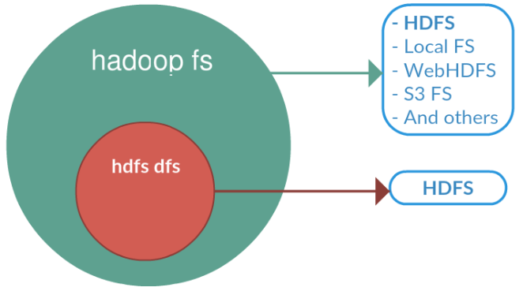
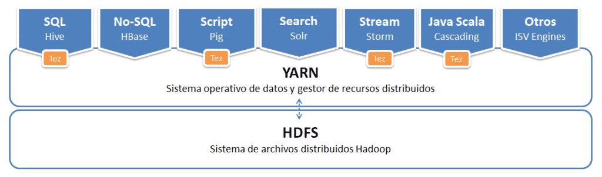

# Hadoop

Si *Big Data* es la filosofía de trabajo para grandes volumenes de datos, *Apache Hadoop* <http://hadoop.apache.org/>) es la tecnología catalizadora. *Hadoop* puede escalar hasta miles de ordenadores creando un clúster con un almacenamiento del orden de *petabytes* de información.

Más que un producto, es un proyecto *open source* que aglutina una serie de herramientas para el procesamiento distribudos de grandes conjuntos de datos a través de clústers de ordenadores utilizando modelos de programación sencillo.

Sus características son:

* Confiable: crea múltiples copias de los datos de manera automática y, en caso de fallo, vuelve a desplegar la lógica de procesamiento.
* Tolerante a fallos: tras detectar un fallo aplica una recuperación automática. En *Hadoop* los fallos de hardware se tratan como una regla, no como una excepción.
* Escalable: los datos y su procesamiento se distribuyen sobre un clúster de ordenadores (escalado horizontal), desde un único servidor a miles de máquinas, cada uno ofreciendo computación y almacenamiento local.
* Portable: se puede instalar en todo tipos de *hardware* y sistemas operativos.

Esto lo logra mediante un entorno distribuido de datos y procesos. El procesamiento se realiza en paralelo a través de nodos de datos en un sistema de ficheros distribuidos, donde se distingue entre:

FIXME: hardware hadoop

* Nodos maestros: normalmente se necesitan 3. Su hardware tiene mayores requisitos.
* Nodos esclavos: entre 4 y 10.000. Su hardware es relativamente barato (*commodity hardware*) mediante servidores X86.

En la actualidad se ha impuesto Hadoop v3 (la última versión a día de hoy es la 3.3.1), aunque todavía existe mucho código para Hadoop v2.

## Componentes

El núcleo se compone de:

* un conjunto de utilidades comunes (*Hadoop Common*)
* un sistema de ficheros distribuidos (*Hadoop Distributed File System* <--> *HDFS*).
* un gestor de recursos para el manejo del clúster y la planificación de procesos (*YARN*)
* un sistema para procesamiento paralelo de grandes conjuntos de datos (*MapReduce*)

Estos elementos permiten trabajar de casi la misma forma que si tuviéramos un sistema de fichero locales en nuestro ordenador personal, pero realmente los datos están repartidos entre miles de servidores.

Sobre este conjunto de herramientas existe un ecosistema "infinito" con tecnologías que facilitan el acceso, gestión y extensión del propio Hadoop.


Las más utilizadas son:

* [Hive](http://hive.apache.org/index.html): Permite accede a HDFS como si fuera una Base de datos, ejecutando comandos muy parecido a SQL para recuperar valores (HiveSQL). Simplifica enormemente el desarrollo y la gestión con *Hadoop*.
* [HBase](http://hbase.apache.org/): Es el sistema de almacenamiento NoSQL basado con columnas para Hadoop.
    * Es de código abierto, distribuida y escalable para el almacenamiento de Big Data.
    * Escrita en Java e implementa y proporciona capacidades similares sobre Hadoop y HDFS.
    * El objetivo de este proyecto es el de trabajar con grandes tablas, miles de millones de filas de X millones de columnas, sobre un clúster Hadoop.
* [Pig](https://pig.apache.org/): Lenguaje de alto de nivel para analizar grandes volúmenes de datos.  Trabaja en paralelo lo que permite gestionar gran cantidad de información. Realmente es un compilador que genera comandos MapReduce, mediante el lenguaje textual denominado *Pig Latin*.
* [Sqoop](http://sqoop.apache.org/): Permite transferir gran volumen de datos de manera eficiente entre Hadoop y gestores de datos estructurados.
* [Flume](https://flume.apache.org/): Servicio distribuido y altamente eficiente para distribuir, agregar y recolectar grandes cantidades de información. Es útil para cargar y mover en Hadoop información textual, como ficheros de logs, bloques de twitter/reddit, etc. Utiliza una arquitectura de tipo streaming con un flujo de datos muy potente y personalizables
* [ZooKeeper](https://zookeeper.apache.org/): Servicio para mantener la configuración, coordinación y aprovisionamiento de aplicaciones distribuidas. No sólo vale para Hadoop, pero es muy útil en esa arquitectura, eliminando la complejidad de la gestión distribuido de la plataforma.
* [Spark](http://spark.apache.org/): Es un motor muy eficiente de procesamiento de datos a gran escala. Implementa procesamiento en tiempo real al contrario que MapReduce, lo que provoca que sea más rápido. Para ello, en vez de almacenar los datos en disco, trabaja de forma masiva en memoria. Puede trabajar de forma autónoma, sin necesidad de Hadoop.
* [Ambari](https://ambari.apache.org/) es una herramienta para instalar, configurar, mantener y monitorizar Hadoop.

Si queremos empezar a utilizar Hadoop y todo su ecosistema, disponemos de diversas distribuciones con toda la arquitectura, herramientas y configuración ya preparadas. Las más reseñables son:

* [Amazon Elastic MapReduce (EMR)](https://aws.amazon.com/es/emr) de AWS.
* [CDH](https://www.cloudera.com/products/open-source/apache-hadoop/key-cdh-components.html) de Cloudera
* [Azure HDInsight](https://azure.microsoft.com/es-es/services/hdinsight/) de Microsoft

## MapReduce

Es el algoritmo que utiliza *Hadoop* para paralelizar las tareas. Un algoritmo MapReduce divide los datos, los procesa en paralelo, los reordena, combina y agrega de vuelta los resultados.

Sin embargo, este algoritmo no casa bien con el análisis interactivo o programas iterativos, ya que persiste los datos en disco entre cada uno de los pasos del mismo, lo que con grandes *datasets* conlleva una penalización en el rendimiento.

El siguiente gráfico muestra un ejemplo de una empresa de juguete que fabrica juguetes de colores. Cuando un cliente compra un juguete desde la página web, el pedido se almacena como un fichero en *Hadoop* con los colores de los juguetes adquiridos. Para averiguar cuantas unidades de cada color ha de preparar la fábrica, se emplea un algoritmo MapReduce para contar los colores:


Como sugiere el nombre, el proceso se divide principalmente en dos fases:

* Fase de mapeo (*Map*) — Los documentos se parten en pares de clave/valor. Hasta que no se reduzca, podemos tener muchos duplicados.
* Fase de reducción (*Reduce*) — Es en cierta medida similar a un *"group by"* de SQL. Las ocurrencias similares se agrupan, y dependiendo de la función de reducción, se puede crear un resultado diferente. En nuestro ejemplo queremos contar los colores, y eso es lo que devuelve nuestra función.

Realmente, es un proceso más complicado:


1. Lectura de los ficheros de entrada.
2. Pasar cada linea de forma separada al mapeador.
3. El mapeador parsea los colores (claves) de cada fichero y produce un nuevo fichero para cada color con el número de ocurrencias encontradas (valor), es decir, mapea una clave (color) con un valor (número de ocurrencias).
4. Para facilitar la agregación, se ordenan las claves.
5. La fase de reducción suma las ocurrencias de cada color y genera un fichero por clave con el total de cada color.
6. Las claves se unen en un único fichero de salida.

!!! note "No es oro todo lo que reluce"
    Hadoop facilita el trabajo con grandes volúmenes de datos, pero montar un clúster funcional no es una cosa trivial. Existen gestores de clústers que hacen las cosas un poco menos incómodas (como son *Ambari* o *Apache Mesos*), aunque la tendencia es utilizar una solución cloud que nos evita toda la instalación y configuración.

Tal como comentamos al inicio, uno de los puntos débiles de Hadoop es el trabajo con algoritmos iterativos, los cuales son fundamentales en la parte de IA. La solución es el uso del framework Spark, que mejora el rendimiento por una orden de magnitud.

## HDFS

Es la capa de almacenamiento de Hadoop, y como tal, es un sistema de ficheros distribuido y tolerante a fallos que puede almacenar gran cantidad de datos, escalar de forma incrementa y sobrevivir a fallos de hardware sin perder datos.

En un sistema que se reparte entre todos los nodos del clúster de Hadoop, dividiendo los ficheros en bloques (cada bloque por defecto es de 128MB) y almacenando copias duplicadas a través de los nodos. Por defecto se replica en 3 nodos distintos.

FIXME: poner gráfico

Está planteado para escribir los datos una vez y leerlos muchos veces. Las escrituras se pueden realizar a mano, o desde herramientas como *Flume* y *Sqoop*, que estudiaremos más adelante.

No ofrece buen rendimiento para:​

* Accesos de baja latencia​
* Ficheros pequeños (a menos que se agrupen)​
* Múltiples *escritores*
* Modificaciones arbitrarias de ficheros​

### Bloques

Un bloque es la cantidad mínima de datos que puede ser leída o escrita.​ El tamaño predeterminado de HDFS son 128 MB, ya que Hadoop está pensado para trabajar con fichero de gran tamaño.​

Todos los ficheros están divididos en bloques.​ Esto quiere decir que si subimos un fichero de 600MB, lo dividirá en 5 bloques de 128MB. Estos bloques se distribuyen por todos los nodos de datos del clúster de Hadoop.

A partir del factor de redundancia, cada bloque se almacena varias veces en máquinas distintas. El valor por defecto es 3.​ Por lo tanto, el archivo de 600MB que teniamos dividido en 5 bloques de 128MB, si lo replicamos tres veces, lo tendremos repartido en 15 bloques entre todos los nodos del clúster.

<figure style="align: center;">
    
    <figcaption>Factor de replicación HDFS</figcaption>
</figure>

En HDFS se distinguen las siguientes máquinas:​

* *Namenode*: ​Actúa como máster y almacena todos los metadatos necesarios para construir el sistema de ficheros a partir de sus bloques.​ Tiene control sobre donde están todos los bloques.​
* *Datanode*:​ Son los esclavos, se limitan a almacenar los bloques que compone cada fichero.​
* *Secondary Namenode*:​ Su función principal es tomar puntos de control de los metadatos del sistema de archivos presentes en namenode.​

<figure style="align: center;">
    
    <figcaption>Arquitectura HDFS</figcaption>
</figure>

### Namenodes

Existen dos tipos. El principal se conoce como *Namenode*:

* Solo existe uno.​
* Gestiona el espacio del sistema de ficheros​
* Mantiene el árbol del Sistema de ficheros y los metadatos para todos los ficheros y directorios en el árbol.​
* Los bloques nunca pasan por el NameNode, se transfieren entre DataNodes o al cliente.​ Es decir, el *Namenode* no es responsable de almacenar o transferir los datos.
* Si se cae, no hay acceso al HDFS​

El segundo tipo es el *Secondary Namenode*:

* Su función principal es guardar una copia de *FsImage* y *EditLog​*
    * *FsImage*: instantánea de los metadatos del sistema de archivos.​
    * *EditLog*: registro de transacciones que contiene los registros de cada cambio que se produce en los metadatos del sistema de * archivos.​
* No se trata de un nodo de respaldo​
* Por lo general se ejecuta en una máquina distinta​

### Datanode

* Más de uno​
* Almacena y lee bloques.​
* Recuperado por Namenode clientes​
* Reportan al Namenode la lista de bloques que están almacenando.​
* Pueden ir en distintos discos​
* Guarda un checksum del bloque​
* Verificación del bloque: lectura​

!!! info "HDFS por dentro" 
    HDFS utiliza de un conjunto de ficheros que gestionan los cambios que se producen en el clúster.
    Si entramos a la carpeta de datos que tenemos configurada en `hdfs-site.xml`, tendremos una carpeta `current` que contendrá un conjunto de ficheros cuyos prefijos son:

    * `edits_000NNN`: histórico de cambios que se van produciendo.
    * `edits_inprogress_NNN`: cambios actuales en memoria
    * `fsimagen_000NNN`: *snapshot* en el tiempo del sistema de ficheros.

    <figure style="float: right; padding-left: 20px">
        
        <figcaption>HDFS DFS</figcaption>
    </figure>

    Al arrancar HDFS se carga en memoria el último fichero `fsimage` disponible junto con los `edits` que no han sido procesados. Mediante el *secondary namenode*, cuando se llena un bloque, se irán sincronizando los cambios que se producen en `edits_inprogress` creando un nuevo `fsimage` y un nuevo `edits`.

### Procesos de lectura y escritura

Colocar un archivo en HDFS implica los siguientes pasos:

1. Una aplicación cliente envía una solicitud al *namenode* que especifica dònde quiere poner el archivo dentro de HDFS.
2. El *namenode* determina la forma en que va a dividir los datos en bloques y qué *datanodes* utilizará para almacenar los bloques. Esta información se devuelve a la aplicación cliente.
3. La aplicación cliente se comunica directamente con cada *datanode* escribiendo los bloques informados en el paso anterior.
4. El *datanode* replica el bloque de nueva creación a otros 2 datanodes (suponiendo que el factor de replicación sea 3).
5. Podemos especificar el tamaño del bloque para cada archivo mediante la propiedad `dfs.blocksize`. Si no se indica un tamaño de bloque a nivel de arhicov, se utiliza el valor global de `dfs.blocksize` definido en `hdfs-site.xml`, el cual por defecto es de 128MB.

Es importante destacar que los datos nunca pasan por el *namenode*. El cliente que realiza la carga en HDFS es el que hace las operación de lectura/escritura directamente con los *datanodes*.

FIXME: revisar, mirar proceso de lectura/escritura del ppt de Teralco

FIXME: mirar video y hacer capturas

https://www.youtube.com/watch?v=e1-yVYXOTMg

### Trabajando con HDFS

Para interactuar con el almacenamiento desde un terminal, se utiliza el comando `hdfs`. Este comando admite un segundo parámetro con diferentes opciones.

Antes la duda, es recomendable consultar la [documentación oficial](https://hadoop.apache.org/docs/current/hadoop-project-dist/hadoop-hdfs/HDFSCommands.html)

``` bash
hdfs comando
```

!!! info "hadoop fs"
    <figure style="float: left; padding-right: 20px">
        
        <figcaption>HDFS DFS</figcaption>
    </figure>

    `hadoop fs` se relaciona con un sistema de archivos genérico que puede apuntar a cualquier sistema de archivos como local, HDFS, FTP, S3, etc. En versiones anteriores se utilizaba el comando `hadoop dfs`para acceder a HDFS, pero ya quedado obsoleto en favor de `hdfs dfs`.

En el caso concreto de interactuar con el sistema de ficheros de Hadoop se utiliza el comando `dfs`, el cual admite requiere de otro argumento (empezando con un guión) el cual será uno de los comandos Linux para interactuar con el shell. Podéis consultar la lista de comandos en la [documentación oficial](https://hadoop.apache.org/docs/current/hadoop-project-dist/hadoop-common/FileSystemShell.html).

``` bash
hdfs dfs -comandosLinux
```

Por ejemplo, para mostrar todos los archivos que tenemos en el raíz haríamos:

``` bash
hdfs dfs -ls
```

Los comandos más utilizados son:

* `put`: Coloca un archivo dentro de HDFS
* `get`: Recupera un archivo de HDFS y lo lleva a nuestro sistema *host*.
* `cat` / `text` / `tail`: Visualiza el contenido de un archivo.
* `mkdir` / `rmdir`: Crea / borra una carpeta.
* `count`: Cuenta el número de elementos (número de carpetas, ficheros, tamaño y ruta).
* `cp` / `mv`: Copia / mueve-renombra un archivo.

!!! question "Autoevaluación"

    ¿Sabes qué realiza cada uno de los siguientes comandos?

    ``` bash
    hdfs dfs -mkdir /datos
    hdfs dfs -put ejemplo.txt /datos/
    hdfs dfs -put ejemplo.txt /datos/ejemploRenombrado.txt
    hdfs dfs -ls /datos
    hdfs dfs -count /datos
    hdfs dfs -mv /datos/ejemploRenombrado.txt /datos/otroNombre.json
    hdfs dfs -get /datos/otroNombre.json /tmp
    ```

A continuación vamos a ver como trabajar HDFS con los bloques. Para el siguiente ejemplo, vamos a trabajar con un archivo que ocupe más de un bloque, como puede ser [El registro de taxis amarillos de Nueva York - Enero 2020](https://s3.amazonaws.com/nyc-tlc/trip+data/yellow_tripdata_2020-01.csv).

FIXME: Corregir y revisar

o primero que vamos a hacer es crear un directorio dentro del hdfs llamado temporal
hdfs dfs -mkdir /user/temporal
 Una vez creado subimos el archivo de la carpeta Recurso al directorio de dfs creado en el paso anterior
hdfs dfs -put el_quijote.txt /user/temporal
 Con el fichero subido nos vamos al hdfs UI: localhost:9870 y comprobamos que el Block Pool ID del block information, coincide con el del directorio de datos del datanode, dentro del directorio current:

Dentro de este subdirectorio existe otro current/finalized, donde Hadoop irá creando una estructura de subdirectorios subdir()... donde albergará los bloques de datos. En uno aparecen los datos y en el otro los metadatos
 Creamos un nuevo directorio llamado temporal1 y copiamos el fichero prueba.txt del directorio temporal a temporal1.
 Borramos el directorio temporal
 Ahora vamos a crear un fichero grande. Para ello lanzamos este comando que nos va a generar un fichero de 1G en /tmp, llamado giga_test.dat que estará lleno de ceros.
 Subimos el fichero a un directorio que creamos conveniente hdfs dfs -put /tmp/giga_test.dat /user/prueba
 Una vez subido nos vamos a hdfs UI file browser para ver los bloques que ha creado

``` bash
dd if=/dev/zero of=/tmp/giga_test.dat bs=1024 count=1000000
````

Ahora nos vamos al directorio subdir() de datanode y podremos comprobar todos los bloques
ls /datos/datanode/current/BP-1410034788-192.168.0.101- 1618596221610/current/finalized/subdir0/subdir0
Bloques acabados desde el 20 al 27

### Administración

Algunas de las opciones más utiles para administrar HDFS son:

* `hdfs dfsadmin -report`: Realiza un resumen del sistema HDFS, similar al que aparece en el interfaz web.
* `hdfs fsck`: Comprueba el estado del sistema de ficheros. Si queremos comprobar el estado de un determinado directorio, lo indicamos mediante un segundo parámetro: `hdfs fsck /datos/prueba`
* `hdfs dfsadmin -printTopology`: Muestra la topología que tenemos, identificando los nodos que tenemos y al rack al que pertenece cada nodo
* `hdfs dfsadmin -listOpenFiles`: Comprueba si hay algún fichero abierto

### *Snapshots*

Mediante las *snapshots* podemos hacer una foto que indica cómo está en un determinado momento nuestro sistema de ficheros, a modo de copia de seguridad de los datos, para en un futuro poder hacer una recuperación.

El primer paso es activar el uso de *snapshots*, mediante el comando de administración, indicando sobre qué carpeta vamos a habilitar su uso:

``` bash
hdfs dfsadmin -allowSnapshot /datos
```

El siguiente paso es crear una *snapshot*, para ellos se indica tanto la carpeta como un nombre para la captura (es un comando que se realiza sobre el sistema de archivos):

``` bash
hdfs dfs -createSnapshot /datos /captura1
```

Esta captura se creará dentro de una carpeta oculta dentro de la ruta indicada (en nuestro caso creará la carpeta  `/datos/.snapshot/captura1/` la cual contendrá la información de la captura)

A continuación, vamos a borrar uno de los archivo creados anteriormente y comprobar que ya no existe:

``` bash
hdfs dfs -rm /datos/ejemplo.txt
hdfs dfs -ls /datos
```

Para comprobar el funcionamiento de los *snapshots*, vamos a recuperar el archivo desde la captura creada anteriormente.

``` bash
hdfs dfs -cp /datos/.snapshot/captura1/ejemplo.txt /datos
```

## YARN

*Yet Another Resource Negotiator* es un distribuidor de datos y gestor de recursos distribuidos. Forma parte de Hadoop desde la versión 2, y abstrae la gestión de recursos de los procesos *MapReduce* lo que implica una asignación de recursos más efectiva.

<figure style="align: center;">
    
    <figcaption>YARN y Hadoop</figcaption>
</figure>

El objetivo principal de YARN es separar en dos servicios las funcionalidades de gestion de recursos de la monitorización/planificación de tareas.

Se divide en tres componentes principales: un *Resource Manager*, Node Manager y *ApplicationMaster*.

La idea es tener un *Resource Manager* global y un *Application Master* por aplicación, considerando una aplicación tanto un único *job* como un conjunto de jobs cíclicos.

El *Resource Manager* y el *Node Manager* componen el framework de computación de datos. En concreto, el *ResourceManager* es la autoridad que orquesta los recursos entre todas las aplicaciones del sistema. A su vez, el *NodeManager* es un agente que está en cada nodo de datos y es responsable de monitorizar los recursos de cada nodo (CPU, memoria, disco y red) y reportar estos datos al *Resource Manager*.

El *Application Master* es una librería específica encargada de negociar los recursos con el *ResourceManager* y de trabajar con los *Node Manager* para ejecutar y monitorizar las tareas.

### *Resource Manager*

A su vez se divide en dos componentes:

* El *Scheduler* o planificador es el encargado de gestionar la distribución de los recursos del clúster de YARN. Además, las aplicaciones usan los recursos que el *Resource Manager* les ha proporcionado en función de sus criterios de planificación. Este planificador no monitoriza el estado de ninguna aplicación ni les ofrece garantías de ejecución, ni recuperación por fallos de la aplicación o el hardware, sólo planifica. Este componente realiza su planificación a partir de los requisitos de recursos necesarios por las aplicaciones (CPU, memoria, disco y red).
* *Applications Manager*:  es el componente del *Resource Manager* responsable de aceptar las peticiones de trabajos, negociar el contenedor en el que ejecutar la *Application Master* y proporcionar reinicios de los trabajos en caso de que fuera necesario debido a errores.

El *Resource Manager* mantiene un listado de los *Node Manager* activos y de sus recursos disponibles. Los clientes del sistema pueden enviar una aplicación Yarn soportada para ejecutar al *Resource Manager*.

### *Node Manager*

Gestiona los trabajos con las instrucciones del *Resource Manager* y proporciona los recursos computacionales necesarios para las aplicaciones en forma de contenedores. Implementa Heartbeats para mantener informado del estado al *Resource Manager*.

Los contenedores YARN tienen una asignación de recursos (CPU, memoria, disco y red) fija de un host del clúster y el *Node Manager* es el encargado de monitorizar esta asignación. Mapean las variables de entorno necesarias, las dependencias y los servicios necesarios para crear los procesos.

### *Application Master*

El *Application Master* es el responsable de negociar los recursos apropiados con el *Resource Manager* y monitorizar su estado y su progreso. También coordina la ejecución de todas las tareas en las que puede dividirse su aplicación.

Podemos ver la secuencia de trabajo y colaboración de estos componentes en el siguiente gráfico:

<figure style="align: center;">
    
    <figcaption>Secuencia de trabajo YARN</figcaption>
</figure>

1. El cliente envía una aplicación YARN.
2. *Resource Manager* reserva los recursos en un contenedor para su ejecución.
3. El *Application Manager* se registra con el *Resource Manager* y pide los recursos necesarios.
4. El *Application Manager* notifica al *Node Manager* la ejecución de los contenedores. Se ejecuta la aplicación Yarn en el contenedor correspondiente.
5. El *Application Master* monitoriza la ejecución y reporta el estado al *Resource Manager* y al *Application Manager*.
6. Al terminar la ejecución, el *Application Manager* lo notifica al *Resource Manager*.

YARN soporta la reserva de recursos mediante el [*Reservation System*](https://hadoop.apache.org/docs/stable/hadoop-yarn/hadoop-yarn-site/ReservationSystem.html), un componente que permite a los usuarios especificar un perfil de recurso y restricciones temporales (*deadlines*) y posteriormente reservar recursos para asegurar la ejecución predecibles de las tareas importantes. Este sistema registra los recursos a lo largo del tiempo, realiza control de admisión para las reservas, e informa dinámicamente al planificador para asegurarse que se produce la reserva.

Para conseguir una alta escalabilidad (del orden de miles de nodos), YARN ofrece el concepto de [*Federación*](https://hadoop.apache.org/docs/stable/hadoop-yarn/hadoop-yarn-site/Federation.html). Esta funcionalidad permite conectar varios clústeres YARN y hacerlos visibles como un clúster único. De esta forma puede ejecutar trabajos muy pesados y distribuidos.

!!! info "Hadoop v1"
    MapReduce en hadoop-2.x mantiene la compatibilidad del APU con versiones previas (hadoop-1.x). De esta manera, todo los *jobs* de *MapReduce* funcionan perfectamente con YARN sólo recompilando el código.

## Instalación

Para trabajar en este y las siguientes sesión, vamos a trabajar con la máquina virtual que tenemos compartida en Aules. A partir de la OVA de VirtualBox, podrás entrar con el usuario *hadoop* y la contraseña *hadoop*.

Si quieres instalar el software del curso, se recomiendo crear una máquina virtual con cualquier distribución Linux.
En mi caso, yo lo he probado en la versión *20.04 LTS* y la versión 3.2.2 de *Hadoop*. Puedes seguir las instrucciones del artículo [Cómo instalar y configurar Hadoop en Ubuntu 20.04 LTS](https://noviello.it/es/como-instalar-y-configurar-hadoop-en-ubuntu-20-04-lts/).

Para trabajar en local tenemos montada una solución que se conoce como *pseudo-distribuida*, porque es al mismo tiempo maestro y esclavo. En el mundo real o si utilizamos una solución cloud tendremos un nodo maestro y múltiples nodos esclavos.

### Configuración

Los archivos que vamos a revisar a continuación se encuentran dentro de la carpeta `$HADOOP_HOME/etc/hadoop`.

El archivo que contiene la configuración general del clúster es el archivo `core-site.xml`. En él se configura cual será el sistema de fichero, que normalmente será hdfs, indicando el dominio del nodo que será el maestro de datos (*namenode*) de la arquitectura. Por ejemplo, su contenido será similar al siguiente:

``` xml
<configuration>
    <property>
        <name>fs.defaultFS</name>
        <value>hdfs://dominioNodoMaestro:9000</value>
    </property>
 </configuration>
```

El siguiente paso es configurar el archivo `hdfs-site.xml` donde se indica tanto el factor de replicación como donde se almacenan tanto los metadatos (*namenode*) como los datos en sí (*datanode*):

``` xml
<configuration>
    <property>
        <name>dfs.replication</name>
        <value>1</value>
    </property>

    <property>
        <name>dfs.namenode.name.dir</name>
        <value>/carpetaData/hdfs/namenode</value>
    </property>

    <property>
        <name>dfs.datanode.data.dir</name>
        <value>/carpetaData/hdfs/datanode</value>
    </property>
</configuration>
```

!!! caution "Recuerda"
    Si tuviésemos un clúster, en el nodo maestro solo configuraríamos la ruta del *namenode* y en cada uno de los nodos esclavos, únicamente la ruta del *datanode*.

Para configurar YARN, primero editaremos el archivo `yarn-site.xml` para indicar quien va a ser el nodo maestro, así como el manejador y la gestión para hacer el *MapReduce*:

``` xml
<configuration>
    <property>
        <name>yarn.resourcemanager.hostname</name>
        <value>dominioNodoMaestro</value>
    </property>
    <property>
        <name>yarn.nodemanager.aux-services</name>
        <value>mapreduce_shuffle</value>
    </property>
    <property>
        <name>yarn.nodemanager.aux-services.mapreduce_shuffle.class</name>
        <value>org.apache.hadoop.mapred.ShuffleHandler</value>
    </property>
</configuration>
```

Y finalmente el archivo `mapred-site.xml` para indicar que utilice YARN como framework *MapReduce*:

``` xml
<configuration>
    <property>
        <name>mapreduce.framework.name</name>
        <value>yarn</value>
    </property>
</configuration>
```

## Puesta en marcha

<figure style="float: right; width: 300px">
    
    <figcaption>Arrancando HDFS</figcaption>
</figure>

Para arrancar Hadoop, hemos de ejecutar el comando `startdfs.sh`. Al finalizar, veremos que ha arrancado el *namenode*, los *datanodes*, y el *secondary namenode*.

Si en cualquier momento queremos comprobar el estado de los servicios y procesos en ejecución, tenemos el comando `jps`.

Si accedemos a `http://localhost:9870/` podremos acceder a una interfaz web.

<figure style="align: center">
    
    <figcaption>Interfaz Web de Hadoop</figcaption>
</figure>

<figure style="float: right; width: 300px">
    
    <figcaption>Arrancando YARN</figcaption>
</figure>

Para arrancar YARN utilizaremos el comando `start-yarn.sh` para arrancar el *Resource Manager* y el *Node Manager*:

Y a su vez, YARN también ofrece un interfaz web para obtener información como las métricas del clúster. Nos conectaremos con el nombre del nodo principal y el puerto `8088`. En nuestro caso lo hemos realizado a `http://hadoop-virtualbox:8088` obtienendo la siguiente página:

<figure style="align: center">
    
    <figcaption>Interfaz Web de YARN</figcaption>
</figure>

## Ambari

[Ambari](https://ambari.apache.org) es un producto que simplifica la gestión de Hadoop y permite configurar, instalar y monitorizar un cluster Hadoop.

La instalación que tenemos no nos sirve, ya que Ambari crea un nueva instalación tanto de Hadoop y YARN. Para su instalación desde cero, es recomendable seguir las indicaciones de su [página oficial](https://cwiki.apache.org/confluence/display/AMBARI/Installation+Guide+for+Ambari+2.7.5).

Nosotros vamos a resumir los pasos recomendados. Para instalar en Ubuntu el servidor Amabari únicamente deberíamos ejecutar el siguiente comando (también va a instalar PostgreSQL donde almacenará todos los metadados sobre la configuración de Ambari):

``` bash
apt-get install ./ambari-server*.deb   # Instalará también PostgreSQL
```

Una vez instalado, solo queda configurarlo (como usuario con permisos *root*):

``` bash
ambari-server setup
```

Y finalmente arrancarlo:

``` bash
ambari-server start
```

Ahora tocaría instalar los agentes en cada uno de los nodos, así como configurarlo. Como vamos a trabajar con un modelo pseudodistribuido, en nuestro caso no vamos a hacer ese paso.

Finalmente, accederemos al interfaz gráfico con el usuario `admin/admin` y acceder http://localhost:8080.

FIXME: captura

Al crear un cluster, Ambari se basa en los stacks de HortonWorks HDP para realizar la instalación de Hadoop.

FIXME: captura

Revisar nodos

Instalar SSH en usuario root


## Referencias

* Documentación de [Apache Hadoop](https://hadoop.apache.org/docs/stable/)
* Artículo de [Hadoop por dentro](https://empresas.blogthinkbig.com/hadoop-por-dentro-ii-hdfs-y-mapreduce/)
* [Tutorial de Hadoop](https://www.tutorialspoint.com/hadoop/index.htm) de Tutorialspoint

## Actividades

Para los siguientes ejercicios, copia el comando y/o haz una captura de pantalla donde se muestre el resutlado de cada acción

1. Comandos HDFS
    1. Crear carpeta, meter 2 archivos, duplicar, renombrar y sacar
    FIXME: escribir
2. HDFS por dentro
    1. Accede al archivo de configuración `hdfs-site.xml` y averigua la carpeta donde se almacena el *namenode*.
    2. Muestra los archivos que contiene la carpeta `current` dentro del namenode
    3. Comprueba el id del archivo `VERSION`.
    4. Realiza un checkpoint manual para sincronizar el sistema de ficheros. Para ello entramos en modo *safe* con el comando `hdfs dfsadmin -safemode enter`, de manera que impedamos que se trabaje con el sistema de ficheros mientras lanzamos el *checkpoint*.
    5. Comprueba mediante el interfaz gráfico que el modo seguro está activo.
    6. Realiza un checkpoint
    7. Vuelve a entrar al modo normal
    8. Comprueba que los *fimage* del *namenode* son iguales.
3. HDFS / Administración
    1. Ejecutar todos los comandos del apartado haciendo capturas. Sobre el contenido creado en el ejercicio 1, crear una snapshot, borrar un archivo, y recuperarlo de la snapshot
    FIXME: escribir
4. (opcional) Crea una instalación desde cero en una nueva máquina virtual siguiendo las intrucciones del artículo recomendado en el apartado de [Configuracion](#configuracion). Arranca Hadoop, muestra los procesos y accede al interfaz gráfico.
5. (opcional) Crea una instalación desde cero mediante Ambari. Tras acceder al interfaz gráfico, crea un cluster llamado `cluster2122`. Instala Hadoop y accede al interfaz gráfico.
