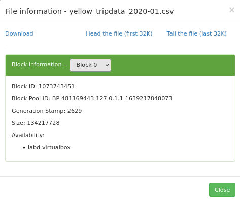

# HDFS

## Funcionamiento de HDFS

En la sesión anterior hemos estudiado los diferentes componentes que forman parte de HDFS: *namenode* y *datanodes*. En esta sesión vamos a estudiar los procesos de lectura y escritura, a interactuar con HDFS mediante comandos, el uso de instántaneas y los formatos de datos más empleados en Hadoop, como son Avro y Parquet.

### Procesos de lectura

Vamos a entender como fluyen los datos en un proceso de lectura entre el cliente y HDFS a partir de la siguiente imagen:

<figure style="align: center;">
    
    <figcaption>Proceso de lectura</figcaption>
</figure>

1. El cliente abre el fichero que quiere leer mediante el método `open()` del sistema de archivos distribuido.
2. Éste llama al *namenode* mediante una RPC (llamada a procedimiento remoto) el cual le indica la localización del primer bloque del fichero. Para cada bloque, el *namenode* devuelve la dirección de los datanodes que tienen una copia de ese bloque. Además, los *datanodes* se ordenan respecto a su proximidad con el cliente (depende de la topología de la red y despliegue en *datacenter/rack/nodo*). Si el cliente en sí es un datanode, la lectura la realizará se sus propio sistema local.
3. El sistema de ficheros distribuido devuelve al cliente un FSDataInputStream (un flujo de entrada que soporta la búsqueda de ficheros), sobre el cual se invoca la lectura mediante el método `read()`. Este flujo, el cual contiene las direcciones de los datanodes para los primeros bloques del fichero, conecta con el *datanode* más cercano para la lectura del primer bloque.

4. Los datos se leen desde el datanode con llamadas método `read()`. Cuando se haya leído el bloque completo, el flujo de entrada cerrará la conexión con el datanode y buscará el mejor datanode para el siguiente bloque.

5. Se repite el paso anterior (siempre de manera transparente para el cliente, el cual solo está leyendo datos desde un flujo de datos contínuo). 

6. Cuando el cliente finaliza la lectura, cierra la conexión con el flujo de datos.

Durante la lectura, si el flujo encuentra un error al comunicarse con un datanode (o un error de *checksum*), intentará el proceso con el siguiente nodo más cercano (además, recordará los nodos que han fallado para no realizar reintentos en futuros bloques y/o informará de los bloque corruptos al *namenode*)

!!! importante "Namenode sin datos"
    Recordad que los datos nunca pasan por el *namenode*. El cliente que realiza la conexión con HDFS es el que hace las operaciones de lectura/escritura directamente con los *datanodes*.
    Este diseño permite que HDFS escale de manera adecuada, ya que el tráfico de los clientes se esparce por todos los *datanodes* de nuestro clúster.

### Proceso de escritura

El proceso de escritura en HDFS sigue un planteamiento similar. Vamos a analizar la creación, escritura y cierre de un archivo con la siguiente imagen:

<figure style="align: center;">
    
    <figcaption>Proceso de escritura</figcaption>
</figure>

1. El cliente crea el fichero mediante la llamada al método `create() del *DistributedFileSystem*.
2. Este realiza una llamada RPC al *namenode* para crear el fichero en el sistema de ficheros del *namenode*, sin ningún bloque asociado a él. El *namenode* realiza varias comprobaciones para asegurar que el fichero no existe previamente y que el usuario tiene los permisos necesarios para su creación. Tras ello, el *namenode* determina la forma en que va a dividir los datos en bloques y qué *datanodes* utilizará para almacenar los bloques.
3. El *DistributedFileSystem* devuelve un *FSDataOutputStream*  el cual gestiona la comunicación con los datanodes y el *namenode* para que el cliente comience a escribir los datos de cada bloque en el *namenode* apropiado.
4. Conforme el cliente escribe los datos, el flujo obtiene del *namenode* una lista de datanodes candidatos para almacenar las réplicas. La lista de nodos forman un *pipeline*, de manera que si el factor de replicación es 3, habrá 3 nodos en el *pipeline*. El flujo envía los paquete al primer datanode del pipeline, el cual almacena cada paquete y los reenvía al segundo datanode del *pipeline*. Y así sucesivamente con el resto de nodos del pipeline.
5. Cuando todos los nodos han confirmado la recepción y almacenamiento de los paquetes, envía un paquete de confirmación al flujo.
6. Cuando el cliente finaliza con la escritura de los datos, cierra el flujo mediante el método `close()` el cual libera los paquetes restantes al pipeline de datanodes y queda a la espera de recibir las confirmaciones. Una vez confirmado, le indica al *namenode* que la escritura se ha completado, informando de los bloques finales que conforman el fichero (puede que hayan cambiado respecto al paso 2 si ha habido algún error de escritura).

### HDFS por dentro

HDFS utiliza de un conjunto de ficheros que gestionan los cambios que se producen en el clúster.

Si entramos a la carpeta de datos que tenemos configurada en `hdfs-site.xml`, tendremos una carpeta `current` que contendrá un conjunto de ficheros cuyos prefijos son:

* `edits_000NNN`: histórico de cambios que se van produciendo.
* `edits_inprogress_NNN`: cambios actuales en memoria
* `fsimagen_000NNN`: *snapshot* en el tiempo del sistema de ficheros.

<figure style="float: right; padding-left: 20px">
    
    <figcaption>HDFS DFS</figcaption>
</figure>

Al arrancar HDFS se carga en memoria el último fichero `fsimage` disponible junto con los `edits` que no han sido procesados. Mediante el *secondary namenode*, cuando se llena un bloque, se irán sincronizando los cambios que se producen en `edits_inprogress` creando un nuevo `fsimage` y un nuevo `edits`.

Así pues, cada vez que se reinicie el *namenode*, se realizará el *merge* de los archivos `fsimage` y `edits log`.

## Trabajando con HDFS

Para interactuar con el almacenamiento desde un terminal, se utiliza el comando `hdfs`. Este comando admite un segundo parámetro con diferentes opciones.

Antes la duda, es recomendable consultar la [documentación oficial](https://hadoop.apache.org/docs/current/hadoop-project-dist/hadoop-hdfs/HDFSCommands.html)

``` bash
hdfs comando
```

!!! info "hadoop fs"
    <figure style="float: left; padding-right: 20px">
        
        <figcaption>HDFS DFS</figcaption>
    </figure>

    `hadoop fs` se relaciona con un sistema de archivos genérico que puede apuntar a cualquier sistema de archivos como local, HDFS, FTP, S3, etc. En versiones anteriores se utilizaba el comando `hadoop dfs` para acceder a HDFS, pero ya quedado obsoleto en favor de `hdfs dfs`.

En el caso concreto de interactuar con el sistema de ficheros de Hadoop se utiliza el comando `dfs`, el cual requiere de otro argumento (empezando con un guión) el cual será uno de los comandos Linux para interactuar con el shell. Podéis consultar la lista de comandos en la [documentación oficial](https://hadoop.apache.org/docs/current/hadoop-project-dist/hadoop-common/FileSystemShell.html).

``` bash
hdfs dfs -comandosLinux
```

Por ejemplo, para mostrar todos los archivos que tenemos en el raíz haríamos:

``` bash
hdfs dfs -ls
```

Los comandos más utilizados son:

* `put`: Coloca un archivo dentro de HDFS
* `get`: Recupera un archivo de HDFS y lo lleva a nuestro sistema *host*.
* `cat` / `text` / `head` / `tail`: Visualiza el contenido de un archivo.
* `mkdir` / `rmdir`: Crea / borra una carpeta.
* `count`: Cuenta el número de elementos (número de carpetas, ficheros, tamaño y ruta).
* `cp` / `mv` / `rm`: Copia / mueve-renombra / elimina un archivo.

!!! question "Autoevaluación"

    ¿Sabes qué realiza cada uno de los siguientes comandos?

    ``` bash
    hdfs dfs -mkdir /user/iabd/datos
    hdfs dfs -put ejemplo.txt /user/iabd/datos/
    hdfs dfs -put ejemplo.txt /user/iabd/datos/ejemploRenombrado.txt
    hdfs dfs -ls datos
    hdfs dfs -count datos
    hdfs dfs -mv datos/ejemploRenombrado.txt /user/iabd/datos/otroNombre.json
    hdfs dfs -get /datos/otroNombre.json /tmp
    ```

### Bloques

A continuación vamos a ver cómo trabaja internamente HDFS con los bloques. Para el siguiente ejemplo, vamos a trabajar con un archivo que ocupe más de un bloque, como puede ser [El registro de taxis amarillos de Nueva York - Enero 2020](https://s3.amazonaws.com/nyc-tlc/trip+data/yellow_tripdata_2020-01.csv).

Lo primero que vamos a hacer es crear un directorio dentro de HDFS llamado temporal:

``` bash
hdfs dfs -mkdir /user/iabd/prueba-hdfs
```

Una vez creado subimos el archivo con los taxis:

``` bash
hdfs dfs -put yellow_tripdata_2020-01.csv  /user/iabd/prueba-hdfs
```

Con el fichero subido nos vamos al interfaz gráfico de Hadoop (<http://iabd-virtualbox:9870/explorer.html#/>), localizamos el archivo y obtenemos el *Block Pool ID* del *block information*:

<figure style="align: center;">
    
    <figcaption>Identificador de bloque</figcaption>
</figure>

Si desplegamos el combo de *block information*, podremos ver como ha partido el archivo csv en 5 bloques (566 MB que ocupa el fichero csv / 128 del tamaño del bloque).

Así pues, con el código del *Block Pool Id*, podemos confirmar que debe existir el directorio `current` del *datanode* donde almacena la información nuestro servidor (en `/opt/hadoop-data/):

``` bash
ls /opt/hadoop-data/hdfs/datanode/current/BP-481169443-127.0.1.1-1639217848073/current
```

Dentro de este subdirectorio existe otro `finalized`, donde Hadoop irá creando una estructura de subdirectorios `subdir` donde albergará los bloques de datos:

``` bash
ls /opt/hadoop-data/hdfs/datanode/current/BP-481169443-127.0.1.1-1639217848073/current/finalized/subdir0
```

Una vez en este nivel, vamos a buscar el archivo que coincide con el *block id*:

``` bash
find -name blk_1073743451
```

En mi caso devuelve `./subdir6/blk_1073743451`. De manera que ya podemos comprobar como el inicio del documento se encuentra en dicho archivo:

``` bash
tail /opt/hadoop-data/hdfs/datanode/current/BP-481169443-127.0.1.1-1639217848073/current/finalized/subdir0/subdir6/blk_1073743451
```

### Administración

Algunas de las opciones más útiles para administrar HDFS son:

* `hdfs dfsadmin -report`: Realiza un resumen del sistema HDFS, similar al que aparece en el interfaz web, donde podemos comprobar el estado de los diferentes nodos.
* `hdfs fsck`: Comprueba el estado del sistema de ficheros. Si queremos comprobar el estado de un determinado directorio, lo indicamos mediante un segundo parámetro: `hdfs fsck /datos/prueba`
* `hdfs dfsadmin -printTopology`: Muestra la topología que tenemos, identificando los nodos que tenemos y al rack al que pertenece cada nodo.
* `hdfs dfsadmin -listOpenFiles`: Comprueba si hay algún fichero abierto.
* `hdfs dfsadmin -safemode enter`: Pone el sistema en modo seguro el cual evita la modificación de los recursos del sistema de archivos.

### *Snapshots*

Mediante las *snapshots* podemos hacer una instántanea que almacena cómo está en un determinado momento nuestro sistema de ficheros, a modo de copia de seguridad de los datos, para en un futuro poder hacer una recuperación.

El primer paso es activar el uso de *snapshots*, mediante el comando de administración indicando sobre qué carpeta vamos a habilitar su uso:

``` bash
hdfs dfsadmin -allowSnapshot /user/iabd/datos
```

El siguiente paso es crear una *snapshot*, para ello se indica tanto la carpeta como un nombre para la captura (es un comando que se realiza sobre el sistema de archivos):

``` bash
hdfs dfs -createSnapshot /user/iabd/datos snapshot1
```

Esta captura se creará dentro de una carpeta oculta dentro de la ruta indicada (en nuestro caso creará la carpeta  `/user/iabd/datos/.snapshot/snapshot1/` la cual contendrá la información de la instantánea).

A continuación, vamos a borrar uno de los archivo creados anteriormente y comprobar que ya no existe:

``` bash
hdfs dfs -rm /user/iabd/datos/ejemplo.txt
hdfs dfs -ls /user/iabd/datos
```

Para comprobar el funcionamiento de los *snapshots*, vamos a recuperar el archivo desde la captura creada anteriormente.

``` bash
hdfs dfs -cp \
    /user/iabd/datos/.snapshot/snapshot1/ejemplo.txt \
    /user/iabd/datos
```

Si queremos saber que carpetas soportan las instantáneas:

``` bash
hdfs lsSnapshottableDir
```

Finalmente, si queremos deshabilitar las *snapshots* de una determinada carpeta, primero hemos de eliminarlas y luego deshabilitarlas:

``` bash
hdfs dfs -deleteSnapshot /user/iabd/datos snapshot1
hdfs dfsadmin -disallowSnapshot /user/iabd/datos
```

### HDFS UI

En la sesión anterior ya vimos que podíamos acceder al interfaz gráfico de Hadoop (<http://iabd-virtualbox:9870/explorer.html#/>) y navegar por las carpetas de HDFS.

Si intentamos crear una carpeta o eliminar algún archivo recibimos un mensaje del tipo *Permission denied: user=dr.who, access=WRITE, inode="/":iabd:supergroup:drwxr-xr-x*. Por defecto, los recursos via web los crea el usuario *dr.who*.

<figure style="align: center;">
    
    <figcaption>Error al crear un directorio mediante Hadoop UI</figcaption>
</figure>

Si queremos habilitar los permisos para que desde este IU podamos crear/modificar/eliminar recursos, podemos cambiar permisos a la carpeta:

``` bash
hdfs dfs -mkdir /user/iabd/pruebas
hdfs dfs -chmod 777 /user/iabd/pruebas 
```

Si ahora accedemos al interfaz, sí que podremos trabajar con la carpeta `pruebas` via web, teniendo en cuenta que las operaciones las realiza el usuario `dr.who` que pertenece al grupo `supergroup`.

Otra posibilidad es modificar el archivo de configuración `core-site.xml` y añadir una propiedad para modificar el usuario estático:

``` xml title="core-site.xml"
<property>
    <name>hadoop.http.staticuser.user</name>
    <value>iabd</value>
</property>
```

Tras reiniciar *Hadoop*, ya podremos crear los recursos como el usuario `iabd`.

## Formatos de datos

En el primer bloque ya vimos una pequeña introducción a los diferentes [formatos de datos](https://manoli-iborra.github.io/bigdata2122/apuntes04.html#formato-de-datos_1).


Las propiedades que ha de tener un formato de datos son:

* independiente del lenguaje
* expresivo, con soporte para estructuras complejas y anidadas
* eficiente, rápido y reducido
* dinámico, de manera que los programas puedan procesar y definir nuevos tipos de datos.
* formato de fichero *standalone* y que permita **dividirlo** y comprimirlo.

Para que Hadoop pueda procesar documento, es imprescindible que el formato del fichero permita su división en fragmentos (*splittable in chunks*).

Si los clasificamos respecto al formato de almacenamiento tenemos:

* texto (más lentos, ocupan más pero son más expresivos y permiten su interoperabilidad): CSV, XML, JSON, etc...
* binarios (mejor rendimiento, ocupan menos, menos expresivos): Avro, Parquet, ORC, etc...

Si comparamos los formatos más empleados a partir de las propiedades descritas tenemos:

| Característica                | CSV   | XML / JSON    | SequenceFile  | Avro
| ----- | ----- | ---- | ----- | ----- |
| Independencia del lenguaje    | :thumbsup:    | :thumbsup:            | :fontawesome-regular-thumbs-down:              | :thumbsup:
| Expresivo                     | :fontawesome-regular-thumbs-down:    | :thumbsup:            | :thumbsup:            | :thumbsup:
| Eficiente                     | :fontawesome-regular-thumbs-down:    | :fontawesome-regular-thumbs-down:            | :thumbsup:            | :thumbsup:
| Dinámico                      | :thumbsup:    | :thumbsup:            | :fontawesome-regular-thumbs-down:         | :thumbsup:
| *Standalone*                  | :grey_question:     | :thumbsup:            | :fontawesome-regular-thumbs-down:             | :thumbsup:
| Dividible                     | :grey_question:     | :grey_question:             | :thumbsup:             | :thumbsup:

https://www.xenonstack.com/blog/data-serialization-hadoop

Hadoop definitive guide


Why choose different File Formats?
Proper selection of file format leads to -
Faster read time
Faster write time
Splittable files (for partial data read)
Schema evolution support (modifying dataset fields)
Advance compression support
Snappy compression leads to high speed and reasonable compression/decompression.
File formats help to manage Diverse data.

### Avro

Es un formato de almacenamiento basado en filas para Hadoop, utilizado para la serialización de datos ya que es más rápido y ocupa menos espacio que JSON, ya que la serialización de los datos se realiza en un formato binario compacto.

Avro se basa en esquemas, los cuales se realizan mediante JSON para definir los tipos de datos y protocolos. Cuando los datos `.avro` son leídos siempre está presente el esquema con el que han sido escritos.

#### Schema

Los esquemas se componen de tipos primitivos (null, boolean, int, long, float, double, bytes, and string) y compuestos (record, enum, array, map, union, and fixed).

Un ejemplo de esquema podría ser:

``` json title="empleado.avsc"
{
   "type" : "record",
   "namespace" : "SeveroOchoa",
   "name" : "Empleado",
   "fields" : [
      { "name" : "Nombre" , "type" : "string" },
      { "name" : "Altura" , "type" : "float" }
      { "name" : "Edad" , "type" : "int" }
   ]
}
```

#### Python

<https://towardsdatascience.com/csv-files-for-storage-absolutely-not-use-apache-avro-instead-7b7296149326>

<https://avro.apache.org/docs/current/gettingstartedpython.html>

Para poder serializar y deserializar documentos Avro mediante Python, previamente debemos instalar la librería `avro`:

``` bash
python3 -m pip install avro
```

A continuación vamos a realizar un ejemplo donde escribamos un archivo y luego lo volvamos a leer:

``` python
import avro.schema
from avro.datafile import DataFileReader, DataFileWriter
from avro.io import DatumReader, DatumWriter

# abrimos el fichero en modo binario y leemos el esquema
schema = avro.schema.parse(open("user.avsc", "rb").read())

writer = DataFileWriter(open("users.avro", "wb"), DatumWriter(), schema)
writer.append({"name": "Alyssa", "favorite_number": 256})
writer.append({"name": "Ben", "favorite_number": 7, "favorite_color": "red"})
writer.close()

reader = DataFileReader(open("users.avro", "rb"), DatumReader())
for user in reader:
    print user
reader.close()
```

### Parquet

Es un formato de almacenamiento basado en columnas para Hadoop. Fue creado para poder disponer de un formato de compresión y codificación eficiente. El formato Parquet está compuesto por tres piezas:

Row group: es un conjunto de filas en formato columnar.
Column chunk: son los datos de una columna en grupo. Se puede leer de manera independiente para mejorar las lecturas.
Page: es donde finalmente se almacenan los datos, debe ser lo suficientemente grade para que la compresión sea eficiente

## Hue

* Ruta: /opt/hue-4.10.0
	* ./build/env/bin/hue runserver
	* http://127.0.0.1:8000/hue
		* iabd/iabd
* Configuración: /opt/hue-4.10.0/desktop/conf/hue.ini


## Referencias

* Documentación de [Apache Hadoop](https://hadoop.apache.org/docs/stable/).
* [Hadoop: The definitive Guide, 4th Ed - de Tom White - O'Reilly](https://www.oreilly.com/library/view/hadoop-the-definitive/9780596521974/)
* [HDFS Commands, HDFS Permissions and HDFS Storage](https://www.informit.com/articles/article.aspx?p=2755708)
* [Handling Avro files in Python](https://www.perfectlyrandom.org/2019/11/29/handling-avro-files-in-python/)

https://empresas.blogthinkbig.com/hadoop-por-dentro-ii-hdfs-y-mapreduce/

## Actividades

Para los siguientes ejercicios, copia el comando y/o haz una captura de pantalla donde se muestre el resultado de cada acción.

1. Explica paso a paso el proceso de lectura que realiza HDFS si queremos leer el archivo `/logs/101213.log`: 

    <figure style="align: center;">
        
        <figcaption>Proceso de lectura HDFS</figcaption>
    </figure>

2. En este ejercicio vamos a practicar los comandos básicos de HDFS. Una vez arrancado *Hadoop*:
    1. Crea la carpeta `/user/iabd/ejercicios`.
    2. Sube el archivo `el_quijote.txt` a la carpeta creada.
    3. Crea una copia en HDFS y llámala `el_quijote2.txt`.
    4. Recupera el principio del fichero `el_quijote2.txt`.
    5. Renombra `el_quijote2.txt` a `el_quijote_copia.txt`.
    6. Adjunta una captura desde el interfaz web donde se vean ambos archivos.
    7. Vuelve al terminal y elimina la carpeta con los archivos contenidos mediante un único comando.

3. (opcional) Vamos a practicar los comandos de gestión de instántaneas y administración de HDFS. Para ello:
    1. Crea la carpeta `/user/iabd/instantaneas`.
    2. Habilita las *snapshots* sobre la carpeta creada.
    3. Sube el archivo `el_quijote.txt` a la carpeta creada.
    4. Crea una copia en HDFS y llámala `el_quijote_snapshot.txt`.
    5. Crea una instántanea de la carpeta llamada `ss1`.
    6. Elimina ambos ficheros del quijote.
    7. Comprueba que la carpeta está vacía.
    8. Recupera desde `ss` el archivo `el_quijote.txt`.
    9. Crea una nueva instántanea de la carpeta llamada `ss2`.
    10. Muestra el contenido de la carpeta `/user/iabd/instantaneas` así como de sus *snapshots*.

4. (opcional) HDFS por dentro
    1. Accede al archivo de configuración `hdfs-site.xml` y averigua la carpeta donde se almacena el *namenode*.
    2. Muestra los archivos que contiene la carpeta `current` dentro del *namenode*
    3. Comprueba el id del archivo `VERSION`.
    4. Realiza un checkpoint manual para sincronizar el sistema de ficheros. Para ello entramos en modo *safe* con el comando `hdfs dfsadmin -safemode enter`, de manera que impedamos que se trabaje con el sistema de ficheros mientras lanzamos el *checkpoint*.
    5. Comprueba mediante el interfaz gráfico que el modo seguro está activo.
    6. Realiza un checkpoint
    7. Vuelve a entrar al modo normal
    8. Comprueba que los *fimage* del *namenode* son iguales.

5. Mediante Python, carga los datos de los taxis que hemos almacenado en HDFS y crea dentro de `/user/iabd/datos` los siguientes archivos con el formato adecuado:

    * `taxis.avro`: la fecha, el nombre y el coste de cada viaje
    * `taxis.parquet`: la fecha y el coste.
