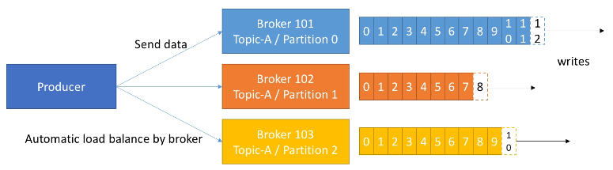

# Kafka

<!--
https://enmilocalfunciona.io/aprendiendo-apache-kafka-parte-3-conceptos-basicos-extra/

https://www.theninjacto.xyz/Instalacion-Configuracion-Kafka-Manager/

https://medium.com/big-data-engineering/hello-kafka-world-the-complete-guide-to-kafka-with-docker-and-python-f788e2588cfc
-->

[Apache Kafka](https://kafka.apache.org/) en pocas palabras es un middleware de mensajería entre sistemas heterogéneos, el cual, mediante un sistema de colas (tópicos, para ser concreto) facilita la comunicación asíncrona, desacoplando los flujos de datos de los sistemas que los producen o consumen.

<figure style="align: center;">
    
    <figcaption>Kafka como middleware</figcaption>
</figure>

En concreto, se trata de una plataforma **distribuida** de **transmisión de eventos/mensajes** en tiempo real con almacenamiento duradero y que proporciona de base un alto rendimiento (capaz de manejar billones de peticiones al día, con una latencia inferior a 10ms), tolerancia a fallos, disponibilidad y escalabilidad horizontal (mediante cientos de nodos).

Más del [80% de las 100 compañías](https://kafka.apache.org/powered-by) más importantes de EEUU utilizan Kafka : Uber, Twitter, Netflix, Spotify, Blizzard, LinkedIn, Spotify, y PayPal procesan cada día sus mensajes con Kafka.

A día de hoy, *Apache Kafka* se utiliza, además de como un sistema de mensajería, para ingestar datos, realizar procesado de datos en streaming y analítica de datos en tiempo real, así como en arquitectura de microservicios y sistemas IOT.

## Publicador / Suscriptor

Antes de entrar en detalle sobre Kafka, hay que conocer el modelo publicador/suscriptor. Este patrón también se conoce como *publish / subscribe* o *productor / consumidor*.

<!--
Hay tres elementos que hay que tener realmente claros:

* Publicador (publisher / remitente / emisor / productor): genera un dato y lo coloca en un *topic*.
* topic (tema):
* subcribers:

Existe un elemento "publisher" (publicador ) que al generar un dato (message / mensaje / record / registro) no lo dirige o referencia específicamente a un "subscriber" (receptor / subscriptor / suscriptor) en concreto, es decir, no lo envía de forma directa a la "dirección" del subscriber.

A partir de estos, existen otros elementos más complejos que ofrecen diferentes configuraciones:

tradicional: Cada suscriptor está asociado a uno o varios topic en concreto. Existen muchas variaciones:
Cada suscriptor está escuchando 1 topic propio.
Cada suscriptor está escuchando X topics independientes.
Cada suscriptor está escuchando X topics independientes y Y topics compartido.
Grupos de consumo: Los suscriptores se pueden agrupar por grupo, este grupo está escuchando un topic y sólo un miembro del grupo tendrá la capacidad de atender el mensaje.
Radio Difusión: Todos los suscriptores que están escuchando el topic reciben el mensaje (cada suscriptor es responsable de interpretar el mensaje de forma independiente).

Para ello se dispone de listas de temas/topics publicados específicos y un conjunto de suscriptores, el productor trata de clasificar el mensaje en base a una tipología, lo pone en la lista de un tema específico y el receptor se suscribe a la listas para recibir ese tipo de mensajes.

Publicación y suscripción de flujos de registros (Bastante similar a una cola de mensajes o un sistema de mensajería).
Almacenar flujos de registros tolerante a fallos (Sistema de Buffer con un periodo de retención de mensajes).
Procesar flujos de registros a medida que ocurren.

Es una plataforma para la transmisión de eventos
Implementa un sistema distribuido formado Servidores y Clientes que se comunican a través de TCP.
Servidores: Importan y exportan datos continuamente como flujos de eventos.
Clientes: Permiten escribir aplicaciones distribuidas y microservicios que leen, escriben y procesan flujos de eventos en paralelo.

Evento: registra el hecho de que algo ha sucedido.
Tiene una clave, un valor y una marca
Los eventos se organizan de forma duradera en temas (similar a una carpeta de archivos)
Los temas están divididos, distribuidos en varios depósitos. Los eventos con la misma clave, se escriben en la misma partición.
Productores: aplicaciones clientes que publican (escriben) eventos en Kaffa.
Consumidores: los que leen estos eventos.

-->

## Hola Kafka

Para arrancar Kafka, vamos a utilizar la instalación que tenemos creada en nuestra máquina virtual.

!!! tip "Kafka mediante Docker"
    *Bitnami* tiene una imagen para trabajar con *Docker* la cual permite probar todos los ejemplos de esta sesión. Para ello, se recomienda seguir los pasos de la página oficial: <https://hub.docker.com/r/bitnami/kafka/>

El primer paso, una vez dentro de la carpeta de instalación de Kafka (en nuestro caso `/opt/kafka_2.13-2.8.1`), es arrancar *Zookeeper*, el cual se encarga de gestionar la comunicación entre los diferentes brokers:

``` bash
zookeeper-server-start.sh ./config/zookeper.properties
```

Para comprobar que Zookeper está arrancado, podemos ejecutar el comando `lsof -i :2181`, el cual escanea el puerto 2181.

Una vez comprobado, en un nuevo terminal, arrancamos el servidor de Kafka (de manera que tenemos corriendo a la vez Zookeeper y Kafka):

``` bash
./bin/kafka-server-start.sh ./config/server.properties
```
<!--

Kafka Shell
To start it just run the command:
> ./start-kafka-shell.sh <DOCKER_HOST_IP/KAFKA_ADVERTISED_HOST_NAME>
 In my case:
> ./start-kafka-shell.sh 172.17.0.1
Hello Topic
From within the Kafka Shell, run the following to create and describe a topic:
> $KAFKA_HOME/bin/kafka-topics.sh --create --topic test \
--partitions 4 --replication-factor 2 \
--bootstrap-server `broker-list.sh`
> $KAFKA_HOME/bin/kafka-topics.sh --describe --topic test \
--bootstrap-server `broker-list.sh`
Hello Producer
Initialize the producer and write messages to Kafka’s brokers.
> $KAFKA_HOME/bin/kafka-console-producer.sh --topic=test \
--broker-list=`broker-list.sh`
>> Hello World!
>> I'm a Producer writing to 'hello-topic'
Hello Consumer
Initialize the consumer from another Kafka terminal and it will start reading the messages sent by the producer.
> $KAFKA_HOME/bin/kafka-console-consumer.sh --topic=test \
--from-beginning --bootstrap-server `broker-list.sh`

https://kafka.apache.org/quickstart

https://learning.oreilly.com/library/view/apache-kafka-quick/9781788997829/b09bb193-31af-4825-acd8-dc6e9ccd78b5.xhtml
-->

## Elementos

### Topic y Particiones

Es un flujo particular de datos, similar a una tabla de una base de datos (sin las restricciones).

Podemos crear tantos *topics* como queramos y cada uno de ellos tendrá un nombre unívoco.

Un *topic* se divide en particiones, las cuales se numeran y la primera es la 0. Al crear un *topic* hemos de indicar la cantidad de particiones inicial, la cual podemos modificar *a posteriori*.

Cada partición está ordenada, de manera que cada mensaje dentro de una partición tendrá un identificador incremental, llamado *offset* (desplazamiento).

<figure style="align: center;">
    
    <figcaption>Offset dentro de las particiones de un topic</figcaption>
</figure>

Como podemos observar en la imagen, cada partición tiene sus propios *offset* (el *offset* 3 de la partición 0 no representa el mismo dato que el *offset* 3 de la partición 1).

Habíamos comentado que las particiones están ordenadas, pero el orden sólo se garantiza dentro de una partición (no entre particiones), es decir, el mensaje 7 de la partición 0 puede haber llegado antes, a la vez, o después que el mensaje 5 de la partición 1.

Los datos de una partición tiene un tiempo de vida limitado, el cual por defecto es de una semana. Además, una vez que los datos se escriben en una partición, no se pueden modificar (las mensajes son immutables).

Finalmente, por defecto, los datos se asignan de manera aleatoria a una partición. Sin embargo, existe la posibilidad de indicar una clave de particionado.

### Brokers

Un cluster de Kafka está compuesto de múltiples nodos conocidos como *Brokers*, donde cada *broker* es un servidor de Kafka. Cada broker se identifica con un id, el cual debe ser un número entero.

Cada broker contiene un conjunto de particiones, de manera que un broker contiene parte de los datos, nunca los datos completos ya que Kafka es un sistema distribuido. Al conectarse a un broker del cluster (*bootstrap broker*), automáticamente nos conectaremos al cluster entero.

Para comenzar se recomienda una arquitectura de 3 brokers, aunque algunos clusters lo forman cerca de un centenar de brokers.

Por ejemplo, el siguiente gráfico muestra el *topic A* dividido en tres particiones, cada una de ellas residiendo en un broker diferente (no hay ninguna relación entre el número de la partición y el nombre del broker), y el *topic B* dividido en dos particiones:

<figure style="align: center;">
    
    <figcaption>Ejemplo de 3 brokers</figcaption>
</figure>

En el caso de haber introducido un nuevo *topic* con 4 particiones, uno de los brokers contendría dos particiones.

<!--
Kafka is a service bus: To connect heterogeneous applications, we need to implement a message publication mechanism to send and receive messages among them. A message router is known as message broker. Kafka is a message broker, a solution to deal with routing messages among clients in a quick way.

Kafka architecture has two directives: The first is to not block the producers (in order to deal with the back pressure). The second is to isolate producers and consumers. The producers should not know who their consumers are, hence Kafka follows the dumb broker and smart clients model.

Kafka is a real-time messaging system: Moreover, Kafka is a software solution with a publish-subscribe model: open source, distributed, partitioned, replicated, and commit-log-based.
There are some concepts and nomenclature in Apache Kafka:


In Kafka, there are three types of clusters:

Single node–single broker
Single node–multiple broker
Multiple node–multiple broker

Cluster: This is a set of Kafka brokers.
Zookeeper: This is a cluster coordinator—a tool with different services that are part of the Apache ecosystem.
Broker: This is a Kafka server, also the Kafka server process itself.
Topic: This is a queue (that has log partitions); a broker can run several topics.
Offset: This is an identifier for each message.
Partition: This is an immutable and ordered sequence of records continually appended to a structured commit log.
Producer: This is the program that publishes data to topics.
Consumer: This is the program that processes data from the topics.
Retention period: This is the time to keep messages available for consumption.

In Kafka, there are three (and just three) ways to deliver messages:

Never redelivered: The messages may be lost because, once delivered, they are not sent again.
May be redelivered: The messages are never lost because, if it is not received, the message can be sent again.
Delivered once: The message is delivered exactly once. This is the most difficult form of delivery; since the message is only sent once and never redelivered, it implies that there is zero loss of any message.

The message log can be compacted in two ways:
Coarse-grained: Log compacted by time
Fine-grained: Log compacted by message

-->

### Factor de replicación

Para soportar la tolerancia a fallos, los *topics* deben tener un factor de replicación mayor que uno (normalmente se configura entre 2 y 3).

En la siguiente imagen podemos ver como tenemos 3 brokers, y un *topic A* con dos particiones y una factor de replicación de 2, de manera que cada partición crea un replica de si misma:

<figure style="align: center;">
    
    <figcaption>Divisiones de un broker en particiones</figcaption>
</figure>

Si se cayera el *broker 102*, Kafka podría devolver los datos al estar disponibles en los nodos 101 y 103.

#### Réplica lider

Acabamos de ver que cada broker tiene múltiples particiones, y cada partición tiene múltiples réplicas, de manera que si se cae un nodo/broker, Kafka puede utilizar otro *broker* para servir los datos.

En cualquier instante, una determinada partición tendrá una única réplica que será la líder, y esta réplica lider será la única que pueda recibir y servir los datos de una partición. La réplica líder es importante poque todas las lecturas y escrituras siempre van a esta réplica. El resto de brokers sincronizarán sus datos. En resume, cada partición tendrá un lider y múltiples ISR (*in-sync replica*).

<figure style="align: center;">
    
    <figcaption>Réplicas de una partición</figcaption>
</figure>

Si se cayera el *Broker 101* , entonces la partición 0 del *Broker 102* se convertiría en la líder. Y cuando vuelva a funcionar el *Broker 101*, intentará volver a ser la partición líder.

### Productores

Los productores escriben datos en los *topics*, sabiendo automáticamente a que *broker* y partición deben escribir.
En el caso de un fallo de un broker, los productores automáticamente se recuperan y se comunican con el broker adecuado.

<figure style="align: center;">
    
    <figcaption>La carga se balancea entre los brokers</figcaption>
</figure>

Si el productor envía los datos sin una clave determinada, Kafka realiza una algoritmo de *Round Robin*, de manera que cada mensaje se va alternando entre los diferentes brokers.

Podemos configurar los productores para que reciban un ACK de las escrituras de los datos con los siguientes valores:

* `ack=0`: El productor no espera la confirmación (posible pérdida de datos).
* `ack=1`: El productor espera la confirmación del líder (limitación de la pérdida de datos).
* `ack=all`: El productores espera la confirmación del líder y de todas las réplicas (sin pérdida de datos).

#### Clave de mensaje

Los productores pueden enviar una clave con el mensaje (de tipo cadena, numérico, etc...). Cuando la clave no se envía, ya hemos comentado que los datos se envían mediante *Round Robin* (primero *Broker 101*, luego el 102, el 103, etc... y vuelta al 101).

Si se envía la clave, todos los mensajes con la misma clave siempre irán a la misma partición. Por lo tanto, enviaremos una clave cuando necesitemos ordenar los mensajes por un campo específico (por ejemplo, el identificador de una operación).

### Consumidores

Los consumidores obtiene los datos de los *topics* y las particiones, y saben de qué broker deben leer los datos. Igual que los productores, en el caso de un fallo de un broker, los consumidores automáticamente se recuperan y se comunican con el broker adecuado.

Los datos se leen en orden dentro de cada partición, de manera que el consumidor no podrá leer, por ejemplo, los datos del offset 6 hasta que no haya leído los del offset 5. Además, un consumidor puede leer de varias particiones (se realiza en paralelo), pero el orden sólo se respeta dentro de cada partición, no entre particiones:

<figure style="align: center;">
    
    <figcaption>Los consumidores leen en orden dentro de cada partición</figcaption>
</figure>

#### Grupo de consumidores

Un consumidor puede pertenecer a un grupo de consumidores, de manera cada uno de los consumidores del grupo obtendrán una parte de los datos.

Por ejemplo, supongamos que tenemos un consumidor en el grupo A que se subscribe a un *topic* que tiene 4 particiones (de la 0 a la 3). El consumidor 1 lo hará de las particiones 0 y 3, y el 2 de la 1 y 2, de manera que todo el grupo consume todas las particiones sin duplicados. Del mismo modo, si nos fijamos en el grupo B, cada uno de los consumidores lo hace de una partición. Dicho de otro modo, el grupo de consumidores funciona como un único consumidor.

<figure style="align: center;">
    
    <figcaption>Grupos de consumidores</figcaption>
</figure>

En el caso de tener más consumidores que particiones, algunos consumidores no realizarán nada. Cabe destacar que los diferentes grupos de consumidores reciben el mismo dato de cada partición, es decir, C1 y C3 reciben la información que había en la partición P0. Este caso de uso es muy útil cuando tenemos dos aplicaciones que queremos que reciban los mismos datos (por ejemplo, uno encargado de realizar *machine learning* y otro analítica de datos).

<!--

https://learning.oreilly.com/videos/apache-kafka-fundamentals/9780134833682/

TIME TO COMPLETE:
3h 49m

Kafka con Docker:
https://www.theninjacto.xyz/Instalacion-Configuracion-Kafka-Manager/

https://learning.oreilly.com/videos/apache-kafka-a-z/9781801077569/
Apache Kafka A-Z with Hands-On Learning

TIME TO COMPLETE:
9h 36m

Transient Storage

Sencillamente es un servicio de commit log, particionado, replicado y distribuido.

En su arquitectura encontramos que disponemos de un modelo Productor/Consumidor, cuyos mensajes se pueden categorizar en algo llamado topics y que funciona como si fuera un cluster.

Se suele utilizar como gestor de colas.

Se utiliza en la etapa de Almacenamiento de Datos.

-->

## Kafka Connect

Permite importar/exportar datos desde/hacia Kafka.
<!--
https://learning.oreilly.com/library/view/modern-big-data/9781787122765/30e977be-ef98-4cc6-a771-d15030ad19c9.xhtml
-->

## Kafka Streams

Permite procesar y transformar datos dentro de Kafka.

## Kafka y Python

### KafkaConsumer

``` python
from kafka import KafkaConsumer
from json import loads

consumer = KafkaConsumer(
   'test',
    auto_offset_reset='earliest',
    enable_auto_commit=True,
    group_id='my-group-1',
    value_deserializer=lambda m: loads(m.decode('utf-8')),
    bootstrap_servers=['172.17.0.1:32783','172.17.0.1:32782','172.17.0.1:32781'])

for m in consumer:
    print(m.value)
```

<!--
auto_offset_reset: Tells the consumer from where to start reading if it crashes. ‘earliest’ will move to the oldest available message, ‘latest’ will move to the most recent.
enable_auto_commit: If True, the consumer’s offset will be periodically committed in the background
value_deserializer: A method that defines how to deserialize the data. In this case, it will read the data coming in JSON format from the producer.
bootstrap_servers: In my case, is the output of running ‘broker-list.sh’

-->

### KafkaProducer

``` python
from kafka import KafkaProducer
from json import dumps

producer = KafkaProducer(
   value_serializer=lambda m: dumps(m).encode('utf-8'), 
   bootstrap_servers=['172.17.0.1:32783','172.17.0.1:32782','172.17.0.1:32781'])

producer.send("test", value={"hello": "producer"})
```

## Nifi +  Kafka

Vamos a realizar un flujo de datos en Nifi para leer datos en streaming desde una *topic* para luego ingestar los datos en Elasticsearch.

<!--

Ejemplo con Kafka
Split Text + ExtractText + PutKafka
https://www.youtube.com/watch?v=2w14d16wR8Y

Nifi + Kafka
https://www.youtube.com/watch?time_continue=1588&v=nWEna1mE4KY&feature=emb_logo

Mediante Nifi, unir Kafka Connect, Kafka, HDFS

-->

!!! info "Amazon Kinesis"
    [Amazon Kinesis](https://aws.amazon.com/es/kinesis/) es un producto similar a Apache Kafa pero dentro del la plataforma AWS, por lo que no es un producto open source como tal. Su principal ventaja es la facilidad de escalabilidad a golpe de click y integración con el resto de servicios que ofrece AWS.
    Se trata de una herramienta muy utilizada que permite incorporar datos en tiempo real, como videos, audios, registros de aplicaciones, secuencias de clics de sitios web y datos de sensores IoT para machine learning, analitica de datos en streaming, etc...

## Referencias

* [Apache Kafka Series - Learn Apache Kafka for Beginners](https://www.packtpub.com/product/apache-kafka-series-learn-apache-kafka-for-beginners-video/9781789342604)

<!--
https://enmilocalfunciona.io/tag/kafka/
https://www.theninjacto.xyz/tags/apache-kafka/

https://youtu.be/yfi-M0vC8SY?t=1098
-->