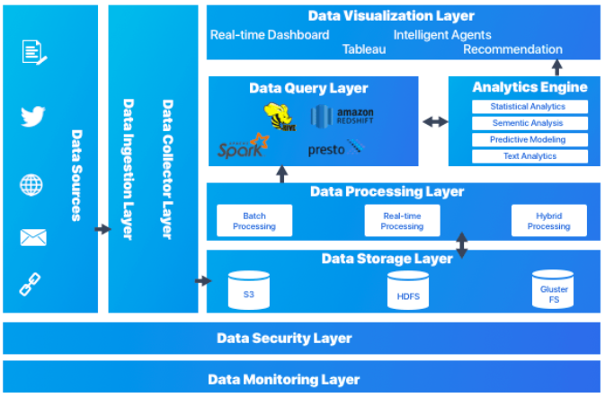

# Ingesta de Datos

## Introducción

Formalmente, la ingesta de datos es el proceso mediante el cual se introducen datos, desde diferentes fuentes, estructura y/o características dentro de otro sistema de almacenamiento o procesamiento de datos. 

La ingesta de datos es un proceso muy importante porque la productividad de un equipo va directamente ligada a la calidad del proceso de ingesta de datos. Estos procesos deben ser flexibles y ágiles, ya que una vez puesta en marcha, los analistas y científicos de datos puedan contruir un *pipeline* de datos para mover los datos a la herramienta con la que trabajen. Entendemos como *pipeline* de datos un proceso que consume datos desde un punto de origen, los limpia y los escribe en un nuevo destino.

Es sin duda, el primer paso que ha de tenerse en cuenta a la hora de diseñar una arquitectura Big Data, para lo cual, hay que tener muy claro, no solamente el tipo y fuente de datos, sino cual es el objetivo final y qué se pretende conseguir con ellos. Por lo tanto, en este punto, hay que realizar un análisis detallado, porque es la base para determinar las tecnologías que compondrán nuestra arquitectura Big Data.

Dada la gran cantidad de datos que disponen las empresas, toda la información que generan desde diferentes fuentes se deben integrar en un único lugar, al que actualmente se le conoce como *data lake* asegurándose que los datos son compatibles entre sí. Gestionar tal volumen de datos puede llegar a ser un procedimiento complejo, normalmente dividido en procesos distintos y de relativamente larga duración.

## La ingesta por dentro

La ingesta extrae los datos desde la fuente donde se crean o almacenan originalmente y los carga en un destino o zona temporal. Un *pipeline* de datos sencillo puede que tenga que aplicar uno más transformaciones ligeras para enriquecer o filtrar los datos antes de escribirlos en un destino, almacen de datos o cola de mensajería. Se pueden añadir nuevos *pipelines* para transformaciones más complejas como *joins*, agregaciones u ordenaciones para analítica de datos, aplicaciones o sistema de informes.

<figure style="align: center;">
    
    <figcaption>Ingesta de datos</figcaption>
</figure>

Las fuentes más comunes desde las que se obtienen los datos son:

* Servicios de mensajería como Apache Kafka
* Bases de datos relaciones, las cuales se acceden, por ejemplo, JDBC
* Servicios REST que vuelven los datos en formato JSON
* Servicios de almacenamiento distribuido como HDFS o S3.

Los destinos donde se almacenan los datos son:

* Servicios de mensajería como Apache Kafka
* Bases de datos relaciones
* Bases de datos NoSQL
* Servicios de almacenamiento distribuido como HDFS o S3.
* Plataformas de datos como Snowflake o Databricks.

### Batch vs Streaming

El movimiento de datos entre los orígenes y los destinos se puede hacer, tal como vimos en la sesión de [Arquitecturas de Big Data](arquitecturas01.md#tipos-de-arquitecturas), mediante un proceso:

* *Batch*: el proceso se ejecuta de forma periódica a partir de unos datos *estáticos*.
* *Streaming*: también conocido como en tiempo real, donde los datos se leen, modifican y cargan tan pronto como llegan a la capa de ingesta.

### Arquitectura

Si nos basamos en la [arquitectura por capas](arquitecturas01.md#arquitectura-por-capas), podemos ver como la capa de ingesta es la primera de la arquitectura por capas, la cual recoge los datos que provienen de fuentes diversas. Los datos se categorizan y priorizan, facilitando el flujo de éstos en posteriores capas:

<figure style="align: center;">
    
    <figcaption>Arquitectura por capas (xenonstack.com)</figcaption>
</figure>

## ETL

Una ETL, entendida como un proceso que lleva la información de un punto A a un punto B, puede realizarse mediante diversas herramientas, scripts, Python, etc... Pero cuando nos metemos con Big Data no servirá cualquier tipo de herramienta, ya que necesitamos que sean:

* Flexibles y soporten formatos variados (JSON, CSV, etc...)
* Escalables y tolerante a fallos.
* Dispongan de conectores a múltiples fuentes y destinos de datos.

https://www.talend.com/es/resources/what-is-etl/

https://www.informatica.com/resources/articles/what-is-etl.html

https://www.informatica.com/blogs/etl-vs-elt-whats-the-difference.html

Los procesos ETL, siglas de **e**xtracción, **t**ransformación y carga (***l****oad*), permiten a las organizaciones recopilar en un único lugar todos los datos de los que pueden disponer. Ya hemos comentado que estos datos provienen de diversas fuentes, por lo que es necesario acceder a ellos, y formatearlos para poder ser capaces de integrarlos. Además, es muy recomendable asegurar la calidad de los datos y su veracidad, para así evitar la creación de errores en los datos.

<figure style="align: center;">
    
    <figcaption>Extracción, Transformación y Carga (load)</figcaption>
</figure>

Una vez los datos están unificados en un *data lake*, otro tipo de herramientas de análisis permitirán su estudio para apoyar procesos de negocio.

Dada la gran variedad de posibilidades existentes para representar la realidad en un dato, junto con la gran cantidad de datos almacenados en las diferentes fuentes de origen, los procesos ETL consumen una gran cantidad de los recursos asignados a un proyecto.

### Extracción

Encargada de recopilar los datos de los sistemas originales y transportarlos al sistema donde se almacenarán, de manera general suele tratarse de un entorno de Data Warehouse o almacén de datos. Los formatos de las fuentes de datos pueden encontrarse en diferentes formatos, desde ficheros planos hasta bases de datos relacionales entre otros formatos distintos.
Una parte de la extracción es la de analizar que los datos sean los que se esperaban, verificando que siguen el formato que se esperaba. En caso contrario, esos datos se rechazan.

La primera característica deseable de un proceso de extracción es que debe ser un proceso rápido, ligero, causar el menor impacto posible, ser trasparente para los sistemas operacionales e independiente de las infraestructuras.

La segunda característica es que debe reducir al mínimo el impacto que se generase en el sistema origen de la información. No se puede poner en riesgo el sistema original, generalmente operacional, ni perder ni modificar sus datos; ya que si colapsase esto podría afectar el uso normal del sistema y generar pérdidas a nivel operacional.

Así pues, la extracción convierte los datos a un formato preparado para iniciar el proceso de transformación

### Transformación

En esta fase se espera realizar los cambios necesarios en los datos de manera que estos tengan el formato y contenido esperado.

En concreto, la transformación puede comprender:

* Cambios de codificación
* Eliminar datos duplicados
* Cruzar diferentes fuentes de datos para obtener una fuente diferente
* Agregar información en función de alguna variable
* Tomar parte de los datos para cargarlos
* Transformar información para generar códigos, claves, identificadores…
* Generar información
* Estructurar mejor la información
* Generar indicadores que faciliten el procesamiento y entendimiento

Respecto a sus características, debe transformar los datos para mejorarlos, incrementar su calidad, integrarlos con otros sistemas, normalizarlos, eliminar duplicidades o ambigüedades. Además, no debe crear información, duplicar, eliminar información relevante, ser errónea o impredecible.

Una vez transformados los datos, ya estarán listos para su carga.

### Carga

Fase encargada de almacenar los datos en el destino, un Data Warehouse o en cualquier tipo de base de datos. Por tanto la fase de carga interactúa de manera directa con el sistema destino, y debe adaptarse al mismo con el fin de cargar los datos de manera satisfactoria.

La carga ha de realizarse buscando minimizar el tiempo de la transacción

Cada BBDD puede tener un sistema ideal de carga basado en:

* SQL (Oracle, SQL Server, Redshift, Postgres, Teradata, Greenplum, …)
* Ficheros (Postgres, Redshift)
* Cargadores Propios (HDFS, Teradata, Greenplum)

Se pueden realizar acciones para mejorar estos procesos:

* Gestiones de índices
* Gestión de claves de distribución y particionado
* Tamaño de las transacciones y commit’s

### ELT

ELT cambia el orden de las siglas y se basa en extraer, cargar y transformar. Es un técnica de ingestión de datos donnde los datos se obtienen desde múltiples fuentes en un *data lake* o almacenamiento de objetos en la nube. Desde ahí, los datos se pueden transformar dependiendo de los diferentes objetivos de negocio.

En prinipio un proceso ELT necesita menos ingenieros de datos necesarios. Con la separación de la extración y la transformación, ELT permite que los analístas y científicos de datos realicen las tranformaciones, ya sea con SQL o mediante Python. De esta manera, más departamentos se involucran en obtener y mejorar los datos.

Una de las principales razones de que ELT cueste menos de implementar es que permite una mayor generalización de la información que se almancena. Los ingenieros de datos generan un *data lake* con los datos obtenidos de las fuentes de datos más populares, dejando que la transformación la realicen los expertos en el negocio.

En resumen, el mercado se está moviendo desde un desarrollo centralizado mediante ETL a uno más orientado a servicios como ELT, qu permite automatizar la carga del *data lake* y la posterior codificación de los flujos de datos.

https://www.informatica.com/blogs/etl-vs-elt-whats-the-difference.html

### Herramientas ETL

Las caracteristicas de las herramientas ETL son:

* Permiten conectividad con diferentes sistemas y tipos de datos
    * Excel, BBDD transaccionales, XML, Access, Teradata, HDFS, Hive, CRM
    * APIs de aplicaciones de terceros, logs…

* Permiten la planificación y ejecución de lógica
    * Planificación por Batch
    * Planificación por eventos
    * Planificación en tiempo real

* Capacidad para transformar los datos
    * Transformaciones Simples: tipos de datos, cadenas, codificaciones, cálculos simples
    * Transformaciones Intermedias: agregaciones, lookups,  
    * Transformaciones Complejas: algoritmos de IA, segmentación, integración de código de terceros, integración con otros lenguajes

* Metadatos y gestión de errores
    * Permiten tener información del funcionamiento de todo el proceso
    * Permiten el control de errores y establecer politicas al respecto

Las soluciones más empleadas son:

* [Pentaho Data Integration (PDI)](https://www.hitachivantara.com/en-us/products/data-management-analytics/lumada-data-integration.html)
* [Oracle Data Integrator](https://www.oracle.com/es/middleware/technologies/data-integrator.html)
* [Talend Open Studio](https://www.talend.com/products/talend-open-studio/)
* [Mulesoft](https://www.mulesoft.com)
* [Informatica Data Integration](https://www.informatica.com/products/data-integration.html)

<figure style="align: center;">
    
    <figcaption>Herramientas ETL</figcaption>
</figure>

## Pipeline de datos

Un *pipeline* es una construcción lógica que representa un proceso dividido en fases. Los pipelines de datos se caracterizan por definir el conjunto de pasos o fases y las tecnologías involucradas en un proceso de movimiento o procesamiento de datos.

Las pipelines de datos son necesarios ya que no debemos analizar los datos en los mismos sistemas donde se crean. El proceso de analítica es costoso computacionalmente, por lo que se separa para evitar perjudicar el rendimiento del servicio. De esta forma, tenemos sistemas OLTP (como un CRM), encargados de capturar y crear datos, y sistemas OLAP (como un *Data Warehouse*), encargados de analizar los datos.

Los movimientos de datos entre estos sistemas involucran varias fases. Por ejemplo:

1. Recogemos los datos y los enviamos a un topic de Apache Kafka. Kafka actúa aquí como un buffer para el siguiente paso.

    <figure style="align: center;">
        
        <figcaption>Ejemplo de pipeline - aprenderbigdata.com</figcaption>
    </figure>

2. Mediante una tecnología de procesamiento, que puede ser streaming o batch, leemos los datos del buffer. Por ejemplo, mediante *Spark* realizmaos la analítica sobre estos datos.
3. Almacenamos el resultado en una base de datos NoSQL como *Amazon DynamoDB* o un sistema de almacenamiento distribuidos como *Amazon S3*.

Aunque a menudo se intercambian los términos de *pipeline* de datos y ETL no significan lo mismo. Las ETLs son un caso particular de pipeline de datos que involucran las fases de extracción, transformación y carga de datos. Las pipelines de datos son cualquier proceso que involucre el movimiento de datos entre sistemas.

## Herramientas de Ingesta de datos

Las herramientas de ingesta de datos para ecosistemas Big Data se clasifican en los siguientes bloques:

* *Apache Nifi*: herramienta ETL que se encarga de cargar datos de diferentes fuentes, los pasa por un flujo de procesos para su tratamiento, y los vuelca en otra fuente.
* *Apache Sqoop*: transferencia bidireccional de datos entre *Hadoop* y una bases de datos SQL (datos estructurados)
* *Apache Flume*: sistema de ingesta de datos semiestructurados o no estructurados en streaming sobre HDFS o HBase.
* *AWS Glue*: servicios gestionado para realizar tareas ETL desde la consola de AWS. Facilita el descubrimiento de datos y esquemas, así como se utiliza como almacenamiento de servicios como Amazon Athena o AWS Data Pipeline.

Por otro lado existen sistemas de mensajería con funciones propias de ingesta, tales como:

* *Apache Kafka*: sistema de intermediación de mensajes basado en el modelo publicador/suscriptor.
* *RabbitMQ*: sistema de colas de mensajes (MQ) que actúa de middleware entre productores y consumidores.
* *Amazon Kinesis*: homólogo de Kafka para la infraestructura Amazon Web Services.
* *Microsoft Azure Event Hubs*: homólogo de Kafka para la infraestructura Microsoft Azure.
* *Google Pub/Sub*: homólogo de Kafka para la infraestructura Google Cloud.

## Consideraciones

A la hora de analizar cual sería la tecnología y arquitectura adecuada para realizar la ingesta de datos en un sistema Big Data, hemos de tener en cuenta los siguientes factores:

* Origen y formato de los datos
    * ¿Cual va a ser el origen u orígenes de los datos?
    * ¿Provienen de sistemas externos o internos?
    * ¿Serán datos estructurados o datos sin estructura?
    * ¿Cuál es el volumen de los datos? Volumen diario, y plantear como sería la primera carga de datos.
    * ¿Existe la posibilidad de que más adelante se incorporen nuevas fuentes de datos?
* Latencia/Disponibilidad
    * Ventana temporal que debe pasar desde que los datos se ingestan hasta que puedan ser utilizables, desde horas/dias (mediante procesos *batch) o ser *real-time* (mediante *streaming*)
* Actualizaciones
    * ¿Las fuentes origen se modifican habitualmente?
    * ¿Podemos almacenar toda la información y guardar un histórico de cambios?
    * ¿Modificamos la información que tenemos? ¿mediante *updates*, o *deletes +insert*?
* Transformaciones
    * ¿Son necesarias durante la ingesta?
    * ¿Aportan latencia al sistema? ¿Afecta al rendimiento?
    * ¿Tiene consecuencias que la información sea transformada y no sea la original?
* Destino de los datos
    * ¿Será necesario enviar los datos a más de un destino, por ejemplo, S3 y Cassandra?
    * ¿Cómo se van a utilizar los datos en el destino? ¿cómo serán las consultas? ¿es necesario particionar los datos? ¿serán búsquedas aleatorias o no? ¿Utilizaremos *Hive* / *Pig* / *Cassandra*?
    * ¿Qué procesos de transformación de datos se van a realizar una vez ingestados los datos?
    * ¿Cual es la frecuencia y actualización de los datos origen?
* Estudio de los datos
    * Calidad de los datos ¿son fiables? ¿existen duplicados?
    * Seguridad de los datos. Si tenemos datos sensibles o confidenciales, ¿los enmascaramos o decidimos no realizar su ingesta?

## Referencias

* [Ingesta, es más que una mudanza de datos](https://www.futurespace.es/ingesta-es-mas-que-una-mudanza-de-datos/)
* [¿Qué es ETL?](https://www.talend.com/es/resources/what-is-etl/)
* [Building Big Data Storage Solutions (Data Lakes) for Maximum Flexibility](https://docs.aws.amazon.com/whitepapers/latest/building-data-lakes/building-data-lake-aws.html?did=wp_card&trk=wp_card)

17 Enero

https://www.xenonstack.com/blog/big-data-ingestion
https://streamsets.com/learn/data-ingestion/

https://streamsets.com/learn/etl-or-elt/

https://aprenderbigdata.com/pipeline-de-datos/

https://www.xenonstack.com/blog/big-data-ingestion
https://www.xenonstack.com/blog/data-pipeline