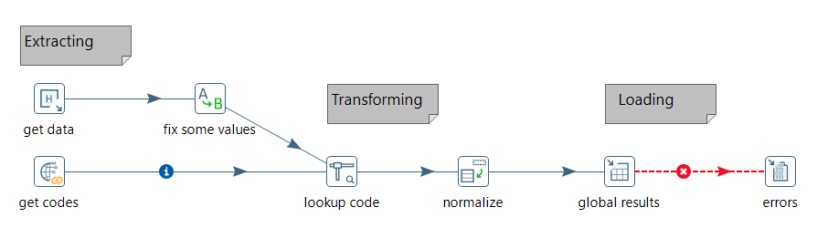
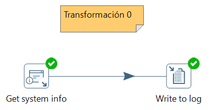
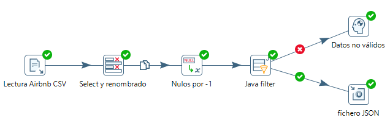
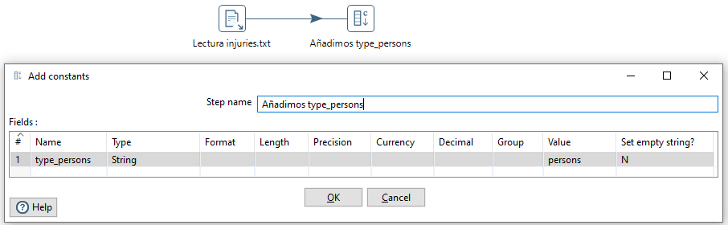

# Pentaho Data Integration

*Kettle* es un componente de *Pentaho Data Integration* (PDI - <https://www.hitachivantara.com/en-us/products/data-management-analytics/pentaho/download-pentaho.html>) que a su vez contiene a *Spoon*. Mediante *Spoon* se pueden realizar procesos ETL de manera visual, de forma muy fácil y rápida, como por ejemplo:

* Conexiones a los datos.
* Transformaciones (filtrado, limpieza, formateado, ... y posterior almacenamiento en diferentes formatos y destinos).
* Inserción de fórmulas.
* Desarrollo de *data warehouses* con estructura en estrella (Hechos/Dimensiones)

Y todo esto sin necesidad de programar directamente con código y sin necesidad de instalar o configurar nada para poder empezar a usarla. Por esto, este tipo de herramientas se conocen como ^^herramientas de metadatos^^, ya que trabajan a nivel de definición diciendo qué hay que hacer, pero no el detalle del cómo se hace, éste queda oculto, lo cual resulta muy interesante en la mayoría de los casos.

<figure style="align: center;">
    
    <figcaption>Pentaho - Ejemplo de flujo ETL</figcaption>
</figure>

Se trata de una herramienta open source multiplataforma que también tiene su soporte comercial. La versión *open source* se puede descargar desde <https://sourceforge.net/projects/pentaho/>. En nuestro caso, vamos a trabajar con la versión 9.2 que data de agosto de 2021 (para los apuntes he trabajado indistintamente con la versión 9.1 y la 9.2, tanto en Windows como en Ubuntu).

Es importante destacar como requisito que necesitamos tener instalado en el sistema la versión 8 de Java.

!!! tip "Instalación en Ubuntu"
    Si trabajamos con Ubuntu, será necesario instalar Java 8 ejecutando el comando `sudo apt install openjdk-8-jdk`, y tras ello `sudo update-alternatives --config java` para elegir la versión 8.

    A continuación, para instalar el paquete *libwebkitgtk*, primero tenemos que añadir su repositorio:
    
    ``` bash
    sudo nano /etc/apt/sources.list
    ```

    Y añadimos al final la siguiente entrada:

    ``` sources.list
    deb http://cz.archive.ubuntu.com/ubuntu bionic main universe
    ```

    Y tras actualizar los repositorios con `sudo apt-get update`, instalaremos el paquete con el comando:
    
    ``` bash
    sudo apt-get install libwebkitgtk-1.0.0
    ```

    Si ha fallado la actualización del repositorio por un problema de certificados, una posible solución es instalar *Y PPA Manager*, tal como explican [aquí](https://ubunlog.com/como-arreglar-el-error-w-error-de-gpg/).

Una vez descargado el archivo y tras descomprimirlo, mediante el archivo `spoon.bat` (o `spoon.sh`) lanzaremos la aplicación.

<figure style="align: center;">
    
    <figcaption>Pantalla de inicio de Pentaho/Spoon</figcaption>
</figure>

!!! tip "Dentro de Spoon"
    *Spoon* permite diseñar mediante un interfaz gráficos las transformaciones y trabajos que se ejecutan con las siguientes herramientas:

    * ***Pan*** es un motor de transformación de datos que facilita la lectura, manipulación, y escritura de datos hacia y desde varias fuentes de datos. Ejecuta archivos `ktr`.
    * ***Kitchen*** es un programa que ejecuta los trabajos (*jobs*) diseñados por Spoon en XML o en una base de datos.  Ejecuta archivos `kjb`.

Para esta sesión, hemos planteado varios casos de uso para ir aprendiendo la herramienta mediante su uso.

## Elementos

En PDI hay dos tipos de elementos: *Transformations* y *Jobs*.

* Se definen *Transformations* para transformar los datos, describiendo flujos de datos para ETL como leer desde una fuente, transformar los datos y cargarlos en un nuevo destino.
* Se definen *Jobs* para organizar tareas y transformaciones estableciendo su orden y condiciones de ejecución (del tipo ¿existe el fichero X en origen? ¿existe la tabla X en mi base de datos?).

Tanto las transformaciones como las tareas, cuando se definen, se almacenan como archivos.

Los elementos del interfaz son:

<figure style="align: center;">
    
    <figcaption>Interfaz de Spoon</figcaption>
</figure>

## Caso de Uso 0

Para familiarizarnos con el entorno, vamos a crear una transformación muy básica. Tras seleccionar *File -> New Transformation*, el primer elemento que vamos a utilizar está dentro de la categoría *Input* (Entrada).

<figure style="float: right;">
    
    <figcaption>Menú emergente</figcaption>
</figure>

En concreto seleccionamos la transformación *Get system info* (Información del sistema), la cual nos permite obtener información sobre el sistema. La vamos a utilizar para averiguar la versión de PDI que estamos utilizando. Así pues, la seleccionamos desde el *árbol de pasos* y lo arrastramos a la zona de trabajo. Si dejamos el ratón sobre el elemento, nos aparecerá un menú emergente donde podremos conectar una entrada, editar las propiedades, ver el menú contextual del paso, conectar una salida e inyectar metadatos.

Sobre este paso, vamos a editar la información que queremos obtener. Para ello, vamos a crear una propiedad con nombre *Versión Pentaho* y seleccionaremos del desplegable la opción *Kettle Version*.

A continuación, en la categoría *Utility* seleccionamos el icono *Write to Log*, y lo arrastramos al área de trabajo. Ahora conectamos la salida de *Get system info* con *Write to log*, mediante la 4ª opción del menu emergente, quedando una transformación tal como se ve en la imagen:

<figure style="align: center;">
    
    <figcaption>Caso de Uso 0 - Versión de PDI</figcaption>
</figure>

Finalmente, sólo nos queda ejecutar la transformación mediante el icono del triángulo (*Run* o F9), y ver el resultado en el panel inferior.

## Caso de Uso 1 - Filtrando datos

En este caso de uso, vamos a leer un archivo CSV y filtrar los datos para quedarnos con un subconjunto de los mismos. Además, aprenderemos a gestionar los errores y ejecutar la transformación desde el terminal.

### Lectura CSV

Tras crear la nueva transformación (CTRL + N), desde *Input* arrastraremos el paso de *CSV input file* para seleccionar el archivo `samples\transformations\files\Zipssortedbycitystate.csv` dentro de nuestra instalación de Pentaho.

Tras seleccionar el archivo, mediante el botón *Get Fields* cargaremos y comprobaremos que los campos que vamos a leer son correctos (nombre y tipo de los datos).

<figure style="align: center;">
    
    <figcaption>Caso de Uso 1 - Tras pulsar sobre Get Fields</figcaption>
</figure>

Tras ello, mediante el botón *Preview* comprobaremos que los datos se leen correctamente.

<figure style="align: center;">
    
    <figcaption>Caso de Uso 1 - Resultado de la opción Preview sobre Ciudades</figcaption>
</figure>

### Filtrado de datos

Una vez leído, el siguiente paso es filtrar las filas. Para ello, desde la categoría de *Flow*, arrastramos el paso *Filter* (Filtrar filas), y las conectamos tal como hemos realizado en el caso anterior. Al soltar la flecha, nos mostrará dos opciones:

* *Main output of step*: define los pasos con un flujo principal, donde todo funciona bien
* *Error handling of step*: define los pasos a seguir en caso de encontrar un error

De momento elegimos la primera y configuramos el filtro para solo seleccionar aquellos datos cuyo estado sea NY (`STATE = NY`)
    
    <figcaption>Caso de Uso 1 - Configuración del filtro</figcaption>
</figure>

Para configurar el resultado, seleccionamos el paso del filtro, y bien pulsamos sobre el icono del ojo de la barra de herramientas, o sobre el paso, tras pulsar con el botón derecho, seleccionamos la opción *Preview*.

<figure style="align: center;">
    
    <figcaption>Caso de Uso 1 - Resultado de hacer Preview sobre Filtro NY</figcaption>
</figure>

Por defecto se precargan 1000 filas. Tras comprobar el resultado, pulsamos sobre *Stop* para detener el proceso de previsualización. Las métricas que aparecen nos información del proceso y su rendimiento.

### Ordenación

El siguiente paso que vamos a realizar es ordenar los datos por su código *Postal Code*. Para ello, desde la categoría de *Transform*, arrastramos el paso de *Sort rows* (Ordenar filas), y conectamos la salida del filtrado con la ordenación eligiendo la salida principal (*main output of step*).

!!! fail "Forzando un error"
    Vamos a forzar un error para comprobar cómo lo indica *Spoon*. Si al elegir el nombre del campo, en vez de *POSTAL CODE* escribimos *CP*, cuando previsualizamos el resultado, podremos ver como aparece la marca de prohibido en la esquina superior derecha del paso, y si visualizamos el log y las métricas de los pasos, veremos el error:

    <figure style="align: center;">
        
        <figcaption>Caso de Uso 1 - Forzando un error</figcaption>
    </figure>

Volvemos a editar el paso, corregimos el nombre del campo (escribimos *POSTAL CODE*) y comprobamos que ahora sí que funciona correctamente

<figure style="align: center;">
    
    <figcaption>Caso de Uso 1 - Ordenando</figcaption>
</figure>

### Escritura del resultado

Una vez realizados todos los pasos, sólo nos queda enviar el resultado a un fichero para persistir la transformación.

Para ello, desde la categoría de *Output* arrastramos el paso *Text file output*, y lo conectamos desde la salida del paso de ordenación. Tras ello, editar este paso para indicar el archivo donde almacenar el resultado.

<figure style="align: center;">
    
    <figcaption>Caso de Uso 1 - Guardando el resultado</figcaption>
</figure>

Tras ello, podremos ejecutar la transformación (icono del triángulo, menú *Action -> Run* o F9) y comprobar el resultado en el fichero:

``` csv
CITY;STATE;POSTALCODE
HOLTSVILLE             ;NY;501
FISHERS ISLAND         ;NY;6390
NEW YORK               ;NY;10001
NEW YORK               ;NY;10003
NEW YORK               ;NY;10005
NEW YORK               ;NY;10007
NEW YORK               ;NY;10009
```

Al comprobar el fichero, vemos que se han quedado espacios en blanco a la derecha del nombre de las ciudades, ya que la columna tenía un tamaño configurado. Si volvemos a editar el último paso, en la pestaña de *Fields* (Campos) podemos indicar mediante el botón de *Minimal width* que reduzca su anchura al mínimo:

<figure style="align: center;">
    
    <figcaption>Caso de Uso 1 - Anchura mínima de los campos</figcaption>
</figure>

Y tras volver a ejecutar la transformación, veremos que ahora sí que obtenemos los datos que esperábamos:

``` csv
CITY;STATE;POSTALCODE
HOLTSVILLE;NY;501
FISHERS ISLAND;NY;6390
NEW YORK;NY;10001
NEW YORK;NY;10003
NEW YORK;NY;10005
NEW YORK;NY;10007
NEW YORK;NY;10009
```

### Uso de Pan

Mediante la utilidad *Pan*, podemos ejecutar las transformaciones sin necesidad de arrancar *Spoon*. Para indicarle el archivo que contiene la transformación, al comando `pan.bat` (o `pan.sh` en el caso de Ubuntu) le pasamos el parámetro `/file=rutaArchivo.ktr`.

Para comprobar su funcionamiento, vamos a eliminar el fichero generado. A continuación, ejecutamos `pan`:

``` bash
pan.bat /file=c:/IABD/caso1filtradoNY.ktr
```

Tras algunos segundos y varias líneas de debug del arranque de pan, tendremos un mensaje similar al siguiente:

``` log
2021/10/24 18:01:42 - Start of run.
2021/10/24 18:01:42 - caso1filtradoNY - Dispatching started for transformation [caso1filtradoNY]
2021/10/24 18:01:42 - Ciudades.0 - Header row skipped in file 'C:\data-integration\samples\transformations\files\Zipssortedbycitystate.csv'
2021/10/24 18:01:42 - Ciudades.0 - Finished processing (I=21380, O=0, R=0, W=21379, U=0, E=0)
2021/10/24 18:01:42 - Filtro NY.0 - Finished processing (I=0, O=0, R=21379, W=1146, U=0, E=0)
2021/10/24 18:01:42 - Orden por Codigo Postal.0 - Finished processing (I=0, O=0, R=1146, W=1146, U=0, E=0)
2021/10/24 18:01:42 - CiudadesNY.0 - Finished processing (I=0, O=1147, R=1146, W=1146, U=0, E=0)
2021/10/24 18:01:43 - Carte - Installing timer to purge stale objects after 1440 minutes.
2021/10/24 18:01:43 - Finished!
2021/10/24 18:01:43 - Start=2021/10/24 18:01:42.424, Stop=2021/10/24 18:01:43.041
2021/10/24 18:01:43 - Processing ended after 0 seconds.
2021/10/24 18:01:43 - caso1filtradoNY -
2021/10/24 18:01:43 - caso1filtradoNY - Step Ciudades.0 ended successfully, processed 21379 lines. ( - lines/s)
2021/10/24 18:01:43 - caso1filtradoNY - Step Filtro NY.0 ended successfully, processed 21379 lines. ( - lines/s)
2021/10/24 18:01:43 - caso1filtradoNY - Step Orden por Codigo Postal.0 ended successfully, processed 1146 lines. ( - lines/s)
2021/10/24 18:01:43 - caso1filtradoNY - Step CiudadesNY.0 ended successfully, processed 1146 lines. ( - lines/s)
```

Y si comprobamos el fichero, veremos que ha vuelto a aparecer.

## Caso de Uso 2 - Uniendo datos

<figure style="float: right;">
    
    <figcaption>Caso de Uso 2 - Lecturas CSV</figcaption>
</figure>

En este caso, vamos a leer datos de [ventas](../recursos/pdi/pdi_sales.csv) y de [productos](../recursos/pdi/pdi_product.csv), y vamos a unirlos de forma similar a un *join*, para posteriormente, tras agrupar los datos, crear un informe.

### *Merge join*

Para ello, primero vamos leer de forma separada cada archivo mediante un paso de tipo *CSV file input*, utilizando el el separador necesarios en cada caso (`;` o `, `). Así pues, tendremos dos pasos, tal como se puede observar en la imagen de la derecha. En el caso del CSV de *ventas*, al tener registros de diferentes países, deberemos cambiar el tipo del ZIP (el código postal) a `String`.

A continuación, para unir los datos, dentro de la categoría *Join*/*Unión* utilizamos el paso *Merge join*/*Unión por clave*. En este caso tras arrastrar el paso al área de trabajo, vamos a enlazar desde el merge hacia los dos orígenes, en un caso como *left hand side stream of the join* y el otro como *right hand side stream of the join*:

<figure style="align: center;">
    
    <figcaption>Caso de Uso 2 - Entradas de Merge</figcaption>
</figure>

A continuación, editamos el *Merge* y le decimos que el campo de unión es *ProductID*. Cuando le damos a aceptar recibimos un mensaje de advertencia avisándonos que si los datos no están ordenados podemos obtener resultados incorrectos.

<figure style="align: center;">
    
    <figcaption>Caso de Uso 2 - Aviso Merge</figcaption>
</figure>

Así pues, vamos a añadir previo al merge un paso de ordenación a cada entrada, ordenando los datos por *ProductID* de manera ascendente. Para comprobar su funcionamiento, podemos hacer un *preview* del *merge*.

### Agrupando datos

Como el resultado final es un informe de ventas con el total de unidades vendidas y la cantidad recaudada agrupada por país y categoría del producto, necesitamos agrupar los datos.

Para ello, dentro de la categoría *Statistics*, utilizaremos el paso *Group by*/*Agrupar por*. En nuestro caso queremos agrupar por país (*Country*) y categoría (*Category*), y los datos que vamos a agregar son la suma de unidades (*Units*) y la suma recaudada (*Revenue*). Así pues, nuestra agrupación quedaría así:

<figure style="align: center;">
    
    <figcaption>Caso de Uso 2 - Agrupamos por país y categoría</figcaption>
</figure>

En este caso, sucede lo mismo que antes, que este paso necesita los datos ordenados. Así pues, vamos a ordenar las salida del merge por país y categoría.

<figure style="align: center;">
    
    <figcaption>Caso de Uso 2 - Ordenamos antes de agrupar</figcaption>
</figure>

El último paso que nos queda es exportar los datos a un fichero de texto mediante el paso *Text file output*.

## Caso de Uso 3 - Cuestionarios Airbnb

Para el siguiente caso de uso, vamos a utilizar datos de los cuestionarios de AirBnb que se pueden descargar desde <http://tomslee.net/airbnb-data-collection-get-the-data>.

En concreto, nos vamos a centrar en los datos de Madrid que podemos descargar desde <https://s3.amazonaws.com/tomslee-airbnb-data-2/madrid.zip>.

### Uniendo datos

Una vez descargados los datos y descomprimidos, vamos a cargar los tres ficheros en el mismo paso, utilizando dentro de *Input* la opción de *Text File Input*/*Entrada Fichero de Texto*:

<figure style="align: center;">
    
    <figcaption>Caso de Uso 3 - Filtrado compuesto</figcaption>
</figure>

Recordad que antes, en la pestaña *Content*/*Contenido* elegiremos la `,` como separador de campos y en *Fields*/*Campos*, tenemos que obtener los campos a leer:

<figure style="align: center;">
    
    <figcaption>Caso de Uso 3 - Campos</figcaption>
</figure>

Nos vamos a quedar con un subconjunto de las columnas y las vamos a renombrar. Para ello, dentro de la categoría *Transform* elegimos el paso *Select values*/*Selecciona/Renombra valores* y elegimos y renombramos los siguentes campos:

* `room_id`, `room_type`, `neighborhood`, `bedrooms`, `overall_satisfaction`, `accommodates`, y `price` pasarán a ser
`habitacion_id`, `habitacion_tipo`, `barrio`, `dormitorios`, `puntuacion`, `huespedes` y `precio`.

<figure style="align: center;">
    
    <figcaption>Caso de Uso 3 - Selección y nombrado de campos</figcaption>
</figure>

### Filtrado compuesto

El siguiente paso que vamos a hacer es quedarnos con aquellos cuestionarios con más de 3 dormitorios o al menos 4 huéspedes. Así pues, con el paso *Filter Rows*/*Filtrar filas* realizaremos:

<figure style="align: center;">
    
    <figcaption>Caso de Uso 3 - Filtrado compuesto</figcaption>
</figure>

Si el filtrado fuese con condiciones más complejas, en ocasiones es más sencillo utilizar el paso *Java filter* (de la categoría *Flow*), el cual utilizando la notación de Java, podemos indicar la condición a cumplir. Por ejemplo, vamos filtrar los de más de 3 dormitorios o al menos 4 huéspedes, y que su precio sea inferior a 200$ → `(dormitorios>3 || huespedes>=4) && precio <200`:

<figure style="align: center;">
    
    <figcaption>Caso de Uso 3 - Filtrado Java</figcaption>
</figure>

Para comprobar su funcionamiento, vamos a añadir un par de pasos *dummy*/*transformación simulada* (no realizan nada, pero sirven para finalizar tareas). Al ejecutarlo, veremos que nos da un error. Si algún dato es nulo, el filtrado Java provocará un error de transformación.

Una posibilidad es que introduzcamos un paso de la categoría *Utility* denominado *If value is null*. Con este paso, podemos indicar el valor a tomar a todos los campos o hacerlo de forma concreta en los campos que queramos. En nuestro caso, vamos indicar que cambie todos los nulos por `-1`.

<figure style="align: center;">
    
    <figcaption>Caso de Uso 3 - Cambiando nulos por -1</figcaption>
</figure>

Debemos tener en cuenta que como ahora podemos tener precios con `-1`, para evitar recogerlos en el filtrado Java, deberíamos modificarlo por `(dormitorios > 3 || huespedes >=4) && ( precio >= 0 && precio < 200)`.

### Generando JSON

<figure style="float: right;">
    
    <figcaption>Caso de Uso 3 - Configuración JSON</figcaption>
</figure>

Finalmente queremos almacenar los datos que cumplen el filtro en un fichero JSON.

Para ello, sustituimos el *dummy* del camino exitoso por un paso *JSON output*. Tras seleccionar los campos que nos interesan, configuraremos:

* *Filename*: La ruta y el nombre del archivo
* *Json bloc name*: nombre de la propiedad que contendrá un objeto o un array de objetos con los datos.
* *Nr rows in a bloc*: Cantidad de datos del archivo. Si ponemos 0, coloca todos los datos en el mismo fichero. Si ponemos 1, generará un fichero por cada registro.

En la imagen que tenemos a la derecha puedes comprobar los valores introducidos.

### Resultado final

En la siguiente imagen puedes visualizar la transformación completa:

<figure style="align: center;">
    
    <figcaption>Caso de Uso 3 - Transformación final</figcaption>
</figure>

La cual, al ejecutarla, genera los siguientes datos:

``` json
{"datos":[
    {"dormitorios":4.0, "huespedes":10, "barrio":"Argüelles", "precio":133.0, "habitacion_tipo":"Entire home\/apt","puntuacion":4.0, "habitacion_id":23021},
    {"dormitorios":1.0, "huespedes":4, "barrio":"Justicia", "precio":147.0, "habitacion_tipo":"Private room","puntuacion":5.0,"habitacion_id":24836},
    {"dormitorios":1.0, "huespedes":4, "barrio":"Bellas Vistas", "precio":44.0, "habitacion_tipo":"Private room","puntuacion":4.0, "habitacion_id":34801},
    ...
    ]
}
```

## Caso de Uso 4 - Informe fabricantes en S3

A partir del caso 2 que hemos realizado previamente, vamos a generar un informe sobre ventas de los fabricantes, y a persistir el informe en S3.

### Unir fabricantes

Así pues, vamos a abrir el caso de uso 2, y a partir de ahí, vamos a fusionar los datos con los de [fabricantes](../recursos/pdi/pdi_manufacturer.csv) para obtener el nombre de éstos. Para ello, creamos una nueva lectura de CSV, ordenación y posterior *Merge*. Cabe destacar que antes de hacer el segundo *join*, debemos ordenar ambas entradas por la clave de unión (`ManufacturerID`):

<figure style="align: center;">
    
    <figcaption>Caso de Uso 4 - Merge fabricantes</figcaption>
</figure>

### Aplicar fórmulas

Tras unir los datos de las ventas con los fabricantes, para poder preparar el informe mediante group-by, del mismo modo que antes, necesitamos ordenar los datos (en este caso por `ManufacturerID`).

En el informe queremos mostrar para cada fabricante, además de su código y nombre (campos de agrupación), queremos obtener el total de unidades vendidad y la recaudación total de dicho fabricante. Para ello creamos una nueva agrupación.

<figure style="align: center;">
    
    <figcaption>Caso de Uso 4 - Agrupamos por fabricante</figcaption>
</figure>

Además, queremos que nos muestre un nuevo campo que muestre el precio medio obtenido de dividir la recaudación obtenida entre el total de unidades. Para ello, dentro de la categoría *Transform*, elegimos el paso *Calculator*.
Una vez abierto el diálogo para editar el paso, si desplegamos la columna *Calculation* puedes observar todas las posibles operaciones y transformaciones (tanto númericas, como de campos de texto e incluso fecha) que podemos realizar. En nuestro caso, sólo necesitamos la división entre *A* y *B*:

<figure style="align: center;">
    
    <figcaption>Caso de Uso 4 - Fórmula entre dos campos</figcaption>
</figure>

### Guardar en S3

Para almacenar los datos en S3, primero crearemos un *bucket* público (en mi caso lo he denominado `severo2122pdi`) y para facilitar el trabajo, vamos a crear una política que permita todas las operaciones:

``` json
{
    "Version": "2012-10-17",
    "Id": "Policy1635323698048",
    "Statement": [
        {
            "Sid": "Stmt1635323796449",
            "Effect": "Allow",
            "Principal": "*",
            "Action": "s3:*",
            "Resource": "arn:aws:s3:::severo2122pdi"
        }
    ]
}
```

El siguente paso es configurar las credenciales de acceso en nuestro sistema. Recuerda que lo haremos mediante las variables de entorno (`AWS_ACCESS_KEY_ID`, `AWS_SECRET_ACCESS_KEY` y `AWS_SESSION_TOKEN`) o almacenando las credenciales en el archivo `~/.aws/credentials`.

Finalmente, añadimos el paso *S3 file output* indicando:

* La ruta del archivo, la cual se indica de forma similar a `s3n://s3n/bucket/nombreArchivo`. En nuestro caso, hemos utilizado el nombre `s3n://s3n/severo2122pdi/informeFabricantes`.
* La extensión: nosotros hemos elegido el formato *csv*

<figure style="align: center;">
    
    <figcaption>Caso de Uso 4 - Salida a S3</figcaption>
</figure>

Una vez todo unido, tras ejecutarlo podremos acceder a nuestra consola de AWS y comprobar cómo ha aparecido el fichero.

En resumen, en este caso de uso hemos generado la siguiente transformación:

<figure style="align: center;">
    
    <figcaption>Caso de Uso 4 - Resultado final</figcaption>
</figure>

## Caso de Uso 5 - Jobs

En este caso de uso vamos a crear un *Job*/*Trabajo* que nos permita coordinar los casos de uso 2 y 4 mediante un solo proceso.

Para ello, primero creamos el Job desde *File -> New -> Job/Trabajo*.
Si vamos a la pestaña *Design* podemos observar cómo aparecen nuevos elementos con los que diseñar los trabajos.

### Comenzando un Job

<figure style="float: right;">
    
    <figcaption>Caso de Uso 5 - Inicio</figcaption>
</figure>

El primer componente a incorporar será *Start* (se encuentra dentro de la categoría *General*) que dará origen a nuestro flujo de datos. El siguiente componente será *File exists* (categoría *Conditions*) que buscará en el directorio donde guardamos el resultado del caso de uso 2 con el informe de ventas.

A continuación, añadimos un componente *Delete Files*, para que en el caso de que el fichero exista lo borremos. Además, añadimos un elemento *Display msgbox info* para avisarnos de que ha borrado el fichero de ventas que existía anteriormente.

A continuación, añadimos nuestra transformación del caso de uso 2 a través del elemento *Transformation*. Finalmente, unimos tanto la salida del *Display msgbox info* como la de *File exists* con nuestra transformación.

<figure style="align: center;">
    
    <figcaption>Caso de Uso 5 - ejecución transformación caso de uso 2</figcaption>
</figure>

### Abortando un Job

En este momento, ya tenemos el informe de ventas y queremos generar el informe de fabricantes (caso de uso 4).

Antes de comenzar con el caso 4, vamos a comprobar que la tranformación anterior ha generado el fichero que esperábamos mediante el componente *File exists*. En el caso de que no lo haga, vamos a abortar el job mediante el componente *Abort job*.

<figure style="align: center;">
    
    <figcaption>Caso de Uso 5 - Detención de un job</figcaption>
</figure>

### Comprobando S3

A continuación repetimos los pasos que hemos hecho al principio de este job pero en este caso comprobando si existe el fichero en S3, y si lo está operamos igual, lo borramos y volvemos a ejecutar la transformación.

Para comprobar que el fichero existe en S3, con el mismo componente, en la parte superior elegimos S3, y a partir de ahí ponemos la URL de nuestro *bucket* donde estarán nuestros archivos CSV:

<figure style="align: center;">
    
    <figcaption>Caso de Uso 5 - Comprobando S3</figcaption>
</figure>

El resultado final debería ser similar al siguiente gráfico:

<figure style="align: center;">
    
    <figcaption>Caso de Uso 5 - Resultado final</figcaption>
</figure>

### Uso de Kitchen

Igual que [Pan](#uso-de-pan) nos permite ejecutar transformaciones desde un terminal, mediante Kitchen podemos ejecutar *jobs*.

Así pues, si nuestro caso de uso lo hemos almacenado en el archivo `caso5Job.kjb`, lo ejecutaríamos así:

``` bash
kitchen.sh /file=caso5Job.kjb
```

Tanto a *Pan* como a *Kitchen* les podemos pasar más parámetros:

* `level`: Indica el nivel del log, utilizando la sintaxis `/level:<nivel>`, siendo los posibles niveles `Nothing`, `Minimal`, `Error`, `Basic`, `Detailed`, `Debug`, y `Rowlevel`.
* `param`: permite pasar parámetros al *job*. Se indica uno por cada parámetro a pasar, y la sintaxis es `/param:"<nombre>=<valor>"`.

## Caso de Uso 6 - Interacción con bases de datos

En este ejemplo vamos a interactuar con una base de datos relacional. En nuestro caso lo hemos planteado con Amazon RDS (si la quieres realizar en local, funcionará igualmente).

Para ello, en RDS creamos una base de datos que vamos a llamar *sports* (podéis seguir los pasos del [ejemplo de RDS](nube05datos.md#ejemplo-rds) para crear la base de datos). Los datos están disponibles en <http://www.sportsdb.org/sd/samples> o los podéis descargar directamente desde [aquí](../recursos/pdi/sports.sql).

### Conectando con la base de datos

Antes de empezar a crear nuestra transformación, hemos de configurar la conexión a la base de datos recién creada. Antes de nada hemos de instalar el driver JDBC para conectar con *MySQL* (por defecto, únicamente está instalado el driver de *PostgreSQL*). Para ello, una vez [descargado](../recursos/mysql-connector-java-5.1.49-bin.jar) (cuidado que no funciona con la última versión del driver JDBC), copiar el *jar* dentro de la carpeta *lib* de nuestra instalación de *Pentaho*.

Finalmente, mediante *File* -> *New* -> *Database connection*, usaremos el asistente para crear la conexión con la base de datos que hemos importado en RDS.

<figure style="align: center;">
    
    <figcaption>Caso de Uso 6 - Conexión con RDS</figcaption>
</figure>

Para cargar los datos tenemos varias opciones (nosotros hemos utilizado el usuario `admin`/`adminadmin`):

1. Desde una herramienta visual como [DBeaver](https://dbeaver.io/).
2. Desde el terminal:
    ``` bash
    mysql -h sports.cm4za4bbxb45.us-east-1.rds.amazonaws.com -u admin -p sports < sportsdb_mysql.sql
    ```
3. Creando una instancia EC2, subiendo los datos a la instancia y luego conectarnos desde el terminal (este es el proceso que realiza la carga de datos más eficiente, ya que colocamos la instancia de EC2 en la misma AZ que la de RDS). Más información en <https://docs.aws.amazon.com/AmazonRDS/latest/UserGuide/MySQL.Procedural.Importing.NonRDSRepl.html>

### Consultando datos

Vamos a partir de un archivo [injuries.txt](../recursos/pdi/injuries.txt) con formato CSV que contiene información sobre las lesiones  que tienen los diferentes deportistas. Podemos ver extracto del archivo a continuación:

``` csv title="injuries.txt"
person_id;injury_type;injury_date
153;elbow;2007-07-09
186;fingers;2007-07-15
198;shoulder;2007-07-15
213;elbow;2007-07-16
```

Así pues, tenemos las claves primarias de los deportistas y las lesiones. Por lo tanto, vamos a comenzar nuestra transformación leyendo dicho archivo mediante un *CSV input file*.

Si comprobamos en la base de datos, la tabla `display_names`, además de los nombres de las personas, tiene un campo `entity_type` con el valor `persons`.

<figure style="align: center;">
    
    <figcaption>Caso de Uso 6 - Datos de la tabla display_names</figcaption>
</figure>

Para que al buscar los valores en la tabla obtengamos los nombres de las personas, necesitamos añadirle dicha constante a nuestro flujo de datos.

Para ello, dentro de la categoría *Transform*, añadimos un paso de tipo *Constant/Añadir Constante* y añadimos la propiedad `type_persons` con el valor `persons`:

<figure style="align: center;">
    
    <figcaption>Caso de Uso 6 - Añadimos constante persons</figcaption>
</figure>

Para obtener el nombre de y resto de datos, vamos a acceder a la base de datos utilizando el componente *Database lookup/Búsqueda en base de datos* el cual configuraremos tal como podemos ver en la imagen:

<figure style="align: center;">
    
    <figcaption>Caso de Uso 6 - Lookup del nombre</figcaption>
</figure>

Y si hacemos preview de los datos, veremos que ya tenemos los nombre de los deportistas que han sufrido alguna lesión.

!!! caution "Usuario no encontrado"
    Si en nuestro archivo de texto tenemos un `person_id` que no aparece en la base de datos, los campos que recuperarán de la base de datos aparecerán como nulos.
    Si no queremos este comportamiento, hemos de marcar la casilla *Do not pass the row if the lookup fails*.

### Insertando datos

Otro caso muy común al trabajar con bases de datos, es tener que insertar datos. Así pues, vamos a partir del mismo fichero de texto con las lesiones, y vamos a insertar los datos en la tabla `injury_phases`.

Vamos a suponer que las lesiones que tenemos en el fichero de texto finalizan cuando ejecutamos la transformación. Así pues, vamos a tener que añadir al flujo de datos la fecha del sistema.

Para ello, mediante el paso *Get System Info/Información de sistema* creamos un campo que hemos llamado `sysdate` con la fecha del sistema.

<figure style="align: center;">
    
    <figcaption>Caso de Uso 6 - Obteniendo la fecha del sistema</figcaption>
</figure>

A continuación, a este paso, le añadimos desde la categoría *Output*  un paso de tipo *Table output/Salida Tabla* donde además de indicar la tabla, mapeamos los campos (con ayuda del botón *Get fields*) de nuestro flujo de datos con las columnas de la tabla `injury_phases` de la base de datos:

<figure style="align: center;">
    
    <figcaption>Caso de Uso 6 - Insertando datos</figcaption>
</figure>

Una vez ejecutada la transformación, podemos comprobar que se han insertado, por ejemplo, utilizando la siguiente consulta:

``` sql
SELECT *
FROM injury_phases
WHERE end_date_time > '2021-01-01'
```

### Modificando datos

A continuación, vamos a modificar los datos almacenados en la tabla de lesiones a partir de otro archivo [injuries2.txt](../recursos/pdi/injuries2.txt) el cual, además de los datos anteriores, nos indica el lugar de la lesión y un campo de comentarios:

``` csv title="injuries2.txt"
person_id;injury_type;injury_side;injury_date;comment
153;elbow;left;2007-07-09;temporada 2018
198;shoulder;left;2007-07-15;jugando al futbol
2523;knee;;2007-07-31;ligamento cruzado anterior
9999;other-excused;;2021-01-06;jugando a la consola
```

En aquellos casos que la lesión que leamos del fichero ya exista, queremos actualizar la información de la base de datos con los datos del fichero.

Para ello, creamos una nueva transformación y leemos el fichero mediante un *CSV input file*. A continuación, añadimos un paso *Update* de la categoría *Output* (en la imagen podéis observar como hemos mapeado los campos de búsqueda y los de actualización) y finalizamos con un paso de *Write to Log* enlazando los posibles errores que podamos encontrar:

<figure style="align: center;">
    
    <figcaption>Caso de Uso 6 - Modificando datos</figcaption>
</figure>

Una vez ejecutada, si comprobáis el log, podemos observar como el último registro no se ha procesado correctamente(En el mensaje *Finished processing (I=4, O=0, R=4, W=3, U=0, E=1)* el valor de `E=1` indica la cantidad de errores).

Para mejorar el mensaje de error, vamos a hacer botón derecho sobre el paso *Actualiza lesiones*  y seleccionamos la opción de *Error Handling....* y añadimos los valores a los campos *Error description fieldname* y *Error fields fieldname*:

<figure style="align: center;">
    
    <figcaption>Caso de Uso 6 - Configurando mensajes de error</figcaption>
</figure>

Lo que provocaría que al volver a ejectuar la transformación, ya podamos obtener información del motivo del error:

``` log
2021/11/11 12:44:40 - Write to log.0 - 
2021/11/11 12:44:40 - Write to log.0 - ------------> Linenr 1------------------------------
2021/11/11 12:44:40 - Write to log.0 - person_id = 9999
2021/11/11 12:44:40 - Write to log.0 - injury_type = other-excused
2021/11/11 12:44:40 - Write to log.0 - injury_side = null
2021/11/11 12:44:40 - Write to log.0 - injury_date = 2021-01-06
2021/11/11 12:44:40 - Write to log.0 - comment = jugando a la consola
2021/11/11 12:44:40 - Write to log.0 - cantidad_errores = 1
2021/11/11 12:44:40 - Write to log.0 - msj_error = Entry to update with following key could not be found: [9999], [2021-01-06]
2021/11/11 12:44:40 - Write to log.0 - campos_error = person_id, injury_date
2021/11/11 12:44:40 - Write to log.0 - 
2021/11/11 12:44:40 - Write to log.0 - ====================
2021/11/11 12:44:40 - Write to log.0 - Finished processing (I=0, O=0, R=1, W=1, U=0, E=0)
2021/11/11 12:44:40 - Actualiza lesiones.0 - Finished processing (I=4, O=0, R=4, W=3, U=0, E=1)
```

!!! tip "Upsert"
    Si lo que queremos es que en vez de dar un mensaje de error al no encontrar el registro lo inserte, es necesario utilizar el paso *Insert/Update*.

## Actividades

1. Realiza los casos prácticos de uso del 1 al 5. En la entrega debes adjuntar tanto el archivo `.ktr` como capturas de pantallas de los flujos de datos. Antes de realizar cada captura, añade una nota donde aparezca vuestro nombre completo (botón derecho -> *New Note*).

2. (opcional) Realiza el caso de uso 6, utilizando Amazon RDS o una base de datos en local (puedes elegir PostgreSQL, MariaDB o MySQL).

3. (opcional) Realiza el tutorial oficial sobre PDI, el cual genera una lista de *mailing* almacenada en una base de datos a partir de un CSV, sobre el cual realiza un proceso de limpieza, formateo, estandarizando y categorización sobre los datos.

## Referencias

* [Pentaho Data Integration Quick Start Guide](https://www.packtpub.com/product/pentaho-data-integration-quick-start-guide/9781789343328) de María Carina Roldán.
* [Apuntes de Pentaho](https://lsi2.ugr.es/jsamos/sm2019/etl-pdi.html), dentro de la asignatura *Sistemas Multidimensionales*, impartida por *José Samos Jiménez* en la Universidad de Granada.
* [Taller sobre integración de datos (abiertos) / Uso de Pentaho Data Integration](https://www.ctranspa.webs.upv.es/wp-content/uploads/2021/03/jnmazon_datathon2021_PDI.pdf), por Jose Norberto Mazón (Universidad de Alicante)
* [Tutorial oficial sobre PDI](https://help.hitachivantara.com/Documentation/Pentaho/9.2/Setup/Pentaho_Data_Integration_(PDI)_tutorial)
* [Curso de Spoon](https://www.youtube.com/playlist?list=PLPgjON4ZM0JBdxxDUAfCS84X79e_2CLNQ) en *youtube* del usuario *Learning-BI*.
