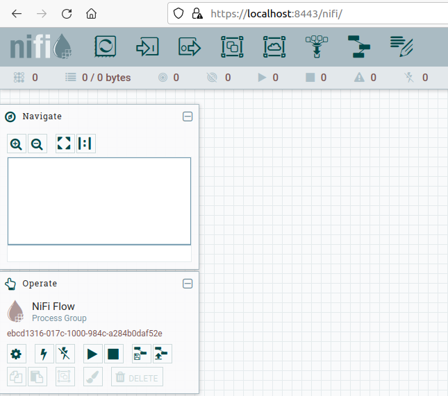
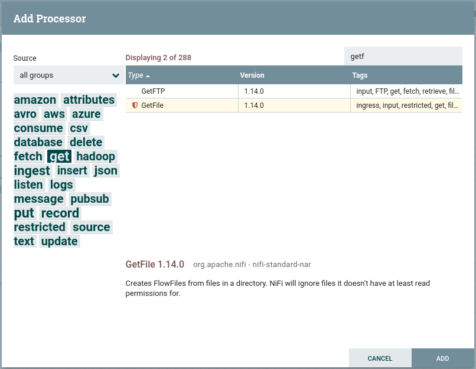

# Nifi I

{align="right" & width="200"}

[*Nifi*](https://nifi.apache.org) es un proyecto de Apache que plantea un sistema distribuido dedicado a ingestar y transformar datos de nuestros sistemas.

Es un proyecto open source hecho en Java, desarrollado por la National Security Agency (NSA). Es escalable, persistente y tolerante a fallos, permite la integración y conexión con gran cantidad de tecnologías, facilitando la implementación de ETLs visualmente con una sencilla interfaz basada en web mediante el uso de grafos acíclicos dirigos (DAG) de datos.

Entre sus características principales destacamos:

* Flujos de datos escalables.
* Más de 300 conectores.
* Procesadores personalizados.
* Usa el paradigma de programación basado en flujos.
* Define las aplicaciones como grafos de procesos a través de conexiones que envían mensajes.
* Entrega garantizada sin pérdida de datos.

Las ventajas de Nifi son:

* Facilidad de uso mediante UI
* Escalabilidad horizontal con un cluster de máquinas.
* Cantidad de conectores
* Procesadores personalizados
* Evolución y comunidad
* Política de usuarios (LDAP)
* Multiplataforma
* Licencia Open Source
* Validador de configuraciones
* Linaje y procedencia del dato

Sus casos de uso son:

* Transferencias de datos entre sistemas, por ejemplo, de JSON a una base de datos, de un FTP a Hadoop, etc..
* Preparar y enriquecer los datos
* Enrutar datos en función de características
* Conversión de datos entre formatos

En cambio, no es apropiado para:

* Procesamiento y operaciones de cómputo distribuido
* Operaciones de streaming complejas con joins o agregaciones.
* Procesamiento complejo de eventos.

## Puesta en marcha

Para instalar Nifi, sólo hemos de descargar la última versión desde <nifi.apache.org> y tras descomprimilar, debemos crear unas credenciales de acceso. Para ello, ejecutaremos el comando `./nifi.sh set-single-user-credentials <username> <password>` indicando el usuario y contraseña que queramos.

A continuación, ya podemos arrancar Nifi ejecutando el comando `./nifi.sh start` (se ejecutará en *brackgound*). Si queremos detenerlo ejecutaremos `.nifi.sh stop`.

Para acceder al entorno de trabajo introducimos en el navegador: <https://localhost:8443/nifi> y tras aceptar la alerta de seguridad respecto al certificado veremos un intefaz similar a la siguiente imagen:

<figure style="align: center;">
    
    <figcaption>Página de inicio en Nifi</figcaption>
</figure>

## Componentes

* **Flowfile**: es básicamento el dato, el cual se persiste en disco tras su creación. Realmente es un puntero al dato en su almacenamiento local, de esta manera se acelera su rendimiento. El *Flowfile* a a su vez se compone de dos partes:

    * contenido: el dato en sí
    * atributos: metadatos en pares de clave/valor

* **Procesador**: encargado de ejecutar alguna transformación o regla sobre los datos o el flujo para generar un nuevo *Flowfile*. La salida de un procesador es un *Flowfile* que será la entrada de otro procesador. Todos los procesadores se ejecutan en paralelo (mediante diferentes hilos de ejecución), abstrayendo complejidad de la programación concurrente y además se pueden ejecutar en varios nodos de forma simultánea o bien en el nodo primario de un clúster.

* **Conector**: es una cola que une diferentes procesadores y contiene los *Flowfiles* que todavía no se han ejecutado, pudiendo definir diferentes prioridades (por ejemplo, FIFO o LIFO según necesitemos).

<figure style="align: center;">
    
    <figcaption>Componentes de Nifi</figcaption>
</figure>

## Caso 1 - Moviendo datos

Vamos a hacer un pequeño ejercicio con Nifi para familiarizarnos con el entorno desarrollando un flujo sencillo que mueva un fichero de un directorio a otro.

Ejemplo video curso y Teralco...

Poner en origen el mismo fichero dos veces
Arrancar solo origen
Ver que se queda en el buffer
Arrancar destino
Ver el mensaje de error en destino
Cambiar política con fallos (replace)

A continuación detallamos los pasos a realizar:

1. Seleccionamos un procesador (primer icono grande) y lo arrastramos en nuestra área de trabajo.
2. Nos aparece un dialogo con tres partes diferenciadas:

    <figure style="alignt: center;">
        
        <figcaption>Diálogo de elección de procesador</figcaption>
    </figure>

    * A la izquierda una nube de etiquetas para poder filtrar los procesador.
    * Arriba a la derecha tenemos un buscador para buscar procesadores por su nombre
    * La parte central con el listado de procesadores, desde donde lo podemos seleccionar.

    Así pues, buscamos el procesador *GetFile* y lo añadimos al flujo.

3. Damos doble click sobre el elemento gráfico que representa nuestro procesador, y en la pestaña *properties* indicamos el directorio de entrada de donde tendrá que recoger el fichero, en nuestro caso `/home/hadoop/Documentos/in`.
5. Añadimos un nuevo procesador de tipo *PutFile*
6. En properties indicamos el directorio de salida
7. Para este ejemplo sencillo “autoterminaremos” las 2 relaciones:
8. Ya solo nos queda unir los dos procesadores
9. Antes de arrancarlo, creamos un pequeño fichero en el directorio que hemos puesto como entrada
10. Con el segundo botón sobre el procesados le damos a START
11. Y vemos que tenemos fichero en la cola
12. Damos a START al proceso PUTFILE y vemos como el fichero pasa de la cola a este proceso marcando la entrada:
13. Comprobamos los directorios /in y /out para comprobar que ha movido los ficheros.

## Interfaz de usuario

* Menú superior
* Barra de debajo con iconos
* Navigation para hacer zoom
* Elementos de un procesador

!!! info "Tipos de procesadores"
    Ya hemos visto que existen más de 300 procesadores, los cuales puedes consultar en https://www.nifi.rocks/apache-nifi-processors/. A grosso modo, los más utilizados son:

    * Tranformación de datos: `ReplaceText`, `JoltTransformJSON`, `CompressContent`.
    * Enrutado y mediación: `RouteOnAttribute`, `RouteOnContent`
    * Acceso a base de datos: `ExecuteSQL`, `ConvertJSONToSQL`, `PutSQL`
    * Extracción de atributos: `EvaluateJsonPath`, `ExtractText`, `UpdateAttribute`
    * Interacción con el sistema: `ExecuteProcess`
    * Ingestión de datos: `GetFile`, `GetFTP`, `GetHTTP`, `GetHDFS`
    * Envío de datos: `PutEmail`, `PutFile`, `PutFTP`, `PutKafka`, `PutMongo`
    * División y agregación: `SplitText`, `SplitJson`, `SplitXml`, `MergeContent`
    * HTTP: `GetHTTP`, `ListenHTTP`, `PostHTTP`
    * AWS: `FetchS3Object`, `PutS3Object`, `PutSNS`, `PutSQS`

## Caso 2

* En Nifi solo hay un canvas de nivel superior, pero podemos construir tantos flujos lógicos como deseemos. Normalmente, para organizar las cosas, se utilizan grupos de procesos, por lo que el canvas de nivel superior puede tener varios grupos de procesos, cada uno de los cuales representa un flujo lógico, pero no necesariamente conectados entre sí.

* Cada vez que se generan Flowfiles (representa un registro de datos que viaja por el flujo) estos van a tener asignados ciertos atributos por defecto. Entre estos atributos están el UUID o identificador único, su timestamp y el tamaño del fichero, mediante el uso de procesadores podremos modificar estos o añadir nuevos atributos.

* Vamos a ver cómo hacerlo realizando los siguientes pasos:

I Vamos a añadir un procesador del tipo GenerateFlowFile: crea flowfiles con datos aleatorios o contenidos personalizados: útil para testear y debugear.

https://www.futurespace.es/cafe-con-iot-capitulo-1-los-flujos-de-nifi/

https://www.futurespace.es/apache-nifi-validando-transferencias-de-ficheros-caso-de-uso-real/

https://www.futurespace.es/apache-nifi-flujo-de-extraccion-validacion-transformacion-y-carga-de-ficheros-caso-de-uso-real/

https://aprenderbigdata.com/introduccion-apache-nifi/#¿Que-es-un-flow-file-en-Apache-NiFi

https://www.theninjacto.xyz/Data-Transformation-Pipelines-Apache-Nifi-Flink-Kafka-Cassandra-1/

Introduction to Apache NiFi (Hortonworks DataFlow - HDF 2.0)
https://learning.oreilly.com/videos/introduction-to-apache/9781789346084/

TIME TO COMPLETE:
1h 47m

El siguiente artículo sobre ejectuar [Nifi en un cluster utilizando Docker](https://www.theninjacto.xyz/Running-cluster-Apache-Nifi-Docker/) es muy interesante.

## Actividades

## Referencias

* [Getting started with Apache Nifi](https://nifi.apache.org/docs/nifi-docs/html/getting-started.html)
* [Apache Nifi User Guide](https://nifi.apache.org/docs/nifi-docs/html/user-guide.html)
* [Apache Nifi in Depth](https://nifi.apache.org/docs/nifi-docs/html/nifi-in-depth.html)
