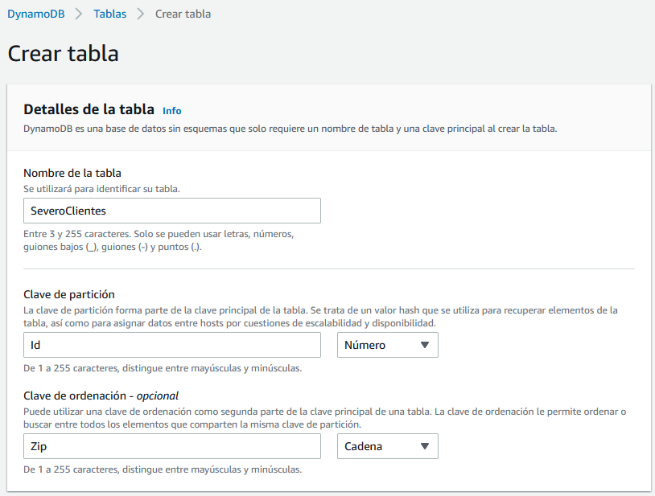
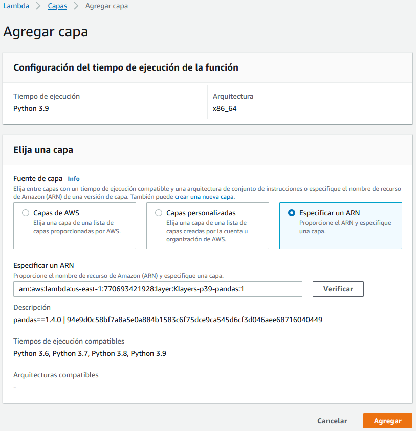
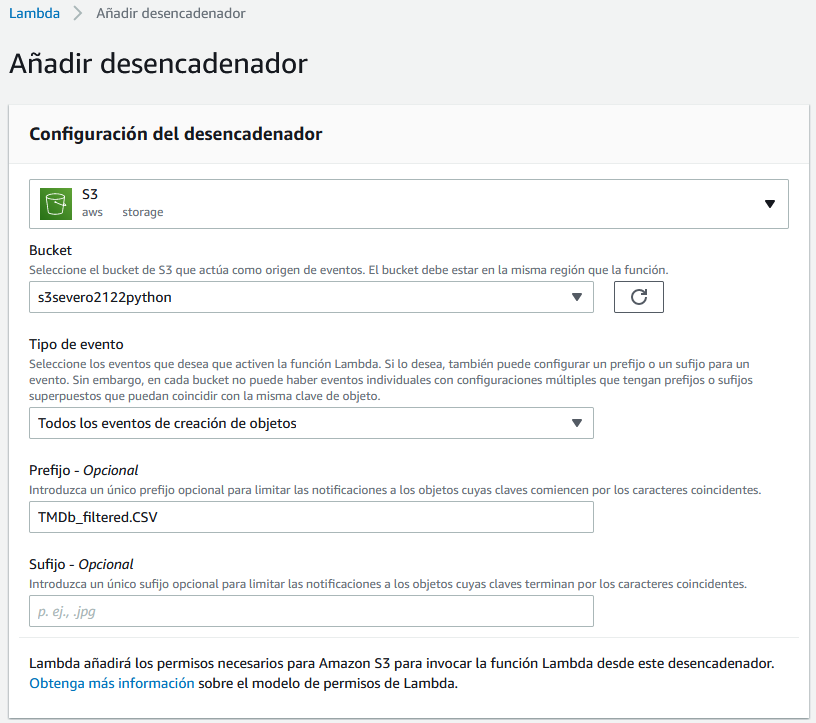
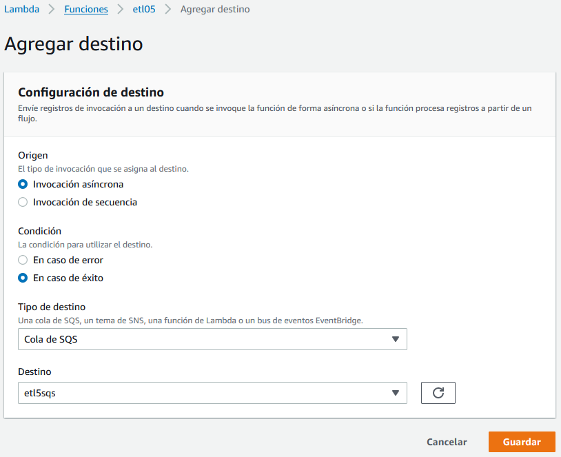
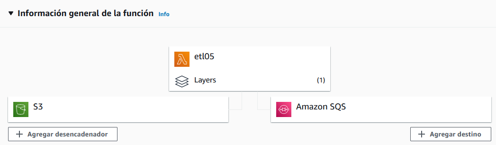
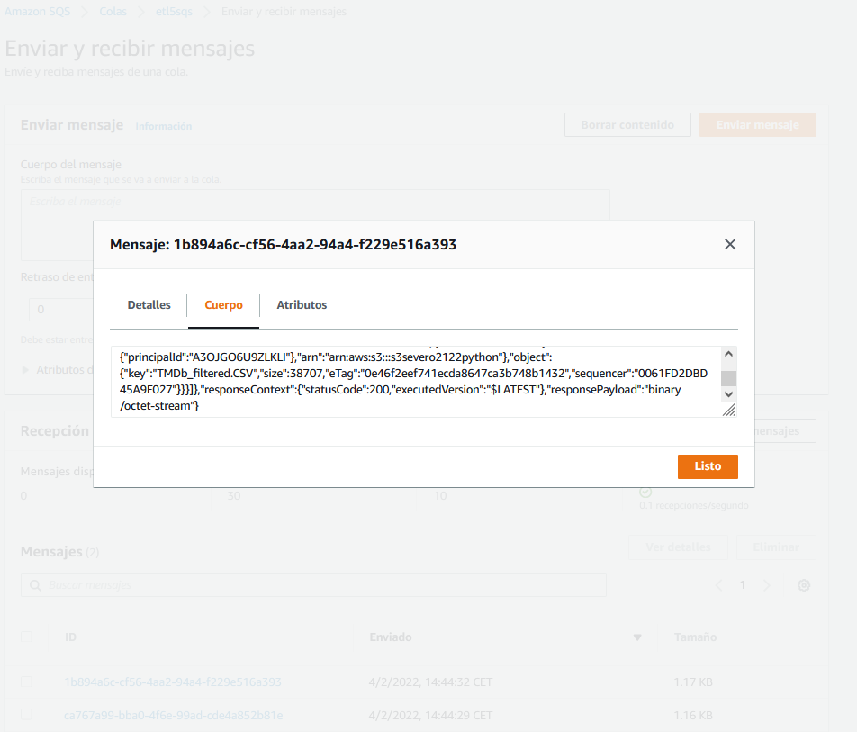

# Python y AWS

En esta sesión vamos a estudiar cómo acceder a los servicios de AWS relacionados con el Big Data estudiados previamente, y mediante diversos casos de uso crear diferentes flujos de datos.

Para los siguientes casos de uso, realizaremos los 5 primeros desde nuestro sistema local y el caso final haciendo uso *AWS Lambda*.

Para autenticarnos en AWS desde nuestro sistema local, recuerda que necesitas copiar las credenciales de acceso en `~/.aws/credentials` o mediante las [variables de entorno](nube02aws.md#variablesEntorno).

## SDK Boto3

Para acceder a AWS desde *Python*, *Amazon* ofrece el [SDK Boto3](https://aws.amazon.com/es/sdk-for-python/). Para poder utilizarlo, la instalaremos mediante

``` console
pip install boto3
```

Podéis consultar toda la información relativa a *Boto3* en su documentación oficial en
<https://boto3.amazonaws.com/v1/documentation/api/latest/index.html>

Existen dos posibilidades para acceder a AWS mediante Boto3:

* **Recursos**: representan un interfaz orientado a objetos de AWS, de manera que cada recurso contendrá un identificador, unos atributos y un conjunto de operaciones. Un ejemplo de recurso es el [S3](https://boto3.amazonaws.com/v1/documentation/api/latest/reference/services/s3.html#object). Más información sobre recursos en la [documentación oficial](https://boto3.amazonaws.com/v1/documentation/api/latest/guide/resources.html).
* **Clientes**: ofrecen un interfaz de bajo nivel que se mapea 1:1 con el API de cada servicio. Los clientes se generan a partir de la definición JSON del servicio. Más información en la [documentación oficial](https://boto3.amazonaws.com/v1/documentation/api/latest/guide/clients.html).

En resumen, los recursos son una abstracción a más alto nivel de los servicios AWS que los clientes. Se recomienda el uso de los recursos al no tener que preocuparse de cómo se realiza por debajo la comunicación e interacción con los servicios. Sin embargo, a día de hoy no hay recursos para todos los servicios AWS, y por ello, en ocasiones no queda otra opción que utilizar los clientes.

Para demostrar las diferencias, vamos a ver cómo podemos realizar algunas operaciones haciendo uso del cliente o del recurso (en estos ejemplos nos vamos a centrar en el servicio S3 - <https://boto3.amazonaws.com/v1/documentation/api/latest/reference/services/s3.html>.):

=== "Buckets de un usuario"

    ``` python title="s3-buckets.py"
    import boto3

    # Opción 1
    print('Buckets mediante resource:')
    s3resource = boto3.resource('s3', region_name='us-east-1')
    buckets = s3resource.buckets.all()
    for bucket in buckets:
        print(f'\t{bucket.name}')

    # Opción 2
    print('Buckets mediante el cliente:')
    s3client = boto3.client('s3')
    response = s3client.list_buckets()
    for bucket in response['Buckets']:
        print(f'\t{bucket["Name"]}')
    ```

=== "Elementos de un bucket"

    ``` python title="s3-bucket-objects.py"
    import boto3

    s3 = boto3.resource('s3', region_name='us-east-1')
    bucket = s3.Bucket('s3severo2122python')
    for obj in bucket.objects.all():
        print(obj.key)
    ```

=== "Creación de un bucket"

    ``` python title="s3-create-bucket.py"
    import boto3

    # Opción 1 - resource
    s3r = boto3.resource('s3', region_name='us-east-1')
    bucket = s3r.Bucket('s3severo2122python-r')
    bucket.create()

    # Opción 2 - cliente
    s3c = boto3.client('s3')
    response = s3c.create_bucket(
        Bucket='s3severo2122python'
    )
    ```

=== "Eliminación de un recurso/bucket"

    ``` python title="s3-delete.py"
    import boto3

    s3r = boto3.resource('s3', region_name='us-east-1')
    bucket = s3r.Bucket('s3severo2122python')

    # Elimina todos los objetos del bucket
    bucket.objects.delete()
    # Elimina el bucket
    bucket.delete()
    ```

## Caso de uso 1: Comunicación con S3

Vamos a trabajar con el archivo [datosPeliculas.json](../recursos/dynamodb/datosPeliculas.json) el cual contiene un listado de películas con las que trabajaremos en los siguientes casos de uso.

Primero vamos a ver cómo podemos subir el archivo a S3 mediante Python:

``` python title="upload-movies-s3.py"
import boto3

ficheroUpload = "datosPeliculas.json"
nombreBucket = "s3severo2122python"

# Opción 1 - resource
s3r = boto3.resource('s3', region_name='us-east-1')

# 1.1 mediante upload_file
bucket = s3r.Object(nombreBucket, 'datosSubidosR1.txt')
bucket.upload_file(ficheroUpload)

# 1.2 mediante put
object = s3r.Object(nombreBucket, 'datosSubidosR2.txt')
object.put(Body=b'Ejemplo de datos binarios')

# Opción 2 - cliente
s3c = boto3.client('s3')

# 2.1 mediante upload_file
response = s3c.upload_file(ficheroUpload, nombreBucket, "datosSubidosC1.json")

# 2.2 mediante upload_fileobj
with open(ficheroUpload, "rb") as f:
    s3c.upload_fileobj(f, nombreBucket, "datosSubidosC2.json")

# Cliente: Ejemplo de como crear un objeto y añadirle contenido desde Python
s3c.put_object(Body=b'Ejemplo de datos binarios',
               Bucket=nombreBucket, Key="datosSubidosC3")
```

Si lo que queremos es descargar un recurso de S3 para tenerlo en nuestro sistema local haremos:

``` python
import boto3

# Opción 1 - descarga
s3c = boto3.client('s3')
s3c.download_file('s3severo2122python', 'datosPeliculas.json',
                 'datosDescargados.json')

# Opción 2 - Abrimos el fichero y metemos el contenido
with open('fichero.json', 'wb') as f:
    s3c.download_fileobj('s3severo2122python', 'datosPeliculas.json', f)
```

## Caso de uso 2: Cargar datos en DynamoDB

Vamos a cargar un listado de películas en *DynamoDB*. El primer paso es elegir las claves de particionado y ordenación. El archivo [datosPeliculas.json](../recursos/dynamodb/datosPeliculas.json) contiene el siguiente contenido:

``` json
[
    {
        "year": 2013,
        "title": "Rush",
        "info": {
            "directors": ["Ron Howard"],
            "release_date": "2013-09-02T00:00:00Z",
            "rating": 8.3,
            "genres": [
                "Action",
                "Biography",
                "Drama",
                "Sport"
            ],
            "image_url": "http://ia.media-imdb.com/images/M/MV5BMTQyMDE0MTY0OV5BMl5BanBnXkFtZTcwMjI2OTI0OQ@@._V1_SX400_.jpg",
            "plot": "A re-creation of the merciless 1970s rivalry between Formula One rivals James Hunt and Niki Lauda.",
            "rank": 2,
            "running_time_secs": 7380,
            "actors": [
                "Daniel Bruhl",
                "Chris Hemsworth",
                "Olivia Wilde"
            ]
        }
    },
]
```

Como los años de las películas permiten particionar de manera más o menos equilibrada los datos, en la mejor candidata para clave de particionado. Como sí que habrá varias películas en el mismo año, elegimos el título como clave de ordenación, provocando que los documentos tengan una clave compuesta.

Así pues, vamos a nombrar nuestra tabla como `SeveroPeliculas` y ponemos como clave de partición el atributo `year` de tipo numérico, y como clave de ordenación `title` de tipo cadena.

<figure style="align: center;">
    
    <figcaption>Creación de la tabla SeveroPeliculas</figcaption>
</figure>

Una vez creada la tabla, vamos a ver cómo podemos cargar los datos. Haciendo uso de la librería *boto3* vamos a crear el archivo [cargarDatosPeliculas.py](../recursos/dynamodb/cargarDatosPeliculas.py):

``` python title="cargarDatosPeliculas.py"
import boto3
import json
import decimal

dynamodb = boto3.resource('dynamodb', region_name='us-east-1') # (1)

tabla = dynamodb.Table('SeveroPeliculas')

with open("datosPeliculas.json") as ficheroJSON:
    peliculas = json.load(ficheroJSON, parse_float=decimal.Decimal)
    for pelicula in peliculas:
        year = int(movie['year'])
        title = movie['title']
        info = movie['info']

        print("Añadida película:", year, title)

        tabla.put_item(
            Item={
                'year': year,
                'title': title,
                'info': info,
            }
        )
```

1. Nos conectamos a la región e indicamos que vamos a utilizar el servicio de DynamoDB

Si lo ejecutamos desde nuestro ordenador, nos aparecerá por la consola cada una de las películas insertadas.

!!! caution "Float y boto3"
    Mucho cuidado con boto3 y DynamoDB, ya que los tipos `Float` no están soportados, y en cambio, hemos de utilizar el tipo `Decimal`.

## Faker

Si necesitamos escribir muchos datos, es muy útil emplear una librería como [Faker](https://faker.readthedocs.io/en/master/) para generar los datos.

Primero hemos de instalarla mediante pip:

``` bash
pip3 install faker
```

Vamos a realizar un ejemplo para mostrar algunos datos aleatorios y comprobar su funcionamiento:

=== "Código"

    ``` python title="holaFaker.py"
    from faker import Faker

    fake = Faker()
    fake = Faker('es_ES')   # cambiamos el locale a español

    print("Nombre:", fake.name())
    print("Dirección:", fake.address())
    print("Nombre de hombre:", fake.first_name_male())
    print("Número de teléfono:", fake.phone_number())
    print("Color:", fake.color_name())
    print("Fecha:", fake.date())
    print("Email:", fake.email())
    print("Frase de 10 palabras", fake.sentence(nb_words=10))
    ```

=== "Resultado"

    ``` output
    Nombre: Dani Pla Chico
    Dirección: Cuesta de Emiliano Milla 66
    Albacete, 83227
    Nombre de hombre: Matías
    Número de teléfono: +34 818 779 827
    Color: Salmón oscuro
    Fecha: 1984-09-29
    Email: btome@example.net
    Frase de 10 palabras Perferendis saepe consequatur saepe sapiente est impedit eaque omnis temporibus excepturi repellat ducimus.
    ```

Los diferentes grupos de datos que genera se agrupan en *Providers*: de dirección, fechas, relacionados con internet, bancarios, códigos de barra, isbn, etc... Se recomienda consultar la documentación en <https://faker.readthedocs.io/en/master/providers.html>.

!!! caution "Locale ES"
    Al trabajar con el idioma en español, puede que algunos métodos no funcionen (más que no funcionar, posiblemente tengan otro nombre). Es recomendable comprobar las opciones disponibles en <https://faker.readthedocs.io/en/master/locales/es_ES.html>

### Generando CSV

Vamos a generar un CSV con datos de 1000 personas. Primero creamos una lista con los encabezados y los escribimos en el fichero, para posteriormente, línea a línea, generar los datos de cada persona:

=== "Código"

    ``` python title="generaCSV.py"
    from faker import Faker
    import csv

    output = open('datosFaker.csv', 'w')

    fake = Faker('es_ES')   # cambiamos el locale a español
    header = ['nombre', 'edad', 'calle', 'ciudad',
            'provincia', 'cp', 'longitud', 'latitud']
    mywriter = csv.writer(output)
    mywriter.writerow(header)

    for r in range(1000):
        mywriter.writerow([fake.name(),
                        fake.random_int(min=18, max=80, step=1),
                        fake.street_address(),
                        fake.city(),
                        fake.state(),
                        fake.postcode(),
                        fake.longitude(),
                        fake.latitude()])
    output.close()
    ```

=== "Resultado"

    ``` csv title="datosFaker.csv"
    nombre,edad,calle,ciudad,provincia,cp,longitud,latitud
    Jenaro Verdú Suarez,26,Urbanización Mohamed Vallés 122,Sevilla,Guipúzcoa,73198,2.657719,-69.679293
    Eugenio Calzada Revilla,57,Camino Vanesa Amor 36 Piso 9 ,Huesca,Álava,75590,34.041399,-52.924628
    Flavio del Lumbreras,76,Avenida de Beatriz Amaya 92,Ciudad,Murcia,86420,58.248903,-17.924926
    ```

### Generando JSON

Y a continuación repetimos el mismo ejemplo, pero ahora generando un documento JSON. La principal diferencia es que primero vamos a rellenar un diccionario con toda la información, y luego persistimos el diccionario:

=== "Código"

    ``` python title="generaJSON.py"
    from faker import Faker
    import json

    fake = Faker('es_ES')   # cambiamos el locale a español

    # Preparamos los datos
    datos = {}
    datos['registros'] = []

    for x in range(1000):
        persona = {"datos": fake.name(),
                "edad": fake.random_int(min=18, max=80, step=1),
                "calle": fake.street_address(),
                "ciudad": fake.city(),
                "provincia": fake.state(),
                "cp": fake.postcode(),
                "longitud": float(fake.longitude()),
                "latitud": float(fake.latitude())}
        datos['registros'].append(persona)

    # Los metemos en el fichero
    output = open('datosFaker.json', 'w')
    json.dump(datos, output)
    ```

=== "Resultado"

    ``` json title="datosFaker.json"
    {
        "registros": [
            {
                "datos": "Merche Moreno Roman",
                "edad": 51,
                "calle": "Paseo Amelia Folch 967",
                "ciudad": "Segovia",
                "provincia": "M\u00e1laga",
                "cp": "71721",
                "longitud": 84.603801,
                "latitud": 58.941349
            },
            {
                "datos": "Miguel Abascal Sanz",
                "edad": 21,
    ```

## Caso de uso 3 - Consultar datos en DynamoDB

Una vez tenemos nuestra tabla de DynamoDB cargada con datos, llega el momento de recuperar los datos, ya sea un registro en concreto o la posibilidad de realizar una consulta, ya sea por su índice o su clave de ordenación (o ambas).

En la sesión que trabajamos con DynamoDB estudiamos que podíamos realizar consultas sobre el almacén NoSQL haciendo uso de un subconjunto de SQL conocido como [PartiQL](https://aitor-medrano.github.io/bigdata2122/apuntes/nube05datos.html#infraestructura). En los siguientes ejemplos vamos a mostrar cómo realizar las operaciones vía el API de DynamoDb y mediante PartiQL.

Si queremos recuperar la película *Interstellar* de 2014 haremos:

=== "Mediante `get_item`"

    ``` python title="dynamodb_getitem.py"
    import boto3

    dynamodb = boto3.resource('dynamodb', region_name='us-east-1')
    tabla = dynamodb.Table('SeveroPeliculas')

    title = "Interstellar"
    year = 2014

    response = tabla.get_item(
            Key={
                'year': year,
                'title': title
            },
            ProjectionExpression="title, info.plot")
    item = response['Item']
    print(item)
    ```

=== "Mediante `get_item` con excepciones"

    ``` python title="dynamodb_getitem_exc.py"
    import boto3
    from botocore.exceptions import ClientError

    dynamodb = boto3.resource('dynamodb', region_name='us-east-1')
    tabla = dynamodb.Table('SeveroPeliculas')

    title = "Interstellar"
    year = 2014

    # Recupera una película
    print("------ Datos de Interstellar")
    try:
        response = tabla.get_item(
            Key={
                'year': year,
                'title': title
            },
            ProjectionExpression="title, info.plot"
        )
    except ClientError as e:
        print(e.response['Error']['Message'])
    else:
        item = response['Item']
        print(item)
    ```

=== "Mediante PartiQL"

    ``` python title="dynamodb_select.py"
    import boto3

    clientDDB = boto3.client('dynamodb', region_name='us-east-1')

    # Recupera una película con PartiQL
    print("------ Datos de Interstellar mediante PartiQL")
    resp = clientDDB.execute_statement(
        Statement="SELECT title, info.plot FROM SeveroPeliculas WHERE year = 2014 and title='Interstellar'")
    item = resp['Items'][0]
    print(item)

    title = "Interstellar"
    year = 2014
    # Recupera una película con PartiQL con parámetros indicados mediante ?
    print("------ Datos de Interstellar mediante PartiQL con parámetros")
    resp = clientDDB.execute_statement(Statement='SELECT * FROM SeveroPeliculas WHERE year = ? AND title = ?',
                                        Parameters=[{'N': str(year)}, {'S': title}])
    item = resp['Items'][0]
    print(item)
    ```

En el caso de las [consultas mediante PartiQL haciendo uso de `execute_statement`](https://boto3.amazonaws.com/v1/documentation/api/latest/reference/services/dynamodb.html#DynamoDB.Client.execute_statement) conviene destacar que:

* Las consultas son *case sensitive*.
* Los parámetros se indican mediante `?`
* Los contenidos de los parámetros se indican mediante una lista con un diccionario por cada parámetro donde la clave es el tipo del parámetro, y el valor es el dato a pasar (el dato se pasa siempre como un `string`)
* Las consultas siempre devuelven un diccionario con una propiedad `Items` que contiene los resultados devueltos.

Destacar que es diferente la estructura del resultado de realizar una consulta mediante el API de DynamoDB (respeta la estructura definida en la base de datos) o mediante PartiQL (crea un atributo por columna recuperada cuyo valor contiene el tipo del dato):

=== "Resultado de `get-item`"

    ``` json
    {
        'info': {'plot': 'A group of explorers make use of a newly discovered wormhole to surpass the limitations on human space travel and conquer the vast distances involved in an interstellar voyage.'},
        'title': 'Interstellar'
    }
    ```

=== "Resultado de *PartiQL*"

    ``` json
    {
        'title': {'S': 'Interstellar'},
        'plot': {'S': 'A group of explorers make use of a newly discovered wormhole to surpass the limitations on human space travel and conquer the vast distances involved in an interstellar voyage.'}
    }
    ```

También podemos realizar otro tipo de consultas:

=== "Películas de 2016 mediante `query`"

    ``` python
    import boto3
    from boto3.dynamodb.conditions import Key

    # Mediante query
    dynamodb = boto3.resource('dynamodb', region_name='us-east-1')
    tabla = dynamodb.Table('SeveroPeliculas')
    print("-----Películas de 2016")
    resp = tabla.query(KeyConditionExpression=Key('year').eq(2016))
    for i in resp['Items']:
        print(i['year'], ":", i['title'])

    # Mediante PartiQL
    print("-----Películas de 2016 con PartiQL")
    clientDDB = boto3.client('dynamodb', region_name='us-east-1')
    resp = clientDDB.execute_statement(
        Statement="SELECT title, year FROM SeveroPeliculas WHERE year = 2016")
    for i in resp['Items']:
        print(i['year']['N'], ":", i['title']['S'])
    ```

=== "Películas cuyo título esté entre la A y la L"

    ``` python
    import boto3
    import json
    import decimal
    from boto3.dynamodb.conditions import Key

    class DecimalEncoder(json.JSONEncoder):
        def default(self, o):
            if isinstance(o, decimal.Decimal):
                if o % 1 > 0:
                    return float(o)
                else:
                    return int(o)
            return super(DecimalEncoder, self).default(o)

    anyo = 2016
    letraInicial = "A"
    letraFinal = "F"

    dynamodb = boto3.resource('dynamodb', region_name='us-east-1')
    tabla = dynamodb.Table('SeveroPeliculas')

    print("-----Películas de 2016 cuyo título empieza desde A hasta L")
    resp = tabla.query(
        ProjectionExpression="#yr, title, info.genres, info.actors[0]",
        # year es una palabra clave, por tanto necesitamos crear un alias
        ExpressionAttributeNames={"#yr": "year"},
        KeyConditionExpression=Key('year').eq(anyo) & Key('title').between(letraInicial, letraFinal)
    )
    for i in resp['Items']:
        print(i)
        # {'info': {'actors': ['Zoe Saldana'], 'genres': ['Action', 'Adventure', 'Fantasy', 'Sci-Fi']}, 'year': Decimal('2016'), 'title': 'Avatar 2'}
        # Transforma los valores numéricos de Decimal a Number
        print(json.dumps(i, cls=DecimalEncoder))
        # {"info": {"actors": ["Zoe Saldana"], "genres": ["Action", "Adventure", "Fantasy", "Sci-Fi"]}, "year": 2016, "title": "Avatar 2"}
        for genero in i['info']['genres']:
            print(genero)

    print("-----Películas de 2016 cuyo título empieza desde A hasta L con PartiQL")
    clientDDB = boto3.client('dynamodb', region_name='us-east-1')
    consulta = 'SELECT year, title, info.genres, info.actors[0] FROM SeveroPeliculas WHERE year = ? AND title between ? and ?'
    resp = clientDDB.execute_statement(Statement=consulta,
                                    Parameters=[{'N': str(anyo)}, {'S': letraInicial}, {'S': letraFinal}])
    for i in resp['Items']:
        print(i)
        # [{'year': {'N': '2016'}, 'title': {'S': 'Avatar 2'}, 'actors[0]': {'S': 'Zoe Saldana'}, 'genres': {'L': [{'S': 'Action'}, {'S': 'Adventure'}, {'S': 'Fantasy'}, {'S': 'Sci-Fi'}]}}]
        for genero in i['genres']['L']:
            print(genero['S'])
    ```

La clase `DecimalEncoder` se utiliza para transformar los campos Decimal que utiliza DynamoDB para almacenar contenido numérico a tipo entero o flotante según necesite.

### Full scan

Cuando en *PartiQL* no le indicamos en la condición una expresión que busque por una de las claves, se realizará un *full scan* sobre toda la tabla, lo que puede implicar unos costes inesperados, tanto económicos como a nivel rendimiento provisionado.

El método `scan` lee cada elemento de la tabla y devuelve todos los datos de la tabla. Se le puede pasar una `filter_expression` opcional para que sólo devuelva los elementos que cumplan el criterio. Sin embargo, el filtrado se aplica tras escanear toda la tabla.

=== "Ejemplo scan"

``` python
import boto3
import json
import decimal
from boto3.dynamodb.conditions import Key

class DecimalEncoder(json.JSONEncoder):
    def default(self, o):
        if isinstance(o, decimal.Decimal):
            if o % 1 > 0:
                return float(o)
            else:
                return int(o)
        return super(DecimalEncoder, self).default(o)

dynamodb = boto3.resource('dynamodb', region_name='us-east-1')
tabla = dynamodb.Table('SeveroPeliculas')

print("-----Películas de sobresaliente mediante full scan")
# Escaneo y filtrado
fe = Key('info.rating').gte(9)
pe = "#yr, title, info.rating"
ean = {"#yr": "year"}
resp = tabla.scan(
    FilterExpression=fe,
    ProjectionExpression=pe,
    ExpressionAttributeNames=ean
)
for i in resp['Items']:
    print(json.dumps(i, cls=DecimalEncoder))
```

=== "Full scan con PartiQL"

``` python
import boto3
from boto3.dynamodb.conditions import Key

print("-----Películas de 2016 con PartiQL")
clientDDB = boto3.client('dynamodb', region_name='us-east-1')
resp = clientDDB.execute_statement(
    Statement="SELECT title, year, info.rating FROM SeveroPeliculas WHERE info.rating >= 9")
for i in resp['Items']:
    print(i['year']['N'], ":", i['title']['S'])
```

## Caso de uso 4 - De S3 a DynamoDB

En este caso, vamos a coger datos de películas de un dataset público disponible en <https://www.kaggle.com/sankha1998/tmdb-top-10000-popular-movies-dataset>

El contenido del dataset es similar a:

``` csv title="TMDb_updated.CSV"
,title,overview,original_language,vote_count,vote_average
0,Ad Astra,"The near future...",en,2853,5.9
1,Bloodshot,"After he ...",en,1349,7.2
2,Bad Boys for Life,"Marcus and Mike ...",en,2530,7.1
```

Una vez descargado [TMDb_updated.CSV](../recursos/TMDb_updated.CSV), vamos a cargar la información en S3 dentro del bucket. Para este caso, en vez de cargar todos los datos desde el dataset en nuestra tabla NoSQL, vamos a meter en DynamoDB el título, la nota media y la trama siempre y cuando hayan recibido al menos 10.000 votos.

### S3Select

Para realizar esta consulta desde Python para poder automatizar el proceso ETL utilizaremos S3Select para recuperar el subconjunto de los datos.

!!! info "S3Select vs AWS Athena"
    Este tipo de procesamiento es más cómodo realizarlo mediante AWS Athena, el cual sí que permite realizar *join* entre diferentes datasets. S3Select sólo permite trabajar con una única tabla.

Para ello, mediante S3Select ejecutaremos la consulta `SELECT s.title, s.overview, s.vote_count, s.vote_average FROM s3object s WHERE cast(s.vote_count as int)> 10000` y almacenaremos el resultado en un nuevo CSV dentro del mismo bucket:

``` python title="s3select.py"
import boto3

s3 = boto3.client('s3')

# 1.- Realizamos la consulta mediante S3Select
resp = s3.select_object_content(
    Bucket='s3severo2122python',
    Key='TMDb_updated.CSV',
    ExpressionType='SQL',
    Expression="SELECT s.title, s.overview, s.vote_count, s.vote_average FROM s3object s WHERE cast(s.vote_count as int)> 10000",
    InputSerialization={'CSV': {"FileHeaderInfo": "USE",
                                'AllowQuotedRecordDelimiter': True},
                        'CompressionType': 'NONE'},
    OutputSerialization={'CSV': {}},
)


# 2.- Unimos los datos que vamos recibiendo en streaming
registros = ["title,overview,vote_count,vote_average\n"]
for evento in resp['Payload']:
    if 'Records' in evento:
        registros.append(evento['Records']['Payload'].decode())

# 3.- Generamos el contenido en un String
file_str = ''.join(registros)

# 4.- Creamos un nuevo objeto en S3
s3.put_object(Body=file_str, Bucket='s3severo2122python',
              Key="TMDb_filtered.CSV")
```

### De S3 a DynamoDB

Una vez creado el fichero en S3, vamos cargar los datos en DynamoDB. Como el dataset no contenía la fecha de la película, en nuestro caso le vamos a poner a todas las películas que son del 2022:

``` python
import boto3
import pandas as pd
from decimal import Decimal

# 1.- Leemos el fichero desde S3 y lo metemos en un DataFrame
s3c = boto3.client('s3')
bucketNombre = "s3severo2122python"
ficheroNombre = "TMDb_filtered.CSV"
response = s3c.get_object(Bucket=bucketNombre, Key=ficheroNombre)
movies_df = pd.read_csv(response['Body'], delimiter = ',')

# 2.- Nos conectamos a DynamoDB
dynamodb = boto3.resource('dynamodb', region_name='us-east-1')
tabla = dynamodb.Table('SeveroPeliculas')

# 3.- Lo metemos en DynamoDB mediante un batch
with tabla.batch_writer() as batch:
    for index, fila in movies_df.iterrows():
        Item = {
            'year': 2022,
            'title': str(fila['title']),
            'info': {
                'plot' : fila['overview'],
                'rating' : Decimal(fila['vote_average']).quantize(Decimal('1.00'))
            }
        }
        batch.put_item(Item=Item)
```

## Caso de uso 5 - Desde RDS

!!! tip "Preparación MariaBD"
    Para estos actividades y futuras sesiones, vamos a utilizar una base de datos (*retail_db*) que contiene información sobre un comercio (clientes, productos, pedidos, etc...).

    Para ello, descargaremos el archivo [create_db.sql](../recursos/create_db.sql) con las sentencias para crear la base de datos y los datos como instrucciones SQL.

    Tras ello, bien sea mediante DBeaver o si nos conectamos a MariaDB (`mariadb -u iabd -p`) desde la misma carpeta que hemos descargado el archivo, ejecutaremos los siguientes comando:

    ``` sql
    create database retail_db;
    use retail_db;
    source create_db.sql;
    show tables;
    ``` 

Vamos a utilizar la instancia de base de datos iabd que tenemos en RDS con la base de datos `retail_db`.

### MariaDB/MySQL y Python

Para acceder a la base de datos desde Python necesitamos instalar la librería correspondiente:

``` bash
pip3 install mariadb
pip3 install mysql-connector-python
```

Todo el código a continuación se basa en *MariaDB* como sistema gestor de base de datos. Si queremos conectarnos, debemos indicar los datos de conexion:

``` python
import mariadb
import sys

try:
    conn = mariadb.connect(
        user="admin",
        password="adminadmin",
        host="iabd.cllw9xnmy9av.us-east-1.rds.amazonaws.com",
        port=3306,
        database="retail_db"
    )
except mariadb.Error as e:
    print(f"Error conectando a MariaD: {e}")
    sys.exit(1)

# Obtenemos el cursor
cur = conn.cursor()
```

Una vez nos hemos conectado y tenemos abierto un cursor, ya podemos hacer consultas y recuperar datos.

Por ejemplo, para recuperar toda la información de los clientes almacenada en la tabla `customers`:

``` python
sql = "select * from customers"
cur.execute(sql)
resultado = cur.fetchAll()

# Cerramos el cursor y la conexión
cur.close()
conn.close()

# Mostramos el resultado
print(resultado)
```

### De RDS a S3

Vamos a realizar otro ejemplo sencillo que recupere el nombre, apellido y email de los clientes mediante una consulta que reibe un parámetro:

``` python
import mariadb
import sys
import json
import boto3

try:
    conn = mariadb.connect(
        user="admin",
        password="adminadmin",
        host="iabd.cllw9xnmy9av.us-east-1.rds.amazonaws.com",
        port=3306,
        database="retail_db")
except mariadb.Error as e:
    print(f"Error conectando a MariaDB: {e}")
    sys.exit(1)

ciudad = "Brownsville"

# Obtenemos el cursor
cur = conn.cursor()
sql = "select customer_fname, customer_lname, customer_zipcode from customers where customer_city=?"
cur.execute(sql, (ciudad, ))

# Generamos un JSON con los datos
row_headers=[x[0] for x in cur.description] 
clientes = cur.fetchall()
json_data=[]
for cliente in clientes:
    json_data.append(dict(zip(row_headers,cliente)))

# Cerramos el cursor y la conexión
cur.close()
conn.close()

# Persistimos el JSON en S3
s3r = boto3.resource('s3', region_name='us-east-1')
object = s3r.Object('s3severo2122python', 'clientesRDS.json')
object.put(Body=json.dumps(json_data))
```

### De RDS a DynamoDB

Para este caso de uso, vamos a crear una nueva tabla en DynamoDB a la que llamaremos `SeveroClientes` y le pondremos como clave de particionado el campo `Id` de tipo numérico y como clave de ordenamiento el `Zip` de tipo texto.

<figure style="align: center;">
    
    <figcaption>Creación de la tabla SeveroClientes</figcaption>
</figure>

Vamos a modificar el ejemplo anterior para que, una vez recuperado los datos de la base de datos, los almacene directamente en DynamoDB:

``` python
import mariadb
import sys
import boto3

try:
    conn = mariadb.connect(
        user="admin",
        password="adminadmin",
        host="iabd.cllw9xnmy9av.us-east-1.rds.amazonaws.com",
        port=3306,
        database="retail_db"
    )
except mariadb.Error as e:
    print(f"Error conectando a MariaDB: {e}")
    sys.exit(1)

ciudad = "Brownsville"

# Obtenemos el cursor
cur = conn.cursor()
sql = "select customer_id, customer_fname, customer_lname, customer_zipcode from customers where customer_city=?"
cur.execute(sql, (ciudad, ))

# Recorremos el cursor e insertamos en DynamoDB
dynamodb = boto3.resource('dynamodb', region_name='us-east-1')
tabla = dynamodb.Table('SeveroClientes')
with tabla.batch_writer() as batch:
    for customer_id, customer_fname, customer_lname, customer_zipcode in cur: 
        Item = {
            'Id': customer_id,
            'Zip': customer_zipcode,
            'Nombre': customer_fname,
            'Apellidos': customer_lname,
        }
    batch.put_item(Item=Item)

# Cerramos el cursor y la conexión
cur.close()
conn.close()

```

!!! tip "Bases de datos y Pandas"
    Si estás interesado en colocar dentro de Pandas los datos que recuperas desde una base de datos, es muy cómodo utilizar [SQLAlchemy](https://www.sqlalchemy.org/) el cual ofrece una capa por encima de los drivers (además de ofrecer un framework ORM).

    Un fragmento de código que utiliza Pandas y SQLAlchmy sería similar a:

    ``` python
    from sqlalchemy import create_engine
    import pymysql
    import pandas as pd

    sqlEngine = create_engine('mysql+pymysql://iabd:@127.0.0.1', pool_recycle=3600)
    dbConnection = sqlEngine.connect()
    df = pd.read_sql("select * from retail_db.customers", dbConnection);
    ```

## Caso de uso 6 - AWS Lambda

En este caso de uso, vamos a realizar los casos de uso 4 y 5 mediante AWS Lambda, de manera que accedamos a S3, RDS y DynamoDB mediante funciones serverless.

Vamos a empezar con el caso [4.2 De S3 a DynamoDB](ingesta05python.md#de-s3-a-dynamodb). Para ello, nos vamos a crear una función que se ejecutará automáticamente cada vez que se inserte en el bucket `s3severo2122python` el objeto `TMDb_filtered.csv`. Si repasamos el caso de uso, el objetivo es cargar los datos de dicho CSV a la tabla `SeveroPeliculas` de DynamoDB.

Así pues, el primer paso, es acceder a AWS Lambda y crear una nueva función desde cero con soporte para Python 3.9 y x86_64:

``` python
import json
import urllib.parse
import boto3
import pandas as pd
from decimal import Decimal

print('Loading function')

s3 = boto3.client('s3')

bucketNombre = "s3severo2122python"
ficheroNombre = "TMDb_filtered.CSV"
            
def lambda_handler(event, context):
    print("Received event: " + json.dumps(event, indent=2))

    # Obtenemos el bucket y el objeto desde el evento
    bucket = event['Records'][0]['s3']['bucket']['name']
    key = urllib.parse.unquote_plus(event['Records'][0]['s3']['object']['key'], encoding='utf-8')
    
    try:
        if bucket == bucketNombre and key == ficheroNombre:

            # 1.- Leemos el fichero desde S3 y lo metemos en un DataFrame
            response = s3.get_object(Bucket=bucketNombre, Key=ficheroNombre)
            movies_df = pd.read_csv(response['Body'], delimiter = ',')
            
            # 2.- Nos conectamos a DynamoDB
            dynamodb = boto3.resource('dynamodb', region_name='us-east-1')
            tabla = dynamodb.Table('SeveroPeliculas')
            
            # 3.- Lo metemos en DynamoDB mediante un batch
            with tabla.batch_writer() as batch:
                for index, fila in movies_df.iterrows():
                    Item = {
                        'year': 2022,
                        'title': str(fila['title']),
                        'info': {
                            'plot' : fila['overview'],
                            'rating' : Decimal(fila['vote_average']).quantize(Decimal('1.00'))
                        }
                    }
                    batch.put_item(Item=Item)

            return response['ContentType']
    except Exception as e:
        print(e)
        print('Error getting object {} from bucket {}. Make sure they exist and your bucket is in the same region as this function.'.format(key, bucket))
        raise e
```

Para poder probar nuestra función, vamos a crear un nuevo evento con el siguiente contenido (el cual hemos creado a partir de la plantilla de `s3-put`):

``` json
{
  "Records": [
    {
      "eventVersion": "2.0",
      "eventSource": "aws:s3",
      "awsRegion": "us-east-1",
      "eventTime": "1970-01-01T00:00:00.000Z",
      "eventName": "ObjectCreated:Put",
      "userIdentity": {
        "principalId": "EXAMPLE"
      },
      "requestParameters": {
        "sourceIPAddress": "127.0.0.1"
      },
      "responseElements": {
        "x-amz-request-id": "EXAMPLE123456789",
        "x-amz-id-2": "EXAMPLE123/5678abcdefghijklambdaisawesome/mnopqrstuvwxyzABCDEFGH"
      },
      "s3": {
        "s3SchemaVersion": "1.0",
        "configurationId": "testConfigRule",
        "bucket": {
          "name": "s3severo2122python",
          "ownerIdentity": {
            "principalId": "EXAMPLE"
          },
          "arn": "arn:aws:s3:::s3severo2122python"
        },
        "object": {
          "key": "TMDb_filtered.CSV",
          "size": 1024,
          "eTag": "0123456789abcdef0123456789abcdef",
          "sequencer": "0A1B2C3D4E5F678901"
        }
      }
    }
  ]
}
```

Si ahora desplegamos e intentamos probar la función, nos dará error ya que no encuentra la librería de *Pandas*. Para que funcione, necesitamos añadirla como una capa de AWS Lambda. Para ello, en la parte inferior de la pantalla, tenemos la opción de añadir una nueva capa. En nuestro caso, vamos a añadirla a través de un ARN:

``` arn
arn:aws:lambda:us-east-1:770693421928:layer:Klayers-p39-pandas:1
```

<figure style="align: center;">
    
    <figcaption>Capa con Pandas en AWS Lambda</figcaption>
</figure>

Ahora sí que podemos ejecutar nuestra función y comprobar que todo funciona correctamente.

### Desencadenador

El siguiente paso es conectar un desencadenador para que automáticamente se lance la función. Para ello, desde el gráfico con el esquema de la función, sobre el botón de `+Agregar desencadenador`, configuramos la carga de objetos S3 en nuestro repositorio:

<figure style="align: center;">
    
    <figcaption>Desencadenador en AWS Lambda</figcaption>
</figure>

Una vez que ya tenemos la función desplegada y hemos comprobado que funciona correctamente, podemos probar primero a borrar y volver a crear la tabla de SeveroPeliculas y a continuación, ejecutar el caso de uso 4.1:

=== "Borrando SeveroPeliculas"

    ``` python title="borrarTablaDDB.py"
    import boto3

    dynamodb = boto3.resource('dynamodb', region_name='us-east-1')

    tabla = dynamodb.Table('SeveroPeliculas')
    tabla.delete()

    print("Estado:", tabla.table_status)
    ```

=== "Creando SeveroPeliculas"

    ``` python title="crearTablaDDB.py"
    import boto3

    dynamodb = boto3.resource('dynamodb', region_name='us-east-1')

    tabla = dynamodb.create_table(
        TableName='SeveroPeliculas',
        KeySchema=[
            {
                'AttributeName': 'year',
                'KeyType': 'HASH'         # clave principal
            },
            {
                'AttributeName': 'title',
                'KeyType': 'RANGE'        # clave ordenacion
            }
        ],
        AttributeDefinitions=[
            {
                'AttributeName': 'year',
                'AttributeType': 'N'
            },
            {
                'AttributeName': 'title',
                'AttributeType': 'S'
            },
        ],
        ProvisionedThroughput={
            'ReadCapacityUnits': 10,
            'WriteCapacityUnits': 10
        }
    )

    print("Estado:", tabla.table_status)
    ```

=== "Creando TMDB_filtered.CSV"

    ``` python title="crearTMDB_filtered.py"
    import boto3

    s3 = boto3.client('s3')
    resp = s3.select_object_content(
        Bucket='s3severo2122python',
        Key='TMDb_updated.CSV',
        ExpressionType='SQL',
        Expression="SELECT s.title, s.overview, s.vote_count, s.vote_average FROM s3object s WHERE cast(s.vote_count as int)> 10000",
        InputSerialization={'CSV': {"FileHeaderInfo": "USE",
                                    'AllowQuotedRecordDelimiter': True},
                            'CompressionType': 'NONE'},
        OutputSerialization={'CSV': {}},
    )

    registros = ["title,overview,vote_count,vote_average\n"]
    for evento in resp['Payload']:
        if 'Records' in evento:
            registros.append(evento['Records']['Payload'].decode())

    file_str = ''.join(registros)
    s3.put_object(Body=file_str, Bucket='s3severo2122python',
                Key="TMDb_filtered.CSV")
    ```

Si ejecutamos los tres programas uno detrás de otro, al crearse el fichero `TMDb_filtered.CSV`, automáticamente se ejecutará la función *serverless* y se rellenará la tabla `SeveroPeliculas`.

### Destino

Finalmente, si queremos que quede registrada nuestra operación, una posibilidad es crear un destino que se ejecute automáticamente. Para ello, vamos a hacer uso de una cola SQS en la cual se insertará un mensaje cada vez que se ejecute exitosamente nuestra función.

Entramos en el servicios SQS, y creamos una cola estándar con el nombre que queramos (en mi caso he elegido `etl5sqs`). Tras ello, desde el gráfico con el esquema de la función, sobre el botón de `+Agregar destino`, configuramos la cola SQS que acabamos de crear:

<figure style="align: center;">
    
    <figcaption>Destino en AWS Lambda</figcaption>
</figure>

Si hemos realizado todos los pasos, tendremos nuestra función asociada a un desencadenador y a un destino:

<figure style="align: center;">
    
    <figcaption>Diagrama completo en AWS Lambda</figcaption>
</figure>

Si volvemos a ejecutar el *script* `crearTMDB_filtered.py` para que forzar la creación del fichero en S3 y que provoque que se lance la función, se insertará automáticamente un mensaje en la cola. Para comprobar la cola, una vez dentro de SQS y habiendo seleccionado la cola creada, mediante el botón superior de *Enviar y recibir mensajes*, entramos en la propia cola y podemos *sondear mensajes* para ver el contenido de la cola e inspeccionar los mensajes.

<figure style="align: center;">
    
    <figcaption>Sondeando mensajes en SQS</figcaption>
</figure>

## Actividades

Para las siguientes actividades, se pide entregar en Aules un zip con todo el código fuente y con una captura de todos los recursos AWS empleados (buckets S3, tabla/s DynamoDB, instancias RDS, función AWS Lambda, etc..).

1. Realizar los casos de uso del 1 al 4.
2. (opcional) Realiza los casos de uso 5 y 6.

## Referencias

* Python, Boto3, and AWS S3: Demystified: <https://realpython.com/python-boto3-aws-s3/>
* [DynamoDB mediante Python](https://highlandsolutions.com/blog/hands-on-examples-for-working-with-dynamodb-boto3-and-python)
* [Ten Examples of Getting Data from DynamoDB with Python and Boto3](https://www.fernandomc.com/posts/ten-examples-of-getting-data-from-dynamodb-with-python-and-boto3/)
* [DynamoDB Insert: Performance Basics in Python/Boto3](https://medium.com/skyline-ai/dynamodb-insert-performance-basics-in-python-boto3-5bc01919c79f)
* *S3Select* mediante *Python*: [Ditch the Database](https://towardsdatascience.com/ditch-the-database-20a5a0a1fb72)
<!--
http://ramondario.com/processing-nyc-taxi-data-part-1-downloading.html
-->
