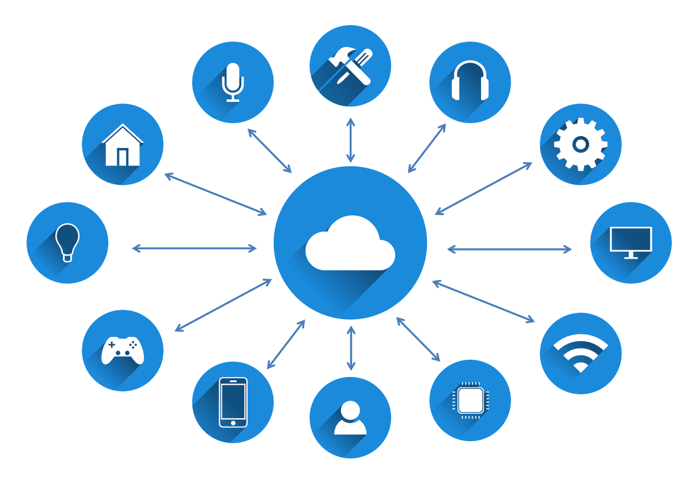
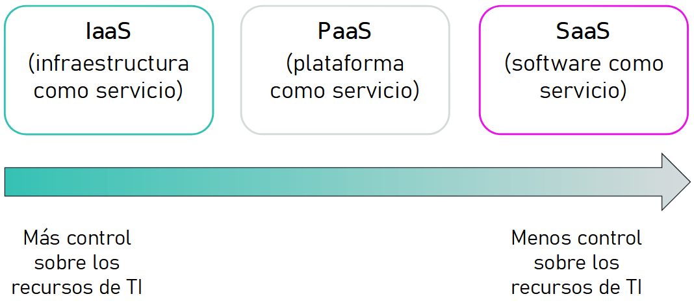
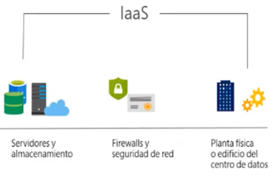
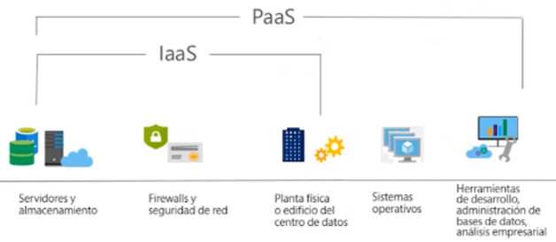
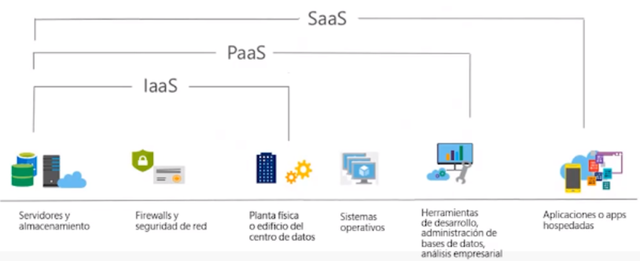
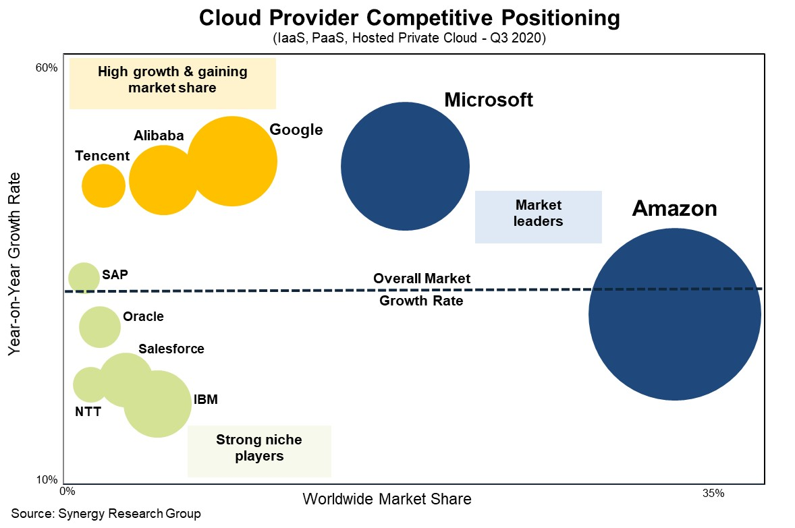
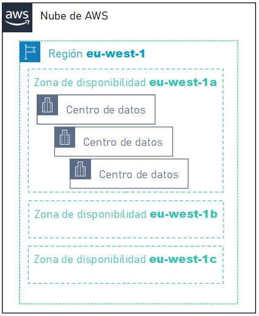
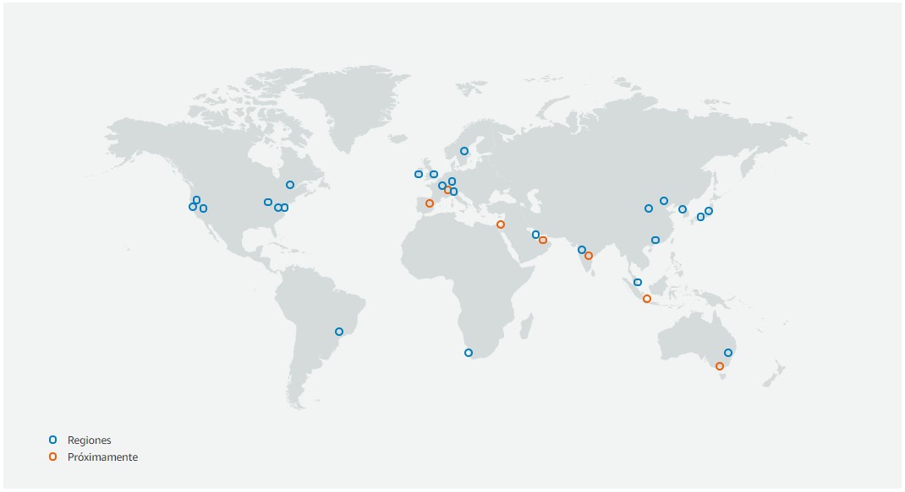

# Cloud Computing

## La Nube

Ya hemos visto que la industria 4.0 incluye el Big Data y la computación en la nube como uno de los elementos principales de su transformación.

El *Cloud Computing* permite obtener servicios de computación a través de internet que hace que sólo se pague por los recursos que usa y en el momento en que los necesita. Dicho de otro modo, es la entrega bajo demanda de potencia de cómputo, bases de datos, almacenamiento, aplicaciones y otros recursos informáticos, a través de Internet con un sistema de precios de pago por uso.

Los modelos productivos basados en la adquisición de hardware de manera propietaria ha quedado atrás, al implicar un proceso largo y costoso de compra de licencias, recursos físicos como oficinas y equipamiento y recursos humanos (tanto técnicos como de seguridad) para su implantación, gestión y mantenimiento.

Así pues, plantea un cambio de perspectiva. La infraestructura se deja de considerar hardware para verla (y usarla) como software.

{ align=center && width=500px }

### Ventajas

Así pues, los beneficios que ofrece la nube son:

* *Alta disponibilidad*, dada su naturaleza de recursos distribuidos.
* *Escalabilidad*: Si un usuario necesita más o menos capacidad de proceso o de almacenamiento, el proveedor se lo facilitará prácticamente en tiempo real.
* *Tolerancia a fallos*, ya que ofrecen una arquitectura de respaldo de copias de seguridad y a prueba de ataques.
* *Elasticidad*: de la misma manera que podemos escalar, podemos reducir los requisitos y buscar soluciones más económicas.
* *Alcance global*: cualquier usuario autorizado puede acceder o actualizar información desde cualquier lugar del mundo, en cualquier momento y mediante cualquier dispositivo.
* *Agilidad*: Permite amoldar los recursos al crecimiento de la empresa/proyecto.
* *Capacidades de latencia del cliente*, pudiendo elegir cómo de cerca se despliegan las aplicaciones.
* *Cálculo de costes de manera predictiva*, siguiendo un modelo basado en el consumo. Sólo se paga por los recursos que se utilizan, para ello se proporciona el precio de cada recurso por hora.

Una de las ventajas más interesante para las empresas puede que sea la reducción de los costes, ya que no necesitamos instalar ningún tipo de hardware ni software, ni pagar por las actualizaciones futuras en términos de ese hardware y software que ya no vamos a necesitar o que se ha quedado corto para nuestras necesidades.

En relación con los costes, es conveniente aclarar dos conceptos relacionados con la contabilidad y las finanzas: CapEx y OpEx.

### CapEx vs OpEx

Hay dos tipos diferentes de gastos que se deben tener en cuenta:

* La inversión de capital (**CapEx**) hace referencia a la inversión previa de dinero en infraestructura física, que se podrá deducir a lo largo del tiempo. El coste previo de CapEx tiene un valor que disminuye con el tiempo.
* Los gastos operativos (**OpEx**) son dinero que se invierte en servicios o productos y se factura al instante. Este gasto se puede deducir el mismo año que se produce. No hay ningún costo previo, ya que se paga por un servicio o producto a medida que se usa.

Así pues, si nuestra empresa es dueña de su infraestructura, comprará equipos que se incluirán como recursos en su balance de cuentas. Dado que se ha realizado una inversión de capital, los contables clasifican esta transacción como CapEx. Con el tiempo, a fin de contabilizar la duración útil limitada de los activos, estos se deprecian o se amortizan.

Los servicios en la nube, por otro lado, se clasifican como OpEx debido a su modelo de consumo. Si nuestra empresa utiliza la nube, no tiene ningún recurso que pueda amortizar, y su proveedor de servicios en la nube (AWS / Azure) administra los costos asociados con la compra y la vida útil del equipo físico. En consecuencia, los gastos de explotación tienen un impacto directo en el beneficio neto, la base imponible y los gastos asociados en el balance contable.

En resumen, CapEx requiere unos costes financieros previos considerables, así como unos gastos continuos de mantenimiento y soporte técnico. En cambio, OpEx es un modelo basado en el consumo, y los gastos se deducen en el mismo año.

Así pues, la informática en la nube es un modelo basado en el consumo, lo que significa que los usuarios finales solo pagan por los recursos que usan. Lo que usan es lo que pagan.

Volviendo a las ventajas, los modelos basados en el consumo y OpEx aportan una serie de ventajas:

* Sin costes por adelantado.
* No es necesario comprar ni administrar infraestructuras costosas que es posible que los usuarios no aprovechen del todo.
* Se puede pagar para obtener recursos adicionales cuando se necesiten.
* Se puede dejar de pagar por los recursos que ya no se necesiten.

### Coste total de propiedad

El coste total de propiedad (CTO) es la estimación financiera que ayuda a identificar los costes directos e indirectos de un sistema. Permite comparar el coste de ejecutar una infraestructura completa o una carga de trabajo específica en las instalaciones del cliente frente a hacerlo en la nube.

Los elementos a considerar sobre el coste total de propiedad son:

Cuando migramos a una solución en la nube, por ejemplo AWS, los únicos costes que deberemos pagar son:

* Costes de computación (procesador, memoría): se factura por horas o por segundos (sólo máquinas Linux)
* Costes de almacenamiento: se factura por GB
* Costes de transferencia de datos: se factura por GB de salida (excepto casos excepcionales, los datos de entrada no se facturan)

Así pues, es necesario presupuestar y desarrollar casos de negocio para migrar a la nube y ver si son viables para nuestra organización. Para ello, podemos utilizar la calculadora de costes que ofrecen las plataformas cloud:

* AWS: <https://calculator.aws> y en concreto en <https://calculator.s3.amazonaws.com/index.html>
* Azure: <https://azure.microsoft.com/es-es/pricing/tco/calculator/>
* Google Cloud: <https://cloud.google.com/products/calculator?hl=es>

Estas calculadoras permiten:

* Calcular los costes mensuales.
* Identificar oportunidades para reducir los costes mensuales.
* Utilizar plantillas para comparar servicios y modelos de implementación.

## Servicios en la nube

Los servicios en la nube son servicios que se utilizan a través de Internet, eliminando las limitaciones de nuestros equipos. Su principal ventaja es que su CapEx es 0, no necesita ningún tipo de inversión inicial ni contrato a largo plazo.

{ width=600px }

!!! todo
    REVISAR
    Definición y diferencias. Apuntes Azure
    <https://www.ibm.com/es-es/cloud/learn/cloud-computing-gbl>
    <https://docs.microsoft.com/es-es/learn/modules/fundamental-azure-concepts/categories-of-cloud-services>

### IaaS

{ align=right && width=300px }

La infraestructura como servicio (*Infraestructure as a Service*) proporciona a las empresas recursos informáticos, incluyendo servidores, máquinas virtuales, redes, almacenamiento y espacio en centro de datos con pago en función del uso.

Los elementos que forman parte de IaaS son:

* Servidores y almacenamiento.
* Firewall y seguridad en red.
* Planta física o edificio del centro de datos.

Se contrata el hardware y el cliente es el responsable de la instalación y mantenimiento del software que corre en dichas máquinas, así como configurar la red, el almacenamiento y el control de acceso. Configurar una máquina virtual nueva es considerablemente más rápido que adquirir, instalar y configurar un servidor físico.

### PaaS

{ align=right && width=300px }

La plataforma como servicio (*Platform as a Service*) proporciona un entorno basado en cloud con todos los requisitos necesarios para dar soporte a todo el ciclo de vida de creación y puesta en marcha de aplicaciones basadas en web (cloud), sin el coste y la complejidad de comprar y gestionar el hardware, software, aprovisionamiento y alojamiento necesario.

Los elementos que forman parte de PaaS son todos los de IaaS más:

* Sistema operativo
* Herramientas de desarrollo, administración de bases de datos, análisis empresarial, etc...

Este enfoque acelera el desarrollo y la comercialización de aplicaciones, ya que desplegar una nueva aplicación es cuestión de minutos.

El cliente no necesita administrar la infraestructura subyacente. El provedor *cloud* gestiona el sistema operativo, la implementación de parches a la base de datos, la configuración del firewall y la recuperación de desastres. De esta manera, el cliente puede centrarse en la administración de código o datos.

### SaaS

Finalmente, las aplicaciones basadas en cloud, o software como servicio (*Sofware as a Service*), se ejecutan en sistemas en la nube que no tienen porque residir en la misma máquina ni en la misma red. Estos servicios pertenecen y los administran otras empresas a las cuales el cliente se conecta a través de Internet y, por lo general, de un navegador web.

Así pues, podemos considerar SaaS como aplicaciones hospedadas y utilizables dentro de un PaaS.

{ width=600px }

Respecto al usuario, cuenta con una licencia según un modelo de suscripción o de pago por uso y no necesitan administrar la infraestructura que respalda el servicio. Por ello, SaaS permite iniciar sesión y empezar rápidamente a utilizar las aplicaciones desde el minuto 0. 

Si el sistema fallase, no se pierden datos, ya que al estar en el cloud hay copias de seguridad continuas y al ser tolerante a fallos y elástico, el servicio permite escalar dinámicamente en función de las necesidades de uso.

!!! info "¿Qué es la informática sin servidor / *Serverless computing*?"
    Igual que PaaS, la informática sin servidor permite que los desarrolladores creen aplicaciones más rápidamente, ya que elimina la necesidad de administrar la infraestructura. En las aplicaciones sin servidor, el proveedor de servicios en la nube aprovisiona, escala y administra automáticamente la infraestructura necesaria para ejecutar el código. Las arquitecturas sin servidor son muy escalables y **controladas por eventos**, y solo usan recursos cuando se produce una función o un desencadenador concretos.

    Es importante tener en cuenta que los servidores siguen ejecutando el código. El término "sin servidor" procede del hecho de que las tareas asociadas a la administración y el aprovisionamiento de la infraestructura son invisibles para el desarrollador. Este enfoque permite a los desarrolladores centrar su atención en la lógica de negocio y ofrecer más valor al núcleo de la empresa.

## Tipos de arquitectura según la infraestructura

### Arquitecturas *on premise*

También conocido como *in-house* es la arquitectura clásica, en la que la empresa adquiere el hardware por adelantado. De esta manera, las empresas tienen el control total sobre los recursos y la seguridad, pero también la responsabilidad respecto a su mantenimiento y actualización del hardware.

### Arquitecturas *cloud*

Son aquellas donde los recursos se virtualizan y no son propiedad de la empresa, sino que se pueden aprovisionar y quitar bajo las necesidades de cada momento. Sólo se paga por lo que se consume.

A su vez, podemos distinguirlas entre:

* **Nube pública**: los recursos virtualizados se comparten de forma pública y entre varios clientes a la vez, permitiendo el acceso via internet.

    Los clouds públicos pertenecen y son administrados por proveedores que ofrecen a través de una red pública acceso rápido a recursos informáticos asequibles. 

* **Nube privada**: los recursos virtualizados son privados, mediante un cluster dedicado para el cliente, normalmente mediante una conexión privada, ya sea de propia fibra o VPN. Este tipo de nube lo utiliza únicamente una única organización, ya sea gestionada internamente o por terceros y alojada internamente o externamente.

### Arquitecturas híbridas

Brindan gran flexibilidad, ya que las empresas deciden donde se ejecutan sus aplicaciones, ya sea en su infraestructura in-house o con servicios cloud. De esta manera, controlan la seguridad y el cumplimiento o requisitos legales de sus aplicaciones.

Un cloud híbrido utiliza una base de cloud privado, combinada con la integración estratégica y el uso de servicios cloud público.

En realidad, un cloud privado no puede existir aislado del resto de los recursos de TI de una empresa ni del cloud público. La mayoría de las empresas con clouds privados evolucionarán para gestionar cargas de trabajo en todos los centros de datos (privados y públicos) creando así clouds híbridos.

Aspectos clave de cloud híbrido:

* Permite que todas las empresas mantengan las aplicaciones críticas y los datos confidenciales en un entorno de centro de datos tradicional o en un cloud privado
* Permite beneficiarse de los recursos de cloud público como SaaS, para obtener las aplicaciones más recientes y la infraestructura IaaS para obtener recursos virtuales de forma flexible
* Facilita la portabilidad de datos, aplicaciones y servicios y otras opciones de modelos de despliegue

## Plataformas Cloud

En la actualidad existen multitud de proveedores que ofrecen servicios en la nube clasificados de acuerdo al modelo de servicio. A continuación nombramos los más conocidos y más utilizados.

Los proveedores cloud de nube pública más importantes son:

* Amazon, con *Amazon Web Services*: Amazon fue el primer proveedor cloud, pionero y con mayor crecimiento. AWS proporciona una plataforma confiable en la nube que utilizan miles de empresa en todo el mundo.
* Microsoft, con *Azure*: Ha realizado una fuerte inversión en los últimos años y es la plataforma cloud con mayor crecimiento. Ofrece servicios en las tres capas, no sólo en IaaS, sino también PaaS y SaaS.
* Google, con *Google Cloud*: Google también es un proveedor de nube pública  mediante su plataforma *Google Cloud Platform (GCP)*. Le costó entrar en este área, pero en los últimos años ha crecido mucho y actualmente es ampliamente utilizada por grandes compañías.

En el caso de nube privada, destacar a *OpenStack*. Se trata de un proyecto de software de infraestructura de computación en la nube, es de código abierto y es uno de los proyectos open source más activos del mundo.

Si entramos a ejemplos concretos para cada tipo de servicio en la nube tenemos:

| Tipo de Servicio  | Proveedor             | Descripción   |
| ------            | -----                         | -----         |
| IaaS              | AWS EC2              | Máquinas virtuales en Amazon, con procesdor, memoria y almacenamiento a medida
|                   | Azure y sus máquina virtuales | Igual pero en Azure
|                   | Google Cloud Platform         | Igual pero en Google
| PaaS              | AWS RDS, AWS Lambda           | Base de datos, funciones serverless
|                   | Google App Engine             |
|                   | Red Hat OpenShift             |
|                   | Heroku                        | Plataforma que permite el despliegue de aplicaciones en la nube
| SaaS              | Microsoft Office 365          | Paquete ofimático de Microsoftw en la nube
|                   | Aplicaciones web de Google    | Correo electrónico, calendario, fotos
|                   | Trello, Notion, GitHub        | Tableros Kanban, gestión de tareas, repositorio de código fuente

!!! tip "Herramientas DevOps relacionadas"
    Aunque se salen del ámbito del curso de IABD, es conveniente conocer algunas herramientas asociadas a perfiles DevOps   como:

    * **Terraform** (<https://www.terraform.io/>): Facilita la definición, aprovisionamiento y orquestación de servicios mediante un lenguaje declarativo.
    * **Ansible** (<https://www.ansible.com/>): Permite centralizar la configuración de numerosos servidores, dispositivos de red y proveedores *cloud* de una forma sencilla y automatizada.
    * **Docker** (<https://www.docker.com/>): Permite la creación de contenedores a modo de máquinas virtuales ligeras, donde se instalan los servicios/recursos necesairos.
    * **Kubernetes (K8s)** (<https://kubernetes.io/es/>): Orquesta los contenedores para facilitar el despliegue, la supervisión de servicios, el reemplazo, el escalado automático y la administración de los servicios. Facilita la portabilidad de contenedores a la nube.

En Octubre de 2020, el informe de Synergy [Cloud Market Growth Rate Nudges Up as Amazon and Microsoft Solidify Leadership](<https://www.srgresearch.com/articles/cloud-market-growth-rate-nudges-amazon-and-microsoft-solidify-leadership) permite observar el predominio de Amazon seguido del crecimiento de la plataforma Azure:

## Infraestructura cloud

Las diferentes plataformas cloud ofrecen una infraestructura dividida en regiones y zonas.

### Regiones y Zonas de disponibilidad

A lo largo de todo el globo terráqueo, se han construido grandes centros de datos que se conocen como *regiones*. Estas regiones son zonas geográficas, y dentro de cada una de ellas hay diferentes grupo de centros de datos lógicos que se conocen como *zonas de disponibilidad* (AZ - *Availability Zone*). Normalmente cada región contiene 3 o más zonas de disponibilidad.

{ align=right && width=400px }

Dicho de otro modo, cada región consta de varias zonas de disponibilidad aisladas y separadas físicamente dentro de un área geográfica. Cada zona de disponibilidad tiene alimentación, refrigeración y seguridad física independientes y está conectada a través de redes redundantes de latencia ultrabaja.

Si seguimos desgranando, cada zona de disponibilidad contiene al menos 3 centros de datos, y cada centro de datos suele albergar entre 50.000 y 80.000 servidor físicos. Si hacemos cálculos podemos ver que una región puede incluir varios cientos de miles de servidores.

Las zonas de disponibilidad permiten que los clientes trabajen con  bases de datos y aplicaciones de producción con un nivel de disponibilidad, tolerancia a errores y escalabilidad mayor que el que ofrecería un centro de datos único.

!!! tip "Tolerancia a fallos"
    La solución ideal es replicar los datos y la aplicación en varias zonas de disponibilidad de una región, y posteriormente, replicarlos a su vez entre diferentes regiones.

    Las AZ están físicamente separadas entre sí por una distancia significativa de muchos kilómetros, aunque todas están dentro de un rango de 100 km de separación.

    La replicación de datos entre regiones y zonas de disponibilidad es responsabilidad del cliente.

La infraestructura global de AWS se compone de regiones y zonas de disponibilidad.
La elección de una región se basa normalmente en los requisitos de conformidad o en la intención de reducir la latencia.
Cada zona de disponibilidad está separada físicamente de las demás y posee alimentación, redes y conectividad redundantes.

### Ubicaciones de borde

Las ubicaciones de borde y las cachés de borde regionales mejoran el rendimiento almacenando en caché el contenido más cerca de los usuarios.

Se trata de CDN (*Content Delivery Network*) que se utiliza para distribuir el contenido (datos, vídeos, aplicaciones y API) a los usuarios finales cuyo objetivo es reducir la latencia al mínimo. Para ello, despliega más de 225 puntos de presencia (más de 215 ubicaciones de borde y 13 cachés de nivel medio regional), a través de 90 ciudades en 47 paises.

++++

Utiliza Amazon Route 53, el cual es un DNS interno que redirige el tráfico a los nodos Cloudfront.

Más información en <https://aws.amazon.com/es/cloudfront/>.

### Despliegue

Por ejemplo, en el siguiente gráfico podemos ver las 25 regiones que tiene AWS que incluyen 81 zonas de disponibilidad (se puede observar como la región en España está en proceso de implantación):

Podéis consultar el mapa interactivo de:

* AWS en <https://aws.amazon.com/es/about-aws/global-infrastructure/> (y las regiones en <https://aws.amazon.com/es/about-aws/global-infrastructure/regions_az/>)
* Azure en <https://infrastructuremap.microsoft.com/explore>.
* Google Cloud en <https://cloud.google.com/about/locations#regions>

## Seguridad

Responsabilidad compartida - Azure

## Actividades

1. A lo largo de este bloque, vamos a trabajar con AWS como plataforma Cloud. Para ello, es necesario activar una cuenta educativa. En breve, recibiréis un email para daros de alta y poder realizar las actividades. Así pues, esta actividad consiste en la creación de la cuenta de AWS y la realización del módulo 0 (Introducción al curso).

2. Realizar los módulos 1 (Información general sobre los conceptos de la nube) y 2 (Facturación y economía de la nube) del curso [ACF de AWS](https://awsacademy.instructure.com/courses/2243/).

3. ¿calculadora de costes?

## Referencias

* [Azure Fundamentals AZ-900 FAQ](https://github.com/davidcervigonluna/AZ-900FAQ)
* [Google Cloud vs AWS en 2021](https://kinsta.com/es/blog/google-cloud-vs-aws/)

<https://openwebinars.net/blog/tipos-de-cloud-computing/>