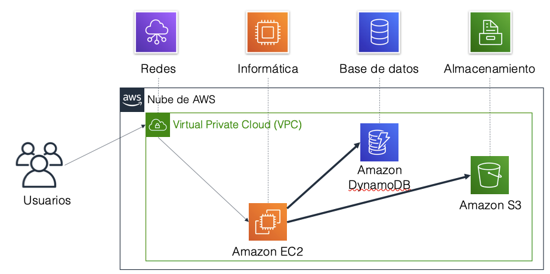
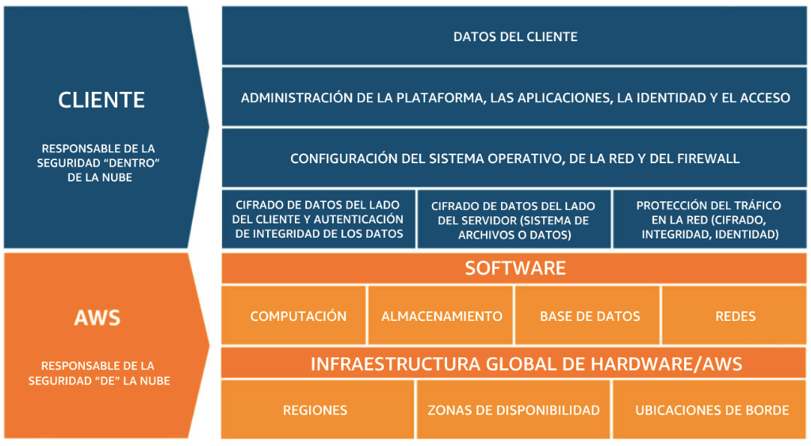

# Amazon Web Services

*Amazon Web Services* ofrece un conjunto de servicios que funcionan a modo de piezas de un puzzle, de manera que uniendo unos con otros podemos diseñar la arquitectura necesaria para nuestras aplicaciones.

## Servicios

Los servicios de AWS se clasifican en categorías:


A continuación vamos a comentar las categorías más importantes junto a algunos de sus servicios más destacados:

### Almacenamiento

Los servicios que ofrece AWS para gestionar el almacenamiento de datos son:

* *Amazon Simple Storage Service* (**Amazon S3**): servicio de almacenamiento de objetos que ofrece escalabilidad, disponibilidad de datos, seguridad y rendimiento. Se utiliza para almacenar y proteger cualquier cantidad de datos para sitios web, aplicaciones móviles, copias de seguridad y restauración, archivado, aplicaciones empresariales, dispositivos de Internet de las cosas (IoT) y análisis de bigdata.
* *Amazon Elastic Block Store* (**Amazon EBS**): almacenamiento en bloque de alto rendimiento diseñado para utilizarse con Amazon EC2 para cargas de trabajo que hacen un uso intensivo de transacciones y de rendimiento. Se utiliza para una amplia gama de cargas de trabajo, como bases de datos relacionales y no relacionales, aplicaciones empresariales, aplicaciones en contenedores, motores de análisis de bigdata, sistemas de archivos y flujos de trabajo multimedia
* *Amazon Elastic File System* (**Amazon EFS**): proporciona un sistema de archivos de Network File System(NFS) elástico escalable y completamente administrado para su uso con los servicios en la nube de AWS y los recursos en las instalaciones. Está diseñado para escalar a petabytes bajo demanda, y aumenta y reduce su tamaño automáticamente a medida que se agregan y se eliminan archivos. Reduce la necesidad de aprovisionar y administrar capacidad para admitir el crecimiento
* *Amazon Simple Storage Service Glacier* (**Amazon S3 Glacier**): es un tipo de almacenamiento en la nube de Amazon S3 seguro, duradero y de muy bajo costo para archivar datos y realizar copias de seguridad a largo plazo. Está diseñado para ofrecer una durabilidad del 99,999999999% y proporcionar capacidades integrales de seguridad y conformidad que permiten cumplir requisitos normativos estrictos

Estos servicios los veremos en mayor profundidad en la sesión [5.- Almacenamiento en AWS](nube04almacenamiento.md).

### Informática / Computación

Los servicios que ofrece AWS relativos a la informática o computación son:

* *Amazon Elastic Compute Cloud* (**Amazon EC2**): proporciona capacidad informática de tamaño ajustable en forma de máquinas virtuales en la nube
* *Amazon EC2 Auto Scaling*: permite agregar o eliminar automáticamente instancias EC2 de acuerdo con las condiciones que defina.
* *Amazon Elastic Container Service* (**Amazon ECS**): servicio de organización de contenedores altamente escalable y de gran rendimiento, compatible con los contenedores Docker.
* *Amazon EC2 Container Registry* (**Amazon ECR**): registro de contenedores *Docker* completamente administrado que facilita las tareas de mantenimiento, administración e implementación de imágenes de contenedores *Docker*.
* ***Amazon Elastic Beanstalk***: servicio para implementar y escalar aplicaciones y servicios web en servicios web conocidos, como Apache o IIS.
* ***AWS Lambda***: permite ejecutar código sin necesidad de aprovisionar ni administrador servidores. Sólo se paga por el tiempo de computación (cuando el código no se ejecuta, no se paga nada)
* *Amazon Elastic Kubernetes Service* (**Amazon EKS**): facilita la implementación, administración y el escalado de aplicaciones en contenedores que utilizan Kubernetes en AWS.
* ***Amazon Fargate***: motor informático para ECS que permite ejecutar contenedores sin tener que administrar servidores ni clústeres.

Estos servicios los veremos en mayor profundidad en la sesión [4.- Computación en AWS](nube03computacion.md).

### Bases de Datos

Los servicios que ofrece AWS para gestionar los datos son:

* *Amazon Relational Database Service* (**Amazon RDS**): facilita las tareas de configuración, operación y escalado de una base de datos relacional en la nube. El servicio ofrece capacidad de tamaño ajustable al mismo tiempo que automatiza tareas administrativas que demandan mucho tiempo, como el aprovisionamiento de hardware, la configuración de bases de datos, la implementación de parches y la creación de copias de seguridad
* **Amazon Aurora**: es una base de datos relacional compatible con MySQL/MariaDB y PostgreSQL. Amazon vende que es hasta cinco veces más rápida que las bases de datos MySQL estándar y tres veces más rápida que las bases de datos PostgreSQL estándar.
* **Amazon Redshift**: es un servicio de *datawarehouse* que permite ejecutar consultas analíticas de petabytes de datos almacenados localmente en Amazon Redshift, además de ejecutar consultas analíticas de exabytes de datos almacenados en Amazon S3 de forma directa. Ofrece un rendimiento rápido a cualquier escala.
* **Amazon DynamoDB**: es una base de datos de documentos y clave-valor que ofrece un rendimiento de milisegundos de un solo dígito a cualquier escala, con seguridad integrada, copias de seguridad y restauración, y almacenamiento en caché en memoria.

Estos servicios los veremos en mayor profundidad en la sesión [6.- Datos en AWS](nube05datos.md).

### Redes

Los servicios que ofrece AWS para gestionar las redes son:

* *Amazon Virtual Private Cloud* (**Amazon VPC**): permite aprovisionar secciones aisladas de forma lógica de la nube de AWS.
* *Elastic Load Balancing*: distribuye automáticamente el tráfico entrante de las aplicaciones en varios destinos, tales como instancias de Amazon EC2, contenedores, direcciones IP y funciones Lambda.
* ***Amazon CloudFront***: servicio rápido de red de entrega de contenido (CDN) que suministra datos, videos, aplicaciones e interfaces de programación de aplicaciones (API) de manera segura a clientes de todo el mundo, con baja latencia y altas velocidades de transferencia.
* ***AWS Transit Gateway***: servicio que permite a los clientes conectar sus nubes privadas virtuales de Amazon (VPC) y sus redes en las instalaciones (*in-house*) a una única gateway.
* ***Amazon Route 53***: servicio web de DNS escalable y en la nube diseñado para direccionar a los usuarios finales a las aplicaciones de Internet de una forma confiable.
* ***AWS Direct Connect***: ofrece una manera de establecer una conexión de red privada dedicada desde un centro de datos u oficina a AWS, lo que puede reducir los costes de red y aumentar el rendimiento del ancho de banda.
* ***AWS VPN***: proporciona un túnel privado seguro desde una red o dispositivo a la red global de AWS.

### Seguridad en AWS

Los servicios que ofrece AWS para gestionar la seguridad, identidad y conformidad son:

* *AWS Identity and Access Management* (**IAM**): le permite administrar el acceso a los recursos y servicios de AWS de manera segura. Con IAM, puede crear y administrar usuarios y grupos de AWS. Puede utilizar los permisos de IAM para permitir y denegar el acceso de usuarios y grupos a los recursos de AWS.
* ***AWS Organizations***: permite restringir los servicios y acciones que se permiten en sus cuentas.Amazon Cognito le permite incorporar control de acceso, inscripción e inicio de sesión de usuarios a sus aplicaciones web y móviles.
* *AWS Artifact* proporciona acceso bajo demanda a los informes de seguridad y conformidad de AWS y a los acuerdos en línea selectos.
* *AWS Key Management Service* (**AWS KMS**): permite crear y administrar claves. Puede utilizar AWS KMS para controlar el uso del cifrado en una amplia gama de servicios de AWS y en sus aplicaciones.
* ***AWS Shield***: es un servicio administrado de protección contra ataques de denegación de servicio distribuidos (DDoS) que protege las aplicaciones que se ejecutan en AWS.

### Servicios de administración de costes

Los servicios que ofrece AWS para administrar los costes son:

* *Informe de uso y coste de AWS* contiene el conjunto más completo de datos de uso y costo de AWS disponibles e incluye metadatos adicionales sobre los servicios, los precios y las reservas de AWS.
* *Presupuestos de AWS* le permite definitir presupuestos personalizados que generarán una alerta cuando los costos o el uso superen, o se prevé que superen, el importe presupuestado.
* *AWS Cost Explorer* cuenta con una interfaz sencilla que permite visualizar, comprender y administrar los costos y el uso de AWS a lo largo del tiempo.Formación y certificación de AWS

### Administración y gobernanza de datos

La consola de administración de AWS proporciona una interfaz de usuario basada en la web que permite obtener acceso a su cuenta de AWS.

Los servicios que ofrece AWS para administrar y gobernar los datos son:

* ***AWS Config***: proporciona un servicio que lo ayuda a realizar un seguimiento del inventario de recursos y sus cambios.
* ***AWS CloudTrail***: realiza un seguimiento de la actividad de los usuarios y del uso de la API. Esto significa que cada vez que alguien carga datos, ejecuta código, crea una instancia EC2, cambia un tipo de unidad S3 o cualquier otra acción que se pueda realizar en AWS, *CloudTrail* lo registrará. Esto resulta muy útil por razones de seguridad para que los administradores puedan saber quién está utilizando su cuenta y qué están haciendo. Si algo sale mal o si surge un problema de seguridad, *CloudTrail* será la mejor prueba para averiguar lo ocurrido.
* ***Amazon CloudWatch***: permite monitorear recursos y aplicaciones. Si *CloudTrail* monitorea personas, *CloudWatch* monitorea servicios. CloudWatch es perfecto para asegurar de que sus servicios en la nube funcionan sin problemas y no utilizan más o menos recursos de los esperados, lo que es importante para el seguimiento del presupuesto. *CloudWatch* es excelente para asegurarse de que todos los recursos están funcionando, lo que puede resultar complicado si una gran empresa utiliza cientos de máquinas y unidades diferentes. Para ello, se puedese pueden configurar alertas para que se lancen cuando una métrica alcanza un límite específico.
* ***AWS Auto Scaling***: ofrece características que permiten escalar varios recursos para satisfacer la demanda.
* *Interfaz de línea de comandos de AWS* (**AWS CLI**) proporciona una herramienta unificada para administrar los servicios de AWS.
* ***AWS TrustedAdvisor***: lo ayuda a optimizar el rendimiento y la seguridad.
* ***AWS Well-Architected Tool***: ayuda a revisar y mejorar sus cargas de trabajo.

Por ejemplo, haciendo usos de esos servicios se puede mostrar una solución sencilla:



## Redes en AWS

TODO: REVISAR

Suponemos que los conceptos de red, subred y dirección IP y el modelo de la OSI están claros.

Dentro de AWS se utiliza el método CIDR para describir redes, por ejemplo, `192.0.2.0/24` (los primeros 24 bits son estáticos, y los últimos 8 flexibles).

Muchos de los conceptos de redes físicas son validos para las redes *cloud*, en la nube nos ahorraremos gran parte de la complejidad.

### Amazon VPC

Amazon Virtual Private Cloud

Explicar VPC, tablas de enrutamiento, gateway y NAT gateway

Siempre hay una VPC predeterminada.

Muchas de las configuraciones se pueden realizar mediante el asistente de VPC Wizard, la cual facilita la creación de arquitecturas de red válidas para soluciones cloud e híbridas.

Amazon Virtual Private Cloud (Amazon VPC) le permite lanzar recursos de Amazon Web Services (AWS) en la red virtual que usted defina. Esta red virtual se asemeja en gran medida a una red tradicional que ejecutaría en su propio centro de datos, con los beneficios de utilizar la infraestructura escalable de AWS. Puede crear una VPC que abarque varias zonas de disponibilidad.

Una gateway de Internet (IGW) es un componente de la VPC que permite la comunicación entre instancias de la VPC e Internet.

NAT gateway.

Después de crear una VPC, puede agregar subredes. Cada subred está ubicada por completo dentro de una zona de disponibilidad y no puede abarcar otras zonas. Si el tráfico de una subred se direcciona a una gateway de Internet, la subred recibe el nombre de subred pública. Si una subred no dispone de una ruta a la gateway de Internet, recibe el nombre de subred privada.

El asistente también creará una Gateway NAT, que se utiliza para proporcionar conectividad a Internet a instancias EC2 en las subredes privadas.

Ahora, configurará las subredes privadas para dirigir el tráfico orientado hacia Internet a la gateway NAT a fin de que los recursos de la subred privada puedan conectarse a Internet, a la vez que mantienen los recursos privados. Esto se realiza mediante la configuración de una tabla de enrutamiento.

Una tabla de enrutamiento contiene un conjunto de reglas llamadas rutas que se utilizan para determinar el destino del tráfico de red. Cada subred de una VPC debe estar asociada a una tabla de enrutamiento, que es la que controla el direccionamiento de la subred. Las reglas de las tablas de enrutamiento se coocan de más a menos restrictivas.

creará un grupo de seguridad de VPC, que actúa como un firewall virtual. Cuando se lanza una instancia, se asocia uno o varios grupos de seguridad a ella. Puede agregar reglas a cada grupo de seguridad que permitan el tráfico hacia las instancias asociadas o desde ellas.

Un párrafo de Route 53 (DNS)
Un párrafo de Cloudfront (CDN)

<https://www.josemariagonzalez.es/amazon-web-services-aws/todo-lo-que-deberias-saber-sobre-las-redes-virtuales-en-amazon-aws.html>

## Seguridad en la Nube

La capacidad de proteger la integridad y la confidencialidad de los datos es esencial. Un agujero de seguridad puede tirar a la basura todo nuestro trabajo y hacer perder a la empresa el prestigio y muchísimo dinero.

### Modelo de responsabilidad compartida de AWS

La seguridad es una característica que tien una responsabilidad compartida entre AWS y el cliente. Este modelo de responsabilidad compartida está diseñado para minimizar la carga operativa del cliente, pero aún así sigue siendo responsable de algunos aspectos de la seguridad general.



#### Responsabilidad de AWS

AWS es responsable de proteger la infraestructura en la que se ejecutan todos los servicios ofrecidos *por* la nube de AWS (en algunas preguntas de la certificación se refieren a ellos por servicios *de* la nube):

* **Seguridad física de los centros de datos** con acceso controlado basado en las necesidades en instalaciones sin identificación, con guardias de seguridad permanentes, autenticación de dos factores, revisión y registro de accesos, videovigilancia, y destrucción y desmagnetización de discos.
* **Infraestructura de hardware**, como servidores, dispositivos de almacenamiento y otros dispositivos de los que dependen los servicios de AWS.
* **Infraestructura de software**,que aloja sistemas operativos, aplicaciones de servicios y software de virtualización.
* **Infraestructura de red**, como routers, conmutadores, balanceadores de carga, firewalls y cables. AWS también monitorea la red en límites externos, protege los puntos de acceso y proporciona infraestructura redundante con detección de intrusiones de forma constante

#### Responsabilidad del cliente

El cliente es responsable del cifrado de los datos en reposo y los datos en tránsito, de todo lo que se pone *en* la nube. Los pasos de seguridad que debe tomar dependerán de los servicios que utilice y de la complejidad del sistema.

Si entramos en más detalle, es responsable de:

* **El sistema operativo** de la instancia de *Amazon EC2*: incluidas las actualizaciones, los parches de seguridad y su mantenimiento.
* La protección de las **aplicaciones** que se lanzan en los recursos AWS: contraseñas, acceso basado en roles, etc.
* Configuración del **grupo de seguridad**.
* SO o firewalls basados en host: incluidos los sistemas de detección o prevención de intrusiones.
* **Configuraciones de red**.
* **Administración de cuentas**: Configuración de inicio de sesión y credenciales para cada usuario.

Respecto al contenido crítico, el cliente es responsable de administrar:

* El contenido que eligen almacenar en AWS.
* Los servicios de AWS que se utilizan con el contenido.
* En qué país se almacena ese contenido.
* El formato y la estructura de ese contenido y si está enmascarado, cifrado o es anónimo.
* Quién tiene acceso a ese contenido y cómo se conceden, administran y revocan esos derechos de acceso.

### AWS IAM

*AWS Identity and Access Management* (IAM) permite administrar el acceso a los recursos de AWS (de informática, almacenamiento, base de datos, ...).

IAM se puede utilizar para gestionar la autenticación y para especificar y aplicar políticas de autorización para especificar qué usuarios pueden obtener acceso a cada servicio. Es decir, permite definir quién, a qué y cómo se accede a los recursos AWS.

Los principales componentes son:

* **Usuario**: persona o aplicación que se puede autenticar en AWS. Cada usuario debe tener un nombre único (sin espacios en el nombre) dentro de la cuenta de AWS y un conjunto de credenciales de seguridad que no se comparte con otros usuarios. Estas credenciales son diferentes de las credenciales de seguridad de usuario raíz de la cuenta de AWS. Cada usuario está definido en una única cuenta de AWS.
* **Grupo**: conjunto de usuarios de IAM, a los que se les concede una autorización idéntica. Así pues, permite asociar las mismas políticas a varios usuarios de una manera sencilla. Hay que tener en cuenta que:
    * Un grupo puede contener muchos usuarios y un usuario puede pertenecer a varios grupos.
    * Un grupo solo puede contener usuarios y, a su vez, un grupo no puede contener otros grupos.
    * No hay ningún grupo predeterminado que incluya automáticamente a todos los usuarios de la cuenta de AWS.
* **Política de IAM**: documento que define permisos para determinar lo que los usuarios pueden hacer en la cuenta de AWS. Una política normalmente concede acceso a recursos determinados y especifica lo que el usuario puede hacer con esos recursos, aunque también pueden denegar explícitamente el acceso.
* **Rol**: herramienta para conceder acceso temporal a recursos de AWS específicos de una cuenta de AWS. Un rol de IAM puede tener asociadas políticas de permisos y se puede utilizar para delegar acceso temporal a usuarios o aplicaciones. Dicho de otro modo, un rol de IAM es similar a un usuario, ya que es una identidad de AWS con políticas de permisos que establecen qué puede hacer o no la identidad en AWS. Sin embargo, en lugar de estar asociada únicamente a una persona, el objetivo es que pueda asignarse un rol a cualquier persona que lo necesite.  
También es conveniente destacar que cuando se asume un rol, se proporcionan credenciales de seguridad temporales para la sesión de rol, de manera que es conveniente utilizar roles para delegar el acceso a usuarios, aplicaciones o servicios que normalmente no tendrían acceso a los recursos de AWS. Veremos el uso de roles en la [configuración de la creación de instancias EC2](nube03computacion.md#paso-3-configuracion-de-la-instancia-red).

!!! tip "Consejo"
    Es recomendable crear una cuenta de usuario IAM por separado con privilegios administrativos en lugar de utilizar el usuario de la cuenta raíz.

#### Autenticación

Cuando se define un usuario de IAM se indica qué tipo de acceso puede utilizar el usuario para obtener acceso a los recursos de AWS:

* acceso mediante programación: mediante email y clave de acceso secreta cuando realice una llamada a la API de AWS mediante la CLI de AWS, el SDK de AWS o cualquier otra herramienta de desarrollo.
* acceso a la consola de administración de AWS: mediante usuario / contraseña más el ID/alias de cuenta. Es recomendable activar MFA (*Multi-Factor Authentication*) para añadir una capa más de seguridad.
* acceso mediante ambos tipos

#### Autorización

Una vez que el usuario se ha autenticado, se ha de determinar qué permisos debe concederse a un usuario, servicio o aplicación.

De forma predeterminada, los usuarios de IAM no tienen permiso para obtener acceso a los recursos o los datos en una cuenta de AWS. En su lugar, debe conceder permisos de forma explícita a un usuario, grupo o rol mediante la creación de una política de IAM, ya que por defecto, se denegarán todas las acciones que no se hayan permitido explícitamente.

!!! tip "Consejo"
    Seguir el principio de mínimo privilegio: conceder únicamente los privilegios de usuario mínimos que necesita el usuario.

El alcance de las configuraciones del servicio de IAM es global, se aplican en todas las regiones de AWS.

#### Políticas IAM

{ align=right && width=300px }

Una política de IAM es una instrucción formal mediante un documento JSON con los permisos que se concederá a una entidad. Las **entidad**es incluyen usuarios, grupos, roles o recursos.

Las políticas especifican cuáles son las acciones permitidas, cuáles son los recursos a los que estas tienen permiso y cuál será el efecto cuando el usuario solicite acceso a los recursos.

!!! info
    Una sola política se puede asociar a varias entidades.
    Una sola entidad puede tener varias políticas asociadas a ella.

Hay dos tipos de políticas de IAM:

* políticas **basadas en identidad**: controlan qué acciones puede realizar dicha identidad, en qué recursos y en qué condiciones. A su vez se dividen en administradas (asociada a varios usuarios/grupos/roles) o insertadas (un único usuario/grupo/rol).

* políticas **basadas en recursos**: son documentos de política JSON que se asocia a un recurso (por ejemplo, un bucket de S3). Estas políticas controlan qué acciones puede realizar una entidad principal especificada en dicho recurso y en qué condiciones. Destacar que no todos los servicios de AWS soportan este tipo de políticas.

#### Políticas y permisos

El usuario solo podrá realizar la acción si la acción solicitada no está denegada de forma explícita y está permitida de forma explícita

Cuando IAM determina si se concede un permiso, primero comprueba la existencia de cualquier política de denegación explícita aplicable. Si no existe ninguna denegación explícita, comprueba si existe alguna política de permisos explícitos aplicable. Si no existe una política de denegación explícita ni de permiso explícito, IAM vuelve a la forma predeterminada, que consiste en denegar el acceso. Este proceso se denomina **denegación implícita**.


!!! note "Otros servicios relacionados con la seguridad"

    * *AWS Organizations*: Permite configurar los permisos de una organización que contiene varias cuentas de usuario en unidades organizativas (UO), y unificar tanto la seguridad como la facturación
    * *AWS Key Management Service* (AWS KMS): servicio que permite crear y administrar claves de cifrado
    * *Amazon Cognito*: permite controlar el acceso a recursos de AWS desde aplicaciones con una credencial única mediante SAML.
    * *AWS Shield*: servicio administrado de protección contra *ataques de denegación de servicio distribuidos* (DDoS) que protege las aplicaciones ejecutadas en AWS.

## AWS CLI

AWS permite el acceso mediante la consola para administrar todos los servicios.

Primero hemos de instalar la herramienta AWS CLI (<https://aws.amazon.com/es/cli/>) que facilita la administración de los productos de AWS desde un terminal.

Antes de continuar, comprueba que no tengas una versión antigua instalada:

``` console
aws --version
```

Nos centraremos en su versión 2, la cual es la más reciente.

!!! warning "Versión 2"
    Si tienes instalada la versión 1, es recomendable desinstalarla e instalar la versión 2.

Para su instalación, dependiendo del sistema opertivo que utilicemos, tenemos diferentes instaladores en <https://docs.aws.amazon.com/es_es/cli/latest/userguide/install-cliv2.html>

El siguiente paso será validarse en AWS. Para ello, desde nuestra consola *vocareum* , tras clickar en el botón azul de *Acount Details*
podréis ver los datos de acceso temporales en la ventana *Credentials*.


Esos datos los podemos pegar en el archivo `~/.aws/credentials` o exportarlos como variables de entorno:

``` console
export AWS_ACCESS_KEY_ID=ASDFEJEMPLO
export AWS_SECRET_ACCESS_KEY=asdfClaveEjemplo
export AWS_SESSION_TOKEN=asdfr...<resto del token de seguridad>
```

Para comprobar que todo ha ido bien, mediante `aws sts get-caller-identity` podremos ver nuestro id de usuario.

Una vez configurado nuestro usuario, mediante `aws ec2 describe-instances` podremos obtener información sobre nuestras instancias.

## Actividades

1. Realizar los módulos 3 (Información general sobre la infraestructura global de AWS) y 4 (Seguridad en la nube) del curso [ACF de AWS](https://awsacademy.instructure.com/courses/2243/).
2. (opcional) Realizar el módulo 5 (Redes y entrega de contenido) del curso [ACF de AWS](https://awsacademy.instructure.com/courses/2243/).

## Referencias

* [Overview of Amazon Web Services](https://d1.awsstatic.com/whitepapers/aws-overview.pdf)
