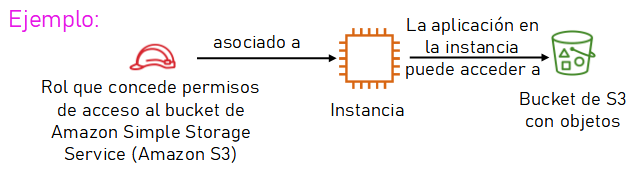
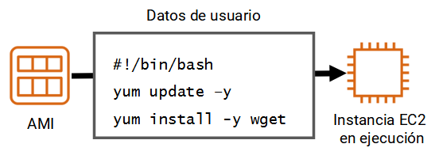

# Servicios de computación en AWS

## Introducción

Los servicios de máquinas virtuales fueron los primeros servicios tanto de AWS como de Azure, los cuales proporcionan infraestructura como servicio (*IaaS*). Posteriormente se añadieron otros servicios como tecnología sin servidor (*serverless*), tecnología basada en contenedores y plataforma como servicio (*PaaS*).

Ya hemos comentado el coste de ejecutar servidores in-house (compra, mantenimiento del centro de datos, personal, etc...) además de la posibilidad de que la capacidad del servidor podría permanecer sin uso e inactiva durante gran parte del tiempo de ejecución de los servidores, lo que implica un desperdicio.

## Amazon EC2

*Amazon Elastic Compute Cloud* (**Amazon EC2** - <https://docs.aws.amazon.com/ec2/>) proporciona máquinas virtuales en las que podemos alojar el mismo tipo de aplicaciones que podríamos ejecutar en un servidor en nuestras oficinas.
Además, ofrece capacidad de cómputo segura y de tamaño ajustable en la nube. Las instancias EC2 admiten distintas cargas de trabajo (servidores de aplicaciones, web, de base de datos, de correo, multimedia, de archivos, etc..)

La computación elástica (*Elastic Compute*) se refiere a la capacidad para aumentar o reducir fácilmente la cantidad de servidores que ejecutan una aplicación de manera automática, así como para aumentar o reducir la capacidad de procesamiento (CPU), memoria RAM o almacenamiento de los servidores existentes.

La primera vez que lancemos una instancia de Amazon EC2, utilizaremos  el asistente de lanzamiento de instancias de la consola de administración de AWS, el cual nos facilita paso a paso la configuración y creación de nuestra máquina virtual.

### Paso 1: AMI

Una **imagen de Amazon Machine** (AMI) proporciona la información necesaria para lanzar una instancia EC2. Así pues, el primer paso consiste en elegir cual será la AMI de nuestra instancia. Por ejemplo, una AMI que contenga un servidor de aplicaciones y otra que contenga un servidor de base de datos.

Si vamos a montar un cluster, también podemos lanzar varias instancias a partir de una sola AMI.


Las AMI incluyen los siguientes componentes:

* Una plantilla para el volumen raíz de la instancia, el cual contiene un sistema operativo y todo lo que se instaló en él (aplicaciones, librerías, etc.). Amazon EC2 copia la plantilla en el volumen raíz de una instancia EC2 nueva y, a continuación, la inicia.
* Permisos de lanzamiento que controlan qué cuentas de AWS pueden usar la AMI.
* La asignación de dispositivos de bloques que especifica los volúmenes que deben asociarse a la instancia en su lanzamiento, si corresponde.

#### Tipos de AMI

Puede elegir entre los siguientes tipos de AMI:

* *Quick Start*: AWS ofrece una serie de AMI prediseñadas, tanto Linux como Windows, para lanzar las instancias.
* *Mis AMI*: estas son las AMI que hemos creado nosotros.
* *AWS Marketplace*: catálogo que incluye miles de soluciones de software creadas por empresas terceras. Estas AMI pueden ofrecer casos de uso específicos para que pueda ponerse en marcha rápidamente.
* *AMI de la comunidad*: estas son AMI creadas por personas de todo el mundo.AWS no controla estas AMI, así que deben utilizarse bajo la propia responsabilidad, evitando su uso en entornos corporativos o de producción. 

Las AMI se crean a partir de una instancia EC2. Si queremos crear una AMI propia, podemos importar una máquina virtual para que se convierta en una instancia EC2 y, luego guardar la instancia EC2 como una AMI. O partir de una AMI existente, modificarla conforme a nuestras necesidades y luego crear la nueva AMI. 

!!! info "Las AMI dependen de la región"
    Las AMI que creamos se hacen en la región en la que estamos conectados. Si la necesitamos en otra región, debemos realizar un proceso de copia.

### Paso 2: Tipo de instancias

El segundo paso es seleccionar un tipo de instancia, según nuestro caso de uso.
Los tipos de instancia incluyen diversas combinaciones de capacidad de CPU, memoria, almacenamiento y red.


Cada tipo de instancia se ofrece en uno o más tamaños, lo cual permite escalar los recursos en función de los requisitos de la carga de trabajo de destino.

#### Categorías

Las categorías de tipos de instancia incluyen instancias de uso general, optimizadas para informática, optimizadas para memoria, optimizadas para almacenamiento y de informática acelerada.

| Categoría     | Tipo de instancia     | Caso de uso   |
| -----         | -----                 | -----         |
| Uso general   | a1, m4, m5, t2, **t3**    | Amplio    |
| Computación   | c4, **c5**                | Alto rendimiento  |
| Memoria       | r4, **r5**, x1, z1        | *Big Data* |
| Informática acelerada | f1, g3, g4, p2, p3    | *Machine Learning* |
| Almacenamiento    | d2, h1, i3        | Sistemas de archivos distribuidos |

#### Tipos de instancias

Los tipos de instancias (<https://aws.amazon.com/es/ec2/instance-types/>) ofrecen ^^familias, generaciones y tamaños^^. Así pues, el tipo de instancia `t3.large` referencia a la familia `T`, de la tercera generación y con un tamaño `large`.

En general, los tipos de instancia que son de una generación superior son más potentes y ofrecen una mejor relación calidad/precio. 

!!! important "Comparando tipos de instancias"
    Cuando se comparan los tamaños hay que examinar la parte del coeficiente en la categoría de tamaño. Por ejemplo, una instancia `t3.2xlarge` tiene el doble de CPU virtual y memoria que una `t3.xlarge`. A su vez, la instancia `t3.xlarge` tiene el doble de CPU virtual y memoria que una `t3.large`.

También se debe tener en cuenta que el ancho de banda de red también está vinculado al tamaño de la instancia de Amazon EC2. Si ejecutará trabajos que requieren un uso muy intensivo de la red, es posible que deba aumentar las especificaciones de la instancia para que satisfaga sus necesidades. 

### Paso 3: Configuración de la instancia / red

El siguiente paso es especificar la ubicación de red en la que se implementará la instancia EC2, teniendo en cuenta la región donde nos encontramos antes de lanzar la instancia. En este paso, elegiremos la **VPC** y la **subred** dentro de la misma, ya sea de las que tenemos creadas o pudiendo crear los recursos en este paso.


Respecto a la asignación pública de ip sobre esta instancia, cuando se lanza una instancia en una VPC predeterminada, AWS le asigna una dirección IP pública de forma predeterminada. En caso contrario, si la VPC no es la predeterminada, AWS no asignará una dirección IP pública, a no ser que lo indiquemos de forma explícita.

#### Asociar un rol de IAM

Si necesitamos que nuestras instancias EC2 ejecuten una aplicación que debe realizar llamadas seguras de la API a otros servicios de AWS, en vez de dejar anotadas las credenciales en el código de la aplicación (esto es una muy mala práctica que puede acarrear problemas de seguridad), debemos asociar un rol de IAM a una instancia EC2.

El rol de IAM asociado a una instancia EC2 se almacena en un **perfil de instancia**. Si creamos el rol desde esta misma pantalla, AWS creará un perfil de instancia automáticamente y le otorgará el mismo nombre que al rol. En el desplegable la lista que se muestra es, en realidad, una lista de nombres de perfiles de instancia.



Cuando definimos un rol que una instancia EC2 puede utilizar, estamos configurando qué cuentas o servicios de AWS pueden asumir dicho rol, así como qué acciones y recursos de la API puede utilizar la aplicación después de asumir el rol. Si cambia un rol, el cambio se extiende a todas las instancias que tengan el rol asociado.

La asociación del rol no está limitada al momento del lanzamiento de la instancia, también se puede asociar un rol a una instancia que ya exista.

#### Script de datos de usuario

Al momento de crear las instancias EC2, de forma opcional, podemos especificar un script de datos de usuario durante el lanzamiento de la instancia. Los datos de usuario pueden automatizar la finalización de las instalaciones y las configuraciones durante el lanzamiento de la instancia. Por ejemplo, un script de datos de usuario podría colocar parches en el sistema operativo de la instancia y actualizarlo, recuperar e instalar claves de licencia de software, o instalar sistemas de software adicionales.



!!! info "Script en Windows"
    Si nuestra instancia es de Windows, el script de datos de usuario debe escribirse en un formato que sea compatible con una ventana del símbolo del sistema (comandos por lotes) o con Windows PowerShell.

De forma predeterminada, los datos de usuario sólo se ejecutan la primera vez que se inicia la instancia.

### Paso 4: Almacenamiento

TODO: REVISAR cuando este escrita la siguiente sesión

Cuando lance una instancia EC2, podrá configurar las opciones de almacenamiento. Por ejemplo, puede configurar el tamaño del volumen raíz en el que está instalado el sistema operativo invitado. También puede asociar volúmenes de almacenamiento adicionales cuando lance la instancia. Algunas AMI también están configuradas para lanzar más de un volumen de almacenamiento de forma predeterminada y, de esa manera, proporcionar almacenamiento independiente del volumen raíz. Para cada volumen que tenga la instancia, puede especificar el tamaño de los discos, los tipos de volumen y si el almacenamiento se conservará en el caso de terminación de la instancia. También puede especificar si se debe utilizar el cifrado.


Amazon ElasticBlock Store (Amazon EBS) es un servicio de almacenamiento en bloque duradero, de alto rendimiento y fácil de usar que está diseñado para utilizarse con Amazon EC2 para las cargas de trabajo con un uso intensivo de transacciones y de rendimiento. Con Amazon EBS, puede elegir entre cuatro tipos de volumen diferentes para equilibrar el precio y el rendimiento óptimos. Puede cambiar los tipos de volumen o aumentar su tamaño sin interrumpir sus aplicaciones críticas, de modo que disponga de almacenamiento rentable cuando lo necesite.El almacén de instancias de Amazon EC2 ofrece almacenamiento a nivel de bloque temporal para su instancia. Este almacenamiento está ubicado en los discos que se asocian físicamente al equipo de alojamiento. El almacén de instancias es una buena opción para el almacenamiento temporal de información que cambia con frecuencia, como buffers, memorias caché, datos de pruebas y demás contenido temporal. También puede utilizar el almacén de instancias para los datos que se replican en una flota de instancias, como un grupo de servidores web con balanceo de carga. Si las instancias se detienen, ya sea debido a un error del usuario o un problema de funcionamiento, se eliminarán los datos en el almacén de instancias.AmazonElasticFileSystem(AmazonEFS)suministra un sistema de archivos.

Network File System(NFS) simple, escalable, elástico y totalmente administrado para utilizar con los servicios en la nube de AWS y con los recursos en las instalaciones. Está diseñado para escalar a petabytes bajo demanda sin interrumpir las aplicaciones. Se expande y se reduce automáticamente a medida que agrega y elimina archivos, lo que reduce la necesidad de aprovisionar y administrar la capacidad para adaptarse al crecimiento.Amazon Simple Storage Service(Amazon S3)es un servicio de almacenamiento de objetos que ofrece escalabilidad, disponibilidad de datos, seguridad y rendimiento. Puede almacenar y proteger cualquier cantidad de datos para diversos casos de uso, como sitios web, aplicaciones móviles, procesos de copia de seguridad y restauración, archivo, aplicaciones empresariales, dispositivos de Internet de las cosas (IoT) y análisis de bigdata.

### Paso 5: Etiquetas

Las etiquetas son marcas que se asignan a los recursos de AWS. Cada etiqueta está formada por una clave y un valor opcional, siendo ambos campos *case sensitive*.


El etiquetado es la forma en que asocia metadatos a una instancia EC2. De esta manera, permiten clasificar los recursos de AWS, como las instancias EC2, de diferentes maneras. Por ejemplo, en función de la finalidad, el propietario o el entorno.

Los beneficios potenciales del etiquetado son la capacidad de filtrado, la automatización, la asignación de costes y el control de acceso.

### Paso 6: Grupo de seguridad

Un grupo de seguridad es un conjunto de reglas de firewall que controlan el tráfico de red de una o más instancias, por lo que se encuentra fuera del sistema operativo de la instancia.


Dentro del grupo, agregaremos reglas para habilitar el tráfico hacia o desde nuestras instancias asociadas. Para cada una de estas reglas especificaremos el puerto, el protocolo (TCP, UDP, ICMP), así como el origen (por ejemplo, una dirección IP u otro grupo de seguridad) que tiene permiso para utilizar la regla.

De forma predeterminada, se incluye una regla de salida que permite todo el tráfico saliente. Es posible quitar esta regla y agregar reglas de salida que solo permitan tráfico saliente específico.

AWS evalúa las reglas de todos los grupos de seguridad asociados a una instancia para decidir si permite que el tráfico llegue a ella. Si desea lanzar una instancia en una nube virtual privada (VPC), debe crear un grupo de seguridad nuevo o utilizar uno que ya exista en esa VPC.

Las reglas de un grupo de seguridad se pueden modificar en cualquier momento, y las reglas nuevas se aplicarán automáticamente a todas las instancias que estén asociadas al grupo de seguridad.

### Paso 7: Análisis e identificación

El paso final es una página resumen con todos los datos introducidos. Cuando le damos a lanzar la nueva instancia configurada, nos aparecerá
un cuadro de diálogo donde se solicita que elijamos un **par de claves** existente, continuar sin un par de claves o crear un par de claves nuevo antes de crear y lanzar la instancia EC2.

Amazon EC2 utiliza la criptografía de clave pública para cifrar y descifrar la información de inicio de sesión. La clave pública la almacena AWS, mientras que .la clave privada que la almacenamos nosotros.

!!! importante "Guarda tus claves"
    Si creamos una par de claves nuevas, hemos de descargarlas y guardarlas en un lugar seguro. Esta es la única oportunidad de guardar el archivo de clave privada. Si perdemos las claves, tendremos que destruir la instancia y volver a crearla.

Para conectarnos a la instancia desde nuestra máquina local, necesitamos hacerlo via un cliente SSH / Putty adjuntando el par de claves descargado. Si la AMI es de Windows, utilizaremos la clave privada para obtener la contraseña de administrador que necesita para iniciar sesión en la instancia. En cambio, si la AMI es de Linux, lo haremos mediante ssh:

``` bash
ssh -i /path/miParClaves.pem miNombreUsuarioInstancia@miPublicDNSInstancia
```

Más información en: <https://docs.aws.amazon.com/es_es/AWSEC2/latest/UserGuide/AccessingInstances.html>

Por último, una vez lanzada la instancia, podemos observar la informacion disponible sobre la misma: dirección IP y la dirección DNS, el tipo de instancia, el ID de instancia único asignado a la instancia, el ID de la AMI que utilizó para lanzar la instancia, el ID de la VPC, el ID de la subred, etc...


### Uso de la consola

También puede lanzar instancias EC2 mediante programación, ya sea a través de la interfaz de línea de comandos de AWS (CLI de AWS) o uno de los kits de desarrollo de software (SDK) de AWS.En el comando de la CLI de AWS de ejemplo, verá un solo comando que especifica la información mínima necesaria para lanzar una instancia. El comando incluye la siguiente información:•aws: especifica la invocación de la utilidad de línea de comandos aws.•ec2: especifica la invocación del comando del servicioec2.•run-instances: es el subcomando que se invoca.El resto del comando especifica varios parámetros, entre los que se incluyen los siguientes:•image-id: este parámetro va seguido de un ID de AMI. Todas las AMI tienen un ID de único.•count: puede especificar más de una instancia. •instance-type: puede especificar el tipo de instancia que se creará, como una instancia c3.large.•key-name: en el ejemplo, supongamos que MyKeyPairya existe.•security-groups: en este ejemplo, supongamos que MySecurityGroupya existe.•region: las AMI se encuentran en una región de AWS, por lo que debe especificar la región donde la CLI de AWS encontrará la AMI y lanzará la instancia EC2. 44
El comando debería crear la instancia EC2 correctamente si suceden los siguientes supuestos:•El comando tiene el formato correcto.•Los recursos que el comando necesita ya existen.•Cuenta con los permisos necesarios para ejecutar el comando.•Tiene capacidad suficiente en la cuenta de AWS.Si el comando se ejecuta correctamente, la API responde al comando con el ID de la instancia y otros datos importantes para que la aplicación los utilice en las solicitudes a la API posteriores. 45

### Ciclo de vida de las instancias

Este es el ciclo de vida de una instancia. Las flechas muestran las acciones que puede realizar, y las casillas indican el estadoque tendrá la instancia después de dicha acción. Las instancias pueden tener uno de los siguientes estados:

Pending(pendiente): cuando se lanza una instancia por primera vez desde una AMI o cuando se activa una instancia detenida, esta pasa al estado pending cuando arranca y se implementa en un equipo de alojamiento. El tipo de instancia que especificó durante el lanzamiento determinará el hardware del equipo de alojamiento para la instancia.

Running(en ejecución): cuando ya arrancó la instancia por completo y está lista, sale del estado pending y pasa al estado running. Puede conectarse a través de Internet a la instancia en ejecución.

Rebooting(reiniciada): AWS recomienda reiniciar las instancias con la consola de Amazon EC2, la CLI de AWS o los SDK de AWS, en lugar de invocar una acción de reinicio desde el sistema operativo invitado. Una instancia reiniciada permanece en el mismo host físico, mantiene el mismo nombre DNS público y la misma dirección IP pública y, si tiene volúmenes del almacén de instancias, conserva los datos en ellos.

Shuttingdown(en proceso de cierre):este es un estado intermedio entre running
y terminated.

Terminated(terminada): las instancias terminadas permanecen visibles en la consola de Amazon EC2 durante un tiempo antes de que se elimine la máquina virtual. Sin embargo, no es posible conectarse a una instancia terminada ni recuperarla. •Stopping(en proceso de detención): las instancias que cuentan con el respaldo de Amazon EBS se pueden detener. Entran en el estado stoppingantes de alcanzar el estado stopped por completo.

Stopped(detenida):una instancia en el estado stopped no generará los mismos costos que una instancia en el estado running. Si se inicia una instancia en el estado stopped, esta vuelve al estado pending y se traslada a una nueva máquina de alojamiento.  47

Algunas instancias que cuentan con el respaldo de Amazon EBS admiten la hibernación. Cuando pone una instancia a hibernar, el sistema operativo invitado guarda el contenido de la memoria de la instancia (RAM) en el volumen raíz de Amazon EBS. Cuando reinicie la instancia, el volumen raíz se restaurará al estado anterior, se volverá a cargar el contenido de la RAM y se reanudarán los procesos que estaban en ejecución anteriormente en la instancia.Solo algunas AMI de Linux que cuentan con el respaldo de Amazon EBS y determinados tipos de instancias admiten la hibernación. La hibernación también requiere el cifrado del volumen raíz de EBS. Además, se debe habilitar la hibernación con el lanzamiento inicial de la instancia. No puede habilitarla en una instancia existente que no tenía habilitada esta función originalmente. Para obtener más información sobre los requisitos previos y el costo, consulte Hiberne su instancia de Linux en la página de documentación de AWS. 48
De manera predeterminada, todas las cuentas de AWS están limitadas a cinco (5) direcciones IP elásticas por región porque las direcciones públicas de Internet (IPv4) son un recurso público escaso. Sin embargo, este límite no es fijo, y se puede solicitar un aumento del límite (que podría aprobarse). 50

### Metadatos de las instancias

Los metadatos de la instancia son datos sobre la instancia. Puede verlos mientras esté conectado a la instancia. Para acceder a ellos en un navegador, diríjase a la siguiente dirección URL: http://169.254.169.254/latest/meta-data/. También puede leer los datos mediante programación, por ejemplo, desde una ventana de terminal que tenga la utilidad cURL. En la ventana de terminal, ejecute cURLhttp://169.254.169.254/latest/meta-data/para recuperarlos. La dirección IP 169.254.169.254es una dirección de enlace local y solo es válida desde la instancia. Los metadatos de la instancia proporcionan en general la misma información acerca de la instancia en ejecución que puede encontrar en la consola de administración de AWS. Por ejemplo, puede conocer la dirección IP pública, la dirección IP privada, el nombre de host público, el ID de la instancia, los grupos de seguridad, la región, la zona de disponibilidad y mucho más. También se puede acceder a todos los datos de usuario especificados durante el lanzamiento de la instancia en la siguiente dirección URL: http://169.254.169.254/latest/user-data.Los metadatos de instancias EC2 se pueden utilizar para configurar o administrar una instancia en ejecución. Por ejemplo, puede crear un script de configuración que tenga acceso a la información de metadatos y la utilice para configurar las aplicaciones o el sistema operativo. 51

!!! note "IPs estáticas"
    Una dirección IP públicaes una dirección IPv4 a la que se puede acceder desde Internet. A cada instancia que recibe una dirección IP pública se le asigna también un nombre de host DNS externo. Por ejemplo, si la dirección IP pública asignada a la instancia es 203.0.113.25, el nombre de host DNS externo podría serec2-203-0-113-25.compute-1.amazonaws.com.Si especifica que se debe asignar una dirección IP pública a la instancia, esta se asigna desde el grupo de direcciones IPv4 públicas de AWS. La dirección IP pública no está asociada a su cuenta de AWS. Cuando se desvincula una dirección IP pública de la instancia, se vuelve a liberar en el grupo de direcciones IPv4 públicas, y no podrá indicar que desea volver a utilizarla. AWS libera la dirección IP pública de la instancia cuando la instancia se detiene o se termina. La instancia detenida recibe una dirección IP pública nueva cuando se reinicia.Si necesita una dirección IP pública permanente, le recomendamos asociar una dirección IP elástica a la instancia. Para hacerlo, primero debe asignar una nueva dirección IP elástica en la región donde se encuentra la instancia. Una vez asignada, puede asociar la dirección IP elástica a una instancia EC2.  49

### Monitorización

Puede monitorizar las instancias con Amazon CloudWatch, el cual recopila y procesa los datos sin formato de Amazon EC2, y los convierte en métricas legibles casi en tiempo real. Estas estadísticas se registran durante un periodo de 15meses, de forma que pueda acceder a la información histórica y obtener una mejor perspectiva acerca del rendimiento de su servicio o aplicación web.De forma predeterminada, Amazon EC2 proporciona un monitoreo básico,que envía datos de métricas a CloudWatch en intervalos de 5minutos. Para enviar los datos de las métricas de la instancia a CloudWatch cada 1 minuto, puede habilitar el monitoreo detallado en la instancia. Para obtener más información, consulte Habilitar o deshabilitar el monitoreo detallado de las instancias. La consola de Amazon EC2 muestra una serie de gráficos basados en los datos sin procesar de Amazon CloudWatch. En función de sus necesidades, es posible que prefiera obtener los datos para las instancias de Amazon CloudWatch, en lugar de los gráficos en la consola. De forma predeterminada, Amazon CloudWatch no proporciona métricas de la RAM para las instancias EC2, pero puede configurar esta opción si desea que Cloud Watch recopile esos datos. 52

RESUMEN
•Las instancias EC2 se lanzan desde una plantilla de AMI en una VPC de su cuenta.•Puede elegir entre muchos tipos de instancias. Cada tipo de instancia ofrece diferentes combinaciones de capacidades de CPU, RAM, almacenamiento y redes.•Puede configurar grupos de seguridad para controlar el acceso a las instancias (especificar el origen y los puertos permitidos).•Los datos de usuario le permiten especificar un script que se ejecutará la primera vez que se lance una instancia. •Solo se pueden detener las instancias que cuentan con el respaldo de Amazon EBS. •Puede utilizar Amazon CloudWatch para capturar y revisar métricas en instancias EC2.

## Optimización de costes

AWS ofrece diferentes tipos de instancia

Los modelos de precios de Amazon EC2 incluyen instancias bajo demanda, instancias reservadas, instancias de spot, instancias dedicadas y hosts dedicados. La facturación por segundo está disponible para las instancias bajo demanda, las instancias reservadas y las instancias de spot que solo utilizan Amazon Linux y Ubuntu.

Las instancias de spot se pueden interrumpir con una notificación de 2 minutos. Sin embargo, pueden significar un ahorro considerable en comparación con las instancias bajo demanda.

Los cuatro pilares de la optimización de costes son:

* Adaptación del tamaño
* Aumento de la elasticidad
* Modelo de precios óptimo
* Optimización de las opciones de almacenamiento

## Servicios de contenedores

Los contenedores pueden abarcar todo lo que una aplicación necesita para ejecutarse.
*Docker* es una plataforma de software que empaqueta software en contenedores.

Una sola aplicación puede abarcar varios contenedores.

Amazon Elastic Container Service(Amazon ECS) organiza la ejecución de los contenedores de Docker.

Kuberneteses un software de código abierto para la organización de contenedores.
Amazon Elastic Kubernetes Service (Amazon EKS) le permite ejecutar Kubernetes en AWS.
Amazon Elastic Container Registry (Amazon ECR) le permite almacenar, administrar e implementar sus contenedores de Docker

## AWS Lambda

La informática sin servidor le permite crear y ejecutar aplicaciones y servicios sin aprovisionar ni administrar servidores.
AWS Lambda (<https://aws.amazon.com/es/lambda/>) es un servicio de informática sin servidor que proporciona las funcionalidades integradas de tolerancia a errores y escalado automático, el cual se factura por el tiempo de ejecución (cantidad de milisegundos por el número de invocaciones a la función). Para ello, permite la ejecución de código en el servidor con soporte para múltiples lenguajes (Java, C#, Python, Go, ...) sin necesidad de configurar una instancia EC2.

Un *origen de eventos* es un servicio de AWS (*S3*, *DynamoDB*, ...) o una aplicación creada por un desarrollador que desencadena la ejecución de una función de Lambda.

Mediante *AWS Step Functions* se pueden crear flujos de trabajo encadenando llamadas a funciones lambda

Las restricciones más destacables son:

* Permite hasta 1000 ejecuciones simultáneas en una única región.
* La cantidad máxima de memoria que se puede asignar para una sola función Lambda es de 3008 MB.
* El tiempo de ejecución máximo para una función Lambda es de 15 minutos.

## AWS Elastic Beanstalk

AWS ElasticBeanstalk mejora la productividad de los desarrolladores.
Simplifica el proceso de implementación de la aplicación.
Reduce la complejidad de administración.
ElasticBeanstalk es compatible con Java, .NET, PHP, Node.js, Python, Ruby, Go y Docker.
No se aplican cargos por utilizar ElasticBeanstalk. Pague únicamente por los recursos de AWS que utilice.

## Actividades

1. Realizar el módulo 6 (Informática) del curso [ACF de AWS](https://awsacademy.instructure.com/courses/2243/).

## Referencias
