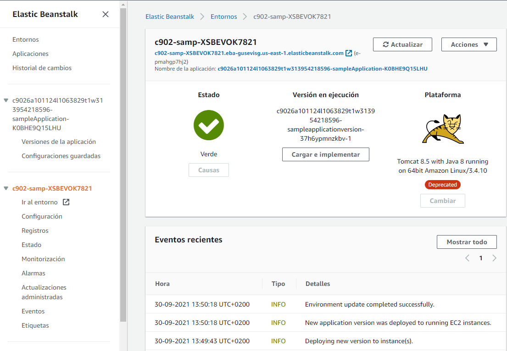

# Servicios de computación en la nube

## Introducción

Los servicios de máquinas virtuales fueron los primeros servicios tanto de AWS como de Azure, los cuales proporcionan infraestructura como servicio (*IaaS*). Posteriormente se añadieron otros servicios como tecnología sin servidor (*serverless*), tecnología basada en contenedores y plataforma como servicio (*PaaS*).

Ya hemos comentado el coste de ejecutar servidores in-house (compra, mantenimiento del centro de datos, personal, etc...) además de la posibilidad de que la capacidad del servidor podría permanecer sin uso e inactiva durante gran parte del tiempo de ejecución de los servidores, lo que implica un desperdicio.

## Amazon EC2

*Amazon Elastic Compute Cloud* (**Amazon EC2** - <https://docs.aws.amazon.com/ec2/>) proporciona máquinas virtuales en las que podemos alojar el mismo tipo de aplicaciones que podríamos ejecutar en un servidor en nuestras oficinas.
Además, ofrece capacidad de cómputo segura y de tamaño ajustable en la nube. Las instancias EC2 admiten distintas cargas de trabajo (servidores de aplicaciones, web, de base de datos, de correo, multimedia, de archivos, etc..)

La computación elástica (*Elastic Compute*) se refiere a la capacidad para aumentar o reducir fácilmente la cantidad de servidores que ejecutan una aplicación de manera automática, así como para aumentar o reducir la capacidad de procesamiento (CPU), memoria RAM o almacenamiento de los servidores existentes.

La primera vez que lancemos una instancia de Amazon EC2, utilizaremos  el asistente de lanzamiento de instancias de la consola de administración de AWS, el cual nos facilita paso a paso la configuración y creación de nuestra máquina virtual.

### Paso 1: AMI

Una **imagen de Amazon Machine** ([AMI](https://docs.aws.amazon.com/es_es/AWSEC2/latest/UserGuide/AMIs.html)) proporciona la información necesaria para lanzar una instancia EC2. Así pues, el primer paso consiste en elegir cual será la AMI de nuestra instancia. Por ejemplo, una AMI que contenga un servidor de aplicaciones y otra que contenga un servidor de base de datos.

Si vamos a montar un cluster, también podemos lanzar varias instancias a partir de una sola AMI.


Las AMI incluyen los siguientes componentes:

* Una plantilla para el volumen raíz de la instancia, el cual contiene un sistema operativo y todo lo que se instaló en él (aplicaciones, librerías, etc.). Amazon EC2 copia la plantilla en el volumen raíz de una instancia EC2 nueva y, a continuación, la inicia.
* Permisos de lanzamiento que controlan qué cuentas de AWS pueden usar la AMI.
* La asignación de dispositivos de bloques que especifica los volúmenes que deben asociarse a la instancia en su lanzamiento, si corresponde.

#### Tipos de AMI

Puede elegir entre los siguientes tipos de AMI:

* *Quick Start*: AWS ofrece una serie de AMI prediseñadas, tanto Linux como Windows, para lanzar las instancias.
* *Mis AMI*: estas son las AMI que hemos creado nosotros, ya sea a partir de máquinas locales que hayamos creado en VmWare, VirtualBox, o una previa que hemos creado en una instancia EC2, configurado y luego exportado.
* *AWS Marketplace*: catálogo que incluye miles de soluciones de software creadas por empresas terceras (las cuales pueden cobrar por su uso). Estas AMI pueden ofrecer casos de uso específicos para que pueda ponerse en marcha rápidamente.
* *AMI de la comunidad*: estas son AMI creadas por personas de todo el mundo.AWS no controla estas AMI, así que deben utilizarse bajo la propia responsabilidad, evitando su uso en entornos corporativos o de producción.

!!! info "Las AMI dependen de la región"
    Las AMI que creamos se hacen en la región en la que estamos conectados. Si la necesitamos en otra región, debemos realizar un proceso de copia.

### Paso 2: Tipo de instancias

El segundo paso es seleccionar un tipo de instancia, según nuestro caso de uso.
Los tipos de instancia incluyen diversas combinaciones de capacidad de CPU, memoria, almacenamiento y red.


Cada tipo de instancia se ofrece en uno o más tamaños, lo cual permite escalar los recursos en función de los requisitos de la carga de trabajo de destino.

#### Categorías

Las categorías de tipos de instancia incluyen instancias de uso general, optimizadas para informática, optimizadas para memoria, optimizadas para almacenamiento y de informática acelerada.

| Categoría     | Tipo de instancia     | Caso de uso   |
| -----         | -----                 | -----         |
| Uso general   | a1, m4, m5, t2, **t3**    | Amplio    |
| Computación   | c4, **c5**                | Alto rendimiento  |
| Memoria       | r4, **r5**, x1, z1        | *Big Data* |
| Informática acelerada | f1, g3, g4, p2, p3    | *Machine Learning* |
| Almacenamiento    | d2, h1, i3        | Sistemas de archivos distribuidos |

#### Tipos de instancias

Los tipos de instancias (<https://aws.amazon.com/es/ec2/instance-types/>) ofrecen ^^familias, generaciones y tamaños^^. Así pues, el tipo de instancia `t3.large` referencia a la familia `T`, de la tercera generación y con un tamaño `large`.

En general, los tipos de instancia que son de una generación superior son más potentes y ofrecen una mejor relación calidad/precio.

!!! important "Comparando tipos de instancias"
    Cuando se comparan los tamaños hay que examinar la parte del coeficiente en la categoría de tamaño. Por ejemplo, una instancia `t3.2xlarge` tiene el doble de CPU virtual y memoria que una `t3.xlarge`. A su vez, la instancia `t3.xlarge` tiene el doble de CPU virtual y memoria que una `t3.large`.

También se debe tener en cuenta que el ancho de banda de red también está vinculado al tamaño de la instancia de Amazon EC2. Si ejecutará trabajos que requieren un uso muy intensivo de la red, es posible que deba aumentar las especificaciones de la instancia para que satisfaga sus necesidades.

A la hora de elegir un tipo de instancia, nos centraremos en la cantidad de nucleos, el tamaño de la memoria, el rendimiento de la red y las tecnologías de la propia CPU (si tiene habilitada GPU y FPGA)

### Paso 3: Configuración de la instancia / red

El siguiente paso es especificar la ubicación de red en la que se implementará la instancia EC2, teniendo en cuenta la región donde nos encontramos antes de lanzar la instancia. En este paso, elegiremos la **VPC** y la **subred** dentro de la misma, ya sea de las que tenemos creadas o pudiendo crear los recursos en este paso.


Respecto a la asignación pública de ip sobre esta instancia, cuando se lanza una instancia en una VPC predeterminada, AWS le asigna una dirección IP pública de forma predeterminada. En caso contrario, si la VPC no es la predeterminada, AWS no asignará una dirección IP pública, a no ser que lo indiquemos de forma explícita.

#### Asociar un rol de IAM

Si necesitamos que nuestras instancias EC2 ejecuten una aplicación que debe realizar llamadas seguras de la API a otros servicios de AWS, en vez de dejar anotadas las credenciales en el código de la aplicación (esto es una muy mala práctica que puede acarrear problemas de seguridad), debemos asociar un rol de IAM a una instancia EC2.

El rol de IAM asociado a una instancia EC2 se almacena en un **perfil de instancia**. Si creamos el rol desde esta misma pantalla, AWS creará un perfil de instancia automáticamente y le otorgará el mismo nombre que al rol. En el desplegable la lista que se muestra es, en realidad, una lista de nombres de perfiles de instancia.


Cuando definimos un rol que una instancia EC2 puede utilizar, estamos configurando qué cuentas o servicios de AWS pueden asumir dicho rol, así como qué acciones y recursos de la API puede utilizar la aplicación después de asumir el rol. Si cambia un rol, el cambio se extiende a todas las instancias que tengan el rol asociado.

La asociación del rol no está limitada al momento del lanzamiento de la instancia, también se puede asociar un rol a una instancia que ya exista.

#### Script de datos de usuario

Al momento de crear las instancias EC2, de forma opcional, podemos especificar un script de datos de usuario durante el lanzamiento de la instancia. Los datos de usuario pueden automatizar la finalización de las instalaciones y las configuraciones durante el lanzamiento de la instancia. Por ejemplo, un script de datos de usuario podría colocar parches en el sistema operativo de la instancia y actualizarlo, recuperar e instalar claves de licencia de software, o instalar sistemas de software adicionales.

Por ejemplo, si queremos instalar un servidor de Apache, de manera que arranque automáticamente y que muestre un *Hola Mundo* podríamos poner

``` bash
#!/bin/bash
yum update -y
yum -y install httpd
systemctl enable httpd
systemctl start httpd
echo '<html><h1>Hola Mundo desde el Severo!</h1></html>' > /var/www/html/index.html
```


!!! info "Script en Windows"
    Si nuestra instancia es de Windows, el script de datos de usuario debe escribirse en un formato que sea compatible con una ventana del símbolo del sistema (comandos por lotes) o con Windows PowerShell.

De forma predeterminada, los datos de usuario sólo se ejecutan la primera vez que se inicia la instancia.

### Paso 4: Almacenamiento

Al lanzar la instancia EC2 configuraremos las opciones de almacenamiento. Por ejemplo el tamaño del volumen raíz en el que está instalado el sistema operativo invitado o volúmenes de almacenamiento adicionales cuando lance la instancia.

Algunas AMI están configuradas para lanzar más de un volumen de almacenamiento de forma predeterminada y, de esa manera, proporcionar almacenamiento independiente del volumen raíz. Para cada volumen que tenga la instancia, podemos indicar el tamaño de los discos, los tipos de volumen, si el almacenamiento se conservará en el caso de terminación de la instancia y si se debe utilizar el cifrado.


En la sesión anterior ya comentamos algunos de los servicios de almacenamiento que estudiaremos en profundidad en la siguiente sesión, como pueden ser *Amazon EBS* (almacenamiento por bloques de alto rendimiento) o* Amazon EFS* (almacenamiento elástico compartido entre diferentes instancias).

### Paso 5: Etiquetas

Las etiquetas son marcas que se asignan a los recursos de AWS. Cada etiqueta está formada por una clave y un valor opcional, siendo ambos campos *case sensitive*.


El etiquetado es la forma en que asocia metadatos a una instancia EC2. De esta manera podemos clasificar los recursos de AWS, como las instancias EC2, de diferentes maneras. Por ejemplo, en función de la finalidad, el propietario o el entorno.

Los beneficios potenciales del etiquetado son la capacidad de filtrado, la automatización, la asignación de costes y el control de acceso.

### Paso 6: Grupo de seguridad

Un grupo de seguridad es un conjunto de reglas de firewall que controlan el tráfico de red de una o más instancias, por lo que se encuentra fuera del sistema operativo de la instancia, formando parte de la VPC.


Dentro del grupo, agregaremos reglas para habilitar el tráfico hacia o desde nuestras instancias asociadas. Para cada una de estas reglas especificaremos el puerto, el protocolo (TCP, UDP, ICMP), así como el origen (por ejemplo, una dirección IP u otro grupo de seguridad) que tiene permiso para utilizar la regla.

De forma predeterminada, se incluye una regla de salida que permite todo el tráfico saliente. Es posible quitar esta regla y agregar reglas de salida que solo permitan tráfico saliente específico.

!!! "Servidor Web"
    Si hemos seguido el ejemplo anterior y hemos añadido en los datos de usuario el *script* para instalar Apache, debemos habilitar las peticiones entrantes en el puerto 80. Para ello crearemos una regla que permita el tráfico HTTP.

    

AWS evalúa las reglas de todos los grupos de seguridad asociados a una instancia para decidir si permite que el tráfico llegue a ella. Si desea lanzar una instancia en una nube virtual privada (VPC), debe crear un grupo de seguridad nuevo o utilizar uno que ya exista en esa VPC.

Las reglas de un grupo de seguridad se pueden modificar en cualquier momento, y las reglas nuevas se aplicarán automáticamente a todas las instancias que estén asociadas al grupo de seguridad.

### Paso 7: Análisis e identificación

El paso final es una página resumen con todos los datos introducidos. Cuando le damos a lanzar la nueva instancia configurada, nos aparecerá un cuadro de diálogo donde se solicita que elijamos un **par de claves** existente (formato X.509), continuar sin un par de claves o crear un par de claves nuevo antes de crear y lanzar la instancia EC2.

Amazon EC2 utiliza la criptografía de clave pública para cifrar y descifrar la información de inicio de sesión. La clave pública la almacena AWS, mientras que la clave privada la almacenamos nosotros.

!!! importante "Guarda tus claves"
    Si creamos una par de claves nuevas, hemos de descargarlas y guardarlas en un lugar seguro. Esta es la única oportunidad de guardar el archivo de clave privada. Si perdemos las claves, tendremos que destruir la instancia y volver a crearla.

Para conectarnos a la instancia desde nuestra máquina local, necesitamos hacerlo via un cliente SSH / Putty adjuntando el par de claves descargado. Si la AMI es de Windows, utilizaremos la clave privada para obtener la contraseña de administrador que necesita para iniciar sesión en la instancia. En cambio, si la AMI es de Linux, lo haremos mediante ssh:

``` bash
ssh -i /path/miParClaves.pem miNombreUsuarioInstancia@miPublicDNSInstancia
```

Más información en: <https://docs.aws.amazon.com/es_es/AWSEC2/latest/UserGuide/AccessingInstances.html>

Por último, una vez lanzada la instancia, podemos observar la informacion disponible sobre la misma: dirección IP y la dirección DNS, el tipo de instancia, el ID de instancia único asignado a la instancia, el ID de la AMI que utilizó para lanzar la instancia, el ID de la VPC, el ID de la subred, etc...

!!! tip "IAM"
    Recuerda que en el caso de otros recursos cloud, como el almacenamiento masivo, bases de datos, serverless, etc, lo normal será controlar el acceso mediante la estructura de permisos IAM, que permite establecer políticas definidas y el uso de roles.


En resumen, las instancias EC2 se lanzan desde una plantilla de AMI en una VPC de nuestra cuenta. Podemos elegir entre muchos tipos de instancias, con diferentes combinaciones de CPU, RAM, almacenamiento y redes. Además, podemos configurar grupos de seguridad para controlar el acceso a las instancias (especificar el origen y los puertos permitidos). Al crear una instancia, mediante los datos de usuario, podemos especificar un script que se ejecutará la primera vez que se lance una instancia.

### Uso de la consola

En la sesión anterior ya utilizamos AWS CLI para conectarnos a AWS. En el caso concreto de EC2, es muy útil para crear, arrancar y detener instancias.

Todos los comandos comenzarán por `aws ec2`, seguida de la opción deseada. Si usamos el comando `aws ec2 help` obtendremos un listado enorme con todas las posibilidades.

Vamos a centrarnos en un par de casos de uso. Por ejemplo, para ejecutar una instancia utilizaremos el comando:

``` bash
aws ec2 run-instances --image-id ami-1a2b3c4d --count 1 --instance-type c3.large --key-name MiParejaDeClaves --security-groups MiGrupoSeguridad --region us-east-1
```

Los parámetros que permiten configurar la instancia son:

* `image-id`: este parámetro va seguido de un ID de AMI. Recordad que todas las AMI tienen un ID de único.
* `count`: puede especificar más de una instancia.
* `instance-type`:  tipo de instancia que se creará, como una instancia `c3.large`
* `key-name`: supongamos que `MiParejaDeClaves` ya existe.
* `security-groups` : supongamos que `MiGrupoSeguridad` ya existe.
* `region`: las AMI se encuentran en una región de AWS, por lo que debe especificar la región donde la CLI de AWS encontrará la AMI y lanzará la instancia EC2.

Para que cree la instancia EC2, se debe cumplir que el comando tiene el formato correcto, y que todos los recursos y permisos existen, así como saldo suficiente.

Si queremos ver las instancias que tenemos creadas ejecutaremos el comando:

``` bash
aws ec2 describe-instances
```

Es muy útil utilizar alguna de las [*cheatsheet*](https://www.bluematador.com/learn/aws-cli-cheatsheet#EC2) disponibles en la red con los comandos más utiles a la hora de trabajar con AWS CLI.

### Ciclo de vida de las instancias

Las instancias en todo momento tienen un estado que se puede consultar:

* *Pending (pendiente)*: nada más lanzarse o al arrancar una instancia detenida.
* *Running (en ejecución)*: cuando arrancó la instancia por completo y está lista  para su uso. En este momento se empieza a facturar.
* *Rebooting (reiniciada)*: AWS recomienda reiniciar las instancias con la consola de Amazon EC2, la CLI de AWS o los SDK de AWS, en lugar de utilizar el reinicio desde el sistema operativo invitado. Una instancia reiniciada permanece en el mismo host físico, mantiene el mismo DNS público y la misma IP pública y, si tiene volúmenes del almacén de instancias, conserva los datos en ellos.
* *Shutting down (en proceso de detención)*
* *Terminated(terminada)*: las instancias terminadas permanecen visibles en la consola de Amazon EC2 durante un tiempo antes de que se destruya la máquina virtual. Sin embargo, no es posible conectarse a una instancia terminada ni recuperarla.
* *Stopping(apagándose)*: las instancias que cuentan con el respaldo de Amazon EBS se pueden detener.
* *Stopped(detenida)*: no generará los mismos costos que una instancia en el estado running. Sólo se paga por el almacenamiento de datos. Solo se pueden detener las instancias que cuentan con el respaldo de Amazon EBS.

<figure style="align: center;">
    
    <figcaption>Ciclo de vida de una instancia</figcaption>
</figure>

!!! note "IPs estáticas"
    A cada instancia que recibe una  IP pública se le asigna también un DNS externo. Por ejemplo, si la dirección IP pública asignada a la instancia es `203.0.113.25`, el nombre de host DNS externo podría ser `ec2-203-0-113-25.compute-1.amazonaws.com`.  
    AWS libera la dirección IP pública de la instancia cuando la instancia se detiene o se termina. La instancia detenida recibe una dirección IP pública nueva cuando se reinicia.  
    Si necesitamos una IP pública fija, se recomienda utilizar una IP elástica, asociandola primero a la región donde vaya a residir la instancia EC2. Recuerda que las IP elásticas se paga por cada hora que las tenemos reservadas y se deja de pagar por ellas si están asociadas a una instancia en ejecución.

### Monitorización

Aunque ya lo veremos en una sesión más adelante, podemos monitorizar las instancias EC2 mediante la herramienta *Amazon CloudWatch* con los datos que recopila y procesa, los cuales convierte en métricas legibles en intervalos por defecto de 5 minutos (aunque se puede habilitar el monitoreo detallado y monitorizar cada minuto)

Estas estadísticas se registran durante un periodo de 15 meses, lo que nos permite obtener información histórica y sobre el rendimiento de nuestras instancias.

## Costes de las instancias

Normalmente cuando iniciemos una instancia usaremos instancias *bajo demanda* (el crédito concedido por AWS es en esa modalidad), pero conviene conocer el el resto de formas que ofrecen diferentes facturaciones.

AWS ofrece diferentes tipos pago de instancia:

| Tipo | Descripción | Beneficios | Uso
| ---- | ----   | ----  | ----
|  **bajo demanda** | se paga por hora, no tiene compromisos a largo plazo, y ​ apto para la capa gratuita de AWS | bajo coste y flexibilidad | Cargas de trabajo de corto plazo, con picos o impredecibles​. También para desarrollo o prueba de aplicaciones​
|  **spot**  | Se puja por ellas. Se ejecutan siempre que estén disponibles y que su oferta esté por encima del precio de la instancia de spot.​ AWS puede interrumpirlas con una notificación de 2 minutos.​ Los precios pueden ser considerablemente más económicos en comparación con las instancias bajo demanda​. | Carga de trabajo dinámica y a gran escala​ | Aplicaciones con horarios flexibles de inicio y finalización​. Aplicaciones que solo son viables con precios de computación muy bajos​. Usuarios con necesidades de computación urgentes de grandes cantidades de capacidad adicional​
|  **instancia reservada** | Pago inicial completo, parcial o nulo para las instancias que reserve​. Descuento en el cargo por hora por el uso de la instancia​ (hasta 72%). Plazo de 1 o 3 años​ | Asegura capacidad de cómputo disponible cuando se la necesita​ | Cargas de trabajo de uso predecible o estado estable​. Aplicaciones que requieren capacidad reservada, incluida la recuperación de desastres​. Usuarios capaces de afrontar pagos iniciales para reducir aún más los costes de computación​
|  **host reservado** | Servidor físico con capacidad de instancias EC2 totalmente dedicado a su uso​ | Ahorro de dinero en costes de licencia​. Asistencia para cumplir los requisitos normativos y de conformidad​ | Licencia “Bring your own” (BYOL). Conformidad y restricciones normativas. Seguimiento del uso y las licencias​. Control de la ubicación de instancias.

La facturación por segundo está disponible para las instancias bajo demanda, las instancias reservadas y las instancias de *spot* que solo utilizan Amazon Linux y Ubuntu.

Las instancias reservadas supondrán un ahorro económico importante, si hay
posibilidades económicas y previsión (de 12 a 36 meses), hasta de un 75% según las diferentes opciones:

* **AURI** - *All up-front reserved instance*: se realiza un pago inicial completo
* **PURI** - *Partial up-front reserved instance*: se realiza una pago inicial parcial y cutoas mensuales
* **NURI** - *No up-front reserved instance*: sin pago inicial, se realiza un pago mensual

<figure style="align: center;">
    
    <figcaption>Modelos de pago de las instancias reservadas</figcaption>
</figure>

El planteamiento ideal es utilizar instancias reservadas para la carga mínima de base de nuestro sistema, bajo demanda para autoescalar según necesidades y quizá las instancias *spot*  para cargas opcionales que se contemplarán sólo si el coste es bajo.

Puedes consultar el coste de las diferentes instancias en <https://aws.amazon.com/es/ec2/pricing/reserved_instances>, y consultar precios en <https://aws.amazon.com/es/ec2/pricing/reserved-instances/pricing/>

### Optimización de costes

Los cuatro pilares de la optimización de costes son:

* *Adaptación del tamaño*: consiste en conseguir el equilibrio adecuado de los tipos de instancias. Los servidores pueden desactivarse o reducirse y seguir cumpliendo con sus requisitos de rendimiento. Si seguimos las métricas de Amazon Cloudwatch podremos ver el porcentaje de actividades de las instancias o los rangos horarios donde están inactivas. Se recomienda primero adaptar el tamaño, y una vez que ya es estable la configuración, utilizar instancias reservadas.
* *Aumento de la elasticidad*: mediante soluciones elásticas podemos reducir la capacidad del servidor (por ejemplo, deteniendo o hibernando las intancias que utilizan Amazon EBS que no están activas, como puedan ser entornos de prueba o durante las noches) o utilizar el escalado automático para administrar picos de cargas.
* *Modelo de precios óptimo*: hay que conocer las opciones de precios disponibles, analizando los patrones de uso para combinar los tipos de compra. Por ejemplo, utilizar instancias bajo demanda e instancias de spot para las cargas de trabajo variables, incluso el uso de funciones *serverless*.
* *Optimización de las opciones de almacenamiento*: hay que reducir la sobrecarga de almacenamiento sin utilizar siempre que sea posible (reduciendo el tamaño de los volúmenes) y elegir las opciones de almacenamiento más económicas si cumplen los requisitos de rendimiento de almacenamiento. Otro caso puede ser el eliminar las intancias EBS que ya no se necesitan o las copias de seguridad ya pasadas.

## AWS Lambda

La informática *serverless* permite crear y ejecutar aplicaciones y servicios sin aprovisionar ni administrar servidores.

*AWS Lambda* (<https://aws.amazon.com/es/lambda/>) es un servicio de informática sin servidor que proporciona tolerancia a errores y escalado automático, y que  se factura por el tiempo de ejecución (cantidad de milisegundos por el número de invocaciones a la función). Para ello, permite la ejecución de código en el servidor con soporte para múltiples lenguajes (Java, C#, Python, Go, ...) sin necesidad de configurar una instancia EC2.

Un *origen de eventos* es un servicio de AWS (*S3*, *DynamoDB*, *Elastic Load Balancing*...) o una aplicación creada por un desarrollador que desencadena la ejecución de una función de Lambda. Podemos encadenar funciones Lambda para flujos de trabajo mediante *AWS Step Functions*.

### Creando una función

Al crear una función Lambda, primero le asignaremos un nombre a la función. Tras  elegir el entorno de ejecución (versión de Python, Node.js, etc...), hemos de elegir el rol de ejecución, mediante un permiso de IAM, dependiendo de los servicios con los que tenga que interactuar...(al menos el rol `AWSLambdaBasicExecutionRole` y `AWSLambdaVPCAccessExecutionRole`).

Respecto a la configuración de la función, deberemos:

* Agregar un desencadenador / origen de evento.
* Agregar el código de la función.
* Especificar la cantidad de memoria en MB que se asignará a la función (de 128MB a 3008MB)
* Si queremos, podemos configurar las variables del entorno, la descripción, el tiempo de espera, la VPC específica en la que se debe ejecutar la función, las etiquetas que desea utilizar y otros ajustes.

<figure style="align: center;">
    
    <figcaption>Ejemplo de función Lambda</figcaption>
</figure>

### Restricciones

Las restricciones más destacables son:

* Permite hasta 1000 ejecuciones simultáneas en una única región.
* La cantidad máxima de memoria que se puede asignar para una sola función Lambda es de 3008 MB.
* El tiempo de ejecución máximo para una función Lambda es de 15 minutos.

## AWS Elastic Beanstalk

AWS ElasticBeanstalk es un servicio PaaS que facilita la implementación, el escalado y la administración de aplicaciones y servicios web con rapidez.
Nosotros, como desarrolladores, sólo deberemos cargar el código, elegir el tipo de instancia y de base de datos, configurar y ajustar el escalador automático.

<figure style="align: center;">
    
    <figcaption>Ejemplo de despliegue con Beanstalk</figcaption>
</figure>

Es compatible con Java, .NET, PHP, Node.js, Python, Ruby, Go y Docker.
No se aplican cargos por utilizar *ElasticBeanstalk*, solo se paga con los recursos que AWS utilice (isntancia, base de datos, almacenamiento S3, etc...)

## Actividades

1. Realizar el módulo 6 (Informática) del curso [ACF de AWS](https://awsacademy.instructure.com/courses/2243/).
2. (opcional) Realiza el ejemplo de AWS Lambda del siguiente artículo: [https://aws.amazon.com/es/getting-started/hands-on/run-serverless-code/](https://aws.amazon.com/es/getting-started/hands-on/run-serverless-code/), y adjunta captura del código fuente, del saldo antes y después de ejecutar la función 10 veces y de las métricas capturadas.

## Referencias

* [Amazon EC2](https://aws.amazon.com/es/ec2/)
* [Funciones Lambda en AWS](https://aws.amazon.com/es/lambda/)
