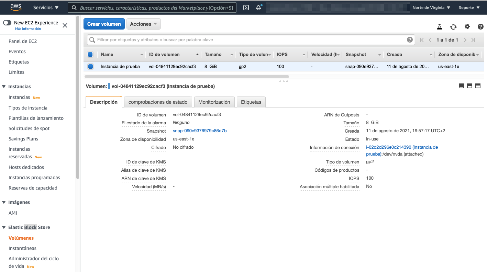
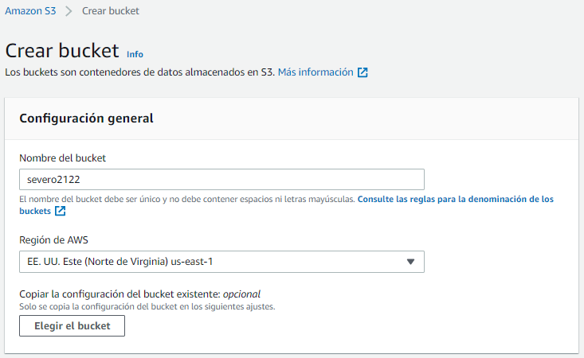

# Almacenamiento en la nube

El almacenamiento en la nube, por lo general, es más confiable, escalable y seguro que los sistemas de almacenamiento tradicionales en las instalaciones.

El análisis de *Big Data*, el almacenamiento de datos, el Internet de las cosas (IoT), las bases de datos y las aplicaciones de copias de seguridad y archivo dependen de algún tipo de arquitectura de almacenamiento de datos.

El almacenamiento más básico es el que incluyen las propias instancias, también conocido como el **almacén de instancias**, o almacenamiento efímero, es un almacenamiento temporal que se agrega a la instancia de AmazonEC2.

El almacén de instancias es una buena opción para el almacenamiento temporal de información que cambia con frecuencia, como buffers, memorias caché, datos de pruebas y demás contenido temporal. También se puede utilizar para los datos que se replican en una flota de instancias, como un grupo de servidores web con balanceo de carga. Si las instancias se detienen, ya sea debido a un error del usuario o un problema de funcionamiento, se eliminarán los datos en el almacén de instancias.

!!! info "Almacenamiento de bloque o de objeto"
    AWS permite almacenar los datos en bloques o como objetos. Si el almacenamiento es en bloques, los datos se almacenan por trozos (bloques), de manera si se modifica una parte de los datos, solo se ha de modificar el bloque que lo contiene. En cambio, si el almacenamiento es a nivel de objeto, una modificación implica tener que volver a actualizar el objeto entero.  
    Esto provoca que el almacenamiento por bloque sea más rápido. En cambio, el almacenamiento de objetos es más sencillo y por tanto más barato.

AWS ofrece múltiples soluciones que vamos a revisar.

## Amazon EBS

*Amazon Elastic Block Store* (<https://aws.amazon.com/es/ebs/>) ofrece volúmenes de almacenamiento a nivel de bloque de alto rendimiento para utilizarlos con instancias de Amazon EC2 para las cargas de trabajo con un uso intensivo de transacciones y de rendimiento.

Los beneficios adicionales incluyen la replicación en la misma zona de disponibilidad, el cifrado fácil y transparente, los volúmenes elásticos y las copias de seguridad mediante instantáneas.

!!! tip "Importante"
    AmazonEBS se puede montar en una instancia de AmazonEC2 solamente dentro de la misma zona de disponibilidad.

### Volúmenes

Los volúmenes de EBS proporcionan almacenamiento fuera de las instancias que persiste independientemente de la vida de la instancia. Son similares a discos virtuales en la nube. *AmazonEBS* ofrece tres tipos de volúmenes: SSD de uso general, SSD de IOPS provisionadas y magnéticos (HDD).

Los tres tipos de volúmenes difieren en características de rendimiento y coste, para ofrecer diferentes posibilidades según las necesidades de las aplicaciones.

FIXME: Completar

Para crear o configurar un volumen, dentro de las instancias EC2, en el menú lateral podemos ver las opciones de .....



Los volúmenes de Amazon EBS están asociados a la red, y su duración es independiente a la vida de una instancia. Los volúmenes de Amazon EBS tienen un alto nivel de disponibilidad y de confianza, y pueden aprovecharse como particiones de arranque de instancias de Amazon EC2 o asociarse a una instancia de Amazon EC2 en ejecución como dispositivos de bloques estándar.

Cuando se utilizan como particiones de arranque, las instancias de Amazon EC2 pueden detenerse y, posteriormente, reiniciarse, lo que le permite pagar solo por los recursos de almacenamiento utilizados al mismo tiempo que conserva el estado de la instancia. Los volúmenes de Amazon EBS tienen durabilidad mucho mayor que los almacenes de instancias de Amazon EC2 locales porque los volúmenes de Amazon EBS se replican automáticamente en el backend (en una única zona de disponibilidad).

Los volúmenes de Amazon EBS ofrecen las siguientes características:

* Almacenamiento persistente: el tiempo de vida de los volúmenes es independiente de cualquier instancia de Amazon EC2.
* De uso general: los volúmenes de Amazon EBS son dispositivos de bloques sin formato que se pueden utilizar en cualquier sistema operativo.
* Alto rendimiento: los volúmenes de Amazon EBS son iguales que las unidades de Amazon EC2 locales o mejores que ellas.
* Nivel de fiabilidad alto: los volúmenes de Amazon EBS tienen redundancia integrada dentro de una zona de disponibilidad.
* Diseñados para ofrecer resiliencia: la AFR (tasa anual de errores) de Amazon EBS oscila entre 0,1 % y 1 %.
* Tamaño variable: los tamaños de los volúmenes varían entre 1 GB y 16 TB.
* Fáciles de usar: los volúmenes de Amazon EBS se pueden crear, asociar, almacenar en copias de seguridad, restaurar y eliminar fácilmente.

Solo una instancia de AmazonEC2 a la vez puede montarse en un volumen de Amazon EBS.

### Instantáneas

Sin embargo, para los que quieran aún más durabilidad, con Amazon EBS es posible crear instantáneas uniformes puntuales de los volúmenes, que luego se almacenan en Amazon Simple Storage Service (Amazon S3) y se replican automáticamente en varias zonas de disponibilidad. Estas instantáneas se pueden utilizar como punto de partida para nuevos volúmenes de Amazon EBS y permiten proteger la durabilidad de sus datos a largo plazo. También puede compartirlas fácilmente con colegas y otros desarrolladores de AWS.

Cuando lo desee, podrá crear una cantidad ilimitada de instantáneas uniformes de un momento específico de los volúmenes de Amazon EBS. Las instantáneas de Amazon EBS se almacenan en Amazon S3 con un alto nivel de durabilidad. Se pueden crear volúmenes de Amazon EBS nuevos a partir de instantáneas para clonar o restaurar copias de seguridad. Las instantáneas de Amazon EBS también pueden compartirse fácilmente entre usuarios de AWS o copiarse entre regiones de AWS.

## Amazon S3

AmazonS3 (<https://aws.amazon.com/es/s3/>) es un servicio de almacenamiento persistente de objetos creado para almacenar y recuperar cualquier cantidad de datos desde cualquier lugar mediante una URL: sitios web y aplicaciones móviles, aplicaciones corporativas y datos de sensores o dispositivos de Internet de las cosas (IoT) y análisis de *Big Data*.

S3 es un servicio de *almacenamiento a nivel de objetos*, y tal como habíamos comentado, significa que si desea cambiar una parte de un archivo, tiene que realizar la modificación y luego volver a cargar todo el archivo modificado. Los datos como objetos dentro de recursos conocidos como **buckets**.

S3 es una solución administrada de almacenamiento en la nube que se diseñó para brindar un escalado sin problemas y 99,999999999% (11 nueves) de durabilidad. Además de poder almacenar prácticamente todos los objetos que desee dentro de un bucket, le permite realizar operaciones de escritura, lectura y eliminación de los objetos almacenados en el bucket. Los nombres de los buckets son universales y deben ser únicos entre todos los nombres de buckets existentes en Amazon S3.

Los objetos pueden ser de hasta 5TB. De forma predeterminada, en Amazon S3 los datos se almacenan de forma redundante en varias instalaciones y en diferentes dispositivos de cada instalación. Los datos que almacena en AmazonS3 no están asociados a ningún servidor en particular. Además, no necesita administrar ninguna infraestructura por su cuenta. Puede colocar tantos objetos como quiera en Amazon S3. Amazon S3 contiene billones de objetos y, con regularidad, tiene picos de millones de solicitudes por segundo. Los objetos pueden ser prácticamente cualquier archivo de datos, como imágenes, videos o registros del servidor. Ya que Amazon S3 admite objetos de hasta varios terabytes de tamaño, le permite incluso almacenar instantáneas de bases de datos como objetos. Amazon S3 también ofrece acceso de baja latencia a los datos a través de Internet mediante el protocolo de transferencia de hipertexto (HTTP) o el HTTP seguro (HTTPS), para que pueda recuperar datos en cualquier momento y desde cualquier lugar. También puede acceder a AmazonS3 de forma privada a través de un punto de enlace de nube virtual privada (VPC). Obtendrá un control detallado sobre quién puede acceder a sus datos a través de las políticas de AWS Identity and Access Management (IAM), las políticas de bucket de AmazonS3 e, incluso, las listas de control de acceso por objeto. De forma predeterminada, no se comparte ninguno de sus datos públicamente. También puede cifrar los datos en tránsito y elegir habilitar el cifrado del lado del servidor en sus objetos. Puede acceder a AmazonS3 a través de la consola de administración de AWS basada en la web, de forma programática a través de la API y los SDK, o con soluciones de terceros que utilizan la API o los SDK. AmazonS3 incluye notificaciones de eventos que le permiten configurar notificaciones automáticas cuando se producen determinados eventos, como la carga o la eliminación de un objeto en un bucketespecífico. Se le pueden enviar estas notificaciones o pueden utilizarse para desencadenar otros procesos, como funciones de AWS Lambda.

### Clases de almacenamiento

S3 ofrece una variedad de clases de almacenamiento (<https://docs.aws.amazon.com/es_es/AmazonS3/latest/userguide/storage-class-intro.html>) a nivel de objetos que están diseñadas para diferentes casos de uso. Entre estas clases se incluyen las siguientes:

* AmazonS3 Estándar: la clase de almacenamiento Estándar de S3 está diseñada para ofrecer almacenamiento de objetos de alta durabilidad, disponibilidad y rendimiento para los datos a los que se accede con frecuencia. Como ofrece baja latencia y alto nivel de rendimiento, Estándar de S3 es una opción adecuada para una amplia variedad de casos de uso, como las aplicaciones en la nube, los sitios web dinámicos, la distribución de contenido, las aplicaciones para dispositivos móviles y videojuegos, y el análisis de bigdata.
* AmazonS3 Intelligent-Tiering: la clase de almacenamiento AmazonS3 Intelligent-Tieringse ha diseñado para optimizar los costos mediante la migración automática de los datos a la capa de acceso más rentable, sin que se perjudique el rendimiento ni se produzca una sobrecarga operativa. Por una pequeña tarifa mensual de monitoreo y automatización por objeto, AmazonS3 monitorea los patrones de acceso de los objetos en AmazonS3 IntelligentTieringy traslada aquellos a los que no se ha accedido durante 30días consecutivos a la capa de acceso poco frecuente. Si se accede a un objeto en la capa de acceso poco frecuente, este se traslada automáticamente a la capa de acceso frecuente. No se aplican tarifas por la recuperación si se usa la clase de almacenamiento AmazonS3 IntelligentTieringni tampoco se cobran tarifas adicionales cuando los objetos se trasladan de una capa de acceso a otra. Funciona bien con datos de larga duración con patrones de acceso desconocidos o impredecibles.
* AmazonS3 Estándar -Acceso poco frecuente: esta clase de almacenamiento de AmazonS3 se utiliza para los datos a los que se accede con menos frecuencia, pero que requieren acceso rápido cuando es necesario. La clase Estándar -Acceso poco frecuente de S3 está diseñada para ofrecer la alta durabilidad, el alto rendimiento y la baja latencia de Estándar de S3, con precios bajos de almacenamiento por GB y de recuperación por GB. Esta combinación de alto rendimiento y bajo costo convierte a Estándar -Acceso poco frecuente de S3 en una opción ideal para el almacenamiento y las copias de seguridad a largo plazo, además de en un almacén de datos para los archivos de recuperación de desastres.
* AmazonS3 Única zona –Acceso poco frecuente: esta clase de almacenamiento de AmazonS3 está diseñada para guardar los datos a los que se accede con menos frecuencia, pero que requieren acceso rápido cuando es necesario. A diferencia de otras clases de almacenamiento de AmazonS3 que guardan datos en un mínimo de tres zonas de disponibilidad, Única zona -Acceso poco frecuente de S3 almacena datos en una única zona de disponibilidad y cuesta menos que Estándar -Acceso poco frecuente de S3. La clase Única zona -Acceso poco frecuente de S3 es ideal para aquellos clientes que desean una opción de menor costo para los datos a los que se accede con poca frecuencia y que no necesitan el nivel de disponibilidad ni la resiliencia de Estándar de S3 o de Estándar -Acceso poco frecuente de S3. Es una buena opción para almacenar copias de seguridad secundarias de los datos que se encuentran en las instalaciones o de los datos que se pueden volver a crear fácilmente. También puede utilizarla como una opción de almacenamiento rentable para los datos que se replican desde otra región de AWS con la replicación entre regiones de AmazonS3.
* AmazonS3 Glacier (<https://aws.amazon.com/es/s3/glacier/>): esta es una clase de almacenamiento seguro, duradero y de bajo costo para archivar datos. Puede almacenar con confianza cualquier cantidad de datos a costos que son competitivos o más económicos que los de las soluciones en las instalaciones. Para que los costos se mantengan bajos, pero sigan siendo aptos para diversas necesidades, AmazonS3 Glacier proporciona tres opciones de recuperación, que van desde unos pocos minutos a unas horas. Puede cargar objetos directamente en AmazonS3 Glacier o utilizar políticas de ciclo de vida de AmazonS3 para transferir datos entre cualquiera de las clases de almacenamiento de AmazonS3 para datos activos (Estándar, IntelligentTiering, Estándar -Acceso poco frecuente y Única zona -Acceso poco frecuente) y AmazonS3 Glacier.
* AmazonS3 Glacier Deep Archive: esta es la clase de almacenamiento de menor costo en AmazonS3. Admite la retención a largo plazo y la preservación digital de datos a los que es posible que se acceda solo una o dos veces por año. Se diseñó para clientes, en particular, para aquellos clientes que pertenecen a sectores con niveles de regulación muy estrictos, como los servicios financieros, la sanidad y los sectores públicos, los cuales retienen conjuntos de datos durante un periodo de7 a10años o más para cumplir los requisitos de conformidad normativa. AmazonS3 Glacier Deep Archive también se puede utilizar para casos de uso de copias de seguridad y de recuperación de desastres. Se trata de una alternativa rentable y fácil de administrar a los sistemas de cintas magnéticas, independientemente de si estos sistemas de cintas son bibliotecas en las instalaciones o servicios fuera de ellas. AmazonS3 Glacier Deep Archive complementa a AmazonS3 Glacier y también está diseñado para proporcionar una durabilidad del 99,999999999% (11nueves). Todos los objetos almacenados en AmazonS3 Glacier Deep Archive se replican y almacenan en al menos tres zonas de disponibilidad geográficamente dispersas, y se pueden restaurar en 12horas.Para obtener más información, consulteClases de almacenamiento de AmazonS3.

Con el análisis de clase de almacenamiento, puede evaluar los patrones de acceso al almacenamiento y transferir los datos correctos a la clase de almacenamiento adecuada. La característica de análisis de AmazonS3 identifica automáticamente la política de ciclo de vida óptima para transferir el almacenamiento al que se accede con menos frecuencia a Estándar -Acceso poco frecuente de S3. Puede configurar una política de análisis de la clase de almacenamiento para monitorear un bucket completo, un prefijo o una etiqueta de objeto. Una vez que se observa un patrón de acceso poco frecuente, se puede crear con facilidad una nueva política de ciclo de vida en función de los resultados. El análisis de clases de almacenamiento también proporciona visualizaciones diarias del uso del almacenamiento en la consola de administración de AWS. Puede exportarlas a un bucketde AmazonS3 para analizarlas utilizando las herramientas de inteligencia empresarial que prefiera, como Amazon QuickSight.

### Buckets

Para utilizar AmazonS3 de forma eficaz, debe comprender algunos conceptos sencillos. En primer lugar, Amazon S3 almacena los datos en buckets. Los buckets son esencialmente el prefijo de un conjunto de archivos y, como tales, deben tener un nombre único en todo AmazonS3 a nivel mundial. Los buckets son contenedores lógicos de objetos. Puede tener uno o más buckets en su cuenta. Puede controlar el acceso a cada bucket, es decir, quién puede crear, eliminar y enumerar objetos en el bucket. También puede ver registros de acceso al buckety a sus objetos, además de elegir la región geográfica donde AmazonS3 almacenará el buckety su contenido. Para cargar sus datos (como fotos, videos o documentos), cree un bucket en una región de AWS y, a continuación, cargue casi cualquier cantidad de objetos en el bucket.

<figure style="float: right;">
    
    <figcaption>Creamos el bucket</figcaption>
</figure>

Por ejemplo, vamos a crear un *bucket* dentro de la región `us-east-1` con el nombre `severo2122` (recuerda que el nombre debe ser único y en minúsculas, así como las tildes, ñ, etc...).


.La dirección URL de un bucket está estructurada como en los ejemplos. Puede utilizar dos estilos de URL diferentes para hacer referencia a los buckets. AmazonS3 se refiere a los archivos como objetos.Tan pronto como tenga un bucket, podrá almacenar casi cualquier cantidad de objetos dentro de él. Un objeto está compuesto por los datos y por cualquier metadato que describa a ese archivo, incluida la dirección URL. Para almacenar un objeto en AmazonS3, debe cargar en un bucketel archivo que quiera almacenar. Cuando carga un archivo, puede establecer permisos sobre los datos y cualquier metadato. En este ejemplo, el objeto Preview2.mp4 se almacena dentro del bucket. La dirección URL del archivo incluye el nombre del objeto al final.


Cuando se crea un bucket en AmazonS3, este se asocia a una región de AWS específica. Cuando almacena datos en el bucket, estos se almacenan de forma redundante en varias instalaciones de AWS dentro de la región seleccionada. AmazonS3 está diseñado para almacenar sus datos de forma duradera, incluso en el caso de producirse una pérdida de datos simultánea en dos instalaciones de AWS.

AmazonS3 administra automáticamente el almacenamiento detrás de su bucketa medida que aumenta la cantidad de datos. Puede comenzar de inmediato, y el almacenamiento de sus datos aumentará en función de las necesidades de la aplicación. AmazonS3 también es escalable, lo que le permitirá gestionar un volumen elevado de solicitudes. No es necesario aprovisionar el almacenamiento ni el rendimiento, y solo se le facturará por lo que utilice.


<figure style="float: right;">
    
    <figcaption>Cargando el bucket</figcaption>
</figure>

Para cargar un archivo, una vez elegido el bucket sobre el que queremos cargar, simplemente arrastrando el [fichero](../recursos/labS3.csv), éste se subirá a S3:

Puede obtener acceso a AmazonS3 a través de la consola, de la interfaz de línea de comandos de AWS (CLI de AWS), o del SDK de AWS. También puede acceder a los datos de su bucket directamente a través de los puntos de enlace basados en REST. Los puntos de enlace admiten el acceso HTTP o HTTPS. Para admitir este tipo de acceso basado en URL, los nombres de los buckets de AmazonS3 deben ser únicos a nivel mundial y también deben cumplir los requisitos del servidor de nombres de dominio (DNS). Además, las claves de objetos deben utilizar caracteres que sean seguros para las direcciones URL.

uckets and objects are the basic building blocks for Amazon S3. You create buckets and add objects to the buckets. Objects in Amazon S3 can be up to 5 TB.

### Casos de uso

Esta flexibilidad para almacenar una cantidad prácticamente ilimitada de datos y para acceder a ellos desde cualquier lugar convierte a AmazonS3 en un servicio adecuado para distintos casos. Ahora, consideraremos algunos casos de uso para AmazonS3:

* Como ubicación para cualquier dato de aplicación, los bucketsde AmazonS3 proporcionan una ubicación compartida para almacenar objetos a los que cualquier instancia de su aplicación puede acceder, incluso las aplicaciones de AmazonEC2 o hasta los servidores tradicionales. Esta característica puede resultar útil para los archivos multimedia generados por el usuario, los registros del servidor u otros archivos que su aplicación deba almacenar en una ubicación común. Además, como el contenido se puede obtener de manera directa a través de Internet, es posible delegar una parte de la entrega de ese contenido de su aplicación y permitir que los clientes consigan ellos mismos de forma directa los datos de AmazonS3.
* Para el alojamiento web estático, los bucketsde AmazonS3 pueden entregar el contenido estático de su sitio web, que incluye HTML, CSS, JavaScript y otros archivos.
* La gran durabilidad de AmazonS3 lo convierte en una buena opción para almacenar copias de seguridad de sus datos. Para una disponibilidad y capacidad de recuperación de desastres incluso mejores, AmazonS3 puede hasta configurarse para admitir la replicación entre regiones, de modo que los datos ubicados en un bucketde AmazonS3 en una región puedan replicarse de forma automática en otra región de AmazonS3.

* Copia de seguridad y almacenamiento:preste servicios de copia de seguridad y almacenamiento de datos a terceros.
* Alojamiento de aplicaciones:preste servicios que implementen, instalen y administren aplicaciones web.
* Alojamiento multimedia:cree una infraestructura redundante, escalable y de alta disponibilidad que aloje cargas y descargas de videos, fotos o música.
* Entrega de software:aloje sus aplicaciones de software para que los clientes puedan descargarlas.

!!! info "Diferencias entre EBS y S3"
    * *EBS* solo se puede utilizar cuando se conecta a una instancia *EC2* y se puede acceder a Amazon *S3* por sí solo.
    * *EBS* no puede contener tantos datos como *S3*.
    * *EBS* solo se puede adjuntar a una instancia *EC2*, mientras que varias instancias *EC2* pueden acceder a los datos de un bucket de *S3*.
    * *S3* experimenta más retrasos que Amazon EBS al escribir datos.

### Costes

Con AmazonS3, los costos específicos varían en función de la región y de las solicitudes específicas que se realizaron. Solo paga por lo que utiliza, lo que incluye gigabytes por mes; transferencias desde otras regiones; y solicitudes PUT, COPY, POST, LIST y GET. Como regla general, solo paga por las transferencias que cruzan el límite de su región, lo que significa que no paga por las transferencias entrantesa AmazonS3 ni por las transferencias salientes desde AmazonS3 a las ubicaciones de borde de Amazon CloudFrontdentro de esa misma región.

Para comenzar a calcular los costos de AmazonS3, debe tener en cuenta lo siguiente:
1. Clase de almacenamiento:
    * El almacenamiento estándar está diseñado para proporcionar 99,999999999% (11nueves) de durabilidad y 99,99% (4nueves) de disponibilidad.
    * Estándar -Acceso poco frecuente de S3es una opción de almacenamiento dentro de AmazonS3 que puede utilizar para reducir sus costos al guardar los datos a los que se accede con menos frecuencia con niveles de redundancia ligeramente inferiores a los del almacenamiento estándar de AmazonS3. El almacenamiento Estándar -Acceso poco frecuente está diseñado para ofrecer la misma durabilidad de 99,999999999% (11nueves) de AmazonS3, pero con 99,9% (3nueves) de disponibilidad en un año concreto. Cada clase tiene diferentes tasas.
2. Cantidad de almacenamiento:se refiere a la cantidad y al tamaño de los objetos almacenados en los bucketsde AmazonS3.
3. Solicitudes:se consideran la cantidad y el tipo de las solicitudes. Las solicitudes GET generan cargos a tasas diferentes de las de otras solicitudes, como PUT y COPY.
    * GET:recupera un objeto en AmazonS3. Debe tener acceso de LECTURA para utilizar esta operación.
    * PUT: agrega un objeto a un bucket. Debe contar con permisos de ESCRITURA en un bucketpara agregarle un objeto.
    * COPY:crea una copia de un objeto que ya está almacenado en AmazonS3. Una operación COPY equivale a realizar una solicitud GET y luego una PUT.
4. Transferencia de datos:se considera la cantidad de datos transferidos fuera de la región de AmazonS3. Recuerde que la transferencia entrante de datos es gratuita, pero se cobra un cargo por la transferencia saliente.

### Sitio web estático

AWS permite que un *bucket* funcione como un sitio web estático. Para ello, una vez creado el *bucket*, sobre sus propiedades, al final de la página, podemos habilitar el alojamiento de web estáticas.

Para este ejemplo, primero creamos un *bucket* llamado `severo2122web`.

Para que la web sea visible, tenemos que modificar los permisos para que no bloquee el acceso público. Así pues, en las propiedades del bucket deshabilitamos todas las opciones.

<figure>
    
    <figcaption>Haciendo el bucket público</figcaption>
</figure>

Una vez que tenemos el bucket visible, tenemos que añadir una política para acceder a los recursos del mismo:

``` json
{
    "Version": "2021-09-16",
    "Statement": [
        {
            "Sid": "PublicReadGetObject",
            "Effect": "Allow",
            "Principal": "*",
            "Action": "s3:GetObject",
            "Resource": "arn:aws:s3:::severo2122web/*"
        }
    ]
}
```

Más información en <https://docs.aws.amazon.com/AmazonS3/latest/userguide/WebsiteHosting.html>

### Ejemplo


Task 2.4: Change the encryption properties and storage type
You can set individual object properties—such as encryption at rest and storage class type—in the Amazon S3 console. Amazon S3 supports two kinds of encryption: Advanced Encryption Standard (AES)-256, and AWS Key Management Service (AWS KMS).

If you select server-side encryption, each object has a unique key. The keys are also encrypted with a master key that AWS rotates regularly. If you choose to use AWS KMS, your objects will also be encrypted with unique keys, but you will manage those keys yourself.

When you uploaded the lab1.csv file, you accepted the default storage class, which is Standard. Amazon S3 provides six different storage classes, each with different properties and cost structures. For more information about Amazon S3 storage classes, refer to Storage Classes.

In this task, you will change the encryption setting and storage class for the lab1.csv file.

In the Amazon S3 breadcrumbs, choose the bucket name for your bucket.

In the Amazon S3 console, choose the lab1.csv file.

From the Object actions menu, choose Edit server-side encryption.

Choose Enable and Save changes.

To return to the object overview page, choose Exit.

From the Object actions menu, choose Edit storage class.

Select Intelligent-Tiering and Save changes.

You receive a confirmation that you successfully edited the storage class.


!!! caution "Seguridad"
    Recuerda que hay que controlar el acceso a los recursos, y en especial a S3. Si lo dejamos abierto, cualquier podrá introducir datos con el consiguiente incremento en el coste.
    Para ello, se recomienda hacer uso de IAM, creando un grupo de usuarios donde definamos los permisos mediante políticas.

898920808877

### S3 Select

*Amazon S3 Select* permite utilizar instrucciones SQL sencillas para filtrar el contenido de los objetos de Amazon S3 y recuperar exactamente el subconjunto de datos que necesitemos. Si utilizamos *S3 Select* para filtrar los datos, podemos reducir la cantidad de datos que Amazon transfiere, lo que reduce también los costes y la latencia para recuperarlos.

Admite los formatos *CSV*, *JSON* o *Apache Parquet*, ya sea en crudo o con comprimidos con *GZIP* o *BZIP2* (solo para objetos *CSV* y *JSON*), así como con objetos cifrados del lado del servidor.

Las expresiones SQL se pasan a Amazon S3 en la solicitud. Amazon S3 Select es compatible con un subconjunto de SQL. Para obtener más información sobre los elementos SQL compatibles con Amazon S3 Select, consulte Referencia de SQL para Amazon S3 Select y S3 Glacier Select..

<figure style="float: right;">
    
    <figcaption>Cargando el bucket</figcaption>
</figure>

Por ejemplo, si trabajamos sobre el bucket que habíamos creado, tras seleccionarlo, en las *Acciones de objeto*, elegiremos la opción de *Consultar con S3 Select* , y si no queremos configurar nada, podemos ejecutar una consulta de tipo *select * desde la propia ventana mediante el botón *Ejectuar consulta SQL*.

Si pulsamos sobre el botón de *Agregar SQL desde plantillas*, podremos seleccionar entre algunas consultas predefinidas (contar, elegir columnas, filtar los datos, etc...).

FIXME: corregir

!!! question "Autoevaluación"
    1. Los datos que hemos cargado en el ejemplo están relacionados con "taxis????????". El campo `vendorid` tiene dos posibles valores: 1 y 2:  ¿ Cuantos viajes han hecho los vendor 1?
    2.  Payment type 1 is for payments that are made by credit card. Write a query to total the number of trips that were paid for by credit card.

    Puedes probar también con los datos almacenados en un [fichero comprido](../recursos/labS3.csv.gz).

Además del interfaz web, podemos realizar consultas de SQL con los SDK de AWS, la API de REST SELECT Object Content, la AWS Command Line Interface (AWS CLI) o la consola de Amazon S3. La consola de Amazon S3 limita la cantidad de datos devueltos a 40 MB. Para recuperar más datos, utilice la AWS CLI o la API.

!!! note "Trabajando programativamente con S3 / S3 Select"
    En el bloque de ingesta de datos, atacaremos S3 mediante Python directamente y utilizando AWS Lambda.


## Amazon EFS

AmazonEFS (<https://aws.amazon.com/es/efs/>) implementa almacenamiento para las instancias EC2 a las que pueden acceder varias máquinas virtuales de forma simultánea. Se ha implementado como un sistema de archivos de uso compartido que utiliza el protocolo de sistemas de archivos de red (NFS).

AmazonEFS es un sistema de archivos de uso compartido que varias instancias de AmazonEC2 pueden montar al mismo tiempo.

Amazon Elastic File System (AmazonEFS) proporciona un almacenamiento de archivos simple, escalable y elástico para utilizarlo con los servicios de AWS y los recursos disponibles en las instalaciones. Ofrece una interfaz sencilla que le permite crear y configurar sistemas de archivos de forma rápida y simple. AmazonEFS está diseñado para escalar a petabytes de manera dinámica bajo demanda sin interrumpir las aplicaciones, por lo que se ampliará y reducirá de forma automática a medida que agregue o elimine archivos. Está diseñado para que sus aplicaciones dispongan del almacenamiento que necesiten, cuando lo necesiten.

AmazonEFS proporciona almacenamiento de archivos en la nube que resulta ideal para bigdata y análisis, flujos de trabajo de procesamiento multimedia, administración de contenido, servidores web y directorios principales.

AmazonEFS escala de manera ascendente o descendente a medida que se agregan o eliminan archivos y solo requiere pago por lo que se utiliza.

AmazonEFS es un servicio completamente administrado al que se puede acceder desde la consola, una API o la CLI de AWS.

## Arquitecturas en la nube

Módulo 9 Introducción
Sección 1: Principios de diseño del marco de buena arquitectura de AWS
External Tool
Sección 1: Principios de diseño del marco de buena arquitectura de AWS
Sección 2: Excelencia operativa
External Tool
Sección 2: Excelencia operativa
Sección 3: Seguridad
External Tool
Sección 3: Seguridad
Sección 4: Fiabilidad
External Tool
Sección 4: Fiabilidad
Sección 5: Eficiencia del rendimiento
External Tool
Sección 5: Eficiencia del rendimiento
Sección 6: Optimización de costos
External Tool
Sección 6: Optimización de costos
Sección 7: Fiabilidad y disponibilidad
External Tool
Sección 7: Fiabilidad y disponibilidad
Sección 8: AWS Trusted Advisor
External Tool
Sección 8: AWS Trusted Advisor
Módulo 2 Conclusión
External Tool
Módulo 2 Conclusión
Student Guide
External Tool
Student Guide
Módulo 9 Evaluación de conocimientos
Assignment
Módulo 9 Evaluación de conocimientos

## Actividades

1. Realizar los módulo 7 (Almacenamiento) y del curso [ACF de AWS](https://awsacademy.instructure.com/courses/2243/).

2. A partir del ejemplo de S3 Select, realiza un script en Python que cargue los siguientes datos en un bucket, y recupere XXXXX.

3. A partir del archiov XXXXX, crear un bucket que muestre el contenido como un sitio web.

## Referencias

* <https://docs.aws.amazon.com/es_es/whitepapers/latest/big-data-analytics-options/welcome.html>
