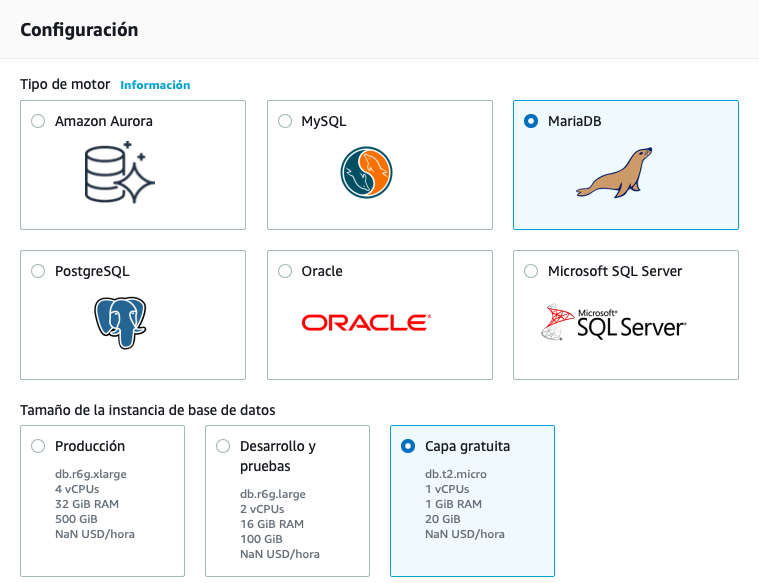

# Datos en la nube

Ya hemos visto que el almacenamiento en la nube ofrece un gran número de ventajas. Otro de los productos estrella de la computación en la nube es el uso de bases de datos, ya sean distribuidas o no.

La principal ventaja de utilizar un servicio de base de datos basado en la nube es que no requieren de la administración por parte del usuario. Éste sólo utiliza el servicio sin necesidad de tener conocimientos avanzados sobre su administración. Estos servicios se conocen como **administrados**, ya que la propia plataforma cloud se encarga de gestionar el escalado, las copias de seguridad automáticas, la tolerancia a errores y la alta disponibilidad, y por tanto, estos servicios forman parte de una solución PaaS.

Si nosotros creásemos una instancia EC2 e instalásemos cualquier sistema gestor de base de datos, como *MariaDB* o *PosgreSQL*, seríamos responsables de varias tareas administrativas, como el mantenimiento del servidor y la huella energética, el software, la instalación, la implementación de parches y las copias de seguridad de la base de datos, así como de garantizar su alta disponibilidad, de planificar la escalabilidad y la seguridad de los datos, y de instalar el sistema operativo e instalarle los respectivos parches.

## Datos relacionales - *Amazon RDS*

AWS ofrece *Amazon RDS* (<https://aws.amazon.com/es/rds/>) como servicio administrado que configura y opera una base de datos relacional en la nube, de manera que como desarrolladores sólo hemos de enfocar nuestros esfuerzos en los datos y optimizar nuestras aplicaciones.

### Instancias de bases de datos

Una instancia de base de datos es un entorno de base de datos aislado que puede contener varias bases de datos creadas por el usuario. Se puede acceder a él utilizando las mismas herramientas y aplicaciones que utiliza con una instancia de base de datos independiente.

Cuando vamos a crear una instancia de base de datos, primero hemos de indicar qué motor de base de datos ejecutar. Actualmente, RDS admite seis motores de bases de datos:

* [MySQL](https://aws.amazon.com/es/rds/mysql/), compatible con las versiones 5.6, 5.7 y 8.0.
* [Amazon Aurora](https://aws.amazon.com/es/rds/aurora/)
* [Microsoft SQL Server](https://aws.amazon.com/es/rds/sqlserver/), que permite implementar varias versiones de SQL Server (2012, 2014, 2016, 2017 y 2019), incluidas las Express, Web, Standard y Enterprise.
* [PostgreSQL](https://aws.amazon.com/es/rds/postgresql/), compatible con las versiones 9.6, 10, 11 y 12.
* [MariaDB](https://aws.amazon.com/es/rds/mariadb/), compatible con las versiones 10.2, 10.3, 10.4 y 10.5
* y [Oracle](https://aws.amazon.com/es/rds/oracle), compatible con Oracle 12 y Oracle 19, con dos modelos de licencia diferentes: *Licencia incluida* y *Bring-Your-Own-License (BYOL)*.

Los recursos que se encuentran en una instancia de base de datos se definen en función de la clase de instancia de base de datos, y el tipo de almacenamiento se determina por el tipo de disco. Las instancias y el almacenamiento de base de datos difieren en cuanto a las características de rendimiento y al precio, lo que permite adaptar el coste y el rendimiento a las necesidades de nuestra base de datos.

<figure style="align: center;">
    
    <figcaption>Instancia de RDS</figcaption>
</figure>

Por ejemplo, si seleccionamos el motor de *MariaDB*, podemos observar como mediante la creación sencilla nos ofrece tres propuestas de tamaño, dependiendo de si es para el entorno de producción, desarrollo y pruebas o el de la capa gratuita.

<figure style="align: center;">
    
    <figcaption>Configuración de tamaño de la instancia con MariaDB</figcaption>
</figure>

### Alta disponibilidad

Una de las características más importantes de *RDS* es la capacidad de configurar la instancia de base de datos para una alta disponibilidad con una [implementación Multi-AZ](https://aws.amazon.com/es/rds/features/multi-az/). Al hacerlo, se genera de manera automática una **copia en espera** de la instancia de base de datos en otra zona de disponibilidad dentro de la misma VPC. Después de propagar la copia de la base de datos, las transacciones se replican de forma ^^síncrona^^ a la copia en espera.

<figure style="align: center;">
    
    <figcaption>Alta disponibilidad en Multi-AZ</figcaption>
</figure>

Por lo tanto, si la instancia de base de datos principal falla en una implementación Multi-AZ, *RDS* activa automáticamente la instancia de base de datos en espera como la nueva instancia principal.

#### Réplica de lectura

RDS también admite la creación de [réplicas de lectura](https://aws.amazon.com/es/rds/features/read-replicas/) para MySQL, MariaDB, PostgreSQLy Amazon Aurora. 

<figure style="float: right;">
    
    <figcaption>Réplica de lectura</figcaption>
</figure>

Las actualizaciones que se realizan en la instancia principal se copian de manera ^^asíncrona^^ en la instancia de réplica de lectura, de manera que direccionando las consultas a esta nueva réplica reduciremos la carga de la instancia principal.

Las réplicas de lectura también pueden convertirse en la instancia de base de datos principal, pero, debido a la replicación asíncrona, este proceso debe hacerse de forma manual.

Las réplicas de lectura pueden crearse en una región diferente a la utilizada por la base de datos principal, lo que puede mejorar la recuperación de desastres y/o disminuir la latencia al dirigir las lecturas a una réplica de lectura lo más cercana al usuario.

### Casos de uso

AmazonRDS es ideal para las aplicaciones web y móviles que necesitan una base de datos con alto rendimiento, enorme escalabilidad en el almacenamiento y alta disponibilidad.

Se recomienda *RDS* cuando nuestra aplicación necesite:

* Transacciones o consultas complejas
* Tasa de consulta o escritura media a alta: hasta 30.000 IOPS (15.000 lecturas + 15.000 escrituras)
* No más de una única partición o nodo de trabajo
* Alta durabilidad

En cambio, no se recomienda cuando:

* Tasas de lectura o escritura muy grandes (por ejemplo, 150.000 escrituras por segundo)
* Fragmentación causada por el gran tamaño de los datos o las altas demandas de rendimiento
* Solicitudes y consultas GET o PUT simples que una base de datos NoSQL puede manejar
* Personalización del sistema de administración de bases de datos relacionales (en este caso, es mejor instalar por nuestra cuenta el SGBD que necesitemos en una instancia EC2).

### Costes

El [coste](https://aws.amazon.com/es/rds/pricing/) se calcula en base al tiempo de ejecución (calculado en horas) así como las características de la base de datos. Las características de la base de datos varían según el motor, el [tipo de instancia](https://aws.amazon.com/es/rds/instance-types/) y su cantidad, así como la clase de memoria de la base de datos.

Otros gastos asociados son:

* almacenamiento aprovisionado: el almacenamiento para copias de seguridad de hasta el 100% del almacenamiento de nuestra base de datos activa es gratuito. Una vez que se termina la instancia de base de datos, el almacenamiento para copias de seguridad se factura por GB por mes.
* cantidad de solicitudes de entrada y de salida.

Aunque se recomienda utilizar la [calculadora de costes](https://calculator.aws/#/addService) para afinar en el presupuesto, por ejemplo, una base de datos con MariaDB con una instancia `db.m4.large` con 2 procesadores y 8GB de RAM, en una única AZ, con un porcentaje de utilización del 100%  y 30GB para almacenar los datos, cuesta alrededor de 131$ mensuales. En cambio si la cambiamos por dos instancias más potentes, como puede ser la `db.m4.4xlarge`, con 16 procesadores y 64 GB de RAM, en multi-AZ ya sube a unos 4.100$ al mes.

Es importante recordar que si reservamos las instancias estos costes se reducirian en proporción a 2350$ (reserva de un año) o 1526$ (reserva de tres años).

## Amazon Aurora

Amazon Aurora es una base de datos relacional compatible con MySQLy PostgreSQLque se creó para la nube. Combina el rendimiento y la disponibilidad de las bases de datos comerciales de alta gama con la simplicidad y la rentabilidad de las bases de datos de código abierto. El uso de Amazon Aurora puede reducir los costos de la base de datos y, al mismo tiempo, mejorar la fiabilidad y la disponibilidad de la base de datos. Como servicio completamente administrado, Aurora está diseñado para automatizar tareas cuya realización requiere mucho tiempo, como el aprovisionamiento, la implementación de parches, la realización de copias de seguridad, la recuperación, la detección de errores y la reparación.
60

En resumen, Amazon Aurora es una base de datos relacional administrada de manera rentable, con alta disponibilidad y buen rendimiento.Aurora ofrece un subsistema de almacenamiento distribuido de alto rendimiento. El uso de Amazon Aurora puede reducir los costos de la base de datos y, al mismo tiempo, mejorar su fiabilidad. Aurora también está diseñado para ofrecer alta disponibilidad. Posee almacenamiento tolerante a errores y con recuperación automática creado para la nube. Aurora replica varias copias de los datos en múltiples zonas de disponibilidad y realiza copias de seguridad continuas de los datos en AmazonS3. Hay varios niveles de seguridad disponibles, incluidos el aislamiento de la red con Amazon VPC, el cifrado en reposo por medio de claves creadas y controladas con AWS Key Management Service(KMS) y el cifrado de los datos en tránsito con la capa de conexión segura (SSL).El motor de base de datos Amazon Aurora es compatible con las bases de datos de código abierto MySQLy PostgreSQLexistentes, e incorpora compatibilidad con las nuevas versiones de manera frecuente.Por último, Amazon Aurora está completamente administrado por Amazon RDS. Aurora automatiza las tareas de administración de bases de datos, como el aprovisionamiento de hardware, la implementación de parches en el software, la
instalación, la configuración o la realización de copias de seguridad.

## Datos NoSQL - *DynamoDB*

DynamoDB (<https://aws.amazon.com/es/dynamodb/>) es un servicio de base de datos NoSQL rápido y flexible para todas las aplicaciones que requieren una latencia uniforme de milisegundos de un solo dígito a cualquier escala. Amazon administra toda la infraestructura subyacente de datos para este servicio y almacena los datos de manera redundante en varias instalaciones dentro de una región nativa de EE.UU., como parte de la arquitectura tolerante a errores. Con DynamoDB, puede crear tablas y elementos. Puede agregar elementos a una tabla. El sistema particionasus datos automáticamente y cuenta con el almacenamiento de tablas necesario para cumplir con los requisitos de carga de trabajo. No existe ningún límite práctico respecto de la cantidad de elementos que se pueden almacenar en una tabla. Por ejemplo, algunos clientes tienen tablas de producción con miles de millones de elementos. Uno de los beneficios de las bases de datos NoSQLes que los elementos de la misma tabla pueden tener atributos diferentes. Esto le da flexibilidad para agregar atributos a medida que la aplicación evoluciona. Puede almacenar elementos con formatos más nuevos junto a otros con formatos más antiguos en la misma tabla, sin tener que realizar migraciones de esquema.
39

A medida que su aplicación se vuelve más popular y los usuarios continúan interactuando con ella, el almacenamiento puede crecer según las necesidades de la aplicación. Todos los datos de DynamoDBse almacenan en unidades de estado sólido (SSD), y su lenguaje de consulta simple permite un rendimiento de las consultas uniforme y de baja latencia. Además de escalar el almacenamiento, DynamoDBle permite aprovisionar el volumen del rendimiento de lectura o escritura que necesita para su tabla. A medida que aumenta la cantidad de usuarios de la aplicación, las tablas de DynamoDBse pueden escalar para admitir el incremento de las solicitudes de lectura y escritura mediante el aprovisionamiento manual. De forma alternativa, puede habilitar el escalado automático para que DynamoDBmonitoree la carga de la tabla e incremente o disminuya el rendimiento aprovisionado de manera automática. Algunas otras características clave incluyen las tablas globales que le permiten generar réplicas de manera automática en las regiones de AWS que elija, el cifrado en reposo y la visibilidad del tiempo de vida (TTL) de los elementos.
40

DynamoDBes un servicio de base de datos NoSQLcompletamente administrado. Amazon administra toda la infraestructura de datos subyacente para este servicio y almacena los datos de manera redundante en varias instalaciones dentro de una región nativa de EE.UU. como parte de la arquitectura tolerante a errores. Con DynamoDB, puede crear tablas y elementos. Puede agregar elementos a una tabla. El sistema particionasus datos automáticamente y cuenta con el almacenamiento de tablas necesario para cumplir con los requisitos de carga de trabajo. No existe ningún límite práctico respecto de la cantidad de elementos que se pueden almacenar en una tabla. Por ejemplo, algunos clientes tienen tablas de producción con miles de millones de elementos. Uno de los beneficios de una base de datos NoSQLes que los elementos en la misma tabla pueden tener diferentes atributos. Esto le da flexibilidad para agregar atributos a medida que la aplicación evoluciona. Puede almacenar elementos con formatos más nuevos junto a otros con formatos más antiguos en la misma tabla sin tener que realizar migraciones de esquema.A medida que su aplicación se vuelve más popular y los usuarios continúan interactuando con ella, el almacenamiento puede crecer según las necesidades de la aplicación. Todos los datos en DynamoDBse almacenan en discos de estado sólido, y el lenguaje de consulta simple permite un rendimiento uniforme de las 
41

consultas de baja latencia. Además de proporcionar escalado del almacenamiento, DynamoDBle permite aprovisionar el volumen del rendimiento de lectura o escritura que necesita para su tabla. A medida que aumenta la cantidad de usuarios de la aplicación, las tablas de DynamoDBse pueden escalar para admitir el incremento de solicitudes de escritura y lectura mediante el aprovisionamiento manual. De forma alternativa, puede habilitar el escalado automático para que DynamoDBmonitoree la carga de la tabla e incremente o disminuya el rendimiento aprovisionado de manera automática. Algunas otras características clave de diferenciación incluyen las tablas globales que le permiten generar réplicas de manera automática en las regiones de AWS que elija, el cifrado en reposo y la visibilidad del tiempo de vida (TTL) de los elementos. 
42

Los componentes principales de DynamoDBson los elementos, las tablas y los atributos.•Una tabla es un conjunto de datos.•Los elementos son un grupo de atributos que se puede identificar de forma exclusiva entre todos los demás elementos.•Un atributo es un elemento de datos fundamental que no es preciso seguir dividiendo.DynamoDBadmite dos tipos distintos de claves principales: La clave de particiónes una clave principal simple que consta de un atributo denominado clave de ordenamiento.La clave de partición y de ordenamiento, también conocidas como clave principal compuesta,está conformada por dos atributos. Para obtener más información sobre cómo funciona DynamoDB, consulte Atributos de los elementos de la tabla
43

A medida que aumenta el volumen de datos, la clave principal particiona e indexa los datos de la tabla. Puede recuperar los datos de una tabla de DynamoDBde dos formas distintas:•Según el primer método, la operación de consultas aprovecha la partición para localizar de manera eficaz los elementos por medio de la clave principal. •El segundo método se lleva a cabo mediante un escaneo, que le permite localizar los elementos de la tabla a partir de las coincidencias con las condiciones en los atributos que no son clave. El segundo método le da la flexibilidad necesaria para localizar elementos por medio de otros atributos. Sin embargo, esta operación es menos eficiente debido a que DynamoDBescanea todos los elementos de la tabla a fin de encontrar los que coinciden con sus parámetros. 
44

Para aprovechar al máximo las operaciones de consulta y DynamoDB, es importante que la clave utilizada identifique de forma exclusiva los elementos de la tabla de DynamoDB. Puede configurar una clave principal simple basada en un único atributo de los valores de los datos con una distribución uniforme, como el identificador único global (GUID)u otros identificadores aleatorios. Por ejemplo, si quisiera modelar una tabla con productos, podría utilizar algunos atributos, como el ID de producto. De forma alternativa, puede especificar una clave compuesta, que incluye una clave de partición y una clave secundaria. En este ejemplo, si tuviera una tabla con libros, podría utilizar la combinación de autor y título para identificar de forma exclusiva los elementos de la tabla. Este método podría ser útil si espera evaluar libros por autor con frecuencia, ya que entonces podría utilizar la consulta

Resumen

DynamoDBse ejecuta exclusivamente en SSD y admite modelos de almacenamiento de clave-valor y documentos. DynamoDBfunciona bien con las aplicaciones móviles, web, de videojuegos, de tecnología publicitaria y de Internet de las cosas (IoT).Se puede acceder a este servicio a través de la consola, de la CLI de AWS y de las llamadas a la API. La capacidad de escalar sus tablas en términos de almacenamiento y rendimiento de aprovisionamiento hace que DynamoDBsea una buena opción para los datos estructurados de las aplicaciones web, móviles y de IoT. Por ejemplo, puede tener una gran cantidad de clientes que generan datos de manera continua y realizan numerosas solicitudes por segundo. En este caso, el escalado del rendimiento de DynamoDBproporciona un rendimiento uniforme a sus clientes. DynamoDBtambién se utiliza en aplicaciones que se ven afectadas por la latencia. El rendimiento predecible de las consultas, incluso en tablas grandes, lo hace útil para los casos en los que la latencia variable podría causar un impacto significativo en la experiencia del usuario o en los objetivos empresariales, como en el ámbito de la tecnología publicitaria o los videojuegos

Con la característica de tablas globales de DynamoDB, se reduce la tarea de replicar los datos entre las regiones y de solucionar los conflictos de actualización. Con esta característica, se replican automáticamente las tablas de DynamoDBen las regiones de AWS que elija. Las tablas globales pueden ayudar a que las aplicaciones mantengan la disponibilidad y el rendimiento necesarios para la continuidad del negocio

## DataWarehouse - *Redshift*

Amazon Redshift es un servicio de datawarehouses rápido y completamente administrado. A medida que el negocio crece, puede escalar de manera sencilla y sin tiempo de inactividad, ya que solo necesita agregar más nodos. Amazon Redshiftagrega de manera automática los nodos a su clúster y redistribuye los datos para alcanzar el máximo rendimiento.Este servicio está diseñado para ofrecer alto rendimiento de manera uniforme. Utiliza almacenamiento en columnas y una arquitectura de procesamiento en paralelo masivo. Estas características ubican en paralelo y distribuyen los datos y las consultas entre varios nodos. Amazon Redshifttambién monitorea su clúster y realiza copias de seguridad de los datos de forma automática para que pueda restaurarlos con facilidad si es necesario. El cifrado está integrado; solo tiene que habilitarlo.Para obtener más información acerca de Amazon Redshift, consulte https://aws.amazon.com/redshift/. 

## Casos de Uso

Como se ha visto en este módulo,la nube continúa reduciendo el costo de almacenamiento y de cómputo. Ha surgido una nueva generación de aplicaciones,la cual, a su vez, ha creado un nuevo conjunto de requisitos para las bases de datos. Estasaplicacionesnecesitan bases de datos capaces de almacenar desde terabytes hasta petabytesde nuevos tiposde datos, proporcionar acceso a los datos con una latencia de milisegundos, procesar millones de solicitudes porsegundo y escalar para admitir millones de usuariosen cualquier partedel mundo. Para cumplir estos requisitos, se necesitan bases de datos relacionales y no relacionales diseñadas especialmente para gestionar las necesidades específicas de las aplicaciones. AWS ofrece una amplia variedad de bases de datos personalizadas para sus casos de uso de aplicacionesespecíficos.

## Actividades

1. Realizar el módulo 8 (Bases de Datos) del curso [ACF de AWS](https://awsacademy.instructure.com/courses/2243/).

2. Crear una bd en RDS y cargar datos

3. Crear una tabla en DynamoDB y cargar datos

## Referencias

* 
