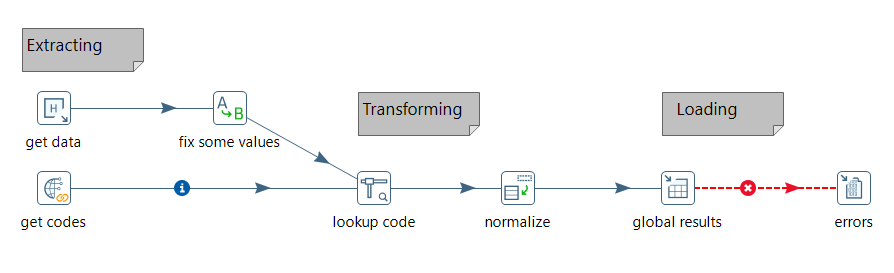
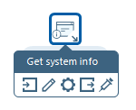
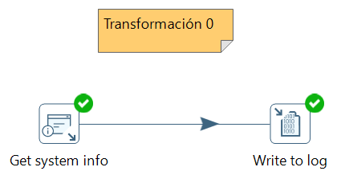
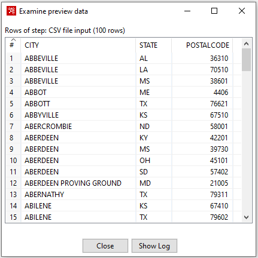
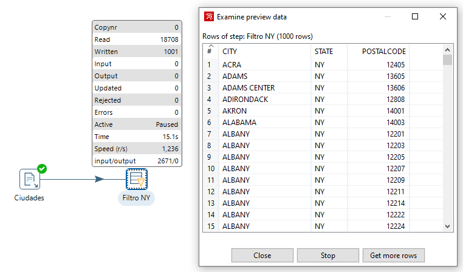
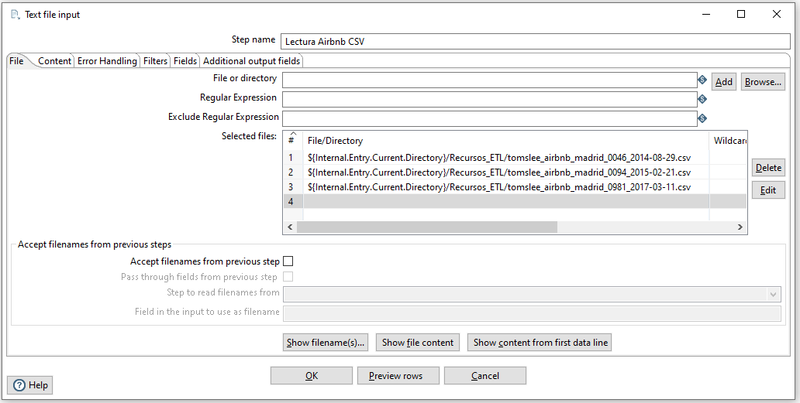
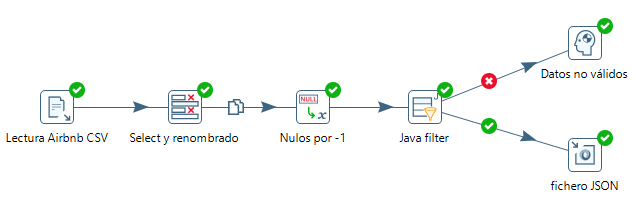

# Pentaho

31 Enero

*Kettle* es un componente de *Pentaho Data Integration* (PDI - <https://www.hitachivantara.com/en-us/products/data-management-analytics/pentaho/download-pentaho.html>) que a su vez contiene a *Spoon*. Mediante *Spoon* se pueden realizar procesos ETL de manera visual, de forma muy fácil y rápida, como por ejemplo:

* Conexiones a los datos.
* Transformaciones (filtrado, limpieza, formateado, ... y posterior almacenamiento en diferentes formatos y destinos).
* Inserción de fórmulas.
* Desarrollo de *data warehouses* con estructura en estrella (Hechos/Dimensiones)

Y todo esto sin necesidad de programar directamente con código y sin necesidad de instalar o configurar nada para poder empezar a usarla. Por esto, este tipo de herramientas se conocen como ^^herramientas de metadatos^^, ya que trabajan a nivel de definición diciendo qué hay que hacer, pero no el detalle del cómo se hace, éste queda oculto, lo cual resulta muy interesante en la mayoría de los casos.

<figure style="align: center;">
    
    <figcaption>Pentaho - Ejemplo de flujo ETL</figcaption>
</figure>

Se trata de una herramienta open source multiplatforma que también tiene su soporte comercial. La versión *open source* se puede descargar desde <https://sourceforge.net/projects/pentaho/>. En nuestro caso, vamos a trabajar con la versión 9.2 que data de agosto de 2021 (para los apuntes he trabajado indistintamente con la versión 9.1 y la 9.2, tanto en Windows como en Ubuntu). Es importante destacar el requisito que necesitamos tener instalado en el sistema al menos la versión 8 de Java.

!!! tip "Instalación en Ubuntu"
    Si trabajamos con Ubuntu, será necesario instalar el paquete *libwebkitgtk*.
    Para ello, primero tenemos que añadir su repositorio:
    
    ```bash
    sudo nano /etc/apt/sources.list
    ```

    Y añadimos al final la siguiente entrada:

    ```bash
    deb http://cz.archive.ubuntu.com/ubuntu bionic main universe
    ```

    Y tras actualizar los respositorios con `sudo apt-get update`, instalaremos el paquete con el comando `sudo apt-get install libwebkitgtk-1.0.0`.

Una vez descargado el archivo y descomprimirlo, mediante el archivo `spoon.bat` (o `spoon.sh`) lanzaremos la aplicación.

<figure style="align: center;">
    
    <figcaption>Pantalla de inicio de Pentaho/Spoon</figcaption>
</figure>

!!! tip "Dentro de Spoon"
    *Spoon* permite diseñar las transformaciones y trabajos que se ejecutan con las siguientes herramientas:
        * *Pan* es un motor de transformación de datos que realiza muchas funciones tales como lectura, manipulación, y escritura de datos hacia y desde varias fuentes de datos.
        * *Kitchen* es un programa que ejecuta los trabajos diseñados por Spoon en XML o en una base de datos.

Para esta sesión, hemos planteado varios casos de uso para ir aprendiendo la herramienta mediante su uso.

https://openwebinars.net/blog/que-es-pentaho-data-integraton-pdi/

## Elementos

En PDI hay dos tipos de elementos: *Transformations* y *Jobs*.

* Se definen *Transformations* para transformar los datos
* Se definen *Jobs* para organizar tareas estableciendo su orden y condiciones de ejecución. Las transformaciones son un tipo de tarea.

Tanto las transformaciones como las tareas, cuando se definen, se almacenan como archivos.

Los elementos del interfaz son:

<figure style="align: center;">
    
    <figcaption>Interfaz de Spoon</figcaption>
</figure>

## Caso de Uso 0

Para familiarizarnos con el entorno, vamos a crear una transformación muy básica. Tras seleccionar *File -> New Transformation*, el primer elemento que vamos a utilizar está dentro de la categoría *Input*.

<figure style="float: right;">
    
    <figcaption>Menú emergente</figcaption>
</figure>

En concreto seleccionamos la transformación *Get system info*, la cual nos permite obtener información sobre el sistema. La vamos a utilizar para averiguar la versión de PDI que estamos utilizando. Así pues, la seleccionamos desde el *árbol de pasos* y lo arrastramos a la zona de trabajo. Si dejamos el ratón sobre el elemento, nos aparecerá un menú emergente donde podremos conectar una entrada, editar las propiedades, ver el menú contextual del paso, conectar una salida e inyectar metadatos.

Sobre este paso, vamos a editar la información que queremos obtener. Para ello, vamos a crear una propiedad con nombre *Versión Pentaho* y seleccionaremos del desplegable la opción *Kettle Version*.

A continuación, en la categoría *Utility* seleccionamos el icono *Write to Log*, y lo arrastramos al area de trabajo. Ahora conectamos la salida de *Get system info* con *Write to log*, mediante la 4ª opción del menu emergente, quedando una transformación tal como se ve en la imagen:

<figure style="align: center;">
    
    <figcaption>Caso de Uso 0 - Versión de PDI</figcaption>
</figure>

Finalmente, sólo nos queda ejecutar la transformación mediante el icono del triángulo (*Run* o F9), y ver el resultado en el panel inferior.

## Caso de Uso 1 - Filtrando datos

En este caso de uso, vamos a leer un archivo CSV y vamos a filtrar los datos para quedarnos con un subconjunto de los mismos. Además, vamos a ver cómo podemos gestionar los errores y ejecutar la transformación desde el terminal.

### Lectura CSV

Tras crear la nueva transformación (CTRL + N), desde *Input* arrastraremos el paso de *CSV input file* para seleccionar el archivo `samples\transformations\files\Zipssortedbycitystate.csv` dentro de nuestra instalación de Pentaho.

Tras seleccionar el archivo, mediante el botón *Get Fields* cargaremos y comprobaremos que los campos que vamos a leer son correctos (nombre y tipo de los datos).

<figure style="align: center;">
    
    <figcaption>Caso de Uso 1 - Tras pulsar sobre Get Fields</figcaption>
</figure>

Tras ello, mediante el botón *Preview* comprobaremos que los datos se leen correctamente.

<figure style="align: center;">
    
    <figcaption>Caso de Uso 1 - Resultado de la opción Preview sobre Ciudades</figcaption>
</figure>

### Filtrado de datos

Una vez leido, el siguiente paso es filtrar las filas. Para ello, desde la categoría de *Flow*, arrastramos el paso *Filter*, y las conectamos tal como hemos realizado en el caso anterior. Al soltar la flecha, nos mostrará dos opciones:

* *Main output of step*: define los pasos con un flujo principal, donde todo funciona bien
* *Error handling of step*: define los pasos a seguir en caso de encontrar un error

De momento elegimos la primera y configuramos el filtro para solo seleccionar aquellos datos cuyo estado sea NY.

<figure style="align: center;">
    
    <figcaption>Caso de Uso 1 - Configuración del filtro</figcaption>
</figure>

Para configurar el resultado, seleccionamos el paso del filtro, y bien pulsamos sobre el icono del ojo de la barra de herramientas, o sobre el paso, tras pulsar con el botón derecho, seleccionamos la opción *Preview*.

<figure style="align: center;">
    
    <figcaption>Caso de Uso 1 - Resultado de hacer Preview sobre Filtro NY</figcaption>
</figure>

Por defecto se precargan 1000 filas. Tras comprobar el resultado, pulsamos sobre *Stop* para detener el proceso de previsualización. Las métricas que aparecen nos información del proceso y su rendimiento.

### Ordenación

El siguiente paso que vamos a realizar es ordenar los datos por su código *Postal Code*. Para ello, desde la categoría de *Transform*, arrastramos el paso de *Sort rows*, y conectamos la salida del filtrado con la ordenación eligiendo la salida principal (*main output of step*).

!!! fail "Forzando un error"
    Vamos a forzar un error para comprobar cómo lo indica *Spoon*. Si al elegir el nombre del campo, en vez de *POSTAL CODE* escribimos *CP*, cuando previsualizamos el resultado, podremos ver como aparece la marca de prohibido en la esquina superior derecha del paso, y si visualizamos el log y las métricas de los pasos, veremos el error:

    <figure style="align: center;">
        
        <figcaption>Caso de Uso 1 - Forzando un error</figcaption>
    </figure>

Volvemos a editar el paso, corregimos el nombre del campo (escribimos *POSTAL CODE*) y comprobamos que ahora sí que funciona correctamente

<figure style="align: center;">
    
    <figcaption>Caso de Uso 1 - Ordenando</figcaption>
</figure>

### Escritura del resultado

Una vez realizados todos los pasos, sólo nos queda es enviar el resultado a un fichero para persistir la transformación.

Para ello, desde la categoría de *Output* arrastramos el paso *Text file output*, y lo conectamos desde la salida del paso de ordenación. Tras ello, editar este paso para indicar el archivo donde almacenar el resultado.

<figure style="align: center;">
    
    <figcaption>Caso de Uso 1 - Guardando el resultado</figcaption>
</figure>

Tras ello, podremos ejecutar la transformación (icono del triángulo, menú *Action -> Run* o F9) y comprobar el resultado en el fichero:

``` csv
CITY;STATE;POSTALCODE
HOLTSVILLE             ;NY;501
FISHERS ISLAND         ;NY;6390
NEW YORK               ;NY;10001
NEW YORK               ;NY;10003
NEW YORK               ;NY;10005
NEW YORK               ;NY;10007
NEW YORK               ;NY;10009
```

Al comprobar el fichero, vemos que se han quedado espacio en blanco a la derecha del nombre de las ciudades, ya que la columna tenía un tamaño configurado. Si volvemos a editar el último paso, en la pestaña de *Fields* podemos indicar mediante el botón de *Minimal width* que reduzca su anchura al mínimo:

<figure style="align: center;">
    
    <figcaption>Caso de Uso 1 - Anchura mínima de los campos</figcaption>
</figure>

Y tras volver a ejecutar la transformación, veremos que ahora sí que obtenemos los datos que esperábamos:

``` csv
CITY;STATE;POSTALCODE
HOLTSVILLE;NY;501
FISHERS ISLAND;NY;6390
NEW YORK;NY;10001
NEW YORK;NY;10003
NEW YORK;NY;10005
NEW YORK;NY;10007
NEW YORK;NY;10009
```

## Uso de Pan

Mediante la utilidad *Pan*, podemos ejecutar las transformaciones sin necesidad de arrancar *Spoon*. Para indicarle el archivo que contiene la transformación, al comando `pan.bat` (o `pan.sh` en el caso de Ubuntu) le pasamos el parámetro `/file=rutaArchivo.ktr`.

Para comprobar su funcionamiento, vamos a eliminar el fichero generado. A continuación, ejecutamos `pan`:

``` bash
pan.bat /file=c:/IABD/caso1filtradoNY.ktr
```

Tras algunos segundos y varias líneas de debug del arranque de pan, tendremos un mensaje similar al siguiente:

``` log
2021/10/24 18:01:42 - Start of run.
2021/10/24 18:01:42 - caso1filtradoNY - Dispatching started for transformation [caso1filtradoNY]
2021/10/24 18:01:42 - Ciudades.0 - Header row skipped in file 'C:\data-integration\samples\transformations\files\Zipssortedbycitystate.csv'
2021/10/24 18:01:42 - Ciudades.0 - Finished processing (I=21380, O=0, R=0, W=21379, U=0, E=0)
2021/10/24 18:01:42 - Filtro NY.0 - Finished processing (I=0, O=0, R=21379, W=1146, U=0, E=0)
2021/10/24 18:01:42 - Orden por Codigo Postal.0 - Finished processing (I=0, O=0, R=1146, W=1146, U=0, E=0)
2021/10/24 18:01:42 - CiudadesNY.0 - Finished processing (I=0, O=1147, R=1146, W=1146, U=0, E=0)
2021/10/24 18:01:43 - Carte - Installing timer to purge stale objects after 1440 minutes.
2021/10/24 18:01:43 - Finished!
2021/10/24 18:01:43 - Start=2021/10/24 18:01:42.424, Stop=2021/10/24 18:01:43.041
2021/10/24 18:01:43 - Processing ended after 0 seconds.
2021/10/24 18:01:43 - caso1filtradoNY -
2021/10/24 18:01:43 - caso1filtradoNY - Step Ciudades.0 ended successfully, processed 21379 lines. ( - lines/s)
2021/10/24 18:01:43 - caso1filtradoNY - Step Filtro NY.0 ended successfully, processed 21379 lines. ( - lines/s)
2021/10/24 18:01:43 - caso1filtradoNY - Step Orden por Codigo Postal.0 ended successfully, processed 1146 lines. ( - lines/s)
2021/10/24 18:01:43 - caso1filtradoNY - Step CiudadesNY.0 ended successfully, processed 1146 lines. ( - lines/s)
```

Y si comprobamos el fichero, veremos que ha vuelto a aparecer.

## Caso de Uso 2 - Orígenes / Destinos

En el primer caso, vamos a leer varios archivos CSV y los vamos a fusionar en uno sólo.

El primer componente que vamos a utilizar es el de tipo *Input* para leer los archivos csv. Para ello, dentro de la pestaña *Design*.

Así pues, arrastramos el componente al area de trabajo, y dejando el ratón sobre el elemento un segundo, elegimos la opción de editar (lapiz). En sus opciones podremos indicar el archivo a leer, así como el delimitador de los campos.

A partir de los archivos que tenemos en Aules, seleccionamos el fichero `CA_Sales.csv`, y pulsamos sobre *Get Fields* para traernos todos los campos. Para ver el contenido, tenemos la opción de *Preview* para comprobar los campos y datos del archivo seleccionado.

## Caso de Uso 3 - Cuestionarios Airbnb

Para el siguiente caso de uso, vamos a utilizar datos de los cuestionarios de AirBnb que se pueden descargar desde <http://tomslee.net/airbnb-data-collection-get-the-data>.

En concreto, nos vamos a centrar en los datos de Madrid que podemos descargar desde <https://s3.amazonaws.com/tomslee-airbnb-data-2/madrid.zip>.

### Uniendo datos

Una vez descargados los datos y descomprimidos, vamos a cargar los tres ficheros en el mismo paso, utilizando dentro de *Input* la opción de *Text File Input*:

<figure style="align: center;">
    
    <figcaption>Caso de Uso 3 - Filtrado compuesto</figcaption>
</figure>

Recordad que antes, en la pestaña *Fields*, tenemos que obtener los campos a leer.

Nos vamos a quedar con un subconjunto de las columnas y las vamos a renombrar. Para ello, dentro de la categoría *Transform* elegimos el paso *Select values* y elegimos y renombramos los siguentes campos:

* `room_id`, `room_type`, `neighborhood`, `bedrooms`, `overall_satisfaction`, `accommodates`, y `price` pasarán a ser
`habitacion_id`, `habitacion_tipo`, `barrio`, `dormitorios`, `puntuacion`, `huespedes` y `precio`.

<figure style="align: center;">
    
    <figcaption>Caso de Uso 3 - Selección y nombrado de campos</figcaption>
</figure>

### Filtrado compuesto

El siguiente paso que vamos a hacer es quedarnos con aquellos cuestionarios con más de 3 dormitorios o al menos 4 huéspedes. Así pues, con el paso *Filter Rows* realizaremos:

<figure style="align: center;">
    
    <figcaption>Caso de Uso 3 - Filtrado compuesto</figcaption>
</figure>

Si el filtrado fuese con condiciones más complejas, en ocasiones es más sencillo utilizar el paso *Java filter* (de la categoría *Flow*), el cual utilizando la notación de Java, podemos indicar la condición a cumplir. Por ejemplo, vamos filtrar los de más de 3 dormitorios o al menos 4 huéspedes, y que su precio sea inferior a 200$:

<figure style="align: center;">
    
    <figcaption>Caso de Uso 3 - Filtrado Java</figcaption>
</figure>

Para comprobar su funcionamiento, vamos a añadir un par de pasos *dummy* (no realizan nada, pero sirven para finalizar tareas). Al ejecutarlo, veremos que nos da un error. Si algún dato es nulo, el filtrado Java provocará un error de transformación.

Una posibilidad es que introduzcamos un paso de la categoría *Utility* denominado *If value is null*. Coneste paso, podemos indicar el valor a tomar a todos los campos o hacerlo de forma concreta en los campos que queramos. En nuestro caso, vamos indicar que cambie todos los nulos por `-1`.

<figure style="align: center;">
    
    <figcaption>Caso de Uso 3 - Cambiando nulos por -1</figcaption>
</figure>

Debemos tener en cuenta que como ahora podemos tener precios con -1, para evitar recogerlos en el filtrado Java, deberíamos modificarlo por `(dormitorios > 3 || huespedes >=4) && ( precio >= 0 && precio < 200)`.

### Generando JSON

<figure style="float: right;">
    
    <figcaption>Caso de Uso 3 - Configuración JSON</figcaption>
</figure>

Finalmente queremos almacenar los datos que cumplen el filtro en un fichero JSON.

Para ello, sustituimos el *dummy* del camino exitoso por un paso *JSON output*, configurando:

* *Filename*: La ruta y el nombre del archivo
* *Json bloc name*: nombre de la propiedad que contendrá un objeto o un array de objetos con los datos.
* *Nr rows in a bloc*: Cantidad de datos del archivo. Si ponemos 0, coloca todos los datos en el mismo fichero. Si ponemos 1, generará un fichero por cada registro.

En la imagen que tenemos a la derecha puedes comprobar los valores introducidos.

### Resultado final

En la siguiente imagen puedes comprobar la transformación completa:

<figure style="align: center;">
    
    <figcaption>Caso de Uso 3 - Transformación final</figcaption>
</figure>

La cual, al ejecutarla, genera los siguientes datos:

``` json
{"datos":[
    {"dormitorios":4.0, "huespedes":10, "barrio":"Argüelles", "precio":133.0, "habitacion_tipo":"Entire home\/apt","puntuacion":4.0, "habitacion_id":23021},
    {"dormitorios":1.0, "huespedes":4, "barrio":"Justicia", "precio":147.0, "habitacion_tipo":"Private room","puntuacion":5.0,"habitacion_id":24836},
    {"dormitorios":1.0, "huespedes":4, "barrio":"Bellas Vistas", "precio":44.0, "habitacion_tipo":"Private room","puntuacion":4.0, "habitacion_id":34801},
    ...
    ]
}
```

## Caso de Uso 3


https://itop.academy/blog/item/spoon-componente-pentaho-data-integration-kettle.html

https://help.hitachivantara.com/Documentation/Pentaho/9.2/Setup/Pentaho_Data_Integration_(PDI)_tutorial


The Data Integration perspective of PDI allows you to create two basic file types: transformations and jobs. Transformations describe the data flows for ETL such as reading from a source, transforming data and loading it into a target location. Jobs coordinate ETL activities such as defining the flow and dependencies for what order transformations should be run, or prepare for execution by checking conditions such as, "Is my source file available?" or "Does a table exist in my database?"

The aim of this tutorial is to walk you through the basic concepts and processes involved in building a transformation with PDI in a typical business scenario. In this scenario, you are loading a flat file (CSV) of sales data into a database to generate mailing lists. Several of the customer records are missing postal codes that must be resolved before loading into the database. In the preview feature of PDI, you will use a combination of steps to cleanse, format, standardize, and categorize the sample data. The six basic steps are:

## Referencias

* https://lsi2.ugr.es/jsamos/sm2019/etl-pdi.html

